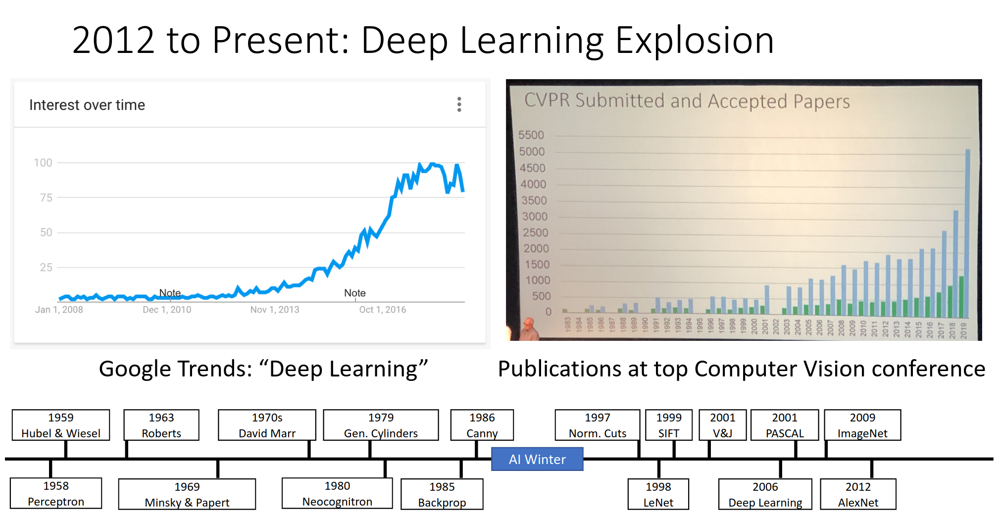

Part of CS231n - Deep Learning for Computer Vision

---
# Winter 2016 is where Andrej taught the class:

https://youtu.be/NfnWJUyUJYU?si=Nty0pDGfWN_9C_bF

Before going in deep in the latest offering of the class just listen and take notes.
## Slides are [here](http://cs231n.stanford.edu/slides/2016/)

Justin Johnson made this drawing.

---
# the highest value is love and truth is it's handmaiden.

---
# Scale back the dragon until you find the one that is conquerable. 🏋️‍♂️

- [x] [First Lecture - Fei Fei Li](lectures/lecture01.md)
- [x] [Second Lecture - Andrej Karpathy](lectures/lecture02.md)
- [x] [Third Lecture: Andrej Karpathy](lectures/lecture03.md)
- [x] [Fourth Lecture: Andrej Karpathy](lectures/lecture04.md)
- [x] [Lecture 5: Training Neural Networks, Part I](lectures/lecture05.md)
- [x] [Lecture 6: Training Neural Networks, Part 2](lectures/lecture06.md)
- [x] [From Andrej Karpathy ⛵](lectures/lecture07.md)
- [x] [From Justin Johnson](lectures/lecture08.md)
- [x] [Andrej Karpathy is Back Baby! 🥰](lectures/lecture09.md)
- [x] [From Andrej Karpathy](lectures/lecture10.md)
- [x] [From Justin Johnson 😉](lectures/lecture11.md)
- [x] [From Justin Johnson](lectures/lecture12.md)
- [x] [From Justin Johnson](lectures/lecture13.md)
- [x] [From Andrej Karpathy 💙 💙 💙](lectures/lecture14.md)
- [x] [From Andrej Karpathy](lectures/lecture15.md)

---
## Second Pass 🌠

- [x] [First Lecture - Fei Fei Li](lectures/lecture01.md)
- [x] [Second Lecture - Andrej Karpathy](lectures/lecture02.md)
- [x] [Third Lecture: Andrej Karpathy](lectures/lecture03.md)
- [x] [Fourth Lecture: Andrej Karpathy](lectures/lecture04.md)
- [x] [Lecture 5: Training Neural Networks, Part I](lectures/lecture05.md)
- [x] [Lecture 6: Training Neural Networks, Part 2](lectures/lecture06.md)
- [x] [From Andrej Karpathy ⛵](lectures/lecture07.md)
- [x] [From Justin Johnson](lectures/lecture08.md)
- [x] [Andrej Karpathy is Back Baby! 🥰](lectures/lecture09.md)
- [x] [From Andrej Karpathy](lectures/lecture10.md)
- [x] [From Justin Johnson 😉](lectures/lecture11.md)
- [x] [From Justin Johnson](lectures/lecture12.md)
- [x] [From Justin Johnson](lectures/lecture13.md)
- [x] [From Andrej Karpathy 💙 💙 💙](lectures/lecture14.md)
- [x] [From Andrej Karpathy](lectures/lecture15.md)

----
## Third Pass 🎋

- [ ] [First Lecture - Fei Fei Li](lectures/lecture01.md)
- [ ] [Second Lecture - Andrej Karpathy](lectures/lecture02.md)
- [ ] [Third Lecture: Andrej Karpathy](lectures/lecture03.md)
- [ ] [Fourth Lecture: Andrej Karpathy](lectures/lecture04.md)
- [ ] [Lecture 5: Training Neural Networks, Part I](lectures/lecture05.md)
- [ ] [Lecture 6: Training Neural Networks, Part 2](lectures/lecture06.md)
- [ ] [From Andrej Karpathy ⛵](lectures/lecture07.md)
- [ ] [From Justin Johnson](lectures/lecture08.md)
- [ ] [Andrej Karpathy is Back Baby! 🥰](lectures/lecture09.md)
- [ ] [From Andrej Karpathy](lectures/lecture10.md)
- [ ] [From Justin Johnson 😉](lectures/lecture11.md)
- [ ] [From Justin Johnson](lectures/lecture12.md)
- [ ] [From Justin Johnson](lectures/lecture13.md)
- [ ] [From Andrej Karpathy 💙 💙 💙](lectures/lecture14.md)
- [ ] [From Andrej Karpathy](lectures/lecture15.md)

---
# Assignments - 2022 Version - [Link](https://cs231n.github.io/assignments2022/assignment1/)

## Assignment 1 - Working on [2022 Version](https://cs231n.github.io/assignments2022/assignment1/)

In this assignment you will practice putting together a simple image classification pipeline, based on the k-Nearest Neighbor or the SVM/Softmax classifier. The goals of this assignment are as follows:

- understand the basic **Image Classification pipeline** and the data-driven approach (train/predict stages)
- understand the train/val/test **splits** and the use of validation data for **hyperparameter tuning**.
- develop proficiency in writing efficient **vectorized** code with numpy
- implement and apply a k-Nearest Neighbor (**kNN**) classifier
- implement and apply a Multiclass Support Vector Machine (**SVM**) classifier
- implement and apply a **Softmax** classifier
- understand the differences and tradeoffs between these classifiers
- get a basic understanding of performance improvements from using **higher-level representations** than raw pixels (e.g. color histograms, Histogram of Gradient (HOG) features)
### Goals

In this assignment you will practice putting together a simple image classification pipeline based on the k-Nearest Neighbor or the SVM/Softmax classifier. The goals of this assignment are as follows:

- Understand the basic **Image Classification pipeline** and the data-driven approach (train/predict stages).
- Understand the train/val/test **splits** and the use of validation data for **hyperparameter tuning**.
- Develop proficiency in writing efficient **vectorized** code with numpy.
- Implement and apply a k-Nearest Neighbor (**kNN**) classifier.
- Implement and apply a Multiclass Support Vector Machine (**SVM**) classifier.
- Implement and apply a **Softmax** classifier.
- Implement and apply a **Two layer neural network** classifier.
- Understand the differences and tradeoffs between these classifiers.
- Get a basic understanding of performance improvements from using **higher-level representations** as opposed to raw pixels, e.g. color histograms, Histogram of Oriented Gradient (HOG) features, etc.
### Q1: k-Nearest Neighbor classifier
The notebook `knn.ipynb` will walk you through implementing the kNN classifier.
### Q2: Training a Support Vector Machine
The notebook `svm.ipynb` will walk you through implementing the SVM classifier.
### Q3: Implement a Softmax classifier
The notebook `softmax.ipynb` will walk you through implementing the Softmax classifier.
### Q4: Two-Layer Neural Network
The notebook `two_layer_net.ipynb` will walk you through the implementation of a two-layer neural network classifier.
### Q5: Higher Level Representations: Image Features
The notebook `features.ipynb` will examine the improvements gained by using higher-level representations as opposed to using raw pixel values.
## Assignment 2 - Working on [2022 Version](https://cs231n.github.io/assignments2022/assignment2/)

### Goals

In this assignment you will practice writing backpropagation code, and training Neural Networks and Convolutional Neural Networks. The goals of this assignment are as follows:

- Understand **Neural Networks** and how they are arranged in layered architectures.
- Understand and be able to implement (vectorized) **backpropagation**.
- Implement various **update rules** used to optimize Neural Networks.
- Implement **Batch Normalization** and **Layer Normalization** for training deep networks.
- Implement **Dropout** to regularize networks.
- Understand the architecture of **Convolutional Neural Networks** and get practice with training them.
- Gain experience with a major deep learning framework, such as **TensorFlow** or **PyTorch**.
- Explore various applications of image gradients, including saliency maps, fooling images, class visualizations.
### Q1: Multi-Layer Fully Connected Neural Networks
The notebook `FullyConnectedNets.ipynb` will have you implement fully connected networks of arbitrary depth. To optimize these models you will implement several popular update rules.
### Q2: Batch Normalization
In notebook `BatchNormalization.ipynb` you will implement batch normalization, and use it to train deep fully connected networks.
### Q3: Dropout
The notebook `Dropout.ipynb` will help you implement dropout and explore its effects on model generalization.
### Q4: Convolutional Neural Networks
In the notebook `ConvolutionalNetworks.ipynb` you will implement several new layers that are commonly used in convolutional networks.
### Q5: PyTorch on CIFAR-10
For this part, you will be working with PyTorch, a popular and powerful deep learning framework. Open up `PyTorch.ipynb`. There, you will learn how the framework works, culminating in training a convolutional network of your own design on CIFAR-10 to get the best performance you can.

There was also a Network-Visualization question but that is moved to Assignment 3. 
## Assignment 3 - Working on [2022 Version](https://cs231n.github.io/assignments2022/assignment3/)

### Goals

In this assignment, you will implement language networks and apply them to image captioning on the COCO dataset. Then you will train a Generative Adversarial Network to generate images that look like a training dataset. Finally, you will be introduced to self-supervised learning to automatically learn the visual representations of an unlabeled dataset.

The goals of this assignment are as follows:

- Understand and implement RNN and Transformer networks. Combine them with CNN networks for image captioning.
- Understand how to train and implement a Generative Adversarial Network (GAN) to produce images that resemble samples from a dataset.
- Understand how to leverage self-supervised learning techniques to help with image classification tasks.
- You will use PyTorch for the majority of this homework.

### Q0: Network Visualization: Saliency Maps, Class Visualization, and Fooling Images
The notebook `Network_Visualization.ipynb` will introduce the pretrained SqueezeNet model, compute gradients with respect to images, and use them to produce saliency maps and fooling images.
### Q1: Image Captioning with Vanilla RNNs
The notebook `RNN_Captioning.ipynb` will walk you through the implementation of vanilla recurrent neural networks and apply them to image captioning on COCO.
### Q2: Image Captioning with Transformers
The notebook `Transformer_Captioning.ipynb` will walk you through the implementation of a Transformer model and apply it to image captioning on COCO.
### Q3: Generative Adversarial Networks
In the notebook `Generative_Adversarial_Networks.ipynb` you will learn how to generate images that match a training dataset and use these models to improve classifier performance when training on a large amount of unlabeled data and a small amount of labeled data. When first opening the notebook, go to Runtime > Change runtime type and set Hardware accelerator to GPU.
### Q4: Self-Supervised Learning for Image Classification
In the notebook `Self_Supervised_Learning.ipynb`, you will learn how to leverage self-supervised pretraining to obtain better performance on image classification tasks. When first opening the notebook, go to Runtime > Change runtime type and set Hardware accelerator to GPU.

Extra Credit: Image Captioning with LSTMs (5 points)
The notebook `LSTM_Captioning.ipynb` will walk you through the implementation of Long-Short Term Memory (LSTM) RNNs and apply them to image captioning on COCO.

---

- [x] Assignment 1
- [ ] Assignment 2
- [ ] Assignment 3

---
