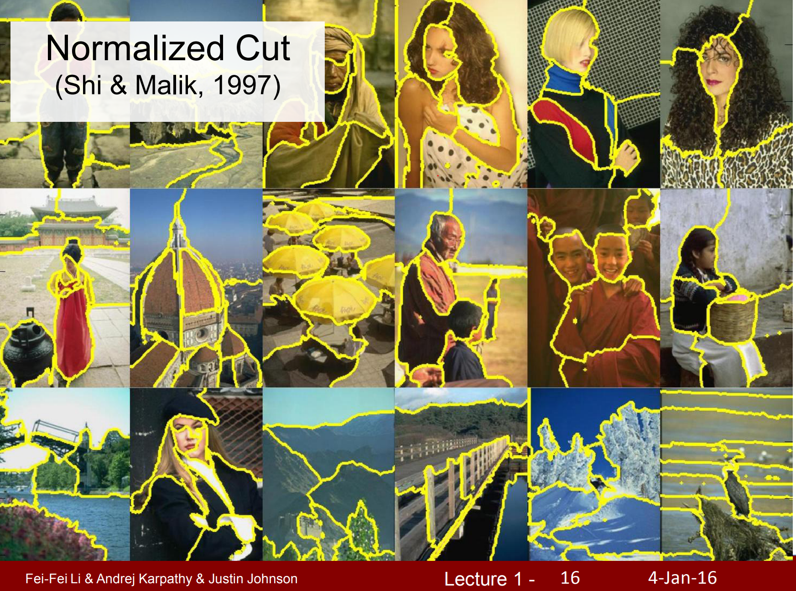

Part of [CS231n Winter 2016](../index.md)

----
# First  Lecture - Fei Fei Li

---
# CS231n Winter 2016: Lecture 1: Introduction and Historical Context

CV people call multimedia, the dark matter of internet. There is so much of it, it is unreal.

Aristotale suggested the camera.

Leonardo Da Vinci, really documented the suggestion of the camera.

The part that processes images is the back of your head.

Almost %50 of your brain is involved in your vision.

When they moved the slides, in between the edges, neurons are fired.

Primary visual cortex are organized in columns and for every column of the neurons, they like to see a specific orientation of the stimuli - simple oriented bars, rather that the fish or Mouse.

Larry Roberts were trying to extract like these edge like structures.

The birthday of computer vision - Summer of 1966.

Vision is so easy LOL!

Computer Vision is not solved in that Summer.
## Vision is hierachical.

Huber and Wiesel told us to start simple. 

David Marr told us to build a **hierarchical** model. Here is [the book.](https://www.amazon.com/Vision-Computational-Investigation-Representation-Information/dp/0262514621)

World is 3D but the image on our retina is 2D.

We have a hardware trick - we have 2 eyes.

We have a bunch of software tricks to understand 3D.

When we pick up a mug, we need a 3D modeling of the world.

Brooks - (Founder of MIT AI Lab - Founder of Roomba ) - World is combined of simple shapes.

Fischler - Parts are connected by strings (not everyone has the same eye distance between). Not everyone sees the world as the same.

Razors found by simple shapes which are constructed by their edges.
## Perceptual Grouping

When you enter a new room, you do not say OMG I see too many pixels.

You immediately group things.

This was one of the first approaches to actually solve problems on real and colored images.

This work (Viola&Jones) was the first paper Fei Fei Li read when she was working as a graduate student.
## First digital camera that has a face detector 📱

This paper transferred to the first smart digital camera by Fujifilm in 2006.

The algorithm learns to find features that can give us the best localization of faces.
## First work to be deployed and run real time.

David Marr was trying to understand the 3D world around him. From this point forward (2000's), CV is focusing to AI applications again, like recognition. 
## We gotta focus on features 🤔

It is really really hard to recognize an object by describing the whole thing.

I see you guys, heavily occluded. I don't see the rest of your torso, I don't see your legs. But I can recognize you.

So people started to think about **features** in recognition.

So SIFT is all about learning important **features** of an object. If we can do that, we can recognize the object on different angle in a cluttered scene.

From 2000 to 2010 entire field of CV was just focusing on features.

One of the reasons Deep Learning  became more convincing to a lot of people is that, a DL network learns really similar features very similar to these engineered features (like on SIFT).

This work is also using the feature thinking we got from SIFT to use them in scene recognition. In this work there is an example of Support Vector Machines and Kernel Models to recognize scene.

One last model before Deep Learning model is a model called Deformable Part Model:

Around this time, 2010'ish, we are working on pedestrian detection. 

A standard benchmark was needed.
## A CLASSIC WAS BORN: PASCAL VOC

European effort, researchers put together thousands of images in 20 classes. So Labs started to compete on object recognition challenge.

Fei Fei Li and her students was thinking: "The world is more than 20 classes."
## Imagenet was born!

## Olimpics of CV

Every year error decreased. 

2012 a CNN destroyed the competition. Historical moment.

CNN is invented in 1980's.

This is the beginning of the Deep Learning revolution.

This was the history of computer vision. 🥰 
## CS231n focuses on one of the most important problems of visual recognition – image classification

## There is a number of visual recognition problems that are related to image classification, such as object detection, image captioning

## Convolutional Neural Network (CNN) has become an important tool for object recognition.

Alex Krizhevsky and Geoffrey Hinton. Here is [the paper](https://proceedings.neurips.cc/paper_files/paper/2012/file/c399862d3b9d6b76c8436e924a68c45b-Paper.pdf)

Fast forward to 2015 - 151 layered CNN - Microsoft Asia Research Group.

However, Convolutional Neural Network (CNN) is not invented overnight.

The **neocognitron** is a hierarchical, multilayered [artificial neural network](https://en.wikipedia.org/wiki/Artificial_neural_network "Artificial neural network") proposed by [Kunihiko Fukushima](https://en.wikipedia.org/wiki/Kunihiko_Fukushima "Kunihiko Fukushima") in 1979. This was the beginning of NN's.

The groundbreaking work was of the Yann Le Cun's.

Yann was working in Bell Labs. Amazing place at that time.

He needed to recognize digits, US post office to recognize zip codes.

He was inspired by Hubei and Wiesel. 

He starts by looking simple edge like structures, not whole letters.

Layer by layer, he filters this edges and pool em together. 

In 2012, almost the same architecture. Sigmoid to rectified linear shape but whatever LOL.

Two things changed:
- Moore's Law. Hardware really helped in 2012. Bigger capacity microchips and GPU's.
- Availability of data changed hugely.
### A lot of problems to be solved.

Dense labeling of en entire scene with perceptual grouping.

Combining recognition with 3D

Motion and so on..

## Tell a story with a vision.

This is the human state.

Vision is wonderful.

Our philosophy
• Thorough and Detailed.
	– Understand how to write from scratch, debug and train convolutional neural networks.
• Practical.
	– Focus on practical techniques for training these networks at scale, and on GPUs (e.g. will touch on distributed optimization, differences between CPU vs. GPU, etc.) Also look at state of the art software tools such as Caffe, maybe also Torch and TensorFlow
• State of the art.
	– Most materials are new from research world in the past 1-3 years. Very exciting stuff!
• Fun.
	– Some fun topics such as Image Captioning (using RNN)
	– Also DeepDream, NeuralStyle, etc. 

Pre-requisite
• Proficiency in Python, some high-level familiarity with C/C++
	– All class assignments will be in Python (and use numpy), but some of the deep learning libraries we may look at later in the class are written in C++.
	– A Python tutorial available on course website
• College Calculus, Linear Algebra
• Equivalent knowledge of CS229 (Machine Learning)
	– We will be formulating cost functions, taking derivatives and performing optimization with gradient descent. 
## Grading policy

• 3 Problem Sets: 15% x 3 = 45%
• Midterm Exam: 15%
• Final Course Project: 40%
	– Milestone: 5%
	– Final write-up: 35%
	– Bonus points for exceptional poster presentation
• Late policy
	– 7 free late days – use them in your ways
	– Afterwards, 25% off per day late
	– Not accepted after 3 late days per PS
	– Does not apply to Final Course Project
• Collaboration policy
	– Read the student code book, understand what is ‘collaboration’ and what is ‘academic infraction
## References

Hubel, David H., and Torsten N. Wiesel. "Receptive fields, binocular interaction and functional architecture in the cat's visual cortex." The Journal of physiology 160.1 (1962): 106.
• Roberts, Lawrence Gilman. "Machine Perception of Three-dimensional Solids." Diss. Massachusetts Institute of Technology, 1963. 
• Marr, David. "Vision.” The MIT Press, 1982.
• Brooks, Rodney A., and Creiner, Russell and Binford, Thomas O. "The ACRONYM model-based vision system. " In Proceedings of the 6th International Joint Conference on Artificial Intelligence (1979): 105-113. 
• Fischler, Martin A., and Robert A. Elschlager. "The representation and matching of pictorial structures." IEEE Transactions on Computers 22.1 (1973): 67-92.
• Lowe, David G., "Three-dimensional object recognition from single two-dimensional images," Artificial Intelligence, 31, 3 (1987), pp. 355-395.
• Shi, Jianbo, and Jitendra Malik. "Normalized cuts and image segmentation." Pattern Analysis and Machine Intelligence, IEEE Transactions on 22.8 (2000): 888-905. [PDF]
• Viola, Paul, and Michael Jones. "Rapid object detection using a boosted cascade of simple features." Computer Vision and Pattern Recognition, 2001. CVPR 2001. Proceedings of the 2001 IEEE Computer
Society Conference on. Vol. 1. IEEE, 2001. [PDF]
• Lowe, David G. "Distinctive image features from scale-invariant keypoints." International Journal of Computer Vision 60.2 (2004): 91-110. [PDF]
• Lazebnik, Svetlana, Cordelia Schmid, and Jean Ponce. "Beyond bags of features: Spatial pyramid matching for recognizing natural scene categories." Computer Vision and Pattern Recognition, 2006 IEEE Computer Society Conference on. Vol. 2. IEEE, 2006. [PDF]
Dalal, Navneet, and Bill Triggs. "Histograms of oriented gradients for human detection." Computer Vision and Pattern Recognition, 2005. CVPR 2005. IEEE Computer Society Conference on. Vol. 1. IEEE, 2005.
[PDF]
• Felzenszwalb, Pedro, David McAllester, and Deva Ramanan. "A discriminatively trained, multiscale, deformable part model." Computer Vision and Pattern Recognition, 2008. CVPR 2008. IEEE Conference on. IEEE, 2008 [PDF]
• Everingham, Mark, et al. "The pascal visual object classes (VOC) challenge." International Journal of Computer Vision 88.2 (2010): 303-338. [PDF]
• Deng, Jia, et al. "Imagenet: A large-scale hierarchical image database." Computer Vision and Pattern Recognition, 2009. CVPR 2009. IEEE Conference on. IEEE, 2009. [PDF]
• Russakovsky, Olga, et al. "Imagenet Large Scale Visual Recognition Challenge." arXiv:1409.0575. [PDF]
• Lin, Yuanqing, et al. "Large-scale image classification: fast feature extraction and SVM training."
Computer Vision and Pattern Recognition (CVPR), 2011 IEEE Conference on. IEEE, 2011. [PDF]
• Krizhevsky, Alex, Ilya Sutskever, and Geoffrey E. Hinton. "Imagenet classification with deep
convolutional neural networks." Advances in neural information processing systems. 2012. [PDF]
• Szegedy, Christian, et al. "Going deeper with convolutions." arXiv preprint arXiv:1409.4842 (2014). [PDF]
• Simonyan, Karen, and Andrew Zisserman. "Very deep convolutional networks for large-scale image
recognition." arXiv preprint arXiv:1409.1556 (2014). [PDF]
• He, Kaiming, et al. "Spatial Pyramid Pooling in Deep Convolutional Networks for Visual Recognition."
arXiv preprint arXiv:1406.4729 (2014). [PDF]
• LeCun, Yann, et al. "Gradient-based learning applied to document recognition." Proceedings of the IEEE
86.11 (1998): 2278-2324. [PDF]
• Fei-Fei, Li, et al. "What do we perceive in a glance of a real-world scene?." Journal of vision 7.1 (2007):
10. [PDF]
