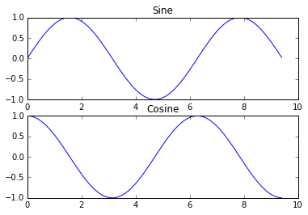

Part of [CS231n Winter 2016](../index.md)

----
# Second Lecture - Andrej Karpathy

---
# CS231n Winter 2016: Lecture 2: Data-driven approach, kNN, Linear Classification 1

## Lecture 2: Image Classification pipeline

Administrative
First assignment will come out tonight (or tomorrow at worst)
It is due January 20 (i.e. in two weeks). Handed in through `CourseWork`
It includes:
- Write/train/evaluate a kNN classifier
- Write/train/evaluate a Linear Classifier (SVM and Softmax)
- Write/train/evaluate a 2-layer Neural Network (back-propagation!)
- Requires writing numpy/Python code
Warning: don’t work on assignments from last year!
Compute: Can use your own laptops, or Terminal.com
## If you need a Numpy reminder:

https://cs231n.github.io/python-numpy-tutorial/

---
# Tangent  - Numpy Reminder:

## Dictionaries

##### A dictionary stores (key, value) pairs, similar to a Map in Java or an object in JavaScript. You can use it like this:

```python
d = {'cat': 'cute', 'dog': 'furry'}  # Create a new dictionary with some data
print(d['cat'])       # Get an entry from a dictionary; prints "cute"
print('cat' in d)     # Check if a dictionary has a given key; prints "True"
d['fish'] = 'wet'     # Set an entry in a dictionary
print(d['fish'])      # Prints "wet"
# print(d['monkey'])  # KeyError: 'monkey' not a key of d
print(d.get('monkey', 'N/A'))  # Get an element with a default; prints "N/A"
print(d.get('fish', 'N/A'))    # Get an element with a default; prints "wet"
del d['fish']         # Remove an element from a dictionary
print(d.get('fish', 'N/A')) # "fish" is no longer a key; prints "N/A"
```
## Numpy

[Numpy](http://www.numpy.org/) is the core library for scientific computing in Python. It provides a high-performance multidimensional array object, and tools for working with these arrays.
### Arrays

A numpy array is a grid of values, all of the same type, and is indexed by a tuple of non-negative integers. 

The number of dimensions is the _rank_ of the array; the _shape_ of an array is a tuple of integers giving the size of the array along each dimension.

We can initialize numpy arrays from nested Python lists, and access elements using square brackets:

```python
import numpy as np

# The rank of an array is the number of dimensions it has. 
# A scalar is considered to have rank zero.
a = np.array([1, 2, 3])   # Make a rank 1 array
print(type(a))            # Prints "<class 'numpy.ndarray'>"
print(a.shape)            # Prints "(3,)"
print(a[0], a[1], a[2])   # Prints "1 2 3"
a[0] = 5                  # Change an element of the array
print(a)                  # Prints "[5, 2, 3]"

b = np.array([[1,2,3],[4,5,6]])    # Make a rank 2 array
print(b.shape)                     # Prints "(2, 3)"
print(b[0, 0], b[0, 1], b[1, 0])   # Prints "1 2 4"
```

Numpy also provides many functions to make arrays:

```python
import numpy as np

a = np.zeros((2,2))   # Create an array of all zeros
print(a)              # Prints "[[ 0.  0.]
                      #          [ 0.  0.]]"

b = np.ones((1,2))    # Create an array of all ones
print(b)              # Prints "1.  1."

c = np.full((2,2), 7)  # Create a constant array
print(c)               # Prints "[[ 7.  7.]
                       #          [ 7.  7.]]"

d = np.eye(2)         # Create a 2x2 identity matrix
print(d)              # Prints "[[ 1.  0.]
                      #          [ 0.  1.]]"

e = np.random.random((2,2))  # Create an array filled with random values
print(e)                     # Might print "[[ 0.91940167  0.08143941]
                             #               [ 0.68744134  0.87236687]]"
```
### Indexing 💚

#### Slicing: `using : or start:stop or start:stop:step`

Since arrays may be multidimensional, you must specify a slice for each dimension of the array:

```python
import numpy as np

# Create the following rank 2 array with shape (3, 4)
# [[ 1  2  3  4]
#  [ 5  6  7  8]
#  [ 9 10 11 12]]
a = np.array([[1,2,3,4], [5,6,7,8], [9,10,11,12]])

# Use slicing to pull out the subarray consisting of the first 2 rows
# and columns 1 and 2; b is the following array of shape (2, 2):
# [[2 3]
#  [6 7]]
b = a[:2, 1:3]

# A slice of an array is a view into the same data, so modifying it
# will modify the original array.
print(a[0, 1])   # Prints "2"
b[0, 0] = 77     # b[0, 0] is the same piece of data as a[0, 1]
print(a[0, 1])   # Prints "77"
```

We can also mix integer indexing with slicing. Just indexing man `LOL` 😅  `array[0] or array[,2]` 

```python
import numpy as np

# Create the following rank 2 array with shape (3, 4)
# [[ 1  2  3  4]
#  [ 5  6  7  8]
#  [ 9 10 11 12]]
a = np.array([[1,2,3,4], [5,6,7,8], [9,10,11,12]])

# Two ways of accessing the data in the middle row of the array.
# Mixing integer indexing with slices yields an array of lower rank,
# while using only slices yields an array of the same rank as the
# original array:
row_r1 = a[1, :]    # Rank 1 view of the second row of a
row_r2 = a[1:2, :]  # Rank 2 view of the second row of a
print(row_r1, row_r1.shape)  # Prints "[5 6 7 8] (4,)"
print(row_r2, row_r2.shape)  # Prints "5 6 7 8 (1, 4)"

# We can make the same distinction when accessing columns of an array:
col_r1 = a[:, 1]
col_r2 = a[:, 1:2]
print(col_r1, col_r1.shape)  # Prints "[ 2  6 10] (3,)"
print(col_r2, col_r2.shape)  # Prints "[[ 2]
                             #          [ 6]
                             #          [10]] (3, 1)"

c = a[2, 0:4]
print(c) # array([ 9, 10, 11, 12])
```

**Integer array indexing:** When you index into numpy arrays using slicing, the resulting array view will ==always be a sub-array== of the original array. 

In contrast, ==integer array indexing== allows you to construct arbitrary arrays using the data from another array. Here is an example:

```python
import numpy as np

a = np.array([[1,2], [3, 4], [5, 6]])

# An example of integer array indexing.
# The returned array will have shape (3,) and
print(a[[0, 1, 2], [0, 1, 0]])  # Prints "[1 4 5]"

# unbelievable
# a[[0, 1, 2], [0, 1, 0]] is equivalent to

# a[0, 0]  # 1
# a[1, 1]  # 4
# a[2, 0]  # 5

# The above example of integer array indexing is equivalent to this:
print(np.array([a[0, 0], a[1, 1], a[2, 0]]))  # Prints "[1 4 5]"

# When using integer array indexing, you can reuse the same
# element from the source array:
print(a[[0, 0], [1, 1]])  # Prints "[2 2]"

# Equivalent to the previous integer array indexing example
print(np.array([a[0, 1], a[0, 1]]))  # Prints "[2 2]"
```

One useful trick with integer array indexing is ==selecting or mutating one element from each row== of a matrix:

```python
import numpy as np

# Create a new array from which we will select elements
a = np.array([[1,2,3], [4,5,6], [7,8,9], [10, 11, 12]])

print(a)  # prints "array([[ 1,  2,  3],
          #                [ 4,  5,  6],
          #                [ 7,  8,  9],
          #                [10, 11, 12]])"

# Create an array of indices
b = np.array([0, 2, 0, 1])  # just another array

# Select one element from each row of a using the indices in b
print(a[np.arange(4), b])  # Prints "[ 1  6  7 11]"

# why? 
# equivalent to this: 
print(np.array([a[0, 0], a[1, 2], a[2, 0], a[3, 1]]))  # Prints  [ 1  6  7 11]

# Mutate one element from each row of a using the indices in b
a[np.arange(4), b] += 10

# weird stuff idk
print(a)  # prints "array([[11,  2,  3],
          #                [ 4,  5, 16],
          #                [17,  8,  9],
          #                [10, 21, 12]])
```

**Boolean array indexing:** Boolean array indexing lets you pick out arbitrary elements of an array. 

Frequently this type of indexing is used to select the elements of an array that satisfy some condition. Here is an example:

```python
import numpy as np

a = np.array([[1, 2], [3, 4], [5, 6]])

bool_idx = (a > 2)   # Find the elements of a that are bigger than 2;
                     # this returns a numpy array of Booleans of the same
                     # shape as a, where each slot of bool_idx tells
                     # whether that element of a is > 2.

print(bool_idx)      # Prints "[[False False]
                     #          [ True  True]
                     #          [ True  True]]"
        
print(bool_idx.ndim)  # 2
print(bool_idx.shape) # (3, 2)
print(bool_idx.dtype) # bool
print(bool_idx.size)  # 6
print(type(bool_idx)) # <class 'numpy.ndarray'>

# We use boolean array indexing to construct a rank 1 array
# consisting of the elements of a corresponding to the True values
# of bool_idx
print(a[bool_idx])  # Prints "[3 4 5 6]"

# We can do all of the above in a single concise statement:
print(a[a > 2])     # Prints "[3 4 5 6]"
```

For brevity we have left out a lot of details about numpy array indexing; if you want to know more you should [read the documentation](http://docs.scipy.org/doc/numpy/reference/arrays.indexing.html).
### Datatypes 🤔

Every numpy array is a grid of elements of the ==same type==. 

Numpy provides a large set of numeric datatypes that you can use to construct arrays. 

Numpy tries to guess a datatype when you create an array, but functions that construct arrays usually also include an optional argument to explicitly specify the datatype. 

Here is an example:

```python
import numpy as np

x = np.array([1, 2])   # Let numpy choose the datatype
print(x.dtype)         # Prints "int64"

x = np.array([1.0, 2.0])   # Let numpy choose the datatype
print(x.dtype)             # Prints "float64"

x = np.array([1, 2], dtype=np.int64)   # Force a particular datatype
print(x.dtype)                         # Prints "int64"
```

You can read all about numpy datatypes [in the documentation](http://docs.scipy.org/doc/numpy/reference/arrays.dtypes.html).
### Array math 🧠

Basic mathematical functions operate element wise on arrays, and are available both as operator overloads and as functions in the numpy module:

```python
import numpy as np

x = np.array([[1,2],[3,4]], dtype=np.float64)
y = np.array([[5,6],[7,8]], dtype=np.float64)

# Elementwise sum; both produce the array
# [[ 6.0  8.0]
#  [10.0 12.0]]
print(x + y)
print(np.add(x, y))

# Elementwise difference; both produce the array
# [[-4.0 -4.0]
#  [-4.0 -4.0]]
print(x - y)
print(np.subtract(x, y))

# Elementwise product; both produce the array
# [[ 5.0 12.0]
#  [21.0 32.0]]
print(x * y)
print(np.multiply(x, y))

# Elementwise division; both produce the array
# [[ 0.2         0.33333333]
#  [ 0.42857143  0.5       ]]
print(x / y)
print(np.divide(x, y))

# Elementwise square root; produces the array
# [[ 1.          1.41421356]
#  [ 1.73205081  2.        ]]
print(np.sqrt(x))
```

`*` is element wise multiplication.

We instead use the `dot` function to compute inner (dot) products of vectors, to multiply a vector by a matrix, and to multiply matrices.

`dot` is available both as a function in the numpy module and as an instance method of array objects:

```python
import numpy as np

x = np.array([[1,2],[3,4]])
y = np.array([[5,6],[7,8]])

v = np.array([9,10])
w = np.array([11, 12])

# If the vectors are perpendicular, then the inner product is zero.
print(np.dot(np.array([4, 3]), np.array([-3, 4]))) # 0

# Inner product of vectors; both produce 219 -> 99 + 120
print(v.dot(w)) # 219
print(np.dot(v, w)) # 219

# Matrix / vector product; both produce the rank 1 array [29 67]
print(x.dot(v)) # [(1 * 9 + 2 * 10 ) , (3 * 9  4 * 10)]
print(np.dot(x, v)) # [(1 * 9 + 2 * 10 ) , (3 * 9  4 * 10)]

# Matrix / matrix product; both produce the rank 2 array
# [[19 22]
#  [43 50]]
print(x.dot(y)) # row * col 
print(np.dot(x, y)) # row * col
```


Numpy provides many useful functions for performing computations on arrays; one of the most useful is `sum`:

```python
import numpy as np

x = np.array([[1,2], [3,4]])

print(np.sum(x))  # Compute sum of all elements; prints "10"
print(np.sum(x, axis=0))  # Sum of each column; prints "[4 6]"
print(np.sum(x, axis=1))  # Sum of each row; prints "[3 7]"
```

You can find the full list of mathematical functions provided by numpy [in the documentation](http://docs.scipy.org/doc/numpy/reference/routines.math.html).

Apart from computing mathematical functions using arrays, we frequently need to reshape or otherwise manipulate data in arrays. 

The simplest example of this type of operation is transposing a matrix; ==to transpose== a matrix, simply use the `T` attribute of an array object:

```python
import numpy as np

x = np.array([[1,2], [3,4]])
print(x)    # Prints "[[1 2]
            #          [3 4]]"
print(x.T)  # Prints "[[1 3]
            #          [2 4]]"

# Note that taking the transpose of a rank 1 array does nothing:
v = np.array([1,2,3])
print(v)    # Prints "[1 2 3]"
print(v.T)  # Prints "[1 2 3]"
```

Numpy provides many more functions for manipulating arrays; you can see the full list [in the documentation](http://docs.scipy.org/doc/numpy/reference/routines.array-manipulation.html).
### Broadcasting - `smaller - larger - together`

Broadcasting is a powerful mechanism that allows numpy to work with arrays of different shapes when performing arithmetic operations. 

Frequently we have a ==smaller array== and ==a larger array==, and we want to use the smaller array multiple times to perform some operation on the larger array.

For example, suppose that we want to add a constant vector to each row of a matrix. We could do it like this:

```python
import numpy as np

# We will add the vector v to each row of the matrix x,
# storing the result in the matrix y
x = np.array([[1,2,3], [4,5,6], [7,8,9], [10, 11, 12]])
v = np.array([1, 0, 1])
y = np.empty_like(x)   # Create an empty matrix with the same shape as x

# Add the vector v to each row of the matrix x with an explicit loop
for i in range(4):
    y[i, :] = x[i, :] + v

# Now y is the following
# [[ 2  2  4]
#  [ 5  5  7]
#  [ 8  8 10]
#  [11 11 13]]
print(y)
```

This works; however when the matrix `x` is very large, computing an explicit loop in Python could be slow.

Note that adding the vector `v` to each row of the matrix `x` is equivalent to forming a matrix `vv` by stacking multiple copies of `v` vertically, then performing element wise summation of `x` and `vv`. 

We could implement this approach like this:
## `np.tile` - `stack on top of each other LOL`

```python
import numpy as np

# We will add the vector v to each row of the matrix x,
# storing the result in the matrix y
x = np.array([[1,2,3], [4,5,6], [7,8,9], [10, 11, 12]])
v = np.array([1, 0, 1])
vv = np.tile(v, (4, 1))   # Stack 4 copies of v on top of each other

print(vv)     # Prints "[[1 0 1]
              #          [1 0 1]
              #          [1 0 1]
              #          [1 0 1]]"
                          
y = x + vv  # Add x and vv elementwise

print(y)  # Prints "[[ 2  2  4
          #          [ 5  5  7]
          #          [ 8  8 10]
          #          [11 11 13]]"
```
## broadcasting - perform computation without copies! 🤨

Numpy broadcasting allows us to **perform this computation without actually making multiple copies** of `v`. 

Consider this version, using broadcasting:

```python
import numpy as np

# We will add the vector v to each row of the matrix x,
# storing the result in the matrix y
x = np.array([[1,2,3], [4,5,6], [7,8,9], [10, 11, 12]])
v = np.array([1, 0, 1])
y = x + v  # Add v to each row of x using broadcasting
print(y)  # Prints "[[ 2  2  4]
          #          [ 5  5  7]
          #          [ 8  8 10]
          #          [11 11 13]]"
```

The line `y = x + v` works even though `x` has shape `(4, 3)` and `v` has shape `(3,)` due to broadcasting; this line works as if `v` actually had shape `(4, 3)`, where each row was a copy of `v`, and the sum was performed element wise.

Broadcasting two arrays together follows these rules:

1. If the arrays do not have the same rank, prepend the shape of the lower rank array with 1's until both shapes have the same length.
2. The two arrays are said to be _compatible_ in a dimension if they have the same size in the dimension, or if one of the arrays has size 1 in that dimension.
3. The arrays can be broadcast together if they are compatible in all dimensions.
4. After broadcasting, each array behaves as if it had shape equal to the element-wise maximum of shapes of the two input arrays.
5. In any dimension where one array had size 1 and the other array had size greater than 1, the first array behaves as if it were copied along that dimension

If this explanation does not make sense, try reading the explanation [from the documentation](http://docs.scipy.org/doc/numpy/user/basics.broadcasting.html) or [this explanation](https://scipy.github.io/old-wiki/pages/EricsBroadcastingDoc).

Functions that support broadcasting are known as _universal functions_. You can find the list of all universal functions [in the documentation](http://docs.scipy.org/doc/numpy/reference/ufuncs.html#available-ufuncs).

Here are some applications of broadcasting:

```python
import numpy as np

# Compute outer product of vectors
v = np.array([1,2,3])  # v has shape (3,)
w = np.array([4,5])    # w has shape (2,)
# To compute an outer product, we first reshape v to be a column
# vector of shape (3, 1); we can then broadcast it against w to yield
# an output of shape (3, 2), which is the outer product of v and w:
# [[ 4  5]
#  [ 8 10]
#  [12 15]]
print(np.reshape(v, (3, 1)) * w)

# Add a vector to each row of a matrix
x = np.array([[1,2,3], [4,5,6]])
# x has shape (2, 3) and v has shape (3,) so they broadcast to (2, 3),
# giving the following matrix:
# [[2 4 6]
#  [5 7 9]]
print(x + v)

# Add a vector to each column of a matrix
# x has shape (2, 3) and w has shape (2,).
# If we transpose x then it has shape (3, 2) and can be broadcast
# against w to yield a result of shape (3, 2); transposing this result
# yields the final result of shape (2, 3) which is the matrix x with
# the vector w added to each column. Gives the following matrix:
# [[ 5  6  7]
#  [ 9 10 11]]
print((x.T + w).T)
# Another solution is to reshape w to be a column vector of shape (2, 1);
# we can then broadcast it directly against x to produce the same
# output.
print(x + np.reshape(w, (2, 1)))

# Multiply a matrix by a constant:
# x has shape (2, 3). Numpy treats scalars as arrays of shape ();
# these can be broadcast together to shape (2, 3), producing the
# following array:
# [[ 2  4  6]
#  [ 8 10 12]]
print(x * 2)
```

Broadcasting typically makes your code more concise and faster, so you should strive to use it where possible.
### Numpy Documentation

This brief overview has touched on many of the important things that you need to know about numpy, but is far from complete. Check out the [numpy reference](http://docs.scipy.org/doc/numpy/reference/) to find out much more about numpy.
## SciPy 💖

Numpy provides a high-performance multidimensional array and basic tools to compute with and manipulate these arrays. 

[SciPy](http://docs.scipy.org/doc/scipy/reference/) builds on this, and provides a large number of functions that operate on numpy arrays and are useful for different types of scientific and engineering applications.

Here is a teaser:

| Subpackage                                                                                                                | Description                                            |
| ------------------------------------------------------------------------------------------------------------------------- | ------------------------------------------------------ |
| [`cluster`](https://docs.scipy.org/doc/scipy/reference/cluster.html#module-scipy.cluster "scipy.cluster")                 | Clustering algorithms                                  |
| [`constants`](https://docs.scipy.org/doc/scipy/reference/constants.html#module-scipy.constants "scipy.constants")         | Physical and mathematical constants                    |
| [`fft`](https://docs.scipy.org/doc/scipy/reference/fft.html#module-scipy.fft "scipy.fft")                                 | Discrete Fourier transforms                            |
| [`fftpack`](https://docs.scipy.org/doc/scipy/reference/fftpack.html#module-scipy.fftpack "scipy.fftpack")                 | Fast Fourier Transform routines (legacy)               |
| [`integrate`](https://docs.scipy.org/doc/scipy/reference/integrate.html#module-scipy.integrate "scipy.integrate")         | Integration and ordinary differential equation solvers |
| [`interpolate`](https://docs.scipy.org/doc/scipy/reference/interpolate.html#module-scipy.interpolate "scipy.interpolate") | Interpolation and smoothing splines                    |
| [`io`](https://docs.scipy.org/doc/scipy/reference/io.html#module-scipy.io "scipy.io")                                     | Input and Output                                       |
| [`linalg`](https://docs.scipy.org/doc/scipy/reference/linalg.html#module-scipy.linalg "scipy.linalg")                     | Linear algebra                                         |
| [`ndimage`](https://docs.scipy.org/doc/scipy/reference/ndimage.html#module-scipy.ndimage "scipy.ndimage")                 | N-dimensional image processing                         |
| [`odr`](https://docs.scipy.org/doc/scipy/reference/odr.html#module-scipy.odr "scipy.odr")                                 | Orthogonal distance regression                         |
| [`optimize`](https://docs.scipy.org/doc/scipy/reference/optimize.html#module-scipy.optimize "scipy.optimize")             | Optimization and root-finding routines                 |
| [`signal`](https://docs.scipy.org/doc/scipy/reference/signal.html#module-scipy.signal "scipy.signal")                     | Signal processing                                      |
| [`sparse`](https://docs.scipy.org/doc/scipy/reference/sparse.html#module-scipy.sparse "scipy.sparse")                     | Sparse matrices and associated routines                |
| [`spatial`](https://docs.scipy.org/doc/scipy/reference/spatial.html#module-scipy.spatial "scipy.spatial")                 | Spatial data structures and algorithms                 |
| [`special`](https://docs.scipy.org/doc/scipy/reference/special.html#module-scipy.special "scipy.special")                 | Special functions                                      |
| [`stats`](https://docs.scipy.org/doc/scipy/reference/stats.html#module-scipy.stats "scipy.stats")                         | Statistical distributions and functions                |

The best way to get familiar with SciPy is to [browse the documentation](http://docs.scipy.org/doc/scipy/reference/index.html). We will highlight some parts of SciPy that you might find useful for this class.
### Image operations

SciPy provides some basic functions to work with images. For example, it has functions to read images from disk into numpy arrays, to write numpy arrays to disk as images, and to resize images. Here is a simple example that showcases these functions:

```python
from scipy.misc import imread, imsave, imresize

# Read an JPEG image into a numpy array
img = imread('assets/cat.jpg')
print(img.dtype, img.shape)  # Prints "uint8 (400, 248, 3)"

# We can tint the image by scaling each of the color channels
# by a different scalar constant. The image has shape (400, 248, 3);
# we multiply it by the array [1, 0.95, 0.9] of shape (3,);
# numpy broadcasting means that this leaves the red channel unchanged,
# and multiplies the green and blue channels by 0.95 and 0.9
# respectively.
img_tinted = img * [1, 0.95, 0.9]

# Resize the tinted image to be 300 by 300 pixels.
img_tinted = imresize(img_tinted, (300, 300))

# Write the tinted image back to disk
imsave('assets/cat_tinted.jpg', img_tinted)
```

The original:


Tinted: 


### Distance between points

SciPy defines some useful functions for computing distances between sets of points.

The function `scipy.spatial.distance.pdist` computes the distance between all pairs of points in a given set:

```python
import numpy as np
from scipy.spatial.distance import pdist, squareform

# Create the following array where each row is a point in 2D space:
# [[0 1]
#  [1 0]
#  [2 0]]
x = np.array([[0, 1], [1, 0], [2, 0]])
print(x)

# Compute the Euclidean distance between all rows of x.
# d[i, j] is the Euclidean distance between x[i, :] and x[j, :],
# and d is the following array:
# [[ 0.          1.41421356  2.23606798]
#  [ 1.41421356  0.          1.        ]
#  [ 2.23606798  1.          0.        ]]
d = squareform(pdist(x, 'euclidean'))
print(d)
```

You can read all the details about this function [in the documentation](http://docs.scipy.org/doc/scipy/reference/generated/scipy.spatial.distance.pdist.html).

A similar function (`scipy.spatial.distance.cdist`) computes the distance between all pairs across two sets of points; you can read about it [in the documentation](http://docs.scipy.org/doc/scipy/reference/generated/scipy.spatial.distance.cdist.html).
## Matplotlib

[Matplotlib](http://matplotlib.org/) is a plotting library. In this section give a brief introduction to the `matplotlib.pyplot` module, which provides a plotting system similar to that of MATLAB.
### Plotting
The most important function in matplotlib is `plot`, which allows you to plot 2D data. Here is a simple example:

```python
import numpy as np
import matplotlib.pyplot as plt

# Compute the x and y coordinates for points on a sine curve
x = np.arange(0, 3 * np.pi, 0.1)
y = np.sin(x)

# Plot the points using matplotlib
plt.plot(x, y)
plt.show()  # You must call plt.show() to make graphics appear.
```

Running this code produces the following plot:

With just a little bit of extra work we can easily plot multiple lines at once, and add a title, legend, and axis labels:

```python
import numpy as np
import matplotlib.pyplot as plt

# Compute the x and y coordinates for points on sine and cosine curves
x = np.arange(0, 3 * np.pi, 0.1)
y_sin = np.sin(x)
y_cos = np.cos(x)

# Plot the points using matplotlib
plt.plot(x, y_sin)
plt.plot(x, y_cos)
plt.xlabel('x axis label')
plt.ylabel('y axis label')
plt.title('Sine and Cosine')
plt.legend(['Sine', 'Cosine'])
plt.show()
```

You can read much more about the `plot` function [in the documentation](http://matplotlib.org/api/pyplot_api.html#matplotlib.pyplot.plot).
### Subplots 📜

You can plot different things in the same figure using the `subplot` function. Here is an example:

```python
import numpy as np
import matplotlib.pyplot as plt

# Compute the x and y coordinates for points on sine and cosine curves
x = np.arange(0, 3 * np.pi, 0.1)
y_sin = np.sin(x)
y_cos = np.cos(x)

# Set up a subplot grid that has height 2 and width 1,
# and set the first such subplot as active.
plt.subplot(2, 1, 1)

# Make the first plot
plt.plot(x, y_sin)
plt.title('Sine')

# Set the second subplot as active, and make the second plot.
plt.subplot(2, 1, 2)
plt.plot(x, y_cos)
plt.title('Cosine')

# Show the figure.
plt.show()
```


You can read much more about the `subplot` function [in the documentation](http://matplotlib.org/api/pyplot_api.html#matplotlib.pyplot.subplot).
### Images

You can use the `imshow` function to show images. Here is an example:

```python
import numpy as np
from scipy.misc import imread, imresize
import matplotlib.pyplot as plt

img = imread('assets/cat.jpg')
img_tinted = img * [1, 0.95, 0.9]

# Show the original image
plt.subplot(1, 2, 1)
plt.imshow(img)

# Show the tinted image
plt.subplot(1, 2, 2)

# A slight gotcha with imshow is that it might give strange results
# if presented with data that is not uint8. To work around this, we
# explicitly cast the image to uint8 before displaying it.
plt.imshow(np.uint8(img_tinted))
plt.show()
```

----

They actually used `terminal.com` and give credits to students and they are also able to use it.

---
# Back to Lesson Flow 🎋

## Image Classification: a core task in Computer Vision


The problem is a **semantic gap**.

Images are represented as 3D arrays of numbers, with integers between [0, 255]. 

E.g. 300 x 100 x 3 (3 for 3 color channels RGB)

All values indicate the amount of brightness on all the 3 color channels at every single position of the image.
## Semantic gap ?


When we move the camera all the brightness values will change.

Challenges of illumination.

Viewpoint varies.


Illumination is not controllable.


Objects deform.


There could be other things in the way.


Background might be almost the same as the object we are looking for.


Not every cat look alike.


## The problem is not simple. 🥰

What is an image classifier look like ?
## Not straight forward as just simply an algorithm.


People actually tried. In early days of CV, for each object class, people tried to come up with some rules.


Not scale-able.

Data driven approach works much better. In early days, they did not have a lot of data anyway. 

So more data is a luxury. Back in the day they only had 5 grey scale images with low resolution.

With the invention of internet this became feasible.


## nearest neighbor classifier!


We will work with CIFAR-10 dataset.


Take all the training data, for test images, lookup nearest neighbors in the training set of things that are most similar to the test images.


We will predict based on the similarity.
## How do we compare images ?

## Manhattan distance or L1 distance


Look at ==every single pixel value==, decide the difference between them.

Here is the code:

```python
import numpy as np

class NearestNeighbor:

	def __init__(self):
		pass
	
	def train(self, X , y):
		"""X is N x D where each row is an example. Y is 1 dimension of size N"""
		# the nearest neighbor classifier simply remembers all ther training data
		self.Xtr = X
		self.ytr = y

	def predict(self, X):
		"""X is NxD where each row is an example we wish to predict label for"""
		num_test = X.shape[0]
		# lets make sure that the output type matches the input type
		Ypred = np.zeros(num_test, dtype = self.ytr.dtype)
	
		# loop over all test rows
		for i in range(num_test):
			# find the nearest training image to the i'th test image
			# using the L1 distance (sum of absolute value differences)
			# this is a vectorized code
			distances = np.sum(np.abs(self.Xtr - X[i,:]), axis = 1)
			min_index = np.argmin(distances)  # get the index with smallest distance
			Ypred[i]  = self.ytr[min_index]
		
		return Ypred
```


# Q: how does the classification speed depend on the size of the training data?

It gets slower, linearly. 
# This is backwards 🤔: 
## - test time performance is usually much more important in practice. 
## - CNN's flip this: expensive training, cheap test evaluation

A nearest neighbor is instant at train but expensive at test. In a neural network we will huge amount of compute, but test time will be constant (really fast).

[FLANN](https://github.com/flann-lib/flann) will help you speed up nearest neighbors.
# Instead of L1 distance, we can choose another one:


How we computed distance, is a ==hyperparameter==.


When we move to higher numbers of K such as 5, the graphics start to smooth out.

Some random noise becomes acceptable and does not affect the clusters too much.
## We are always retrieving 5 nearest neighbors, so they get to overwhelm a green point. `dont only look for the nearest Neighbor`

## The choice of K is a hyperparameter.

In practice kNN offers better performance.


## 100%, because there will always be exactly a training set point on top of the test set.

## It would be the same if we used Manhattan distance also. LOL.


## Not 100%, `k` NN might change the classifier.

## What is the best distance to use? What is the best value of k to use? i.e. how do we set the hyperparameters? 

## Very problem-dependent. Must try them all out and see what works best.


Forget that you even have test data. Test data is where you test generalization.

Where you test your hyperparameters is in ==validation data==.


We can use 5 folds, only train a part of it.
## If you have very few training data, you can use cross validation. `1-4` - `2-3` - `3-2` - `4-1`


## We can find the different K values in a kNN using cross validation.


## We talked about kNN a lot. Is it used on vision ?


In vision it is kinda, yeah.
## Summary

- **Image Classification**: We are given a Training Set of labeled images, asked to predict labels on Test Set. Common to report the Accuracy of predictions (fraction of correctly predicted images)
- We introduced the k-Nearest Neighbor Classifier, which predicts the labels based on nearest images in the training set
- We saw that the choice of distance and the value of k are hyperparameters that are tuned using a validation set, or through cross-validation if the size of the data is small.
- Once the best set of hyper-parameters is chosen, the classifier is evaluated once on the test set, and reported as the performance of kNN on that data.
## Linear Classification


Neural networks not only see, they can hear. The can perform control.
## Playing with Lego blocks!


An example NN can make descriptions:


How does it work ?


CNN's can see. RNN's can model sequences of words. We stick them together.

These networks learn to talk to each other, in the process of trying to describe the images these gradients will be flowing through the convolutional network and the full system will be adjusting itself to better see  the images in order to describe them in the end.


We will approach CIFAR from a parametric approach:


kNN was non parametric approach. 

In parametric approach we are looking to find a function that takes an image and gives classes to us.


We can use the simplest approach, the linear classifier.

$x$ is a ==column vector== of $3072$ numbers. So $w$ should have $(10x3072)$ shape.


We also have to find $b$ which is not a function on the image.


If input only had 4 pixels and trying to predict 3 classes (there is an issue here, if there was 4 pixels, this would be 12 values in xi).
## Tangent - if input images are not same sized, resize images. So that all of the images are comparable on the same stuff.

## Tangent - state of the art models are work in square images, if you have a panorama, you will get a poor performance.


This setting of $w$ is not really good. Our cat score is less than other scores.

W matrix has all of the classes ==stacked IN ROWS== an they are all being dot product-ed with the image to give you the scores.
## Interpreting a Linear Classifier ? 


## Interpretation: Every single score is the weighted sum of all the pixel values of the image.


## if you reshape it back to an image so you can visualize it, you will see these templates.

`plane-blueblob` In the blue channel there are a lot of positive weights.

Some horses look at left some looking at right. So the blob looks like this.

These templates are the optimal way to mixing across of merging all of the modes.
## When we get to Conv-Nets this will be avoided. In principle we will have different angled versions of cars ?

## Another downside of the Linear Classifier is that it can only know the colored example that it has seen. `red car dominant`


We can think of these images as very high dimensional points in a $3072$ dimensional space. 

Along the line of the car classifier the score is 0.

As we train the classifier lines will rotate and turn and twist to isolate all the cars in the dataset.


Classes are similar. Negative images would not work well. Grey scale images would not work well.

If you have all of your textures (blue), say these textures van be different types but they can be spatially invariant but that would be not good. 
## what? 🤔

Spatial in-variance refers to the property where the output of a system (in this case, a linear classifier) is not affected by the position or location of the input features. In the context of textures, spatial in-variance would mean that the classifier treats textures similarly regardless of where they are located in the image.


We defined this linear function.


Loss function will help us quantify and minimize the loss.

Loss function is a function of ==your entire dataset and your weights.==
## we will extend f to not be that simple ==linear expression==, we will make it slightly more complex we will get a ==neural network==, we will make it slightly more complex and we will get a ==convolutional neural network==.

We cannot find the best set of weights right away, but we do know how to find the slightly better set of weights.

Convolutional Neural Networks are like stacking linear classifiers. 

We will have all these templates, red blue yellow cars. There will be a neuron assigned to detecting every one of these modes there will be combined in the second layer.

The next neuron will be just like okay I will just get a weighted sum of you guys and do an OR operation on your output.

---
# Tangent - `anaconda the goat`: 

The neat thing about Anaconda is that it ships with MKL optimizations by default, which means your numpy and scipy code benefit from significant speed-ups without having to change a single line of code.

Here is a [website](https://medium.com/hydroinformatics/getting-started-with-conda-environment-part-2-fc87fdd9fde8) about it.

---
# Assignment 1 - Working on [2022 Version](https://cs231n.github.io/assignments2022/assignment1/)

In this assignment you will practice putting together a simple image classification pipeline, based on the k-Nearest Neighbor or the SVM/Softmax classifier. The goals of this assignment are as follows:

- understand the basic **Image Classification pipeline** and the data-driven approach (train/predict stages)
- understand the train/val/test **splits** and the use of validation data for **hyperparameter tuning**.
- develop proficiency in writing efficient **vectorized** code with numpy
- implement and apply a k-Nearest Neighbor (**kNN**) classifier
- implement and apply a Multiclass Support Vector Machine (**SVM**) classifier
- implement and apply a **Softmax** classifier
- understand the differences and tradeoffs between these classifiers
- get a basic understanding of performance improvements from using **higher-level representations** than raw pixels (e.g. color histograms, Histogram of Gradient (HOG) features)
### Setup

Please familiarize yourself with the [recommended workflow](https://cs231n.github.io/setup-instructions/#working-remotely-on-google-colaboratory) before starting the assignment. You should also watch the Colab walkthrough tutorial below.

**Note**. Ensure you are periodically saving your notebook (`File -> Save`) so that you don’t lose your progress if you step away from the assignment and the Colab VM disconnects.

Once you have completed all Colab notebooks **except `collect_submission.ipynb`**, proceed to the [submission instructions](https://cs231n.github.io/assignments2022/assignment1/#submitting-your-work).
### Goals

In this assignment you will practice putting together a simple image classification pipeline based on the k-Nearest Neighbor or the SVM/Softmax classifier. The goals of this assignment are as follows:

- Understand the basic **Image Classification pipeline** and the data-driven approach (train/predict stages).
- Understand the train/val/test **splits** and the use of validation data for **hyperparameter tuning**.
- Develop proficiency in writing efficient **vectorized** code with numpy.
- Implement and apply a k-Nearest Neighbor (**kNN**) classifier.
- Implement and apply a Multiclass Support Vector Machine (**SVM**) classifier.
- Implement and apply a **Softmax** classifier.
- Implement and apply a **Two layer neural network** classifier.
- Understand the differences and tradeoffs between these classifiers.
- Get a basic understanding of performance improvements from using **higher-level representations** as opposed to raw pixels, e.g. color histograms, Histogram of Oriented Gradient (HOG) features, etc.
### Q1: k-Nearest Neighbor classifier

The notebook **knn.ipynb** will walk you through implementing the kNN classifier.
### Q2: Training a Support Vector Machine

The notebook **svm.ipynb** will walk you through implementing the SVM classifier.
### Q3: Implement a Softmax classifier

The notebook **softmax.ipynb** will walk you through implementing the Softmax classifier.
### Q4: Two-Layer Neural Network

The notebook **two_layer_net.ipynb** will walk you through the implementation of a two-layer neural network classifier.
### Q5: Higher Level Representations: Image Features

The notebook **features.ipynb** will examine the improvements gained by using higher-level representations as opposed to using raw pixel values.
### Submitting your work

**Important**. Please make sure that the submitted notebooks have been run and the cell outputs are visible.

Once you have completed all notebooks and filled out the necessary code, you need to follow the below instructions to submit your work:

**1.** Open `collect_submission.ipynb` in Colab and execute the notebook cells.

This notebook/script will:

- Generate a zip file of your code (`.py` and `.ipynb`) called `a1_code_submission.zip`.
- Convert all notebooks into a single PDF file.

If your submission for this step was successful, you should see the following display message:

`### Done! Please submit a1_code_submission.zip and a1_inline_submission.pdf to Gradescope. ###`

**2.** Submit the PDF and the zip file to [Gradescope](https://www.gradescope.com/courses/379571).

Remember to download `a1_code_submission.zip` and `a1_inline_submission.pdf` locally before submitting to Gradescope.
