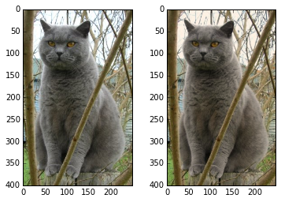
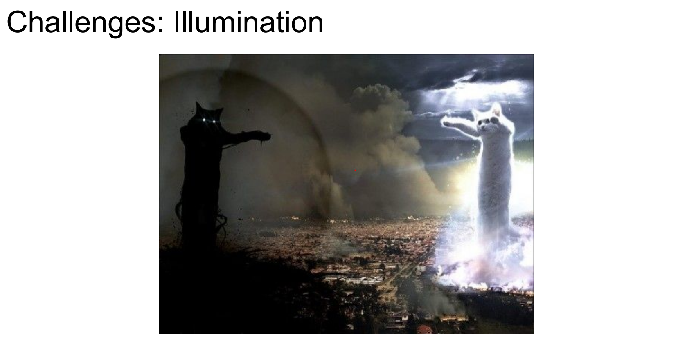
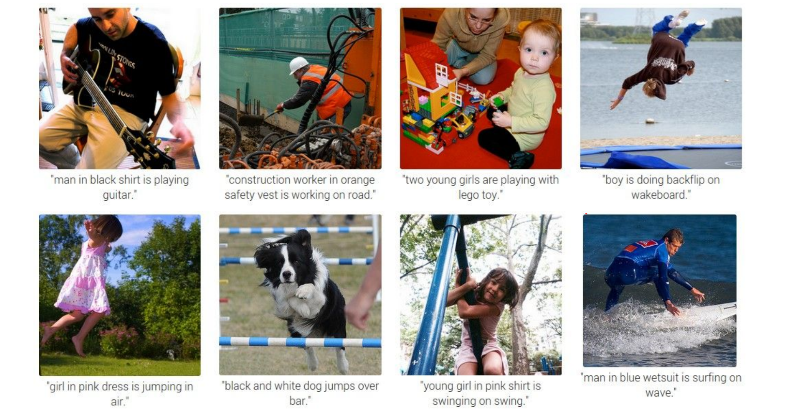

Part of [CS231n Winter 2016](../index.md)

----

## Lecture 2: Data-Driven Approach, kNN, Linear Classification

Andrej Karpathy continues the course by reframing image recognition as a data-centric pipeline, contrasting classical rule-based vision with modern learning systems.

**Agenda.**

- Image classification pipeline and the semantic gap.

- Data-driven learning with k-nearest neighbors.

- Parametric linear classifiers that lead toward neural networks.

- Tangent refresher on NumPy, SciPy, and Matplotlib tooling.

- Assignment 1 preview and computing resources.

**Logistics.**

- First assignment drops tonight (or tomorrow at worst) and is due January 20 via `CourseWork`.

- Expect to implement a kNN classifier, linear classifiers (SVM and Softmax), and a 2-layer neural network with back-propagation in Python/NumPy.

- Do **not** reuse last year’s assignments; you can work on personal hardware or on Terminal.com (credits provided).

**Resource.** Need a NumPy refresher? [Here you go](https://cs231n.github.io/python-numpy-tutorial/). 

----

### Refreshers

#### Numpy

Karpathy pauses for a practical refresher on core Python libraries you will depend on throughout the assignments.

**Dictionaries.**

A dictionary stores `(key, value)` pairs, similar to a Java `Map` or JavaScript object:

```python
d = {'cat': 'cute', 'dog': 'furry'}  # Create a new dictionary with some data
print(d['cat'])       # Get an entry from a dictionary; prints "cute"
print('cat' in d)     # Check if a dictionary has a given key; prints "True"
d['fish'] = 'wet'     # Set an entry in a dictionary
print(d['fish'])      # Prints "wet"
# print(d['monkey'])  # KeyError: 'monkey' not a key of d
print(d.get('monkey', 'N/A'))  # Get an element with a default; prints "N/A"
print(d.get('fish', 'N/A'))    # Get an element with a default; prints "wet"
del d['fish']         # Remove an element from a dictionary
print(d.get('fish', 'N/A')) # "fish" is no longer a key; prints "N/A"
```

**Arrays.**

[NumPy](http://www.numpy.org/) is the core scientific computing library in Python. It provides high-performance multidimensional arrays plus tools to operate on them.

The number of dimensions is the *rank* of the array; the *shape* is a tuple that records the array’s size along each dimension. Initialize arrays from nested lists and use square brackets to access elements:

```python
import numpy as np

# The rank of an array is the number of dimensions it has.
# A scalar is considered to have rank zero.
a = np.array([1, 2, 3])   # Make a rank 1 array
print(type(a))            # Prints "<class 'numpy.ndarray'>"
print(a.shape)            # Prints "(3,)"
print(a[0], a[1], a[2])   # Prints "1 2 3"
a[0] = 5                  # Change an element of the array
print(a)                  # Prints "[5, 2, 3]"

b = np.array([[1,2,3],[4,5,6]])    # Make a rank 2 array
print(b.shape)                     # Prints "(2, 3)"
print(b[0, 0], b[0, 1], b[1, 0])   # Prints "1 2 4"
```

NumPy also provides convenience functions to create arrays:

```python
import numpy as np

a = np.zeros((2,2))   # Create an array of all zeros
print(a)              # Prints "[[ 0.  0.]
                      #          [ 0.  0.]]"

b = np.ones((1,2))    # Create an array of all ones
print(b)              # Prints "[[1. 1.]]"

c = np.full((2,2), 7)  # Create a constant array
print(c)               # Prints "[[7. 7.]
                      #          [7. 7.]]"

d = np.eye(2)         # Create a 2x2 identity matrix
print(d)              # Prints "[[1. 0.]
                      #          [0. 1.]]"

e = np.random.random((2,2))  # Create an array filled with random values
print(e)                     # Example output:
                             # [[0.91940167 0.08143941]
                             #  [0.68744134 0.87236687]]
```

**Indexing 💚.**

Array slicing and indexing produce powerful views into data.

Use `:` or `start:stop[:step]` for each dimension:

```python
import numpy as np

# Create the following rank 2 array with shape (3, 4)
# [[ 1  2  3  4]
#  [ 5  6  7  8]
#  [ 9 10 11 12]]
a = np.array([[1,2,3,4], [5,6,7,8], [9,10,11,12]])

# Use slicing to pull out the subarray consisting of the first 2 rows
# and columns 1 and 2; b is the following array of shape (2, 2):
# [[2 3]
#  [6 7]]
b = a[:2, 1:3]

# A slice of an array is a view into the same data, so modifying it
# will modify the original array.
print(a[0, 1])   # Prints "2"
b[0, 0] = 77     # b[0, 0] is the same piece of data as a[0, 1]
print(a[0, 1])   # Prints "77"
```

Mix integer indexing with slicing to control rank:

```python
import numpy as np

# Create the following rank 2 array with shape (3, 4)
# [[ 1  2  3  4]
#  [ 5  6  7  8]
#  [ 9 10 11 12]]
a = np.array([[1,2,3,4], [5,6,7,8], [9,10,11,12]])

# Two ways of accessing the data in the middle row of the array.
# Mixing integer indexing with slices yields an array of lower rank,
# while using only slices yields an array of the same rank as the
# original array:
row_r1 = a[1, :]    # Rank 1 view of the second row of a
row_r2 = a[1:2, :]  # Rank 2 view of the second row of a
print(row_r1, row_r1.shape)  # Prints "[5 6 7 8] (4,)"
print(row_r2, row_r2.shape)  # Prints "[[5 6 7 8]] (1, 4)"

# We can make the same distinction when accessing columns of an array:
col_r1 = a[:, 1]
col_r2 = a[:, 1:2]
print(col_r1, col_r1.shape)  # Prints "[ 2  6 10] (3,)"
print(col_r2, col_r2.shape)  # Prints "[[ 2]
                             #          [ 6]
                             #          [10]] (3, 1)"

c = a[2, 0:4]
print(c) # array([ 9, 10, 11, 12])
```

*Integer array indexing.*

Slices always produce contiguous views. Integer array indexing constructs arbitrary selections:

```python
import numpy as np

a = np.array([[1,2], [3, 4], [5, 6]])

# An example of integer array indexing.
# The returned array will have shape (3,)
print(a[[0, 1, 2], [0, 1, 0]])  # Prints "[1 4 5]"

# a[[0, 1, 2], [0, 1, 0]] is equivalent to
# a[0, 0], a[1, 1], a[2, 0]
# The above example of integer array indexing is equivalent to this:
print(np.array([a[0, 0], a[1, 1], a[2, 0]]))  # Prints "[1 4 5]"

# When using integer array indexing, you can reuse the same element.
print(a[[0, 0], [1, 1]])  # Prints "[2 2]"
print(np.array([a[0, 1], a[0, 1]]))  # Prints "[2 2]"
```

One useful trick is selecting or mutating a single element from each row:

```python
import numpy as np

# Create a new array from which we will select elements
a = np.array([[1,2,3], [4,5,6], [7,8,9], [10, 11, 12]])
print(a)  # Prints:
          # [[ 1  2  3]
          #  [ 4  5  6]
          #  [ 7  8  9]
          #  [10 11 12]]

# Create an array of indices
b = np.array([0, 2, 0, 1])

# Select one element from each row using b
print(a[np.arange(4), b])  # Prints "[ 1  6  7 11]"

# Equivalent explicit construction
print(np.array([a[0, 0], a[1, 2], a[2, 0], a[3, 1]]))
# Prints "[ 1  6  7 11]"

# Mutate one element from each row
a[np.arange(4), b] += 10
print(a)  # Prints:
          # [[11  2  3]
          #  [ 4  5 16]
          #  [17  8  9]
          #  [10 21 12]]
```

*Boolean array indexing.*

Boolean indexing selects arbitrary elements that satisfy conditions.

Here is an example:

```python
import numpy as np

a = np.array([[1, 2], [3, 4], [5, 6]])

bool_idx = (a > 2)   # Find the elements of a that are bigger than 2;
                     # this returns a numpy array of Booleans of the same
                     # shape as a, where each slot of bool_idx tells
                     # whether that element of a is > 2.
print(bool_idx)      # Prints:
                     # [[False False]
                     #  [ True  True]
                     #  [ True  True]]

print(bool_idx.ndim)  # 2
print(bool_idx.shape) # (3, 2)
print(bool_idx.dtype) # bool
print(bool_idx.size)  # 6
print(type(bool_idx)) # <class 'numpy.ndarray'>

# Use boolean indexing to pull out matching elements
print(a[bool_idx])  # Prints "[3 4 5 6]"

# Shorthand
print(a[a > 2])     # Prints "[3 4 5 6]"
```

For brevity we have left out a lot of details about numpy array indexing; if you want to know more you should [read the documentation](http://docs.scipy.org/doc/numpy/reference/arrays.indexing.html).

**Datatypes 🤔.**

NumPy arrays hold elements of a single type. Specify types when necessary:

```python
import numpy as np

x = np.array([1, 2])   # Let numpy choose the datatype
print(x.dtype)         # Prints "int64"

x = np.array([1.0, 2.0])
print(x.dtype)         # Prints "float64"

x = np.array([1, 2], dtype=np.int64)
print(x.dtype)         # Prints "int64"
```

You can read all about numpy datatypes [in the documentation](http://docs.scipy.org/doc/numpy/reference/arrays.dtypes.html).

**Array math 🧠.**

NumPy overloads operators for elementwise math and provides explicit functions:

```python
import numpy as np

x = np.array([[1,2],[3,4]], dtype=np.float64)
y = np.array([[5,6],[7,8]], dtype=np.float64)

# Elementwise sum; both produce the array
# [[ 6.0  8.0]
#  [10.0 12.0]]
print(x + y)
print(np.add(x, y))

# Elementwise difference; both produce the array
# [[-4.0 -4.0]
#  [-4.0 -4.0]]
print(x - y)
print(np.subtract(x, y))

# Elementwise product; both produce the array
# [[ 5.0 12.0]
#  [21.0 32.0]]
print(x * y)
print(np.multiply(x, y))

# Elementwise division; both produce the array
# [[ 0.2         0.33333333]
#  [ 0.42857143  0.5       ]]
print(x / y)
print(np.divide(x, y))

# Elementwise square root; produces the array
# [[ 1.          1.41421356]
#  [ 1.73205081  2.        ]]
print(np.sqrt(x))
```

`*` performs elementwise multiplication. Use `dot` for inner products and matrix multiplication:

```python
import numpy as np

x = np.array([[1,2],[3,4]])
y = np.array([[5,6],[7,8]])

v = np.array([9,10])
w = np.array([11, 12])

# If the vectors are perpendicular, the inner product is zero.
print(np.dot(np.array([4, 3]), np.array([-3, 4]))) # 0

# Inner product of vectors; both produce 219 -> 99 + 120
print(v.dot(w)) # 219
print(np.dot(v, w)) # 219

# Matrix / vector product; both produce the rank 1 array [29 67]
print(x.dot(v)) # [(1 * 9 + 2 * 10 ) , (3 * 9  4 * 10)]
print(np.dot(x, v)) # [(1 * 9 + 2 * 10 ) , (3 * 9  4 * 10)]

# Matrix / matrix product; both produce the rank 2 array
# [[19 22]
#  [43 50]]
print(x.dot(y)) # row * col 
print(np.dot(x, y)) # row * col
```


Many reductions are built in; here `sum` collapses arrays along chosen axes:

```python
import numpy as np

x = np.array([[1,2], [3,4]])

print(np.sum(x))          # Sum of all elements; prints "10"
print(np.sum(x, axis=0))  # Sum of each column; prints "[4 6]"
print(np.sum(x, axis=1))  # Sum of each row; prints "[3 7]"
```

You can find the full list of mathematical functions provided by numpy [in the documentation](http://docs.scipy.org/doc/numpy/reference/routines.math.html).

Apart from computing mathematical functions using arrays, we frequently need to reshape or otherwise manipulate data in arrays. 

The simplest example of this type of operation is transposing a matrix, and to transpose a matrix, simply use the `T` attribute of an array object:

```python
import numpy as np

x = np.array([[1,2], [3,4]])
print(x)    # Prints "[[1 2]
            #           [3 4]]"
print(x.T)  # Prints "[[1 3]
            #           [2 4]]"

# Transposing a rank 1 array leaves it unchanged
v = np.array([1,2,3])
print(v)    # Prints "[1 2 3]"
print(v.T)  # Prints "[1 2 3]"
```

Numpy provides many more functions for manipulating arrays; you can see the full list [in the documentation](http://docs.scipy.org/doc/numpy/reference/routines.array-manipulation.html).

**Broadcasting – smaller – larger – together.**

Broadcasting lets arrays of different shapes participate in elementwise operations.

Frequently we have a smaller array and a larger array, and we want to use the smaller array multiple times to perform some operation on the larger array.

For example, suppose that we want to add a constant vector to each row of a matrix. We could do it like this:


```python
import numpy as np

# Add vector v to each row of matrix x, storing result in y
x = np.array([[1,2,3], [4,5,6], [7,8,9], [10, 11, 12]])
v = np.array([1, 0, 1])
y = np.empty_like(x)

# Explicit loop
for i in range(4):
    y[i, :] = x[i, :] + v
# Now y is the following
# [[ 2  2  4]
#  [ 5  5  7]
#  [ 8  8 10]
#  [11 11 13]]
print(y)
```

This works; however when the matrix `x` is very large, computing an explicit loop in Python could be slow.

Note that adding the vector `v` to each row of the matrix `x` is equivalent to forming a matrix `vv` by stacking multiple copies of `v` vertically, then performing element wise summation of `x` and `vv`. 

We could implement this approach like this:

*`np.tile`: stack on top of each other LOL.*

```python
import numpy as np

x = np.array([[1,2,3], [4,5,6], [7,8,9], [10, 11, 12]])
v = np.array([1, 0, 1])
vv = np.tile(v, (4, 1))   # Stack 4 copies of v

print(vv)

y = x + vv
print(y)
```

*Broadcasting without copies 🤨.*

Numpy broadcasting allows us to **perform this computation without actually making multiple copies** of `v`.

Consider this version, using broadcasting:

```python
import numpy as np

# We will add the vector v to each row of the matrix x,
# storing the result in the matrix y
x = np.array([[1,2,3], [4,5,6], [7,8,9], [10, 11, 12]])
v = np.array([1, 0, 1])
y = x + v  # Add v to each row of x using broadcasting
print(y)  # Prints "[[ 2  2  4]
          #          [ 5  5  7]
          #          [ 8  8 10]
          #          [11 11 13]]"
```

The line `y = x + v` works even though `x` has shape `(4, 3)` and `v` has shape `(3,)` due to broadcasting; this line works as if `v` actually had shape `(4, 3)`, where each row was a copy of `v`, and the sum was performed element wise.

Broadcasting two arrays together follows these rules:

1. If the arrays do not have the same rank, prepend the shape of the lower rank array with 1's until both shapes have the same length.
2. The two arrays are said to be _compatible_ in a dimension if they have the same size in the dimension, or if one of the arrays has size 1 in that dimension.
3. The arrays can be broadcast together if they are compatible in all dimensions.
4. After broadcasting, each array behaves as if it had shape equal to the element-wise maximum of shapes of the two input arrays.
5. In any dimension where one array had size 1 and the other array had size greater than 1, the first array behaves as if it were copied along that dimension

If that still feels opaque, see the [NumPy documentation](http://docs.scipy.org/doc/numpy/user/basics.broadcasting.html) or [this guide](https://scipy.github.io/old-wiki/pages/EricsBroadcastingDoc).

Functions that support broadcasting are *universal functions*. Find the full list [in the docs](http://docs.scipy.org/doc/numpy/reference/ufuncs.html#available-ufuncs).

Examples:

```python
import numpy as np

# Compute outer product of vectors
v = np.array([1,2,3])  # v has shape (3,)
w = np.array([4,5])    # w has shape (2,)
# To compute an outer product, we first reshape v to be a column
# vector of shape (3, 1); we can then broadcast it against w to yield
# an output of shape (3, 2), which is the outer product of v and w:
# [[ 4  5]
#  [ 8 10]
#  [12 15]]print(np.reshape(v, (3, 1)) * w)

# Add a vector to each row of a matrix
x = np.array([[1,2,3], [4,5,6]])
# x has shape (2, 3) and v has shape (3,) so they broadcast to (2, 3),
# giving the following matrix:
# [[2 4 6]
#  [5 7 9]]
print(x + v)

# Add a vector to each column of a matrix
# x has shape (2, 3) and w has shape (2,).
# If we transpose x then it has shape (3, 2) and can be broadcast
# against w to yield a result of shape (3, 2); transposing this result
# yields the final result of shape (2, 3) which is the matrix x with
# the vector w added to each column. Gives the following matrix:
# [[ 5  6  7]
#  [ 9 10 11]]
print((x.T + w).T)
# Another solution is to reshape w to be a column vector of shape (2, 1);
# we can then broadcast it directly against x to produce the same
# output.
print(x + np.reshape(w, (2, 1)))

# Multiply a matrix by a constant:
# x has shape (2, 3). Numpy treats scalars as arrays of shape ();
# these can be broadcast together to shape (2, 3), producing the
# following array:
# [[ 2  4  6]
#  [ 8 10 12]]
print(x * 2)
```

Broadcasting keeps code concise and typically faster—use it whenever shapes permit.

**NumPy documentation.**

This skim hits the core operations, but NumPy is much richer. Explore the [NumPy reference](http://docs.scipy.org/doc/numpy/reference/) to dive deeper.

#### SciPy 💖

NumPy gives you high-performance arrays; [SciPy](http://docs.scipy.org/doc/scipy/reference/) layers on specialized functions for scientific and engineering workloads.

| Subpackage                                                                                                                | Description                                            |
| ------------------------------------------------------------------------------------------------------------------------- | ------------------------------------------------------ |
| [`cluster`](https://docs.scipy.org/doc/scipy/reference/cluster.html#module-scipy.cluster "scipy.cluster")                 | Clustering algorithms                                  |
| [`constants`](https://docs.scipy.org/doc/scipy/reference/constants.html#module-scipy.constants "scipy.constants")         | Physical and mathematical constants                    |
| [`fft`](https://docs.scipy.org/doc/scipy/reference/fft.html#module-scipy.fft "scipy.fft")                                 | Discrete Fourier transforms                            |
| [`fftpack`](https://docs.scipy.org/doc/scipy/reference/fftpack.html#module-scipy.fftpack "scipy.fftpack")                 | Fast Fourier Transform routines (legacy)               |
| [`integrate`](https://docs.scipy.org/doc/scipy/reference/integrate.html#module-scipy.integrate "scipy.integrate")         | Integration and ordinary differential equation solvers |
| [`interpolate`](https://docs.scipy.org/doc/scipy/reference/interpolate.html#module-scipy.interpolate "scipy.interpolate") | Interpolation and smoothing splines                    |
| [`io`](https://docs.scipy.org/doc/scipy/reference/io.html#module-scipy.io "scipy.io")                                     | Input and Output                                       |
| [`linalg`](https://docs.scipy.org/doc/scipy/reference/linalg.html#module-scipy.linalg "scipy.linalg")                     | Linear algebra                                         |
| [`ndimage`](https://docs.scipy.org/doc/scipy/reference/ndimage.html#module-scipy.ndimage "scipy.ndimage")                 | N-dimensional image processing                         |
| [`odr`](https://docs.scipy.org/doc/scipy/reference/odr.html#module-scipy.odr "scipy.odr")                                 | Orthogonal distance regression                         |
| [`optimize`](https://docs.scipy.org/doc/scipy/reference/optimize.html#module-scipy.optimize "scipy.optimize")             | Optimization and root-finding routines                 |
| [`signal`](https://docs.scipy.org/doc/scipy/reference/signal.html#module-scipy.signal "scipy.signal")                     | Signal processing                                      |
| [`sparse`](https://docs.scipy.org/doc/scipy/reference/sparse.html#module-scipy.sparse "scipy.sparse")                     | Sparse matrices and associated routines                |
| [`spatial`](https://docs.scipy.org/doc/scipy/reference/spatial.html#module-scipy.spatial "scipy.spatial")                 | Spatial data structures and algorithms                 |
| [`special`](https://docs.scipy.org/doc/scipy/reference/special.html#module-scipy.special "scipy.special")                 | Special functions                                      |
| [`stats`](https://docs.scipy.org/doc/scipy/reference/stats.html#module-scipy.stats "scipy.stats")                         | Statistical distributions and functions                |

Browse the [full SciPy reference](http://docs.scipy.org/doc/scipy/reference/index.html) for details. A few highlights:

**Image operations.**

SciPy reads/writes images and resizes them via `scipy.misc`:

```python
from scipy.misc import imread, imsave, imresize

# Read a JPEG image into a numpy array
img = imread('assets/cat.jpg')
print(img.dtype, img.shape)  # Prints "uint8 (400, 248, 3)"

# We can tint the image by scaling each of the color channels
# by a different scalar constant. The image has shape (400, 248, 3);
# we multiply it by the array [1, 0.95, 0.9] of shape (3,);
# numpy broadcasting means that this leaves the red channel unchanged,
# and multiplies the green and blue channels by 0.95 and 0.9
# respectively.
img_tinted = img * [1, 0.95, 0.9]

# Resize the tinted image to 300x300
img_tinted = imresize(img_tinted, (300, 300))

# Write the tinted image back to disk
imsave('assets/cat_tinted.jpg', img_tinted)
```

Original:


Tinted:


**Distance between points.**

Measure distances across sets of points with `pdist` and `cdist`:

```python
import numpy as np
from scipy.spatial.distance import pdist, squareform

# Each row is a point in 2D space
x = np.array([[0, 1], [1, 0], [2, 0]])
print(x)

# Pairwise Euclidean distances
# Compute the Euclidean distance between all rows of x.
# d[i, j] is the Euclidean distance between x[i, :] and x[j, :],
# and d is the following array:
# [[ 0.          1.41421356  2.23606798]
#  [ 1.41421356  0.          1.        ]
#  [ 2.23606798  1.          0.        ]]
d = squareform(pdist(x, 'euclidean'))
print(d)
```

See the documentation for [`pdist`](http://docs.scipy.org/doc/scipy/reference/generated/scipy.spatial.distance.pdist.html) and [`cdist`](http://docs.scipy.org/doc/scipy/reference/generated/scipy.spatial.distance.cdist.html) for more.

#### Matplotlib

[Matplotlib](http://matplotlib.org/) provides MATLAB-style plotting through `matplotlib.pyplot`.

**Plotting.**

```python
import numpy as np
import matplotlib.pyplot as plt

# Compute the x and y coordinates for points on a sine curve
x = np.arange(0, 3 * np.pi, 0.1)
y = np.sin(x)

# Plot the points using matplotlib
plt.plot(x, y)
plt.show()  # You must call plt.show() to make graphics appear.
```

Running this code produces the following plot:


Add multiple lines, title, legend, and labels:

```python
import numpy as np
import matplotlib.pyplot as plt

# Compute the x and y coordinates for points on sine and cosine curves
x = np.arange(0, 3 * np.pi, 0.1)
y_sin = np.sin(x)
y_cos = np.cos(x)

# Plot the points using matplotlib
plt.plot(x, y_sin)
plt.plot(x, y_cos)
plt.xlabel('x axis label')
plt.ylabel('y axis label')
plt.title('Sine and Cosine')
plt.legend(['Sine', 'Cosine'])
plt.show()
```


Find more configuration options in the [`plot` docs](http://matplotlib.org/api/pyplot_api.html#matplotlib.pyplot.plot).

**Subplots 📜.**

Display multiple plots in one figure using `subplot`:

```python
import numpy as np
import matplotlib.pyplot as plt

# Compute the x and y coordinates for points on sine and cosine curves
x = np.arange(0, 3 * np.pi, 0.1)
y_sin = np.sin(x)
y_cos = np.cos(x)

# Set up a subplot grid that has height 2 and width 1,
# and set the first such subplot as active.
plt.subplot(2, 1, 1)
# Make the first plot
plt.plot(x, y_sin)
plt.title('Sine')

# Set the second subplot as active, and make the second plot.
plt.subplot(2, 1, 2)
plt.plot(x, y_cos)
plt.title('Cosine')

plt.show()
```


See the [`subplot` docs](http://matplotlib.org/api/pyplot_api.html#matplotlib.pyplot.subplot) for all layout options.

**Images.**

```python
import numpy as np
from scipy.misc import imread, imresize
import matplotlib.pyplot as plt

img = imread('assets/cat.jpg')
img_tinted = img * [1, 0.95, 0.9]

# Show the original image
plt.subplot(1, 2, 1)
plt.imshow(img)

# Show the tinted image
plt.subplot(1, 2, 2)
# Cast to uint8 before display to avoid surprises
plt.imshow(np.uint8(img_tinted))
plt.show()
```



----

### Image Classification

Now we are back to Lesson Flow. Image classification is a core task in computer vision.


Pixel arrays (height × width × channels, values 0–255) must map to semantic labels. That semantic gap fuels the difficulty.

Meaning, images are represented as 3D arrays of numbers, with integers between [0, 255].  E.g. 300 x 100 x 3 (3 for 3 color channels RGB)

All values indicate the amount of brightness on all the 3 color channels at every single position of the image.


Moving the camera alters every **brightness** value. **Illumination** can change dramatically, **viewpoints** shift, and objects rarely cooperate.


Illumination is not controllable.



Objects deform.


There could be other things in the way.


Background might be almost the same as the object we are looking for.


Not every cat look alike.


Different instances of “cat” look nothing alike; occlusion, deformation, and background clutter abound. The problem is not simple 🥰.

So an image classifier is not straight forward as just simply an algorithm.


*Early rule-based approaches.* 

In early days of CV, for each object class, people tried to come up with some rules.


Early vision attempted hand-crafted rules per object class—not scalable, especially with limited grayscale, low-resolution datasets.

In early days, they did not have a lot of data anyway.

Internet-scale imagery made data-driven learning feasible:


### Data-Driven Approach and k-Nearest Neighbors


**CIFAR-10 setup.** We will work with CIFAR-10 dataset.


Take all the training data, for test images, lookup nearest neighbors in the training set of things that are most similar to the test images.


We will predict based on the similarity.

**Distance metrics and implementation.** How do we compare images?


Manhattan (L1) distance sums absolute pixel differences. Look at every single pixel value, decide the difference between them.

Here is an example implementation:

```python
import numpy as np

class NearestNeighbor:
    def __init__(self):
        pass

    def train(self, X, y):
        """X is N x D where each row is an example. y is length N."""
        # The nearest neighbor classifier simply remembers the training data
        self.Xtr = X
        self.ytr = y

    def predict(self, X):
        """X is N x D where each row is an example to classify."""
        num_test = X.shape[0]
        Ypred = np.zeros(num_test, dtype=self.ytr.dtype)

        # loop over all test rows
        for i in range(num_test):
            # find the nearest training image to the i'th test image
			# using the L1 distance (sum of absolute value differences)
            # this is a vectorized code
            distances = np.sum(np.abs(self.Xtr - X[i, :]), axis=1)
            # Index with smallest distance
            min_index = np.argmin(distances)
            Ypred[i] = self.ytr[min_index]

        return Ypred
```


**How does classification speed depend on training set size?** 
Linearly—it gets slower as data grows.

That is backwards for production use: test-time performance typically matters most. kNN is instant to “train” but expensive at inference, while CNNs flip the cost profile (expensive training, cheap evaluation). 

Libraries like [FLANN](https://github.com/flann-lib/flann) accelerate nearest-neighbor search.

Instead of L1 distance, we can choose another one:


Distance choice is a **hyperparameter**. Euclidean, cosine, and others behave differently.


Larger `k` (e.g., 5) smooths decision boundaries—random noise becomes less disruptive.

Some random noise becomes acceptable and does not affect the clusters too much.

Always retrieving multiple neighbors prevents outliers from dominating (“don’t only look for the nearest neighbor”).

The choice of K is a hyperparameter. In practice kNN offers better performance.


100%, because there will always be exactly a training set point on top of the test set.

It would be the same if we used Manhattan distance also. LOL.


For `k=1`, training accuracy hits 100% because every test point overlaps a training sample; higher `k` alters the classifier.

**Validation and hyperparameter search.**

What is the best distance to use? What is the best value of k to use? i.e. how do we set the hyperparameters? 

Very problem-dependent. Must try them all out and see what works best.


Forget test data until the end.

Use a validation split to choose hyperparameters (distance metric, `k`).


We can use 5 folds, only train a part of it.

If you have very few training data, you can use cross validation. `1-4` - `2-3` - `3-2` - `4-1`


We can find the different K values in a kNN using cross validation.


We talked about kNN a lot. Is it used on vision ?


Yes, kNN appears in vision tasks, though less frequently today.

**Takeaways.**

- **Image Classification**: Given labeled training images, predict test labels (accuracy = fraction of correctly predicted images).
- We introduced the k-Nearest Neighbor Classifier, which predicts the labels based on nearest images in the training set (kNN predicts by proximity in feature space).
- We saw that the choice of distance and the value of `k` are hyperparameters that are tuned using a validation set, or through cross-validation if the size of the data is small.
- After selecting hyperparameters, evaluate once on the test set and report that performance.

### Linear Classification


Neural networks can perceive, listen, and even control systems—think of them as Lego blocks (combining CNNs and RNNs):


As an example NN can make descriptions:


But, how does it work ?


Basicallyy, CNN's can see. RNN's can model sequences of words. We stick them together.

These networks learn to talk to each other, in the process of trying to describe the images these gradients will be flowing through the convolutional network and the full system will be adjusting itself to better see  the images in order to describe them in the end.


**From kNN to parametric models.**


kNN is non-parametric. Parametric approaches learn a function mapping images to class scores.

In other words, with parametric approach we are looking to find a function that takes an image and gives classes to us.

For CIFAR-10, flatten each image into a 3072-dimensional column vector `x`.


Use a linear classifier: weights `W` of shape `(10 × 3072)` and biases `b`.


We also have to find $b$ which is not a function on the image.


If input only had 4 pixels and trying to predict 3 classes (there is an issue here, if there was 4 pixels, this would be 12 values in $x_i$).

If inputs differ in size, resize them so features align.

State-of-the-art models typically expect square images; panoramas fare poorly without preprocessing.


This setting of $w$ is not really good. Our cat score is less than other scores.

W matrix has all of the classes **stacked IN ROWS** an they are all being dot product-ed with the image to give you the scores.

In other words, poorly tuned weights mis-rank classes (cat score below others). `W` stacks class templates row-wise and dot-products with the input.

**Interpreting a Linear Classifier.**


Every single score is the weighted sum of all the pixel values of the image.


If you reshape it back to an image so you can visualize it, you will see these templates.

Each score is a weighted sum of pixel values. Reshaping `W` rows back into images reveals interpretable templates (`plane-blueblob`, horse silhouettes). These merge modes optimally—but linear models struggle with variations.

When we get to Conv-Nets this will be avoided. In principle we will have different angled versions of cars.

Another downside of the Linear Classifier is that it can only know the colored example that it has seen. `red car dominant`


**High-dimensional intuition.**

We can think of these images as very high dimensional points in a $3072$ dimensional space. 

So let's treat images as points in a 3072-D space.

Along the line of the car classifier the score is 0.

As we train the classifier lines will rotate and turn and twist to isolate all the cars in the dataset.


Classes are similar. Negative images would not work well. Grey scale images would not work well.

Decision boundaries (hyperplanes) separate classes; training rotates and shifts these hyperplanes to isolate examples.

Similar classes (e.g., gray-scale images) confuse linear classifiers. 

Spatial invariance—weighing textures identically regardless of location—fails for structured objects. *(Spatial invariance means outputs ignore the position of features; for textures that’s fine, for objects it is not.)*

In other words, if you have all of your textures (blue), say these textures van be different types but they can be spatially invariant but that would be not good.

Spatial in-variance refers to the property where the output of a system (in this case, a linear classifier) is not affected by the position or location of the input features. In the context of textures, spatial in-variance would mean that the classifier treats textures similarly regardless of where they are located in the image.


We defined this linear function.


**Loss functions and beyond.**

Loss function is a function of **your entire dataset and your weights.**

We define a loss function over the full dataset and weights to quantify mistakes.

We cannot jump directly to optimal weights, but we can iteratively improve them.

Extend the simple linear function `f` by adding layers: first a richer neural network, then a convolutional neural network that shares patterns spatially.

Templates for specific modes (red, blue, yellow cars) feed neurons that combine via weighted sums, effectively performing OR operations over patterns.

In other words, we will extend `f` to not be that simple **linear expression**, we will make it slightly more complex we'll get a **neural network**, we will make it slightly more complex and we'll get a **convolutional neural network**.

We cannot find the best set of weights right away, but we do know how to find the slightly better set of weights.

Convolutional Neural Networks are like stacking linear classifiers. 

We will have all these templates, red blue yellow cars. There will be a neuron assigned to detecting every one of these modes there will be combined in the second layer.

The next neuron will be just like okay I will just get a weighted sum of you guys and do an OR operation on your output.

### Tools and Assignment 1

See the details for Assignment 1 [here](assignments/README.md).