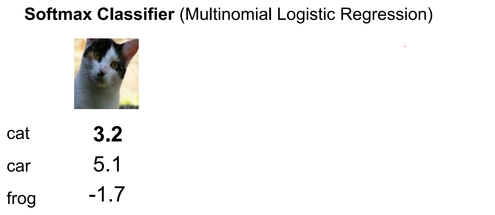

Part of [CS231n Winter 2016](../index.md)

---
# Third Lecture: Andrej Karpathy

The legend.

---
# Lecture 3: Loss functions and Optimization

Recall from last time:


We talked about data driven approach, folding. 


We are trying to find a function. Working on CIFAR-10.


We can interpret the situation as, matching templates or images being in high dimensional space and classifiers separating them.


We are trying to find weights that are good for all of our classes.

1. Define a loss function that quantifies our unhappiness with the scores across the training data. 
2. Come up with a way of efficiently finding the parameters that minimize the loss function. (optimization)


## Multi-class SVM Loss ? 🧠

Comparing the difference in scores and using a **safety margin (1).** Also if we get a negative result, we will select $0$.

Summing across all the incorrect classes, compare the correct class received.


Here is the application: 

$s_j$ - calculated wrong score (e.g. for `car` or `frog`) (class score where the class is not the Ground Truth)
$s_{yi}$ - correct score for the image


If we had a good classifier, for the first example, we would want all incorrect classes to be `2.2` at most.

But car class has `5.1` score.

So, to loss, Car class contributes `2.9` and Frog class contributes `0.0`

Total loss: `2.9`
## For the second image:


Loss of 0, because the car score is higher than other classes by at least `1.0`
## Last image:


# Combine into a single loss function ♻️


## Q: what if the we sum over all classes? (including $j$ = $y_i$)

If you add the correct class, you will just increase the loss by 1. LOL

```python
max(0 , s_j - s_yi + 1) 
# would become
max(0, 1)
# which would be
1
```
## Q2: what if we used a `mean` instead of a sum here?


If we used mean, the loss would be lower (3 classes 1/3 added). 

In the end we are going to minimize the W over that loss, your solution does not change.
## Q3: what if we used another loss?


We would get a different loss, because we are not just adding or removing a constant to the loss, we are changing the trade-off non linearly in different examples.

This is actually called **Squared Hinge Loss**. This is a hyperparameter and sometimes it works better.
## Q4: what is the min/max possible loss?


min is `0` and max is `infinity`
## Q5: usually at initialization W are small numbers, so all s ~= 0. What is the loss?


Using this loss, Your first loss should be `number of classes  - 1`. This is important for sanity checks.


```python
def L_i_vertorized(x, y, W):
	"""
	X is a single colmun vector 
	y is class of the image (integer)
	W is weight matrix
	
	"""
	scores = W.dot(x)
	margins = np.maximum(0, scores - scores[y] + 1)
	margins[y] = 0
	loss_i = np.sum(margins)
	return loss_i
	 
```

In open form we got this:


## There is a bug ?? 🤔


This is not really obvious. 

E.g. Suppose that we found a $W$ such that $L = 0$. Is this W unique? Is there a W that is different but achieves zero loss.
## Actually there could be a lot of $W$'s giving us 0 loss. Here is an example:


We have this entire subspace of W's and it all works the same according to our loss function.
# We would like to have some `W`'s over others, based on some things we want about W (forget the data).

## Regularization measures ==the niceness of your `w`==.


Regularization is a set of techniques where we are adding objectives to the loss, which will be fighting with the part where the loss is just want to fit to the data, because we want both of them.
## Even if the training error is worse (we are not correctly classifying all examples), test set performance is better with these regularization's.

## Most common is `L2 rEgularization - Weight Decay` - most common one


The effect of these w's are the same. We want low `w`'s across board (diffused weights) if possible.

But regularization will strictly favor one of them.
## Second one is way better. Why? 

## It takes into account the most things (dimensions) in your input vector `X`

# Our Losses will always have these.

---
# Most commonly used two linear classifiers: SVM - Softmax Classifier (Multinomial Logistic Regression) 🤔

The softmax function is named as such because it is a "soft" or smooth version of the maximum function (argmax). 

The softmax function takes a vector of arbitrary real-valued scores and transforms them into a probability distribution over multiple classes. 

It does this by exponentiating each score and then normalizing the results by dividing by the sum of the exponentiated scores. 

This normalization ensures that the output values fall between 0 and 1 and sum up to 1, making them interpretable as probabilities.



This is just a generalization of Logistic Regression. 🤔


These are scores: unnormalized log probabilities.


The way to get probabilities of different classes, like class `k` - $Y = k$


We take the score, we exponentiate all of them to get the unnormalized probabilities, and we normalize them.
## This is the `softmax` function.


## We want the log likelihood of the correct class to be high. The log likelihood is the `softmax` of your scores.

## Lets see an example.


This came from our classifier.


We exponentiate them first.


Probabilities always sum to 1, so we want to divide these.


In final we found `0.89` for Cat.
## Q: What is the min/max possible loss $L_i$?


## min value - `0` / highest possible is `infinity`

## Q5: usually at initialization W are small numbers, so all s ~= 0. What is the loss?


It is $$-log(number_of_classes)$$
# Tangent - Insight

- Take note of your number of classes.
- Evaluate the negative log of number of classes.
- Beginning loss is what you should expect.
- Start from that calculation and go towards 0.
- You never expect to get negative numbers out of this.


This is the summary so far.

We had Hinge loss, where we used scores directly with our loss function. We just want the correct class score to be some margin above the other classes.
## Or

With Softmax loss, we use unnormalized probabilities and normalize them and we want to maximize the probability of correct classes (over the log of them).

Why log? Log is a monotonic function. Maximize a probability is exactly the same for maximizing the logarithmic probability. ==Log is much nicer in math==.
## They start of the same way but different approaches. In practice when you run the two, gives almost the same result.

# Compare Two


Green is the correct classes.
## Q: Suppose I take a datapoint and I jiggle a bit (changing its score slightly). What happens to the loss in both cases?

SVM is already happy, when we jiggle, it does not care. But Softmax would care a lot, it want the score at some specific ranges.

You are **in charge of the loss function,** if it is differentiable, you can write your own.


## The greatest - [Web Demo](http://vision.stanford.edu/teaching/cs231n-demos/linear-classify/) - One day of Karpathy's Life 🤭

We can improve the set of `W`'s we have. The total loss is decreasing.

At the start, we will use big step size, overtime, we will update the update size.

The class scores for linear classifiers are computed as $f(xi;W,b)=Wxi+b$, where the parameters consist of weights $W$ and biases $b$ . The training data is $x_i$ with labels $y_i$. 

In this demo, the data-points $x_i$ are 2-dimensional and there are 3 classes, so the weight matrix is of size [3 x 2] and the bias vector is of size [3 x 1]. 

The multi-class loss function can be formulated in many ways. The default in this demo is an SVM that follows [Weston and Watkins 1999].

----
# Tangent: Optimization - Loss Function and Regularization

They work together to improve the performance of the model. 

Let's break down each concept and then discuss their relationships:

1. **Optimizer** - `SGD` - `Adam` - `RMSprop` - `Adagrad` :  
    - An optimizer is an algorithm used to adjust the parameters of a model during training in order to minimize the error between the predicted outputs and the actual targets.
    - Optimizers work by ==iteratively updating the model's parameters== (such as weights and biases) based on the gradients of the loss function with respect to those parameters.
    - Popular optimizers include stochastic gradient descent (SGD), Adam, RMSprop, and Adagrad, each with its own advantages and characteristics.
2. **Loss Function** - `Softmax` - `SVM` - `Mean Squared Error`:
    - A loss function, also known as a cost function or objective function, measures the difference between the predicted outputs of a model and the actual targets (labels) for a given set of input data.
    - The goal during training is to minimize this loss function, as doing so indicates that the model's predictions are closer to the true labels.
    - Common loss functions include mean squared error (MSE) for regression tasks and cross-entropy loss for classification tasks.
3. **Regularization**:
    - Regularization is a technique used to ==prevent overfitting== in machine learning models. Overfitting occurs when a model learns to memorize the training data instead of generalizing well to unseen data.
    - Regularization methods impose additional constraints on the model's parameters during training, typically by penalizing large parameter values or reducing model complexity.
    - Common regularization techniques include `L1` and `L2` regularization (also known as weight decay), dropout, and early stopping.

Now, let's discuss the relationships between these concepts:

- **Optimizer and Loss Function**: The optimizer's role is to minimize the value of the loss function. During each iteration of training, the optimizer calculates the gradients of the loss function with respect to the model's parameters and updates those parameters in the direction that reduces the loss.
- **Regularization and Loss Function**: Regularization techniques are applied to the loss function to modify its formulation, adding penalties or constraints that encourage the model to favor simpler solutions. For example, `L1` or `L2` regularization adds a penalty term to the loss function that penalizes large parameter values, effectively discouraging the model from overfitting.
- **Regularization and Optimizer**: Regularization can also be considered as part of the optimization process. By modifying the loss function, regularization affects the gradients calculated by the optimizer and consequently influences the updates made to the model's parameters. This helps prevent overfitting and improves the generalization performance of the model.
    
In summary, optimizers are responsible for minimizing the loss function by adjusting the model's parameters, while regularization techniques modify the loss function to encourage simpler solutions and prevent overfitting.

These components work together to train effective machine learning models.

----
## Optimization - `L is loss`


Summary of the information flow. The dataset of pairs of **(x,y)** is given and fixed. The weights start out as random numbers and can change. During the forward pass the score function computes class scores, stored in vector **f**. 
# The loss functions contains two components 💙💙

The loss function contains two components: 

==The data loss== computes the compatibility between the scores **f** and the labels **y**. 

==The regularization loss== is only a function of the weights.

During Gradient Descent, we compute the gradient on the weights (and optionally on data if we wish) and use them to perform a parameter update during Gradient Descent.

Better `W` is a smaller loss.


## Do not use this LOL


You have an altitude meter and blindfolded.


# Instead of teleporting different places and read altitude, compute slope and go downhill.


We have multiple dimensions, multiple W's so we have a gradient.


Literally apply the limit function. 
## Evaluate your altitude at f(x +h) subtract it from x(h) and divide it to h. 

## Take a small step in some direction ans calculate if I went up or down.


# SO the gradient is `-2.5` I took a step and it worked!

DO this for every dimension.


And another one.


Most basic way:


This is very slow we have million of parameters. 
## We cannot check millions of parameters before we do a single step. 😕


## This is silly. The loss is just a function of W:

## We want the gradient of the loss function wrt W.

We can just write that down:


## Newton and Leibniz. They actually found Calculus. There is actually controversy over it.

## Instead of evaluating numerical gradient, we can use calculus write than expression of what the gradient is of that loss function in weight space.


## In practice: Always use analytic gradient, but check implementation with numerical gradient. This is called a gradient check.


## `Step Size / Learning Rate` is the most critical Hyper-parameter that you will work on.

## Process of optimization


We have this loop, where we evaluate the gradient on your loss function and knowing the gradient we can do a parameter update where we change the `W` by tiny amount.
## We want to update the negative step size times the gradient.

## Negative because the gradient shows us the greatest increase , we have to go to the negative direction.

## `StepSize` or `Learning Rate` and Weight Regularization.

## The most critical places. These are usually what we cross validate over.


Jump is high in red parts, blue parts are small.
## In Practice, we do not evaluate the loss of the entire dataset, we sample batches from the data. 


Much more efficient.
## Batch size is usually decided by GPU memory size.


This is what it looks like. Because we are using batches of data we have the ==wiggling==.


These are effects of learning rate.


The way we do the update, how we used gradient to change w. 
## There is also momentum, where I also keep track of my velocity. Stochastic Gradient Descent with Momentum.


## This GIF is incredible. Here [is the link.](https://youtu.be/qlLChbHhbg4?list=PLkt2uSq6rBVctENoVBg1TpCC7OQi31AlC&t=3946)

Different approaches takes different paths.
## Before we get to ConvNets:


You do not want to put Linear Classifiers on pixels themselves, so you get different features.

And you can use the features to concatenate into big vectors and feed them into linear classifiers.


One simple feature type is a color histogram. 

Go over of each pixel in image, bin them 12 for different colors depending on the Hue of the color.

This would be one of the features that we will be using with different feature types together.

---
# Tangent 
## What is Hue ? 

## ## Characteristics of color

The color can be characterized by the following properties:

- **hue**: the dominant color, name of the color itself e.g. red, yellow, green.
- **saturation or chroma**: how pure is the color, the dominance of hue in color, purity, strength, intensity, intense vs dull.
- **brightness or value**: how bright or illuminated the color is, black vs white, dark vs light.

---
# **Histogram of Oriented Gradients** and Scale-Invariant Feature Transform

**Histogram of Oriented Gradients (HOG)**:

- Imagine you have an image, and you want to describe the shapes and patterns in it. HOG is a method that breaks down the image into smaller parts called cells. For each cell, it calculates the gradient, which tells us how the intensity of the image changes in different directions.
- Next, HOG counts how often certain gradient orientations occur in each cell. It divides the gradient orientations into bins (like dividing a pie into slices) and counts how many gradient orientations fall into each bin.
- After counting the gradient orientations, HOG creates a histogram for each cell, showing the distribution of gradient orientations. These histograms capture the shape and texture information of the image.
- Finally, HOG combines the histograms from all cells to create a feature vector that represents the image's overall shape and texture. This feature vector can be used for tasks like object detection and recognition.

**Scale-Invariant Feature Transform (SIFT)**:

- SIFT is a method used for detecting and describing key points or features in an image, regardless of their scale, rotation, or illumination changes.
- Imagine you're looking at a picture of a cat. SIFT would identify distinctive points on the cat's body, such as the tip of its ears, the end of its tail, or the corner of its eyes.
- SIFT achieves this by first identifying potential key points in the image using a process called ==scale-space extrema detection==. This involves looking for regions in the image where the intensity changes significantly compared to neighboring regions, across different scales (sizes) of the image.
- Once potential key points are detected, SIFT then calculates descriptors for these points, which are representations of the local image structure around each key point. These descriptors are invariant to changes in scale, rotation, and illumination, making them robust for matching and recognizing objects across different conditions.
- The descriptors generated by SIFT can be compared between different images to find matching or similar regions, enabling tasks like image stitching, object recognition, and 3D reconstruction.

Another common feature is HOG/SIFT features.


Lots of different ways to find features: Many more: GIST, LBP, Texton, SSIM, ..


We also have these pipelines, 
- you look at different part of the image,
- you describe the local patch in a schema you come up with, looking at frequencies or colors..
- You come up with the dictionaries - what kind of stuff do we see (centeroids)
- We express every single image as statistics of how much of each thing we see in the image
- Third Image have a lot of green stuff.


## The context is:

## In before 2012, 

we take the image and we do feature extractions. What are important things to compute about the image (different frequencies, different bins). And you put a linear classifier (SVM) on top of it.


## After 2012 -  

We start with raw image, you are not designing some part of it in isolation (of what you think is a good idea or not), you come up with an architecture that can simulate a lot of those different features and since everything is just a single function we don't just train on top of the features we can train all the way down to the pixels. 
## We can train our own feature extractors.

## We tried to eliminate a lot of hand engineered components we want to have a single differentiable blob.

## SO that we can train the full thing starting from the pixels.


# Genius.
