Part of [CS231n Winter 2016](../index.md)

---
## Lecture 4: Backpropagation and Neural Networks


Andrej Karpathy begins by reminding us that we have a score function (like SVM) and a loss function (Data Loss + Regularization Loss).

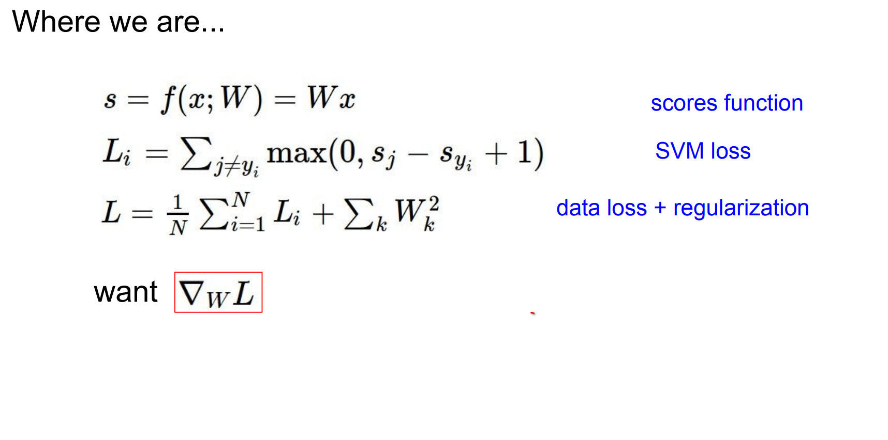

Our goal is to find the gradient of the loss function with respect to the weights. We then perform a parameter update to minimize the loss, which corresponds to making better predictions.

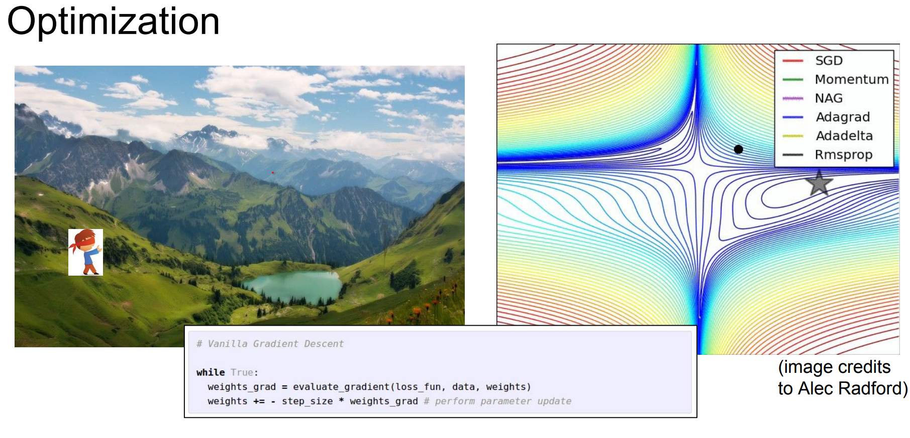

### Numerical vs Analytic Gradient

There are two ways to evaluate the gradient:

1.  **Numerical Gradient**: Easy to write, but extremely slow and approximate.
2.  **Analytic Gradient**: Exact and fast, computed using calculus.

We always use the analytic gradient in practice, but numerical gradients are useful for debugging (gradient check).

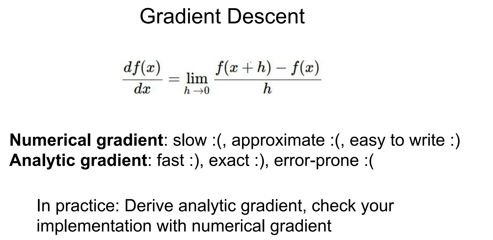

### Computational Graphs

Instead of deriving a single giant expression for the gradient on paper, we should think in terms of **computational graphs**.

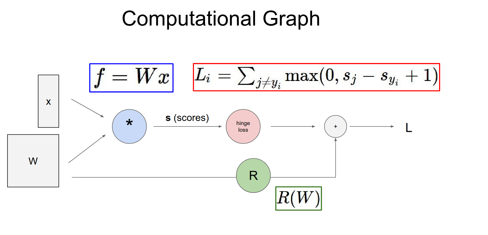

Values flow through a graph where nodes are operations (gates).

1.  **Forward Pass**: Inputs (data and parameters) flow through the graph to compute the loss.

2.  **Backward Pass**: We compute gradients by backpropagating from the loss to the inputs.

This approach is essential because models can get extremely complicated, like the Neural Turing Machine shown below.

So we start off with our data and our parameters as inputs they feed through this computational graph which is just an all these series of functions along the way. At the end we get a single  number which is the loss.

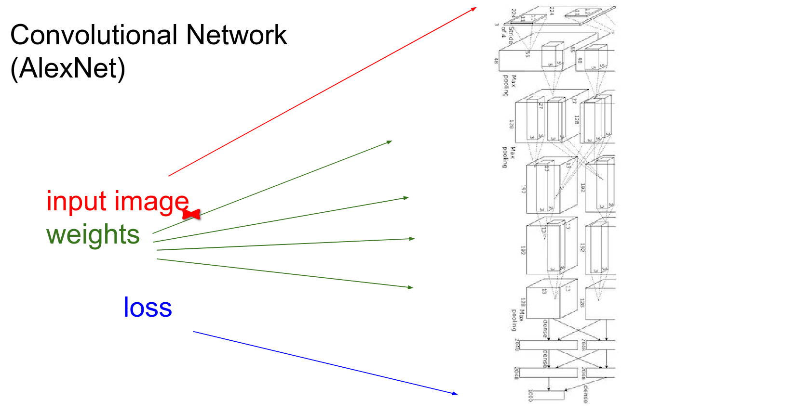

Convolutional networks are not even the worst of it.

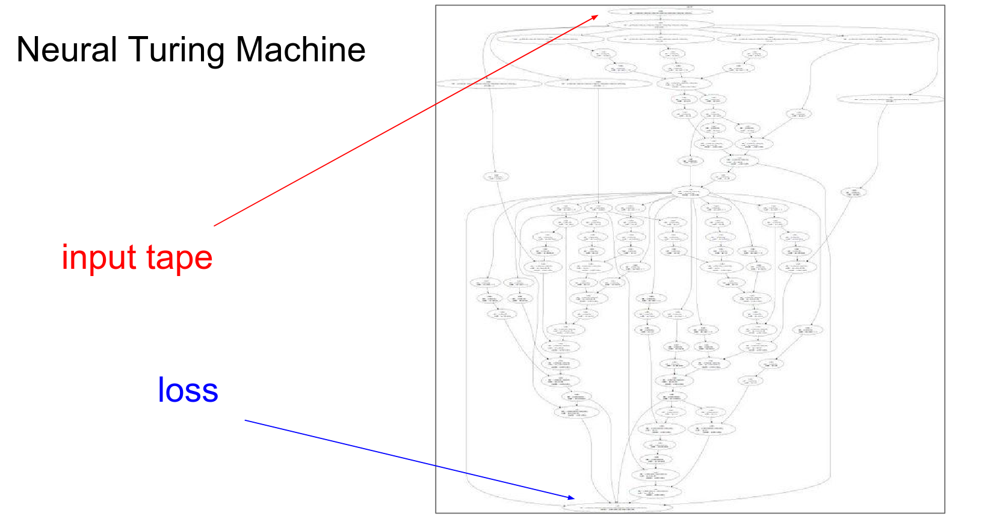

Basically a differentiable Turing machine - computational graph is huge!

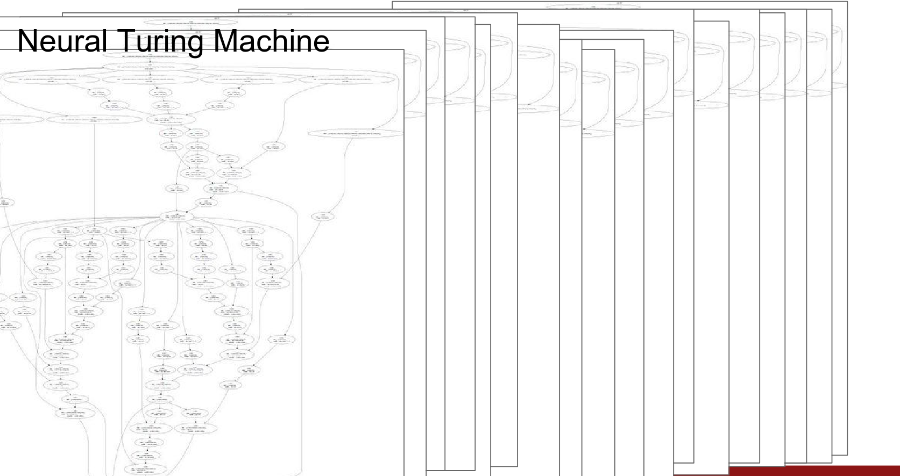

It would be impossible to write out the explicit gradient equation for such complex models. Instead, we rely on the modular nature of backpropagation through the graph.

---

> Implementing backpropagation by hand is like programming in assembly language. You’ll probably never do it, but it’s important for having a mental model of how everything works.

---

### Backpropagation: A Simple Example

Let's look at a simple function: $f(x, y, z) = (x + y)z$.
We can break this down into two intermediate values:
1.  $q = x + y$
2.  $f = qz$

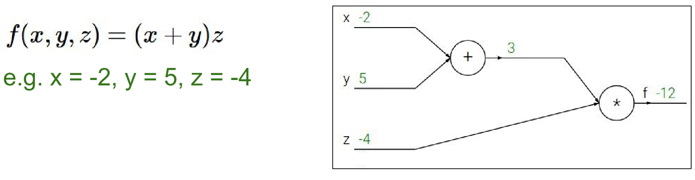

**Forward Pass:**
We compute the values from inputs to outputs.
-   $x = -2, y = 5 \rightarrow q = 3$
-   $z = -4 \rightarrow f = -12$

**Backward Pass:**
We want to find the gradient of $f$ with respect to inputs $x, y, z$. We start from the end and work backwards using the **Chain Rule**.

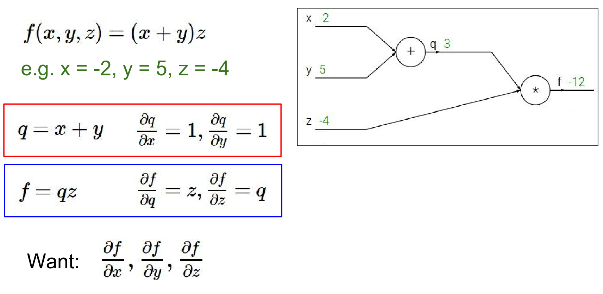

1.  **Gradient of $f$ w.r.t $f$**: Always 1. $\frac{\partial f}{\partial f} = 1$.
2.  **Gradient of $f$ w.r.t $z$**:
    -   $f = qz$
    -   $\frac{\partial f}{\partial z} = q = 3$
    -   Interpretation: If we increase $z$ by a tiny amount $h$, $f$ will increase by $3h$.
3.  **Gradient of $f$ w.r.t $q$**:
    -   $\frac{\partial f}{\partial q} = z = -4$
    -   Interpretation: If we increase $q$, $f$ will decrease by $4$ times that amount.

Gradients in red. Values are in green.

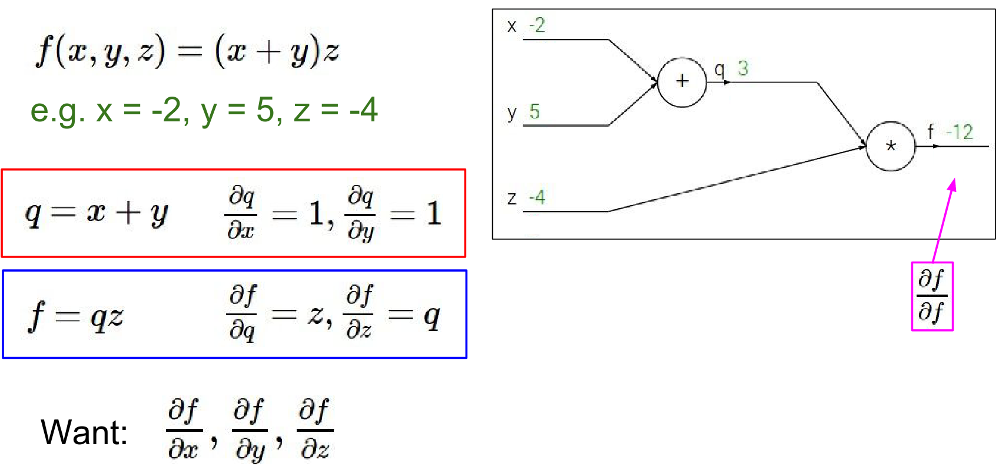

As a base case of this recursive procedure we're considering the gradient of F with respect to F. Derivative of f by f is 1.

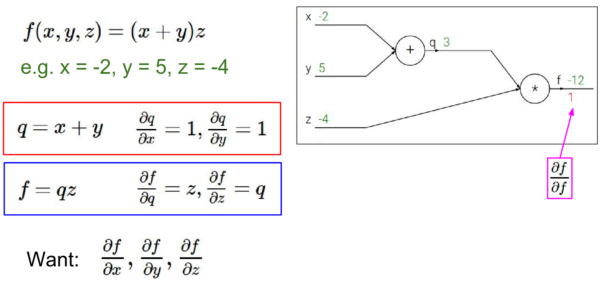

Now we're going to go backwards through this graph.

gradient of f with respect to z is 3.

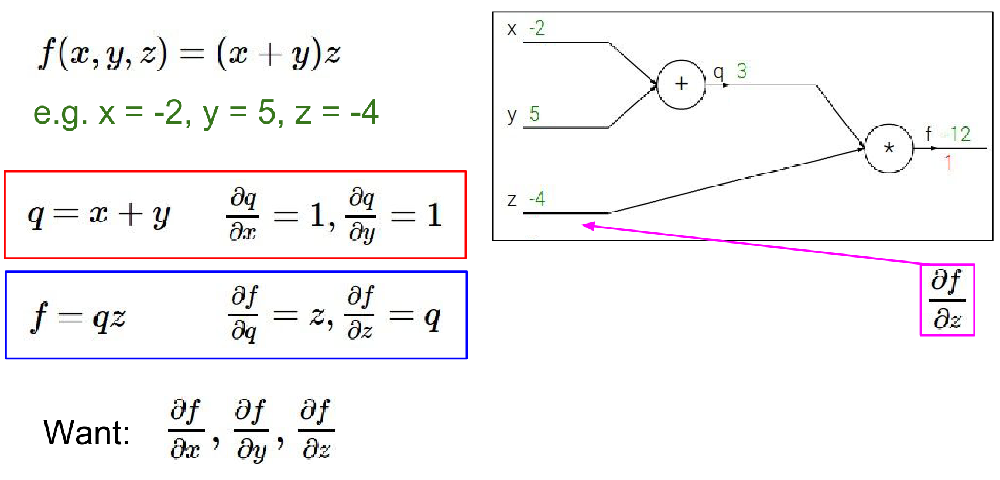

What does this tell us ? 

What 3 is telling you really (intuitively keep in mind the interpretation of a gradient) is what that's saying is that the influence of Z on the final value is positive and with sort of a force of 3.

So if we increment Z by a small amount H, then the output of the circuit will react by increasing because it's a positive 3, will increase  by $3*H$ so a small change will result in  a positive change on the output.

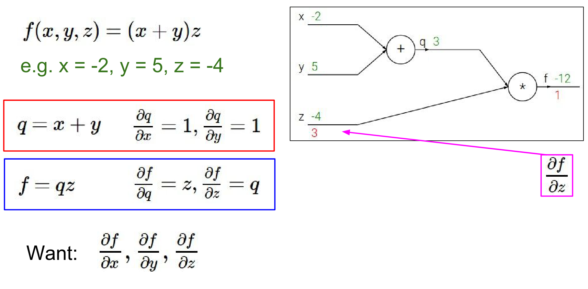

Gradient on Q in this case will be so $DF/DQ$ is said what is that $- 4$.

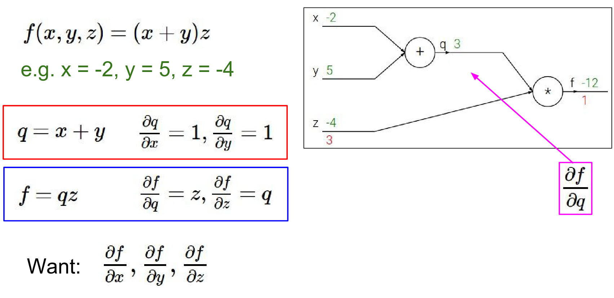

What that's saying is that if Q were to increase then the output of the circuit will decrease, if you increase by H the output of the circuit will decrease by $4*H$

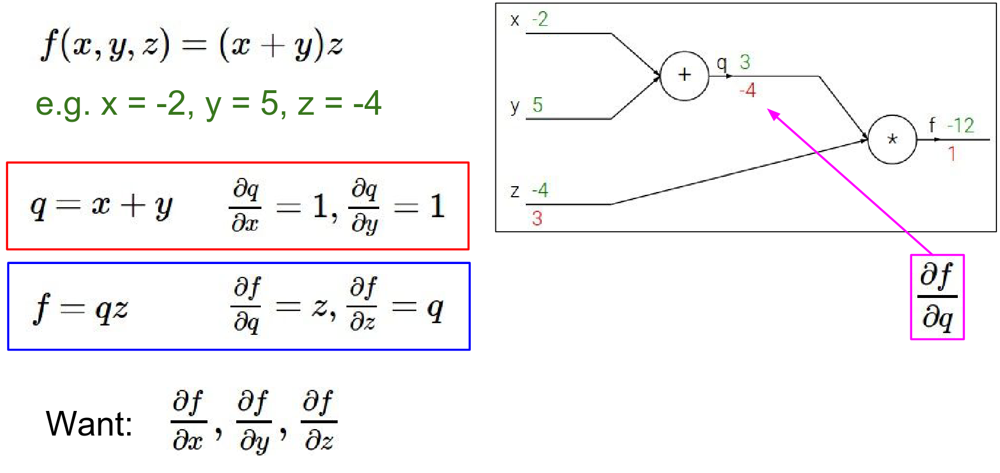

Now we need the gradients for $x$ and $y$. We use the Chain Rule.
We want $\frac{\partial f}{\partial y}$. We know $\frac{\partial f}{\partial q}$ and $\frac{\partial q}{\partial y}$.

$$ \frac{\partial f}{\partial y} = \frac{\partial f}{\partial q} \cdot \frac{\partial q}{\partial y} $$

-   We know $\frac{\partial f}{\partial q} = -4$.
-   Since $q = x + y$, $\frac{\partial q}{\partial y} = 1$.
-   Therefore, $\frac{\partial f}{\partial y} = -4 \cdot 1 = -4$.

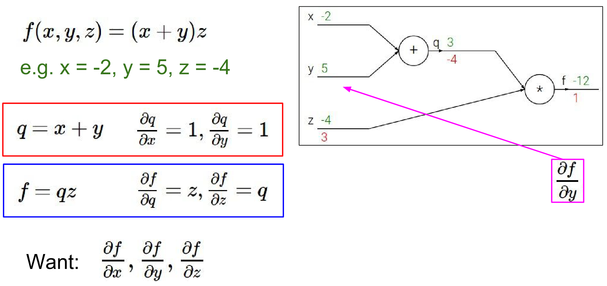

Many ways to do it, just apply chain rule.

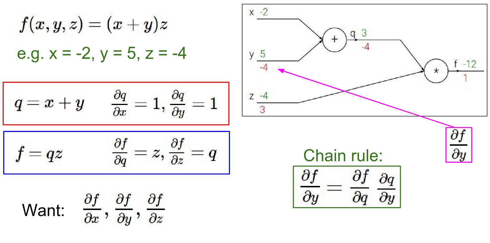

The Chain Rule tells us to multiply the **local gradient** (how the gate's output changes with its input) by the **upstream gradient** (how the final loss changes with the gate's output).

This is kind of the the crux of how back propagation works is this is very important to understand.

We have these two  pieces that we keep multiplying through when we perform this chain rule.

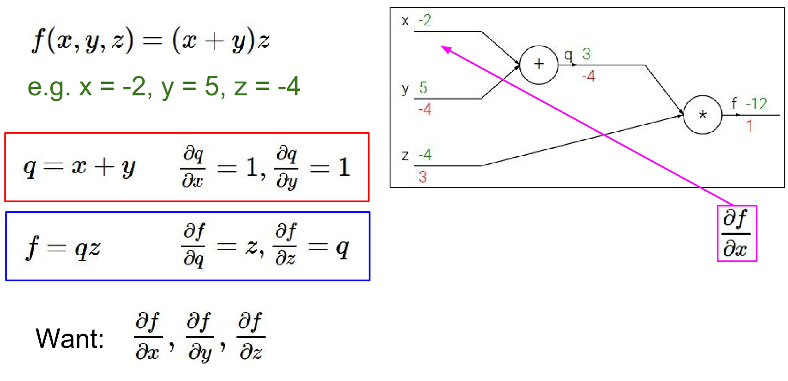

Basically what this is saying is that, the influence of Y on the final but the circuit is $-4$ so increasing y should decrease the output of the circuit by $-4 *  the little change$ that you've made.

Similarly for $x$:
$$ \frac{\partial f}{\partial x} = \frac{\partial f}{\partial q} \cdot \frac{\partial q}{\partial x} = -4 \cdot 1 = -4 $$

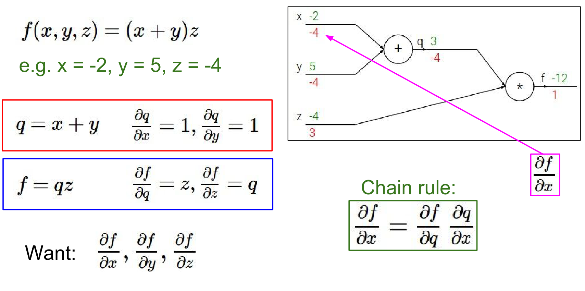

What is X's influence on Q and what q's influence on the end of the circuit and so that ends up being a  chain rule. $-4 * 1 = -4$

So chain rule is kind of giving us this correspondence.

### Perspective of a single Node

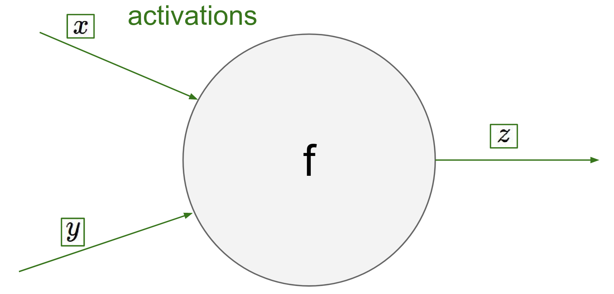

Imagine you are a gate (node) in a large computational graph. You don't need to know the entire graph structure. You only need to know:

1.  **Your Inputs**: $x, y$

2.  **Your Operation**: e.g., addition, multiplication

3.  **Your Output**: $z$

This value of Z, goes into computational graph and something happens to it, but you're just a gate  hanging out in a circuit and you're not sure what happens.

But by the end of the circuit the loss gets computed. That's the forward pass.

**Forward Pass:**
You receive inputs $x, y$ and compute output $z$. At this moment, you can also compute your **local gradients**: $\frac{\partial z}{\partial x}$ and $\frac{\partial z}{\partial y}$.

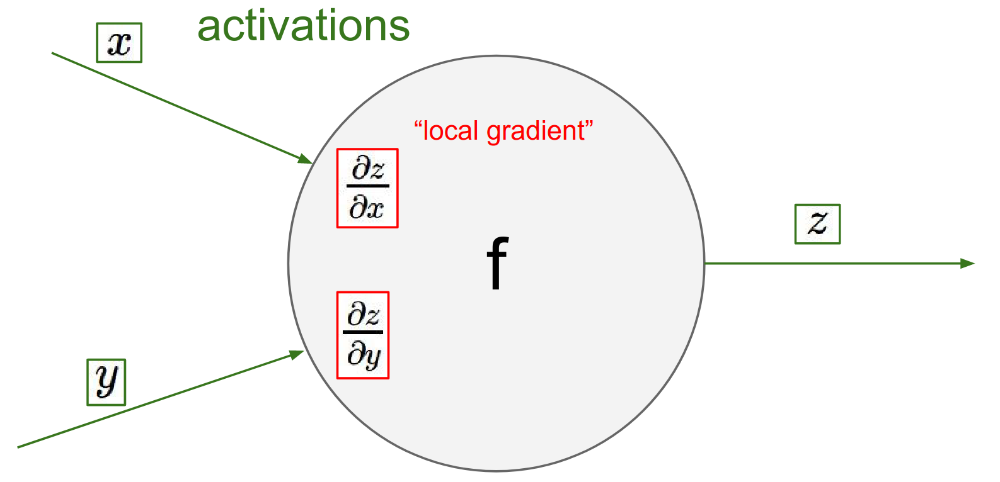

I'm just a gate and I know what I'm performing like addition or multiplication, so I know the influence that x and y I have on my output value.

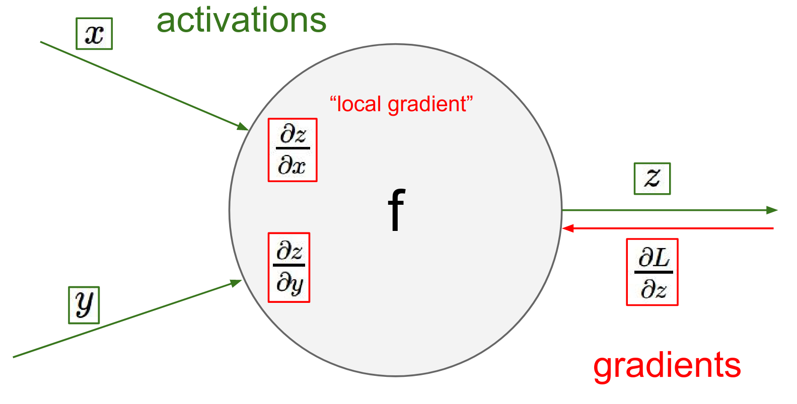

What happens near the end  so the loss gets computed and now we're  going backwards I'll eventually learn about what is my influence on the final output of the circuit the loss so I'll learn what is $DL / DZ$ in there.

To find $dl/dx$ , use the $dL/dz$ you got and your local gradient in a chain rule!


**Backward Pass:**

Eventually, a gradient $\frac{\partial L}{\partial z}$ comes back to you from the end of the circuit. This tells you how much the final Loss $L$ changes if your output $z$ changes.

To find how the Loss changes with respect to your inputs, you simply multiply this incoming "upstream" gradient by your local gradients (Chain Rule).

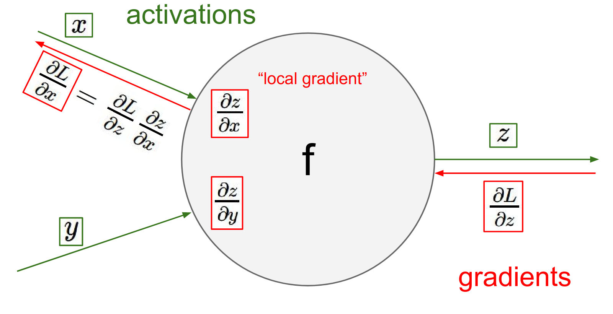

Chain rule -> `Global gradient ontheoutput` * `localgradient`

$$ \frac{\partial L}{\partial x} = \frac{\partial L}{\partial z} \cdot \frac{\partial z}{\partial x} $$

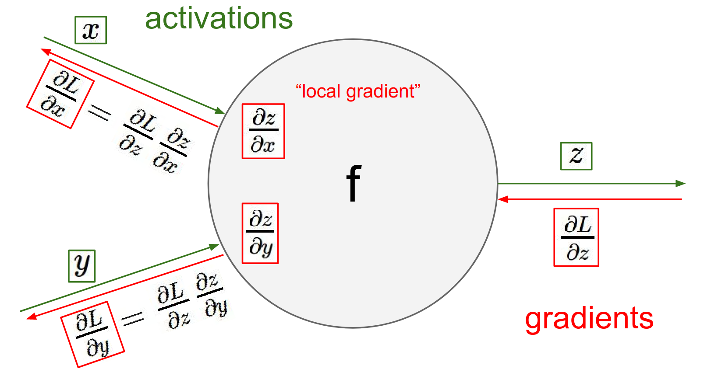

Chain rule is just this added multiplication where we take our what  I'll called global gradient of this gate  on the output and we change it through  the local gradient.

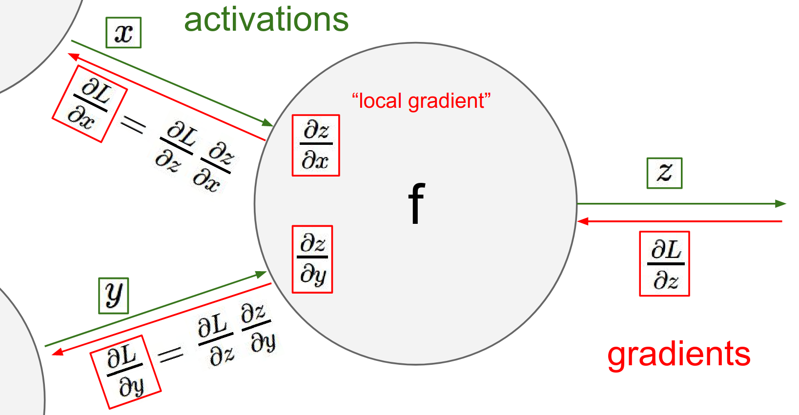

These X's and Y's there  are coming from different gates right so  you end up with recursing this process through the entire computational circuit  and so these gates just basically  communicate to each other the influence on the final loss.

In other words, this process repeats for every node. The gradients flow backwards through the graph, multiplied by local gradients at each step.

### Backpropagation: A Complex Example

It's a way of computing gradients through a recursive application of chain rule through computational graph the influence of every single intermediate value in that graph on the final loss function.

If Z is being influenced in multiple places in the circuit, the backward flows will add but we'll come back to that point.

Let's look at a more complex function:

$$ f(w, x) = \frac{1}{1 + e^{-(w_0x_0 + w_1x_1 + w_2)}} $$

This is actually a 2-layer neural network (or logistic regression).

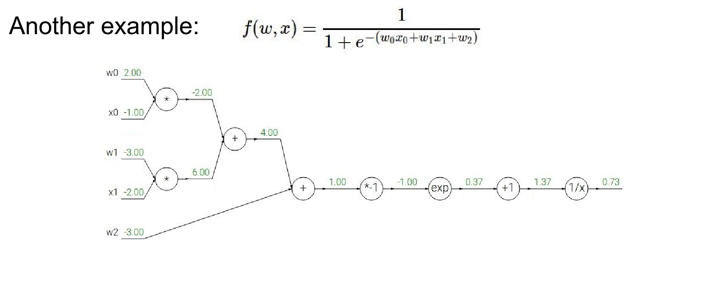

We can break this down into a computational graph.

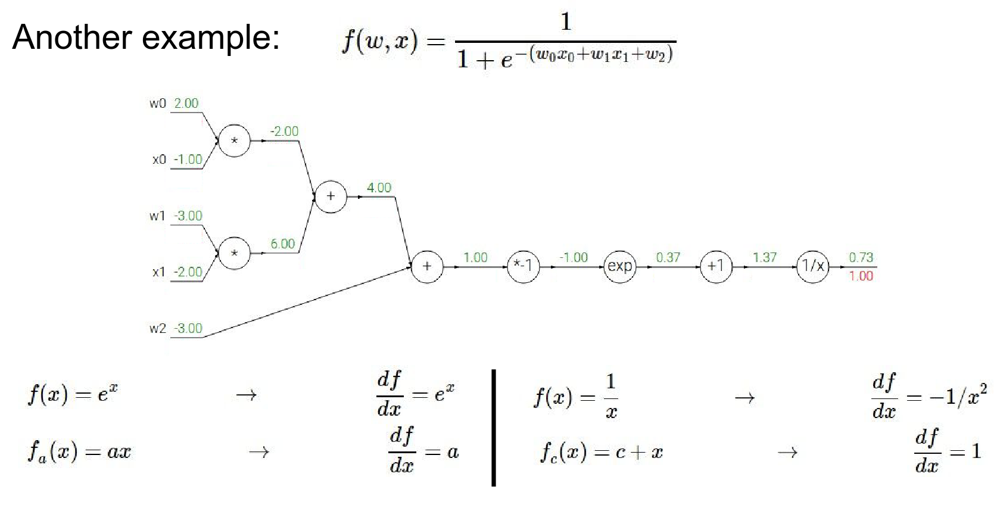


We're going to do now is we're going to  back propagate through this expression.

We're going to compute what the influence of every single input value is on the output of this expression.

So we have exponentiation and we know for every  little local gate what these local gradients are right so we can derive that using calculus so $e^X$ derivative is $e^X$

- WE ALWAYS START with $1.00$ - gradient on identity function.
- now we're going to back propagate through this $1 / X$  operation.
- $1 / X$ gate  during the forward pass received input $1.37$ and right away that $1 / X$ gate  could have computed what the local  gradient was, the local gradient was $-1 / x^2$ 
- and now during  back propagation it has to by chain rule  multiply that local gradient by the  gradient of it on the final output of  the circuit which is easy because it  happens to be at the end 
- so we get $-1/ x ^ 2$

**Step-by-Step Backpropagation:**

1.  **Start at the end**: Gradient is $1.0$.

2.  **$1/x$ gate**:
    -   Forward: $1.37 \rightarrow 0.73$
    -   Local Gradient: $-1/x^2 = -1/(1.37)^2 = -0.53$
    -   Global Gradient: $1.0 \cdot (-0.53) = -0.53$

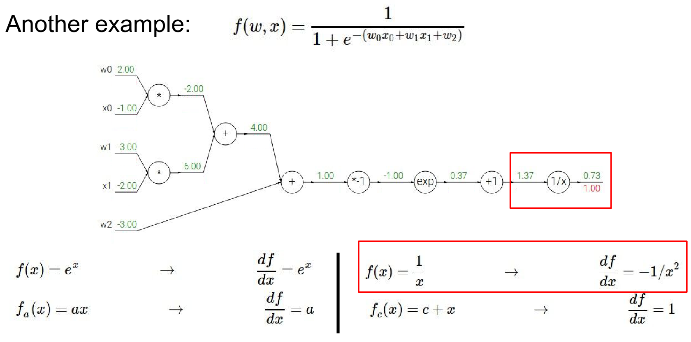

3.  **$+1$ gate**:
    -   Local Gradient: 1.0
    -   Global Gradient: $-0.53 \cdot 1.0 = -0.53$


So the output is $-0.53$. It has negative effect on the output. Which make sense because it is a $1/x$ gate, if we increased x, the value will be smaller.

That's why you're seeing negative gradient.

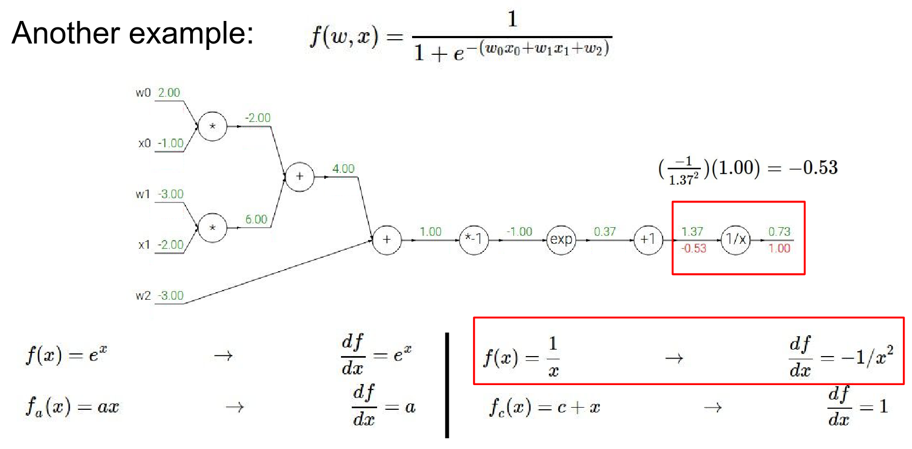

- the next gate in the circuit it's adding a constant of one $+ 1$
- Local gradient is 1. The gradient before is $0.53$

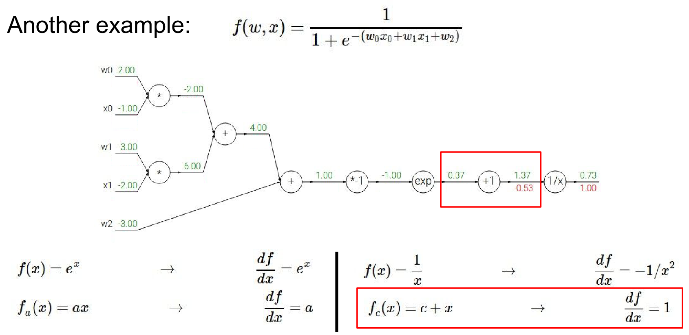

4.  **$e^x$ gate**:
    -   Forward: $-1.0 \rightarrow 0.37$
    -   Local Gradient: $e^x = e^{-1} \approx 0.37$
    -   Global Gradient: $-0.53 \cdot 0.37 \approx -0.2$

- Result is $0.53$

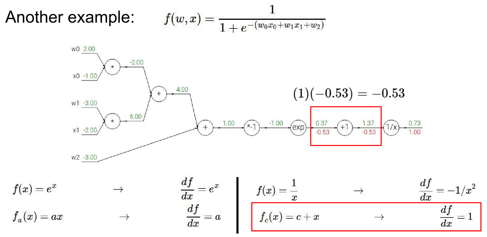
- Now we know the gradient just before - $-0.53$

- Local gradient is $e^{-1}$ because input is $-1$?

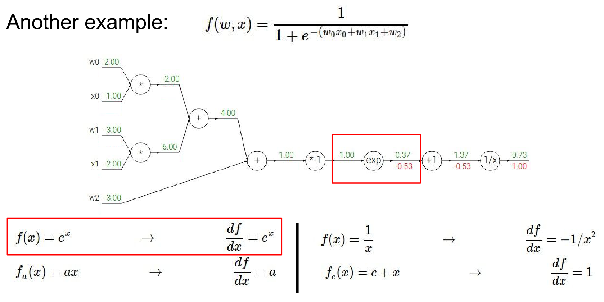

5.  **$*-1$ gate**:
    -   Local Gradient: -1
    -   Global Gradient: $-0.2 \cdot -1 = 0.2$

- Result is $-0.2$

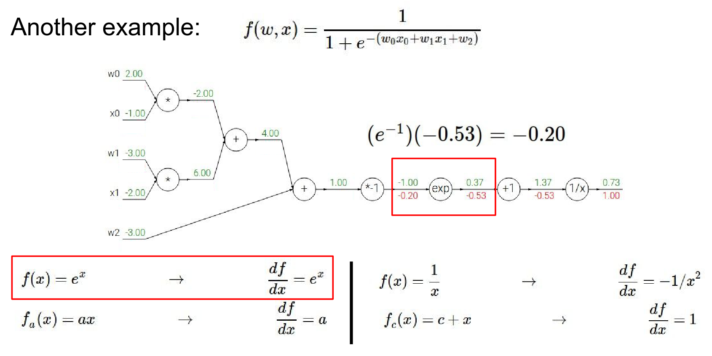

- We have $*-1$ gate. 
- $1 * -1$ gave us $-1$ in the forward pass. Our local gradient it $a$. Result before was $-0.2$

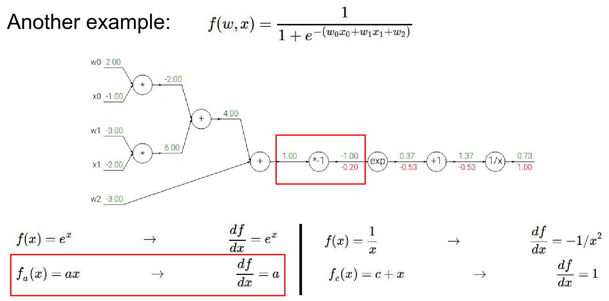

6.  **Sum gate**:
    -   The gradient $0.2$ is distributed to all inputs equally (since local gradient of sum is 1).
    -   $w_2$ gradient: $0.2$

- We now have $0.2$

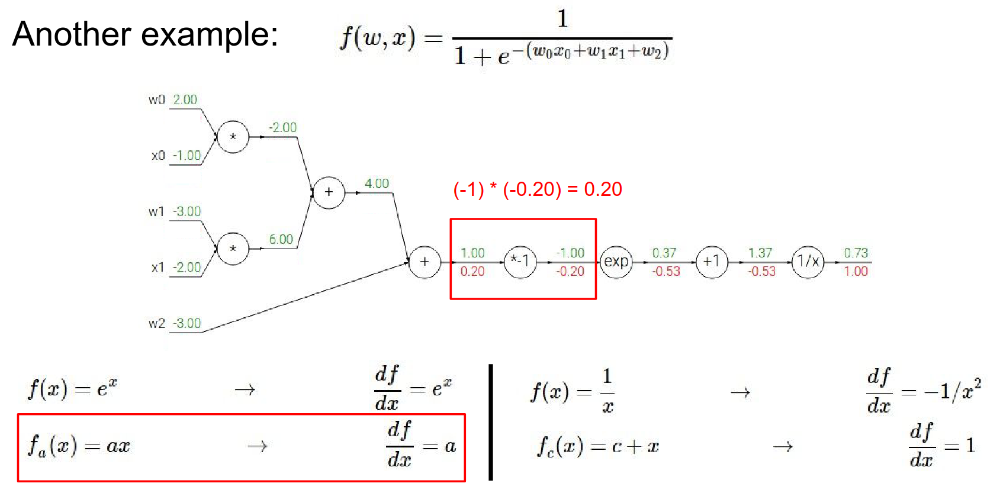

- This plus operation has multiple inputs.

- Local gradient to the plus gate is 1 and 1.

- If you just have a  function $X + y$ then for that  function the gradient on either X or Y  is just 1.

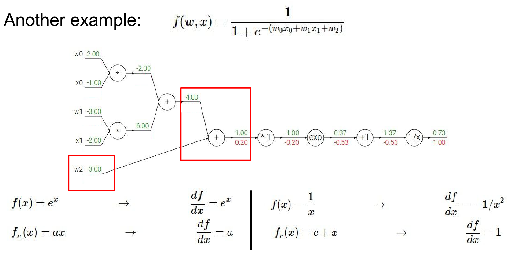

- What you end up getting  is just $1 * 0.2$

- A plus gate is kind of like a **gradient distributor** where if something flows in from the top it will just spread out all the all the  gradients equally to all of its children.

We've already received one of the inputs ($w2$) is gradient 0.2 here on the very final output of the circuit.

So this influence has been computed through a series of applications of chain rule along the way.

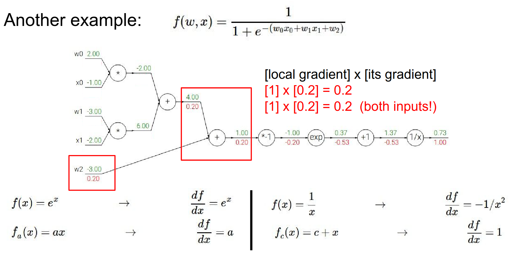

7.  **Multiply gates**:
    -   For $w_0x_0$: Gradient is $0.2$.
    -   $w_0$ gradient: $0.2 \cdot x_0 = 0.2 \cdot (-1) = -0.2$
    -   $x_0$ gradient: $0.2 \cdot w_0 = 0.2 \cdot 2 = 0.4$

There was another plus gate, so now we're going to back propagate through that (previous) multiply operation.

What will be the gradient for $w0$ and $x0$ ? 


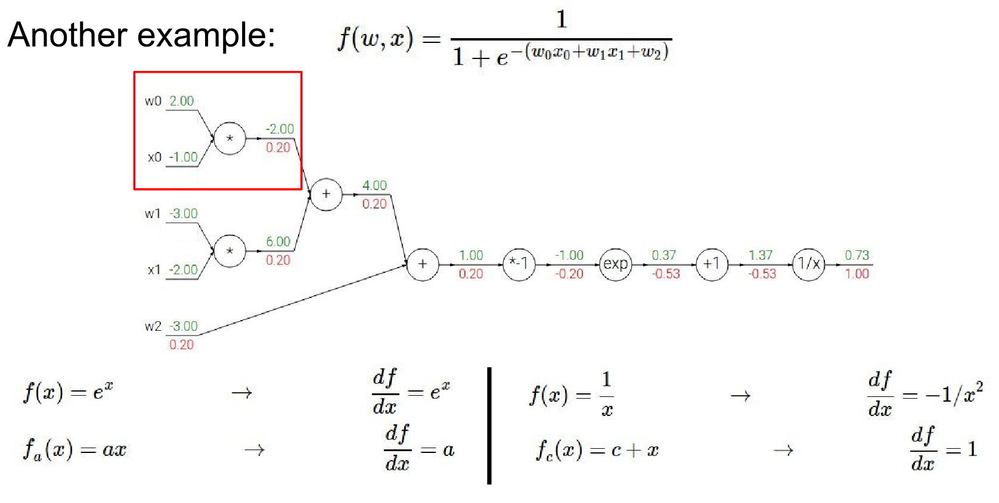

- For $w0$ the gradient will be, $-1 * 0.2$

- For $x0$ the gradient will be : $2 * 0.2$

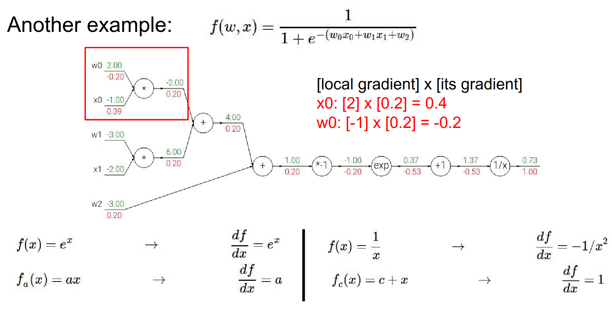

Result is not $0.39$ - result is $0.4$. We will skip the next multiplication gate.

The cost of forward and  backward propagation is roughly equal.

I could have made a different gate.

### Sigmoid Gate Shortcut

The function we just differentiated is the **Sigmoid function**: $\sigma(x) = \frac{1}{1+e^{-x}}$.

The derivative of the sigmoid function is simple:
$$ \frac{d\sigma(x)}{dx} = (1 - \sigma(x))\sigma(x) $$

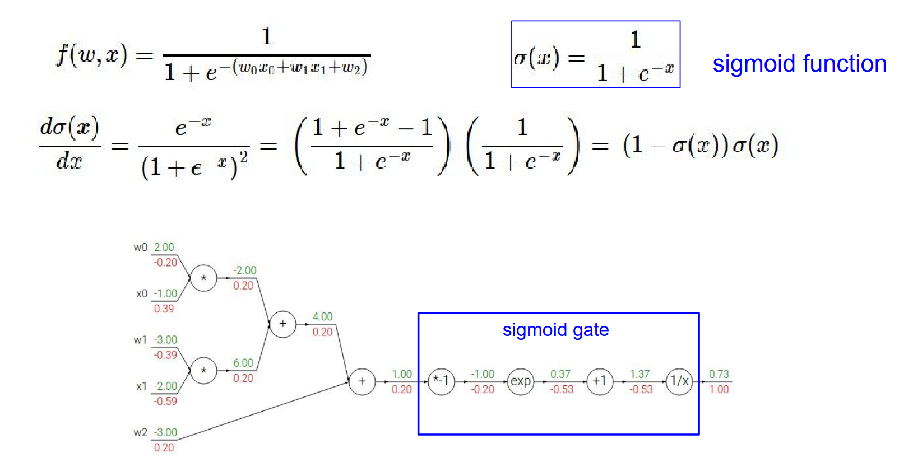

This has a single sigmoid gate for example.

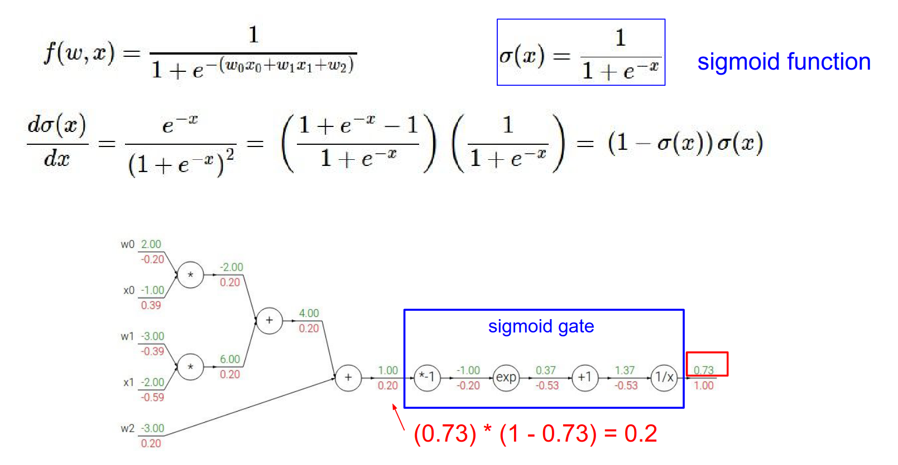

If we know the local gradient for the sigmoid, which we can derive, we can use it.

- `Local gradient * gradients = result`

$$(0.73) * (1 - 0.73) * (1.0) = 0.2$$

This understanding helps you debug the networks, for example vanishing gradients.

So, if we have a sigmoid gate, we don't need to break it down into elementary operations. We can just use this formula.

In our example, output was $0.73$. Gradient = $(1 - 0.73) \cdot 0.73 \approx 0.2$. This matches our step-by-step calculation!

### Patterns in Backward Flow

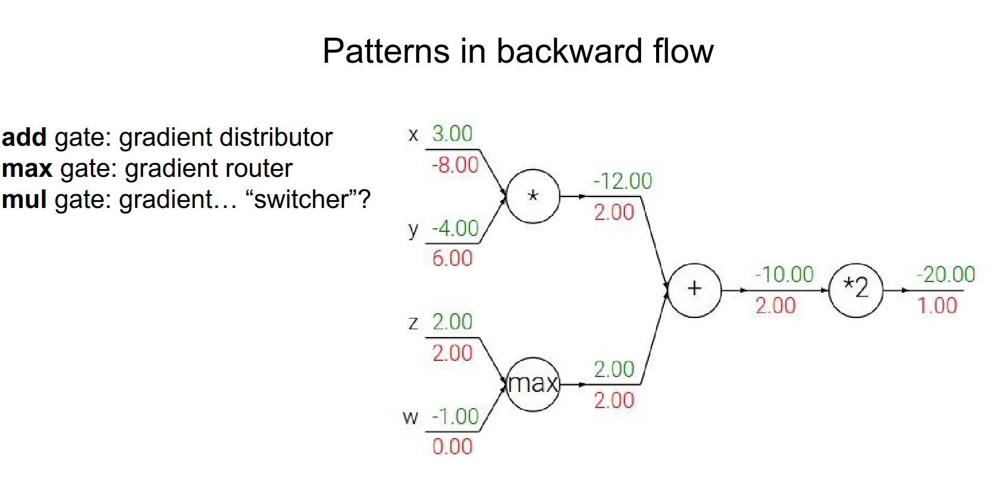

Common gates have intuitive behaviors:

*   **Add Gate**: **Gradient Distributor**. Takes the upstream gradient and passes it to all inputs equally.

*   **Max Gate**: **Gradient Router**. Passes the gradient to the input that had the max value, and 0 to others.

*   **Mul Gate**: **Gradient Switcher**. Scales the gradient by the value of the *other* input.

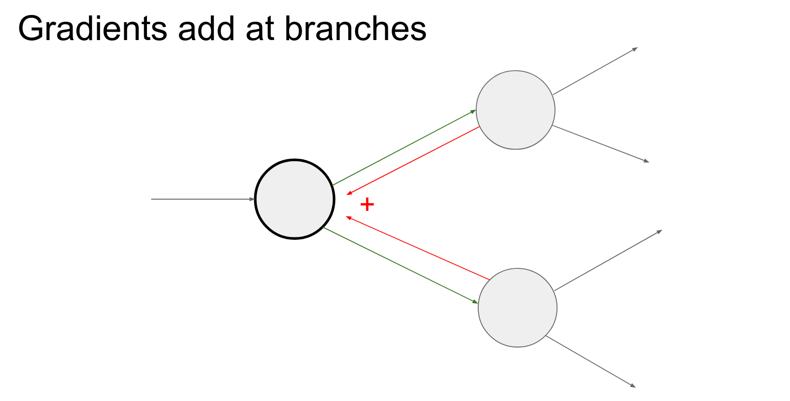

Add up the contributions at the operation.

### Implementation: Modular Gates

We need a object to connect the gates. Graphs are great!

It has two main pieces, forward and backward.
We can implement these gates as classes with `forward` and `backward` methods.

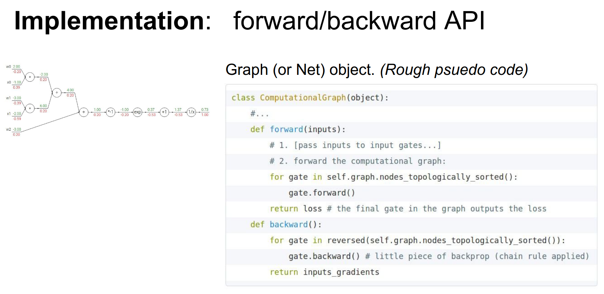

**The Multiply Gate Example:**

```python
class MultiplyGate(object):
    def forward(self, x, y):
        z = x * y
        self.x = x # Cache input for backward pass
        self.y = y 
        return z
    
    def backward(self, dz):
        # dz is the upstream gradient
        dx = self.y * dz # [dL/dz] * [dz/dx]
        dy = self.x * dz # [dL/dz] * [dz/dy]
        return [dx, dy]
```

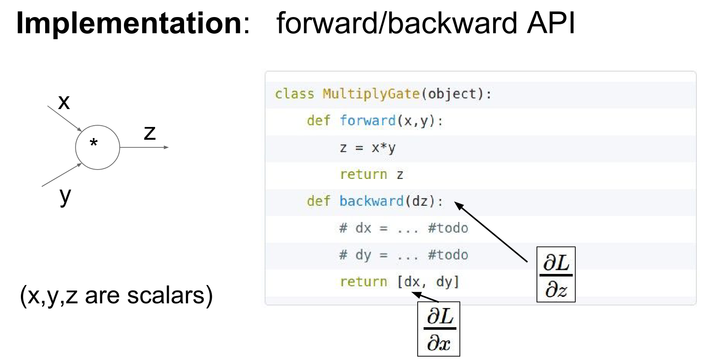

**Key Idea**: During the forward pass, we **cache** the input values ($x$ and $y$) because we will need them during the backward pass to compute local gradients ($dz/dx$ and $dz/dy$).

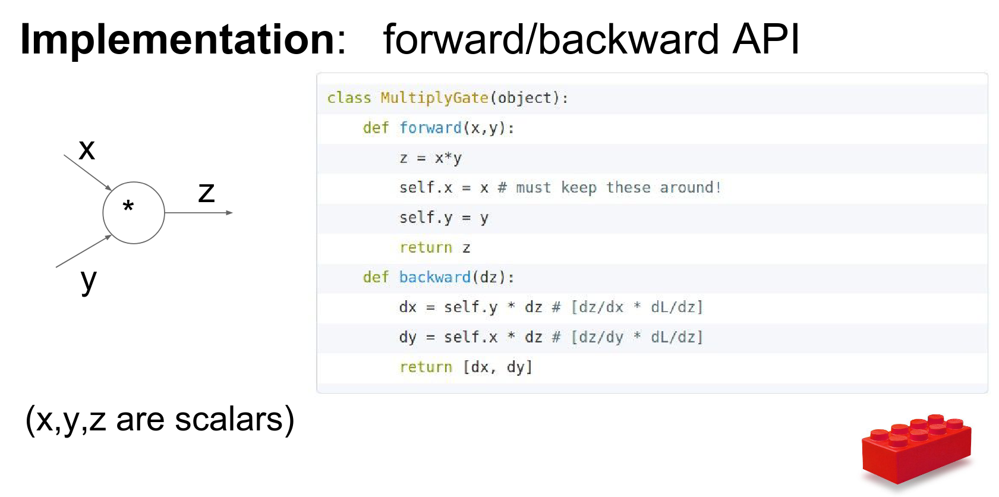

Deep learning frameworks (like Caffe, Torch, TensorFlow, PyTorch) are essentially collections of these layers (gates) and a graph engine that manages their connectivity. 😍

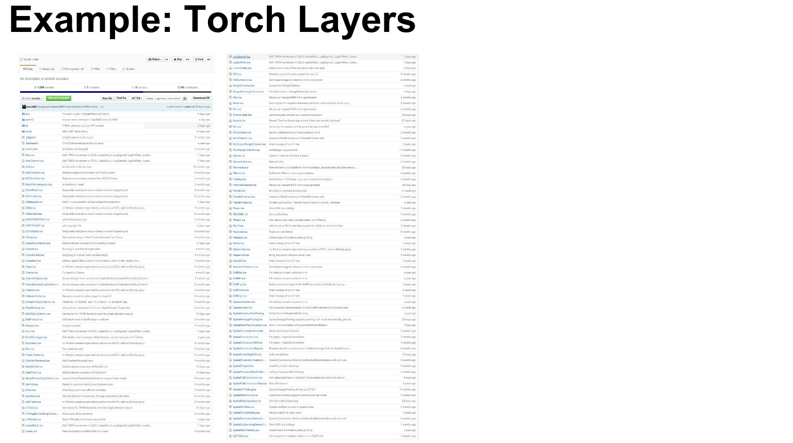

We are building towers from Lego blocks.

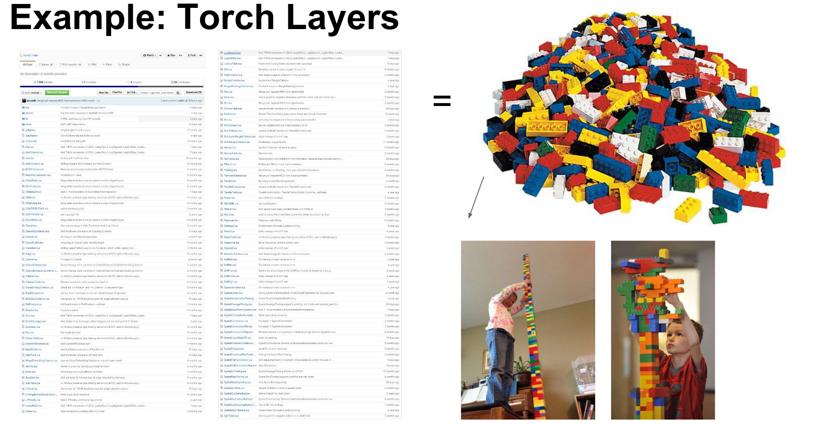

A specific example. 

Just a scaling by a number.

Give the $a$ in the initialization.

Forward and Backward.

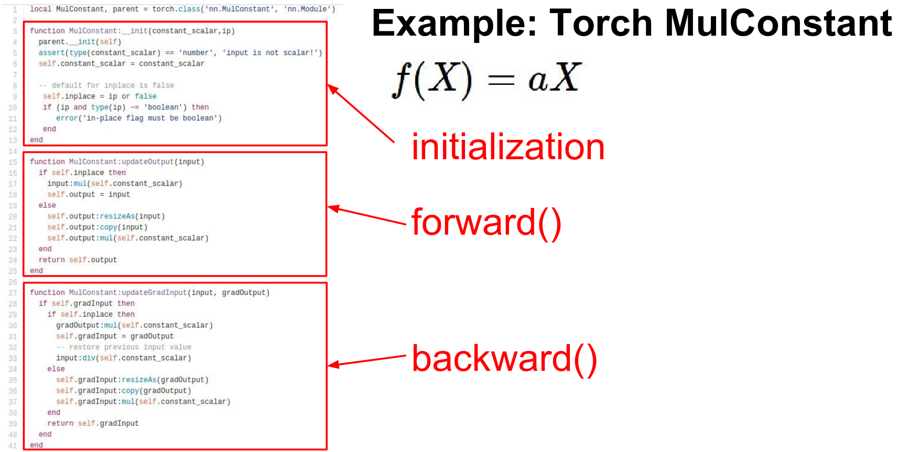

`Caffe` is a deep learning framework specifically for images. A lot of layers there too.

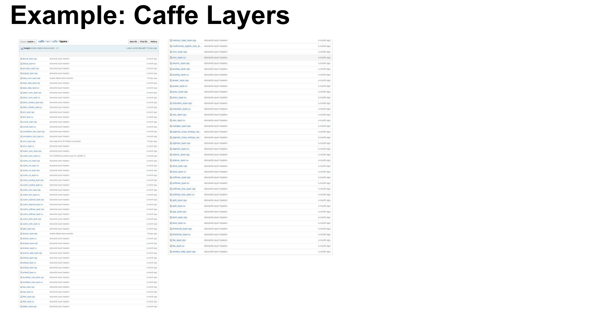

A `Sigmoid` layer. `Caffe` calls tensors blobs. Blob is just a n dimensional array of numbers. 


Forward and backward pass, again. Chain rule again.

This is the CPU implementation. There is a separate file which has this run on GPU, which is a CUDA code.

**Q:** Do we have to go through forward and backward for every update ? 

**A:** Yes. When you want to to update you need the gradient. You sample a mini batch, you do a forward, right away you do a backward, now you have initial gradient.

- Forward computes the loss


### Vectorized Operations

In practice, we work with vectors and matrices (tensors), not just scalars.

The logic remains the same, but the local gradients become **Jacobian matrices**.


The Jacobian matrix contains the derivative of every output element with respect to every input element.

**Important Note**: We rarely form the full Jacobian matrix because it is huge.

For example, if input $x$ is size 4096 and output $z$ is 4096, the Jacobian is $4096 \times 4096$.

Instead, we compute the product of the Jacobian with the upstream gradient vector directly.


You did a thresholding.


Simple: $4096 x 4096$


It actually looks like a almost an identity matrix but some of them are 0 instead of 1 (because they were clamped to zero in forward pass).


Usually we do mini batches. 

All the examples in mini batches are computed in parallel. The Jacobian ends up huge, so you do not write them out.

Compute scores, compute margins. Compute loss do backprop.


We learned why we need forward/backward passes so far.


## Neural Networks


So far, we've seen linear score functions: $f = Wx$.

A **Neural Network** adds non-linearity and layers.

*   **2-Layer Net**: $f = W_2 \max(0, W_1 x)$

*   **3-Layer Net**: $f = W_3 \max(0, W_2 \max(0, W_1 x))$

Here, $\max(0, x)$ is the **ReLU** (Rectified Linear Unit) activation function.


A 2 layer network, is just more complex score function.


By stacking these linear layers with non-linear activations, we can model complex functions.

For example, a 2-layer net can classify data that is not linearly separable (like the spiral dataset).

h - hidden layer count - `100` - it is a hyper parameter.


We have a 100 layers in middle, now we can actually classify different colored cars.

We could not do that in Linear SVM.

We now have a multi model car classifier!


You just extend this if you want 3-layer Network.


Not so complicated to make them.

x input - y output. syn0 - sny1 weights. With logistic regression loss.


Stage your computation and do backpropogation for every single result.


### Biological Inspiration

Neural Networks are loosely inspired by biological neurons.


Image search for neurons.


This is the real neuron. It can spike based on the input.

*   **Dendrites**: Inputs ($x$)

*   **Synapses**: Weights ($w$)

*   **Cell Body**: Summation and Activation ($f(\sum w_i x_i)$)

*   **Axon**: Output ($y$)

However, biological neurons are much more complex. Artificial Neural Networks are a mathematical abstraction.


The similarity is kinda like down below:

Based on the activation of function, you decide on output.


People like to use `sigmoid`. You get the number between 0 - 1. 


If we want to implement it:


Neural Networks are not really like brains.


A lot of options here. ReLU helps NN's convert faster.

### Architecture

We organize neurons into **layers**.

*   **Input Layer**: The raw data.

*   **Hidden Layers**: The intermediate layers.

*   **Output Layer**: The final predictions (scores).

**Fully-Connected Layer (FC)**: Every neuron in one layer is connected to every neuron in the next layer.


We connect layers. 

Input does not have computation so architecture on left has 2 layers. `2 Layer Net`

Input does not have computation so architecture on right has 3 layers. `3 Layer Net`


Having them in layers allows us to use vectorized operations. Neurons inside layers can be evaluated in paralel and they all see the same input.


**Code Example:**

```python
# 2-Layer Neural Network
import numpy as np

# Forward pass
f = lambda x: 1.0 / (1.0 + np.exp(-x)) # Activation function (Sigmoid)
x = np.random.randn(3, 1) # Random input vector
h1 = f(np.dot(W1, x) + b1) # Hidden layer
h2 = np.dot(W2, h1) + b2   # Output layer
```


### Summary

*   We arrange neurons into layers to use efficient vectorized operations.

*   More neurons/layers = more capacity to represent complex functions.

*   To prevent overfitting with large networks, we use **Regularization** (not just smaller networks).


When you decrease the regularization, your network can act advanced.


See the [Website](https://cs.stanford.edu/people/karpathy/convnetjs/demo/classify2d.html) for demo.

Your hidden layer literally wraps space in such a way that your last layer, which is just a linear classifier, can separate the input points effectively.

You can see on the right in the image down below, space is warped.


Here is the summary so far.


**Q:** Is it always better to have more neurons ? 
**A:** Yes. Only Computational constraints.

The correct way to to constrain your Neural Network to not to overfit your data, is not by making the network smaller, the correct way is to increase your regularization.

For practical reasons, you will use smaller models.

**Q:** Do you regularize each layer equally ?
**A:** Usually you do, as a simplification.

**Q:** Depth or width, which is more important ?
**A:** It depends on the data.


That was fun, let's go next.
