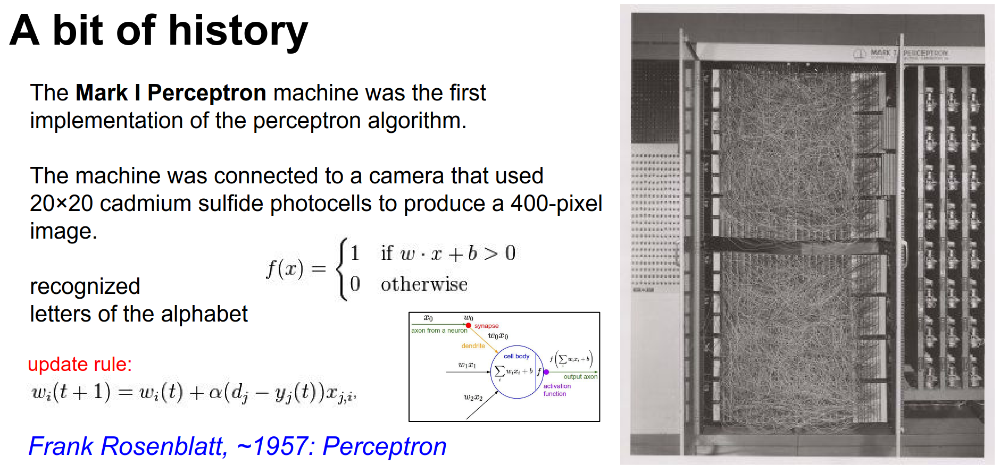

Part of [CS231n Winter 2016](../index.md)

---
# Lecture 5:  Training Neural Networks,  Part I


Some things to think about project proposals.


You can finetune!


Chop of the classifier, and train the neural network as a feature extractor? How man ?


You have a lot of pretrained datasets!


LOL. During hyper parameter optimization, you will need a lot of compute. Be careful.


Finite compute.


We are here. 
## batch a data - forward - backprop - update


We have a Optimization problem at hand.


NN's can get really large.


We need calculus - just chain rule.


Chain rule seen here.


We need a forward/backward API.


Simple Multiplication Gate:


LEGO's.


We saw the activation functions here, first time ever.


The resemblance of NN and Brain.


FC are only the layers that are not input (which have computation).


## History - Zoomed Out Field!


1960 is the start, the perceptron.
## the perceptron

they had to actually build from circuits and electronics.

Activation function was a binary step function, it was not differentiable. 

So back propagation was not even here. It came much later. 

There was no loss function also.



They started to stack perceptons, still building on hardware. Just rules.


Scientist was excited but would under deliver, they did not work good.

First time you see back propagation like rules, seen on paper. People got excited again. Training would get stuck and it would not work.


It was 2006, when a 10 layer NN would actually trains properly.

Which is based on RBZ:
# RBZ - Restricted Boltzman Machine.

Instead of training all 10 layers all at once, they came up with this unsupervised pretraining scheme. You train your first layer using an unsupervised objective than you train your second layer on top of it and third and fourth.

Once all of them are trained, than you start backpropogation. You start the fine-tuning step.

You actually can start with backpropogation for training but you have to be very careful with initialization.

They used sigmoids and sigmoids are really not good activation functions.


Things started to work relatively well.

In 2010, strong results. 

In speech recognition area, they had this `GMM` - `HMM` stuff, they swapped out one part and subbed in a NN, THAT GAVE THEM HUGE IMPROVEMENTS.

In Vision - 2012 crushed the competition. Field exploded.


Why this happened in 2012? 
- We figured out initialization
- We had better activations
- We had more data
- We had better compute.

---

Next 2 lectures will be about, these:


## activation functions:


Different proposals:


Historically, squashes a number between 0 and 1.


Problems (Vanishing gradient):


We would like to back propagate on sigmoid gate,


Gradient is very low when X is 10 or $-10$
# Slope is actually 0. You can see that.

## If your neuron is saturated (which means they are either 0 or 1) than gradient cannot backpropogate through the network.

Only active region of the sigmoid will work.


When you preprocess data, you want to make sure that it is zero centered. 


## If your x's are all positive what happens on gradients on w ?


All gradients of w are either all positive or all negative. 
$$X * grad(f)$$

If the gradient of the output of the neuron is positive. Then all your W gradients will be positive and vice versa.

The problem is you are constrained in the update you can make.


## You can see this empirically, when you train with things that are not zero centered, you will observe slower convergence.

# You want to have things that are zero centered.


Literally simply, just expensive.
## when we are training CNN's most of compute time is actually in convolutions and dot products

exp is however expensive.

Yann Lecun recommended using tanh() instead of sigmoids.


Yeah, still vanishing gradients.
# In 2012 first convolutional neural networks paper, ReLu makes CNN's converge faster. 🎱

Just thresholding. This is the default.


## Problems, not zero centered. when x < 0 gradient dies.


If it is positive, just passes through.
# At x = 0 gradient is undefined.

## Whenever we are talking gradient in this course we are talking about sub-gradient, generalization of gradient to functions that are sometimes non differentiable.


## In practice, if you are unlucky in your initialization, ded relus. They will not come back.


Sometimes when you are training, you stop and look at the activation on neurons,
## as much as %10 or %20 of your network is ded. These are neurons that are never turned on for anything in the training data.

## To avoid this problem, initialize with instead of 0 bias, 0.01 bias


An approach to solve ReLu. Neurons are not dying.
##  Andrej is not completely sold on them.


Also PReLu is possible. The slope can be a parameter.


2 months ago at the lecture times, a new paper came out:


`Ian Goodfellow et al` is how you read the top left.

A different form of Neuron.
## It has 2 weights. 🤔


## a lot of the optimization process is not just about loss function, it is more about the dynamics of the backwards flow of the gradients.


## Sigmoids are used in LSTM and RNN's but there are reason for that.


## Very common to zero center your the data = Along every single feature you subtract the mean.

### In ML literature (normalize the data) you do standardizing (normalize the standart deviation), or you can make sure the min and the max are within -1 and 1.

In images normalizing is not common.


In Machine Learning these common but in images we are not using these:

- PCA - you can make the covariance structure become diagonal
- Whitened data - squish the data - covariance matrix becomes diagonal.
## PCA is not really common becuase images are really high dimentional objects with a lot of pixels so covariance matrices would be huge.


In images, mean centering:

- AlexNet has the mean image of orange blob
- You can subtract based on RGB.


People were not careful enough with this:


How not to do it:


If you set all weights to 0:

All output would be zero, there is nothing **symmetry breaking**.


This is the first valid approach:


In deep networks things go wrong with 0.01 w's, let's see an example:

```python
# sample a dataset first 1000 points 500 dimentional

# make hidden layers and nonlineararties

# use tanh

# take unit gaussian data and forward it in network

# in the first for loop, you are just forward propogating the network
```

What happens to the statistics of the neurons activations throughout the network with this initialization.
- We will look at mean and standard deviations
- we will plot histograms


Means and standard deviations are printed, means stays around 0 but standard deviation plumbed down to 0.


Why is this an issue?
## Think about the dynamics of the backward pass, to the gradients, when you have tiny numbers in the activations what do these gradients on these weights look like?


Tiny X's will make the gradient really small.

When you multiply by W at every single layer, the gradients will just go to really small number.

What if we initialized with $1$ instead of $0.01$ ?


Now we have overshot the other way LOL. Everything is completely saturated. All the neurons are either 1 or -1.

You die. You can train for very long time and you can see that loss is not moving at all. Because nothing is back propagating because all neurons are saturated and nothing is being updated.
# The Xavier Initialization!

Based on number input number, weight initialization changes.

- If you have a lots of input and you will end up with lower weights.
- If you have less inputs and your weights will be large.

In the notes there is text about how this is derived. This is reasonable.

But this paper  has the flaw of not taking into account tanh() 


When we try with ReLU, it does not work at all.


Someone pointed out, you are missing out an factor of 2. 

> ReLU neurons half your variance each time.

When you use this factor of 2, things build nicely.


You have to be careful with initialization.


This is the proper way. Xaiming He with factor of 2.


There is also a data driven approach for initialization too.

---
## There is a technique that alleviates a lot of this problems.

# Batch Normalization

----
### Explained in assignment python notebook: ## 😍 

To understand the goal of batch normalization, it is important to first recognize that ==machine learning methods tend to perform better with input data consisting of uncorrelated features with zero mean and unit variance. ==

When training a neural network, we can preprocess the data before feeding it to the network to explicitly decorrelate its features. 

This will ensure that the first layer of the network sees data that follows a nice distribution. 

However, even if we preprocess the input data, the activations at deeper layers of the network will likely no longer be decorrelated and will no longer have zero mean or unit variance, since they are output from earlier layers in the network. 

Even worse, during the training process the distribution of features at each layer of the network will shift as the weights of each layer are updated.

The authors of BN paper hypothesize that the shifting distribution of features inside deep neural networks may make training deep networks more difficult. 

To overcome this problem, they propose to insert into the network layers that normalize batches. At training time, such a layer uses a mini-batch of data to estimate the mean and standard deviation of each feature. 

These estimated means and standard deviations are then used to center and normalize the features of the mini-batch. A running average of these means and standard deviations is kept during training, and at test time these running averages are used to center and normalize features.

It is possible that this normalization strategy could reduce the representational power of the network, since it may sometimes be optimal for certain layers to have features that are not zero-mean or unit variance. 

To this end, the batch normalization layer includes learnable shift and scale parameters for each feature dimension. 
  
----

This helps a lot. Basic idea is, you can make things unit Gaussian because it is a completely differentiable function. You can back propagate through it.


N examples (mini batch) going through network, D features / activations of neurons, X makes sure every single column is normalized. 

By subtracting and dividing stuff.


# Normally we had Fully Connected followed by non linearity (tanh - relu)

### Now we have BN layers right after FC layers.

## These BN's make sure everything is roughly unit Gaussian at every single step of the network (by normalizing them).


A small patch on top of it. Allow the network to be able to shift and scale the bump.

Back propagation can take over and finetune over time.


### Several nice properties of Batch Norm. 🥰

- Reduces the strong independence of initialization.
- Reduces the need for dropout and seems to actually help.


At test time, you nu and sigma can be a running sum  in training and remember that in test time.


It is good thing to use. But there is a runtime penalty.

----
### Tip: Layer Normalization 🐘

Batch normalization has proved to be effective in making networks easier to train, but the dependency on batch size makes it less useful in complex networks which ==have a cap on the input batch size due to hardware limitations==. 

Several alternatives to batch normalization have been proposed to mitigate this problem; one such technique is Layer Normalization. 

Instead of normalizing over the batch, we normalize over the features. In other words, when using Layer Normalization, each feature vector corresponding to a single data-point is normalized based on the sum of all terms within that feature vector.


### Simple Definitions

- **Batch Normalization** is normalizing the inputs to each batch of data by subtracting the mean and dividing by the standard deviation. This helps to stabilize the inputs to each layer, reduce the internal covariate shift, and enable faster and more stable training of deep neural networks. Batch normalization is typically applied to the inputs of each batch of data, hence the name "batch" normalization. It is often used in conjunction with other techniques such as convolutional neural networks (CNNs) and recurrent neural networks (RNNs).

- **Layer Normalization** is normalizing the inputs across the features (or neurons) within a layer, rather than across the batch dimension. This helps to stabilize the inputs to each layer, reduce the internal covariate shift, and enable faster and more stable training of deep neural networks. Layer normalization is often used in recurrent neural networks (RNNs) and transformer models, where the inputs to each layer may have varying lengths and dimensions.

----


We did the classic.


CIFAR-10. 2 FC, 50 neurons.


Initialize 2 layer network. Really small network, we can start randomly. We have 10 classes we are using Softmax loss.
$$2.3 = -log(1/10)$$


Expect the loss to go up.


Good sanity check. Take a small piece of your data, make sure you can over fit. 


Loss can go to 0, Accuracy is 100.


Do not scale up to your full dataset before you can pass the sanity check.


# What is the learning rate that works ? 


We can assume the $1e-6$ learning rate was too low.


Did you catch that ? Loss barely went down but  accuracy is so good. How ?


You start out with fewest scores, when your correct answers become a tiny bit more probable, the accuracy goes up.


Huge learning rate, gives errors.


What is the ideal learning rate.


Find the best hyperparameters for the network.


## Do coarse -> fine


# tip: it is best to optimize in log space! 😍

Because the learning rate is a multiplicative interaction. If we had a linear space, most of the samples would be in a bad region.


Do a finer search now.


This is worrying, why? If there is a best result in the edge, we might have to adjust the range.


## You can grid search instead of random sampling, but this is not good.

Some of the hyperparameters are much more important than others.
# Tip: always use random.


This is so much fun.


You cannot spray and pray LOL.


We might want to consider a bigger learning rate.


Suddenly starts training.


## _lossfunctions.tumblr.com_ LOL 


We gotta also need to look at accuracy.

Accuracy is absolutely interpretable.


Tracking the difference between the scale of your parameters and the scale of your updates to your parameters.

Based on this, you can decide to adjust your learning rate.


TLDR for today:


We will work on these in the next lecture.


Solid performance.
