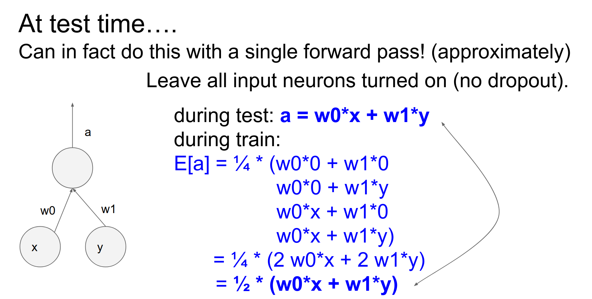

Part of [CS231n Winter 2016](../index.md)

---
# Lecture 6:  Training Neural Networks,  Part 2


By the end of the assignment you will have a good level understanding of all the low level details of how a ConvNet classifies images.

---

I am so excited. Here is the [Assignment link again](https://cs231n.github.io/assignments2022/assignment1/).

In this assignment you will practice writing backpropagation code, and training Neural Networks and Convolutional Neural Networks. The goals of this assignment are as follows:

- Understand **Neural Networks** and how they are arranged in layered architectures.
- Understand and be able to implement (vectorized) **backpropagation**.
- Implement various **update rules** used to optimize Neural Networks.
- Implement **Batch Normalization** and **Layer Normalization** for training deep networks.
- Implement **Dropout** to regularize networks.
- Understand the architecture of **Convolutional Neural Networks** and get practice with training them.
- Gain experience with a major deep learning framework, such as **TensorFlow** or **PyTorch**.
- Explore various applications of image gradients, including saliency maps, fooling images, class visualizations.

**Q1**: Multi-Layer Fully Connected Neural Networks
The notebook `FullyConnectedNets.ipynb` will have you implement fully connected networks of arbitrary depth. To optimize these models you will implement several popular update rules.

**Q2**: Batch Normalization
In notebook `BatchNormalization.ipynb` you will implement batch normalization, and use it to train deep fully connected networks.

**Q3**: Dropout
The notebook `Dropout.ipynb` will help you implement dropout and explore its effects on model generalization.

**Q4**: Convolutional Neural Networks
In the notebook `ConvolutionalNetworks.ipynb` you will implement several new layers that are commonly used in convolutional networks.

**Q5**: PyTorch on CIFAR-10
For this part, you will be working with PyTorch, a popular and powerful deep learning framework.

Open up `PyTorch.ipynb`. There, you will learn how the framework works, culminating in training a convolutional network of your own design on CIFAR-10 to get the best performance you can.

**Q6**: Network Visualization: Saliency Maps, Class Visualization, and Fooling Images
The notebook `Network_Visualization.ipynb` will introduce the pretrained `SqueezeNet` model, compute gradients with respect to images, and use them to produce saliency maps and fooling images.

---

Training a ConvNet is a 4 step process.

- Loss tells us how well are we classifying at the moment.
- We back-propagate to compute the gradient on all the weights. This gradient tells us how we should nudge every single weight so that we are making better classifications.
- We can use the gradients to make the small nudge.


Entire zoo of activation functions.


## Why not just skip activation function? 

If you do not use a activation function, your entire network will be a linear sandwich.

Your capacity is equal to that just a linear classifier.

Activation functions are the critical, they are the ones who give you the wiggle to fit your data.


Problem here, is how should we start ? Xavier is a reasonable start.


BN get rids of headaches. Reduces the strong dependence on initialization.


Tips and tricks for learning process babysitting.


Today's agenda:


4 step process, this is how it looks like. 

Again, training a Neural Network is a 4 step process.

- Loss tells us how well are we classifying at the moment.
- We backpropagate to compute the gradient on all the weights. This gradient tells us how we should nudge every single weight so that we are making better classifications.
- We can use the gradients to make the small nudge.


Parameter update is just gradient descent, we would like to make it more better ? 


## Stochastic Gradient Descent - SGD

The classic `.gif` is here. In practice you rarely use sgd.


# Here is, in 3D 😍


SGD is slowest among all of them. 


Big arrow towards up, a small one for right.


You are going way too fast in one direction, very slow in other. This results in a jitter.


## Momentum - $mu$ is a hyperparameter. Between 0 and 1.

To solve the problem, we can use a momentum.


Not using learning rate directly, using velocity to make an update.

A ball rolling around and slowing down over time:

- Gradient is force
- $mu * v$ is friction.
- $v$ - velocity is initialized with 0


SGD is slower than momentum, as expected. Momentum overshoots (because it build all of the velocity) the target.


## Nesterov Momentum - A variation of Momentum Update 🤔

Momentum and gradient step together ? Evaluate the gradient at the end of momentum step.


One step look ahead. Evaluate the gradient at the look ahead step.


In theory and in practice, it almost always works better than Standard momentum.


This is a bit ugly, do not sit in a single API. Normally we do forward pass and a backward pass, so normally have a parameter vector and gradient at that point.


You can do variable transform. 


You can go into notes to check it out.


NAG stands for this in the graph:


NAG Curls around much more quickly than SGD Momentum. 🍓


## As you scale up Neural Networks, Local Minima issue goes away: best and worst local minima gets really close.

## AdaGrad ? - A scale on sgd?

Very common in practice. It was originally developed in convex optimization literature. It was ported into Neural Networks.

```python
cache += dx **2
```

We are building a `cache` is sum of gradients squared, a giant vector in the a same size as parameter vector.
### Un centered Second Moment ? This is called a per parameter adaptive learning rate method ?
### Every single dimension of the parameter space, now has it's own learning rate is scaled dynamically, based on what kind of gradients we are seeing.


What happens with adagrad when updating? 


We have a large gradient vertically and that large gradient (fast changes) will be added up to cache and then we end up dividing by larger and larger numbers so we'll get smaller and smaller updates in the vertical step.

So since we're seeing lots of large gradients vertically, this will decay the learning rate and we'll make smaller and smaller steps in the vertical direction.

But in the horizontal direction - it's a very shallow direction -  so we end up with smaller numbers in the denominator and you'll see that relative to the Y dimension we're going to end up making faster progress.

So ==we have this equalizing effect of accounting for this the steepness== and in shallow directions you can actually have much larger learning rate then instead of the vertical directions.

That's adagrad.


## One problem with adagrad, it can decay to a halt. 

Your cache ends up building up all the time you add all these positive numbers goes into your denominator you're learning they just decays towards zero and you end up stopping learning at like completely.

That's okay in convex problems perhaps when you just have a ball and you just kind of decay down to the optimum and you're done 

But in a neural network this stuff is kind of like shuffling around and it's trying to pick your data - and that's like a better way to think of it - and so this thing needs continuous kind of energy to fit your data 

==You don't want it to just decay to a halt.==

`1e-7` is there to prevent the division by 0 error. It is also a hyperparameter.

`rmsprop` will forget the gradients from so far ago, it is an exponentially weighted sum


## so there's a very simple change to adagrad that was proposed by Geoff Hinton - `rmsprop` 🤭

Instead of keeping it completely just the sum of squares in every single dimension, we make that counter ==a leaky counter.==

So instead, we end up with this decay rate hyperparameter which we set to something like 0.99 usually and then what you're doing is you're accumulating sum of squares but the sum of squares is leaking slowly with this decay rate.

We still maintain this nice equalizing effect of equalizing the step sizes in steep or shallow directions but we're not going to just converge completely to zero updates.

It was just a slide in a Coursera LOL.


People cited this slide. 😅


Here is the image again. Adagrad blue, rmsprop black. 


Usually in neural networks, what you see in practice when you train deep neural networks is `adagrad` stops too early and `rmsprop` will end up usually winning out in these.
## Last Update - Adam 🍉 - combine adagrad with momentum. 

Roughly what's happening is Adam is this last update that was only proposed very recently and it kind of has elements of both.

The Adam optimizer is not necessarily the "best" for all neural networks, but it is a popular and effective choice for many applications. There are several reasons for its popularity:

- Adaptive learning rate: Adam optimizer adapts the learning rate for each parameter, which helps in faster convergence and better performance. It combines the advantages of two other popular optimization methods, AdaGrad and RMSProp, by using the first moment estimate (mean) and the second moment estimate (variance) of the gradients.
- Memory efficiency: Unlike other adaptive learning rate methods like AdaGrad and RMSProp, Adam only requires the storage of two additional moments (mean and variance) per parameter, making it more memory-efficient.
- Easy to implement: Adam is relatively easy to implement, as it only requires the computation of the mean and variance of the gradients, which can be done efficiently using moving averages.
- Robust performance: Adam has been shown to perform well on various optimization tasks, including deep neural networks, making it a popular choice among practitioners.

However, it is essential to note that the choice of optimizer depends on the specific problem and the nature of the data. It is always recommended to experiment with different optimizers and tune their hyperparameters to find the best fit for a given task.


Kinda like both together. 

In $m$ it is summing up the raw gradients, keeping the exponential sum.

In $v$ keeping track of the second moment of the gradient and it's exponential sum.


If we compare `rmsprop` with momentum, with Adam:


`Beta1` and `Beta2` are hyperparameters. Usually $beta1 = 0.9$ and $beta2 = 0.995$

We are replacing the $dx$ (in the second equation) in the RMSprop with $m$ which is this running counter of $dx$. 

At any time you will have noisy gradients, Instead of using those noisy gradients, you will use a weighted (decaying) sum of previous gradients which will stabilize the gradient direction.

Fully complete version down below:


There is also bias correction. Depends on time step $t$. Bias correction is only important as the Adam is warming up.


It depends.


You should start with the high learning rate. It optimizes faster, at some point you will be too stochastic and you cannot converge your minima very nicely. Because you have too much energy in your system and you cannot settle down into the nice parts of your loss function.

Decay your learning rate and you can ride this wagon of decreasing learning rates and do best in all of them.
## 1 Epoch means - You have seen all of the training data once.

## Learning Rate decays: step - ==exponential== - 1/t

These learning rate decays are solid for SGD and Momentum SGD. Adam and Adagrad are kinda if?
## Andrej uses Adam for everything now. 🥳

These are all first order methods, because they only use the gradient information at your loss function. When you evaluate the gradient, you know the slope in every single direction.
## Second Order Methods 😯

A larger approximation to your loss function, they do not only approximate with the hyperplane (which way are we sloping), they also approximate it by the Hessian, telling you how your surface is curving.


- Faster convergence
- Less Hyperparameters - No need for learning rate.


- Your Hessian will be gigantic:
- You have 100 mil parameter network, your hessian will be `100milx100mil` and you want to invert it.

SO this is not a good idea in Neural Networks.

You can get around inverting Hessian: BGFS and L-BFGS.


These are used in practice.


L-BFGS works really well on $f(X)$ functions. In mini batches no bueno. 


Adam default. If you have small dataset, you can look up L-BFGS.


What is that mean ? 


Multiple models, average the results. You have to train all of these models, so that is not ideal.


You save a checkpoint when you are training.
### You can ensemble different checkpoints. 💎


x_test is a running sum exponentially decaying. This x_text works better on validation data? 


Very important technique ? 

As you are doing a forward pass, you set some neurons randomly to zero.


$U1$ is a zeros and ones, a binary mask. We apply to hidden layer 1 $H1$ this mask we calculated (effectively dropping half of them).

We also do this for second hidden layer. Do not forget we need to consider this in backward pass too.


## How does this make any sense?

Maybe it will prevent overfitting ? All features can have same strength.

It is forcing all the neurons to be useful.


## what makes a cat ? 🐱


## You cannot rely on a single feature. 


A dropped out neuron will not have connections to the previous layer, as if it was not there. 

You are sub-sampling a part of your Neural Network, an you are only training that neural network on that single example that you have in that point of time.

You want to apply stronger dropout where there is huge number of parameters. 
## In practice, you do not use dropout at the start of Convolutional Neural Networks, you scale the dropout overtime.
####  Instead of dropping gradients, you can drop weights. That is called DropConnect.


We would like to integrate out all of the noise. You can try all binary masks and average the result. But that is not really efficient.


You can approximate this Monte Carlo. 

In ideal world, you do not want to leave any neurons behind.


Can we use expectation?


## During test, a linear neuron will give, in expectation in training time, will give the ==half== of what it is of test time.

That half comes from the half of the units we dropped.


If we do not do this, we will end up having a too large of an output, compared to what we had in expectation in training time, and things will break in NN, they are not used to seeing such large outputs from the neurons.
## Scale your activations by $0.5$


In this example, p can be $0.5$.


Do not forget to also backpropogate the masks.
## You can do this scaling in training time! 🥰


We select p at each time of we have a mini batch.

Even though there is randomness in the exact amount of dropout, we still use 0.5.


Implement what you learn. Fast. Deep Learning Summer School [Geoffrey Hinton](https://www.cs.toronto.edu/~hinton/).


Go through the notes. Here is the [link for it.](https://cs231n.github.io/neural-networks-3/)


# It is here! ConvNets.

LeNet-5 - 1980.


Fei Fei Li told us about this. Here is a video on [the experiment](https://www.youtube.com/watch?v=OGxVfKJqX5E).

This is one neuron in `V1` cortex. In particular orientation, neurons get excited about edges.


Nearby cells in the visual cortex are processing nearby areas in your visual field. Locality is preserved in processing.


Visual cortex has a hierarchical organization. Simple cells to complex cells through layers.


A layered architecture with these local receptive cells, looking at a part of the input.


There was no backpropogation.

Yann LeCun built on top of this knowledge. Kept the rough architecture layout, and trained the network from backpropogation. 


AlexNet. 2012 won Image-net Challange.


ConvNet's can classify images. 

They are really good at retrieval, showing similar images.


They can do detection.


They are used in cars. You can do perception of things around you.


ConvNet's are really good face detectors. Friends tagging in Facebook.

Google is really interested in detecting street numbers.


They can detect poses, they can play computer games.


They can work on cells. They can read Chinese. They can recognize street signs.


They can recognize speech (non visual application). They can be used with text too.


Specific type of whale. Satellite image analyze.


They can do image captioning.


They can do deepdream. Imagenet have a lot of dogs, so they hallucinate dogs.


Will not explain this one.


From an image, you can almost get equal results with a ConvNet compared to a monkey's IT Cortex.


A lot of images to both monkey and ConvNet. 

You look at how images are represented in Brain and ConvNet, the mapping is really really similar.


How do they work?


Next class.
