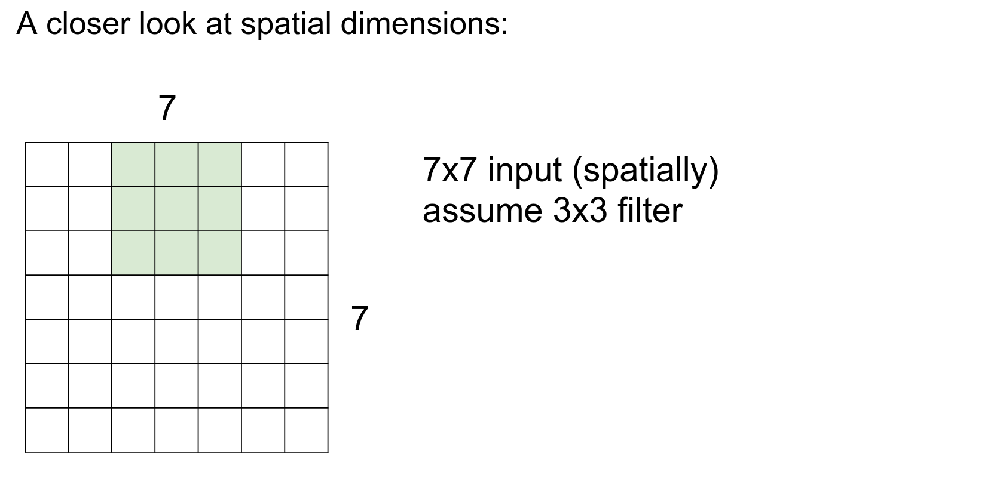

Part of [CS231n Winter 2016](../index.md)

---
# From Andrej Karpathy ⛵

Going strong!

---

2 weeks to go, on the Assignment 2.

Project Proposal ? [About Project](http://cs231n.stanford.edu/project.html)

The 4 step process is still there.

How did we update parameters?

Dropout is just casually dropped by Geoffrey Hinton.

LeNet is the classic.

Hubel and Wiesel.

Featural hierarchy.

We start with an image $32x32x3$ CIFAR-10 image. 

3 Channels, the volume of activations is 3 deep. This is just 3rd dimension of a volume.

**Convolutional Layer** a core building block. 

A filter With 3 depth, we will cover the full depth of the input volume. But $5x5$ -> spatially small.

We always extend the full depth of the input volume.

We will learn $w$. We are going to slide the filter on input volume.

As we slide, we are making 75 dimensional dot product.

This sliding will result in an **activation map.** 
## why activation map is smaller ? 

Because we are starting from index 0 to 4 on the input image, we can put the filter on 28x28 distinct locations.

We will actually have a filter bank. Different filter will result in different activation maps.

6 filters will result 6 activation maps.

## a new image, smaller sized! 😮

After all the convolutions, we will have an new image that is sized $28x28x6$ ! 

We will have these convolutional layers, they will have some number of filters. And these filters will have some special extend (5x5). This conv layer will slide on input and result the new image. This will be followed by ReLu and other conv layer.

The filters now have to be $5x5x6$. 
### Always match the input depth!

These filters are initialized randomly. They will become our parameters in out ConvNet.

When you look at the trained layer, first layers are low level features, color pieces, edges pieces and blobs. 

First layers will be looking for these things in the input image as we convolve through.

As you go deeper, we are performing conv on top of conv, it will be doing dot product over the outputs of the first conv layer.

It will be putting together all the color / edge pieces, and making larger and larger pieces out of it, which the neurons will be excited about.

For example, mid level will be looking for circles.

And in the end, we will be building all of the object templates, high level feature.

In the left most picture, these are raw weights ($5x5x3$ array).

In the middle and in the left, these are just visualizations that those layers are responding to, in the original image.

This is pretty similar to Hubel and Wiesel imagined. A bar of a specific orientation -> more complex features.

Small piece of a car, as an input. 

32 filters of 5 by 5 in the first convolutional layer.

Down below is the example activation maps. ==White== corresponds to high activation, ==black== corresponds to low activations, low numbers. 

In the blue arrow there is an orange stuff in the image, so the activation will show that the filter is happy about that part.

A layout like this. 
## 3 core building blocks. - `conv` - `relu` - `pool` 

Also, Fully connected layer in the end.

Every row is a activation map. Every column is an operation.
## ReLU is non linearity - thresholding ? 

Image feeds into left side, we do convolution, thresholding (ReLU) - we do another Conv, we do ReLU, we do pooling..

Piece by piece we are making this 3D volumes of higher and higher abstraction. We end up with a volume, connected to a large FC layer.

Last matrix multiply will get us the class scores.

## how do we decide the number of filters? 🤔

Only concerned about spatial dimensions at this point.

One at a time.

One at a time.

One at a time.

One at a time.

We can do a stride 2 - which is a hyperparameter.

We moved two at a time.

We are done in less steps!

Can we do stride 3?

Yeah, we cannot.

This simple formula will give you possible selections. The formula should always give integer. 

We can pad! Padding is also a hyperparameter!

If we pad with 1, we can get the same sized output.
## Sizes are preserved spatially 🌉

### We might have bigger filters! In practice, pad with $(F-1)/2$.

If we do not pad, the size will shrink! We do not want that, we will have a lot of layers.

10 filters with $5x5x3$ shape.

Padding is correct, so the spatial size will not change. 

10 filters will generate 10 different activation maps.

Output is : $32x32x10$ shaped.

Parameters?

Each filter has $5*5*3$ parameters, and a single bias. So the result will be $$10 * 76 = 760$$

Here is the summary so far:

## 4 hyperparameters for filters:
- Number of filters
- the spatial extent of the filters
- the stride
- number of zero padding

We can compute the size of the activation output with the formula. The depth will be the number of filters. $F$ is usually odd.

Total number of parameters will depend on input depth, filters size and bias.

K is usually chosen as a powers of 2, for computational reasons. Some libraries go into special subroutines when the see powers of 2.

We can use $1x1$ convolutions. You are still doing a lot of computation, you are just not merging information spatially.
## why not pad something other than 0? You want to ignore that part.

### Are we always working with squares? - We always resize to squares.

We will see how to work with non rectangular images.

## kernel and filter interchangeable 🎋

API of `SpatialConvolution` in Torch. 
- Input plane is the depth of input layer.
- Output plane is how many filters you have
- kw - kH - kernel width 
- dW - dH - step means stride
- pad - what padding you want.

Same in `Caffe`.

Same in `Lasagne`.
## Let's go into brain view now. 🧠

With This filter, We end up with 1 number in a convolution.

Output of the filter at this position is just a neuron that is fixed in space, and it happens to be looking to a small part of the input, and it is computing $w^T*x + b$ 
 
It has no connections to the other parts of the image, so local connectivity. 

We sometimes say neurons receptive field - as the same size of filter (region of the input the filter is looking at).

In a single activation map, 28x28 grid, these neurons share parameters (because one filter is computing all the outputs) so all the neurons have the same weight $w$
## They have shared weights spatially and local connectivity. 🍒

We have several filters, so ==spatially they are sharing weights==, but across ==depth== these are all different neurons.

Nice advantage of both local connectivity and parameter spatial sharing is that, that is basically controlling the capacity of the model.

It makes sense that neurons would want compute similar things, say they are looking for edges, you might imagine that a vertical edge in the middle of an image is just as useful anywhere else spatially.

It makes sense, as a way of controlling overfitting to share those parameters spatially.

We covered conv and ReLU layers.
## Now the pooling layer 📏 - squishing

The Conv layer will not shrink the spatial size.

The spatial shrinking is done by pooling.
## why ??

The most common is max polling.

Reduction of half on all activation maps. Average pooling will not work as well.

We need to know the filter size and stride. $2x2$ with stride $2$ is common.

The depth of the volume does not change.
## Fully Connected layer ? 

3 pooling layer, $2x2$  stride 2. We started by 32, 16, 8, 4

At the end we have $4x4x10$ volume of activations after last pooling.

That goes into the Fully Connected layer.
## Demo time! 🐤

Website [here](https://cs.stanford.edu/people/karpathy/convnetjs/demo/cifar10.html). 80 percent accuracy for CIFAR-10 on Javascript! 

6 OR 7 nested loops. V8 engine in Chrome is good, so JS is fast.

All running in the browser.

---
#### Why is that we are stacking layers? 🤔 Because we want to do dot product, because we can back propagate on them efficiently.

#### If you are working with image batches, all the volume between Convnet's are 4D arrays. If single image, 3D arrays.

#### Intermediate filters are not properly visualized. Yann LeCun did what the neurons are responding to. 

#### How does pooling make sense we are losing the image??? When you do pooling, you are throwing away a bit of spatial information. Because you want to eventually get the scores out.

#### Because of padding, the statistics of border is different than center, we do not worry about it.

---
## Anything you can back propagate through, you can put in a ConvNet / Neural Net.

## All case studies coming up 💎:

## LeNet-5

Figure from paper. 6 filters all $5x5$ sub-sampling (max pooling).

## AlexNet - 60 Million Parameters

Won the ImageNet. 

Input is big. 

Two separate streams ? Alex had to split the convolutions on 2 seperate GPU's.

Let's imagine if it had single stream. 

Output volume will be: $55x55x96$ 🐦 Because we have 96 kernels/filters.

Total parameters: every filter is $11x11x3$ x 96 roughly.
## We are not even sure what Alex did.  😅

The input on image is $224x224$, but for the math to add up the input should be $227x227$.

After pooling ? half of spatial size so - $27x27x96$

How many parameters in the pooling layer?

0 - only Conv layers have parameters.

Summarization:

Full architecture:

This is a classic sandwich. Sometimes filter sizes change. We back propagate through all of this.

First use of ReLU, used normalization layers (not used anymore), used dropout only on the last fully connected layers, 7 ensemble -> just train more models LOL.
## ZFNet - 2013 Winner - Founded a company later - Clarifai

Built on top of AlexNet.

$11x11$ stride 4 was too drastic, so they changed to $7x7$ filters.

They used more filters in Conv 3- 4 -5.

Error become %14.8, the writer of this paper found a company called Clarify and reported %11 error.
## what does top-5 error mean ? there are 1000 classes, we are giving 5 chances to the classifier to guess. 😌

## VGGNet - 140 Million Parameters - Used as a default, simple arch

They have different types of architectures. They decided they will use a single set of filters, the question is:
## How many tho ? 

Turns out, 16 layer performed the best. They dropped error to 7.3%

This is all of the architecture:
### Spatially the volumes get smaller, number of filters are increasing 💚

### The memory?

If we add up all the numbers, 24 M if we are using floating points float32 - 93 MB of memory - intermediate activation volumes per image.

That is just maintained on memory because we need it on backpropogation. 

Just to represent 1 image, it takes 93 MB of RAM ONLY for FORWARD pass - for backward pass we also need the gradients - which we will end up with 200 MB of footprint.
### Total number of parameters is 138 Million. 

### Most memory is in early Conv, most parameters are in late FC. 

We found that this huge parametered Fully Connected layers are not necessary. 
### We can do average pooling!  😮

Instead of FC'ing on $7x7x512$ you can average on $7x7$ and make it a single $1x1x512$ , which works just as well.
## GoogleNet 🍉 - Only 5 Million Parameters

Key innovation here was, **Inception** module. Instead of using Direct Convolutions, they used inception modules.

A sequence of inception modules are in GoogleNet. You can read the paper.

It win 2014 challenge with 6.7%. 
 

At the very end they had $7x7x1024$ and they did an average pool!

That means Much less parameters!

## ResNet - 2015 Kaiming He - They won bunch of competitions.

Here is what the history looks like.

More layers.

You have to be careful how you increase the number of layers,
## Plain Nets 🆚 ResNets ?

56 layer performs worst than 44 layer, what ?

In ResNets, number of layers will always result of better results.

## At Runtime, it is actually faster than a VGGnet  - how ??

This is a plain net down below:

We will have skip connections.

You take a $224x224$ image, you pool by a huge factor, spatially working on $56x56$, still really good.
## Depth at the cost of spatial resolution, very early on. Because depth is to their advantage.

In a plain net, you have some function $f(x)$ you are trying to compute, you would transform your representation, you have a weight layer, you threshold it and so on..

In a ResNet, your input flows in, but instead of computing how you transfer your input into $f(x)$, you are computing what to add to your input to transform it into $F(x)$.

Computing a delta on top of your original representation instead of a new representation right away, which will be discarding the original information about original X.
## THIS IS LIKE DELTA MODULATION.

> In analogy, you can think of delta modulation as encoding the difference between successive samples (input and output), somewhat akin to how the ResNet architecture focuses on learning the residual (difference) between input and output to improve learning efficiency. Both methods leverage this residual information for better representation or reconstruction.

You are computing just these delta's to these x's. 

If you think about the gradient flow, in a ResNet, when a gradient comes, it is doing addition (remember the addition is just doing distribution of gradient to all of it's children) the gradient will flow to top, skipping over the straight part.

You can train, right away really close to the image, to the first Conv Layer.

These are the commonly used hyperparameters.
- Batch norm layers will allow you to get away with a bigger learning rate.

Using $1x1$ Convs in clever ways.

This is the whole architecture, Andrej skipped it in the interest of time.

This was in the Cover of AlphaGo.

This was a convolutional network!

The input is $19x19x48$ because they are using 48 different features on specifics on rules of GO. You can kinda understand what is going on when you read the paper.

Other GO Deep-learning player: https://www.remi-coulom.fr/CrazyStone/

- Trend is to get rid of Pooling and Fully Connected Layers.
- Smaller filters and deeper architectures.

Done!
