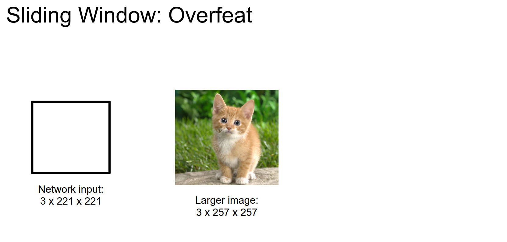
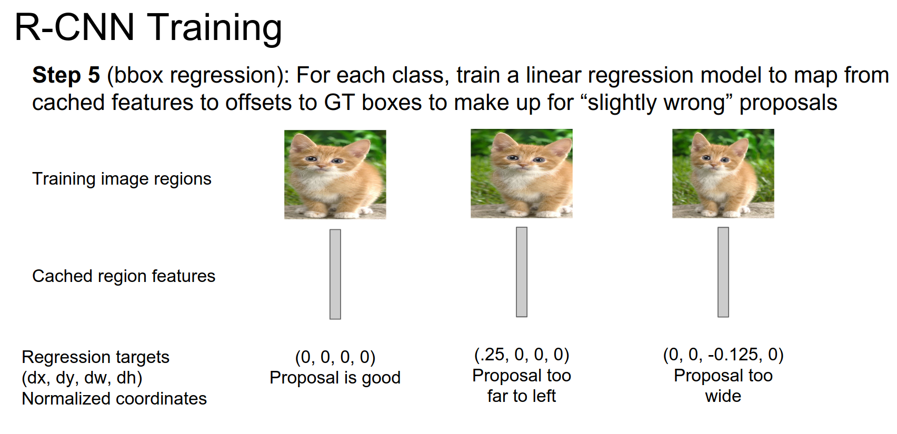
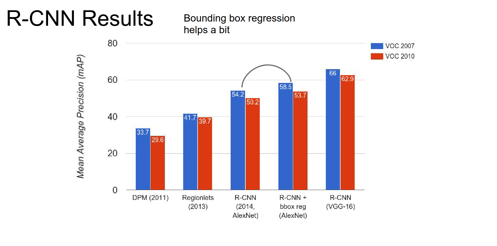

Part of [CS231n Winter 2016](../index.md)

---
# From Justin Johnson

Let's give him the benefit of the doubt.

---
# Spatial Localization and Detection

We will give Andrej a little bit of break.

Assignment 2 - Due on Friday. Midterm coming up.

We talked about Convolutional Networks. Lower level features early (low levels), high level features deeper (higher layers).

We saw pooling for shrinking spatially.

We saw bunch of networks and how they are implemented.

We saw ResNet and how it changed the game.

## Localization and Detection is also possible.

Another big problem we have.

Where exactly is the class - localization. Detection is for bounding boxes, instance segmentation is contours around.

Do both at the same time.

ImageNet also has this as a challenge.

Class should be correct, and IoU should be over $0.5$.

We can see localization as a regression problem. We are generating 4 numbers.

This is a simple recipe. AlexNet, VGG, download a pretrained model. 

Take those fully connected layers that gives us class scores, set them aside.

Attach new FC layers to some point in the network. The regression head. Basically the same thing. A couple of FC layers outputting some real valued numbers.

We train this just like how we trained classification network. 
## Instead of class scores and GT classes, we use L2 loss and GT boxes.

We train this network exactly the same way.

At test time we use both heads to do classification and localization. We have an image we have trained the classification head, we have trained the localization heads, we pass it through, we get class scores, we get boxes, we are done!

One detail, 2 main ways to regression.

Just 4 numbers or One bounding box per class is also possible.

Maybe after last convolutional layer. / Or attach after last Fully Connected layer.

You could just attach it to anywhere?

We are also interested in localizing multiple objects.

This is used in human pose estimation. 

There is a fixed number of joints in a human. What is the pose of the person? 

We can find all the joints, run it  through CNN, find all points for joints $(x,y)$ that gives us a way to find the current pose of the human.

Overall this idea of localization as regression for a fixed number of objects is simple.

This will work. But if you want to win competitions, you need to add a little bit fancy stuff.

You still have this dual headed network, you will combine predictions.

Classification head is giving us class scores. Regression head is giving us bounding boxes.

## We can run this in larger images. 🎈

If we run the window on the only upper right corner on the image, we will get a class score and bounding box. We will repeat this on 4 corners.

Corner top right:

Corner bottom left:

Corner bottom right:

## we will get 4 bounding boxes after all of that.

We only want a single bounding box. Greedily merge boxes (details in paper).

In practice they used many more than 4 corners. Figure from paper down below. 

They finally decide at the best.

It is pretty expensive to run the network on all crops. 

We think about networks, convolutions and Fully connected layers.

## We can convert FC layers into convolutional layers.  🤔

Now our network is only convolutions, pooling and element wise operations. Now we can run the network, on different sized images.

This will give us an cheap approximation of running the network on different locations.

We previously had 4096 FC, but we now has $1x1$ convolutional layers.

Now if we are working on $14x14$ input in training time, no FC we have $1x1x496$ convs.

We can share computation in this way. Only extra computation is made in yellow parts.

## overfeat ?  🪟

OverFeat uses a different architecture compared to traditional Convolutional Neural Networks (CNNs) by eliminating fully connected layers. Instead, it uses convolutional layers directly connected to the input image. This design choice allows OverFeat to process images of different sizes without the need for resizing or cropping.

By eliminating fully connected layers, OverFeat reduces the number of parameters in the model and avoids the computational overhead associated with processing high-dimensional feature vectors. This design simplifies the model and makes it more efficient, especially for tasks like object detection where processing speed is critical.

The point here isn't really "re-imagining" the FC layer as a convolution step.  Instead, it lets you take advantage of efficiencies built into Convolution Operation implementations that aren't present in FC implementations.

Imagine a convolution operation in 1 dimension.  Let's say you're kernel is 5 numbers.  In step 0, I add A+B+C+D+E = A + (B + C + D + E).  That cost me 4 add ops.  In step 1, I want to add B+C+D+E+F.  I can use my cached value and calculate it with (cached_value) + F.  Which only cost me 1 add op.  Efficiencies like this can be scaled to implementations of the convolution operator.  However, FC layers operate over the whole input and have no logical place for such caching.

In Overfeat, we're running these operations on "windows" of the input image.  Each window is a lot like a patch of input to a convolutional layer.  By transforming the last FC layers into convolution operations, we can treat the whole network as a series of convolution operations and then take advantage of the inherent efficiencies (described above) of convolution operations.

In classification + localization problem, 2013 won with ==overfeat== method.

VGG used deeper network, and it improved the results.

ResNet crushed competition. - They used a different localization method - RPN's.

Now we move on.

### Object detection! 🐱 🐶

Can we use regression here too?

2 classes.

n cats - $nx4$ cats.

We need something different because we have variable sized outputs.

You have 2 blades, you have regression and classification. Regression did not work, try classification.

Found a cat here!

Nothing here. 

So what we do is to try out different image regions, run a classifier on each one and this will solve the variable sized output problem.
### Just try them all. That will be expensive.

Detection is really old problem in Computer Vision. Which is solved by HoG in 2005 for pedestrians.

Do linear classifiers, they are fast. 
Run Linear Classifier at every scale at every position.

- Compute HoG of all image at multiple resolutions.
- Score every sub-window of the feature pyramid.
- Apply non-maxima suppression.

People took this idea and worked on it. One of the most important paradigms before deep learning was:
### Deformable Parts Model ? 

We still are working on HoG features but our model instead of a simple linear classifier, we have linear template for objects and that vary over spatial decisions which will form a little bit.

Latent SVM is in this. 

It is more powerful classifier. Still works really fast. We still run it on everywhere every scale. 

These are just Conv Nets LOL.
### Histogram is kinda like pooling, edges is like CNN

We still have a problem.

We use expensive classifier on certain regions!
## Region Proposals. 🤹

They do not care about classes, they are looking for blob like structures. They just run FAST.

Most famous one is called: Selective Search:

Here is more information about [selective search](https://learnopencv.com/selective-search-for-object-detection-cpp-python/). Here is a [Python Package](https://github.com/ChenjieXu/selective_search) for it.

You start from pixels, you merge adjacent pixels, together if they had similar color and texture, and you form connected blob like features.

After that you can convert these regions into boxes. You end up with bottom right.

A lot of different proposal methods.
#### Tip: Just use `EdgeBoxes` if you have to choose one.

---
## Tangent - Does ==YOLO== have region proposals? - NO

YOLO (You Only Look Once) does not utilize region proposals like some other object detection algorithms such as Faster R-CNN or R-CNN. Instead, YOLO performs object detection by dividing the input image into a grid of cells and predicting bounding boxes and class probabilities directly from each grid cell.

Here's a brief overview of how YOLO works:

- **Grid Division**: YOLO divides the input image into a grid of cells. Each cell is responsible for predicting bounding boxes and class probabilities for the objects contained within it.
- **Bounding Box Prediction**: For each grid cell, YOLO predicts bounding boxes. Each bounding box is represented by a set of parameters: (x, y) coordinates of the box's center relative to the grid cell, width, height, and confidence score. The confidence score indicates how likely the bounding box contains an object and how accurate the box is.
- **Class Prediction**: Along with each bounding box, YOLO predicts class probabilities for the objects present in the bounding box. This is done using softmax activation to estimate the probability of each class for each bounding box.
- **Non-Maximum Suppression (NMS)**: After obtaining bounding boxes and their associated class probabilities, YOLO applies non-maximum suppression to remove redundant or overlapping bounding boxes. This ensures that each object is detected only once with the most confident bounding box.

By directly predicting bounding boxes and class probabilities from grid cells without the need for region proposals, YOLO achieves real-time object detection capabilities. This approach allows YOLO to detect objects efficiently in a single forward pass of the neural network.

---

Let's put all of them together.

- We have an input image
- WE will run a region proposal methods - get 2000 boxes
- Crop and wrap that image region to some fixes size
- Run it through CNN
- CNN will have regression head - 

Training is a bit complicated.

Download pretrained classification model.

We need to add couple of layers in the end.

We are using positive - negative regions from detection images. Initialize a new layer and train again.

We want to cache all these features to disk. For every image in your dataset, you run selective search, you extract the regions, you warp them, you run it through CNN 

AND 

You cache the features it to disk. 
## LOL - 200GB Disk what? For PASCAL only.

We want to train SVM's to be able to classify different classes based on the features.

- You have these image regions
- You have features for those regions
- You divide them into positive and negative samples for each class
- You train binary SVM's

You do this for every class in your datasets.

### bbox regression

Your region proposals are not perfect. You might want to make a corrections.

In the middle, the proposal too far to the left, you need to regress to this correctness vector.

They just do linear regression, you have features and targets you just train linear regression.

3 datasets are used in practice.

Imagenet has a lot of different images. One object per image.

COCO - a lot more objects per image.

`mAP` is the main metric on detection.

PASCAL dataset, 2 different versions. Publicly available so easier to use.
### Feature Extractor 🍒

Pre CNN - post CNN is a big improvement.

R-CNN have different results for Alexnet - bbox reg + AlexNet  - VGG-16.

Features from deeper network helps a lot.

R-CNN is pretty slow at test time.

Our SVM and regression is trained offline. CNN did not had a chance to update.

Complex multistage training pipeline.

## Fast R-CNN - swap!

- We are just going to swap the order of running a CNN and extracting regions.

Pipeline at testtime:

- Take the high res image
- Run CNN - get high high resolution Convolutional feature map
- We will extract directly region proposals from this convolutional feature map - using ROI pooling
- The convolutional features will be head to the fully connected layers and classsification and regression heads.

### Slved slowness - sharing computation of convolution layers between

### Messy training pipeline - we have a simple one!

### ROI - Region of Interest Pooling 🤔

We have the input image on high resolution, we have this region proposal that is coming out of selective search or `edgeboxes`.

We can put this image through convolution and pooling layers fine, those are scale invarient.

**Problem** - FC layers are expecting low res conv features.

Given a region proposal, We are going to project onto spatial part of that convolution feature volume.

We will divide that feature volume into a grid.

We do max pooling.

We have taken this region proposal we shared convolutional features, we extracted fixed sized output for that region proposal.
### TIP: swapping the order of convolution and wrapping and cropping.

We can backpropogate from these regions of interests.
## Now we can train this thing in a joint way!

Much faster! 🐍

Test time is huge improvements.

Not a huge improvement in performance. But solid.

### Now the Fast R-CNN is so good that the bottleneck is computing region proposals.

This is still not Real Time.
## Faster R-CNN: why not use Convolutions for Region Proposals?

Instead of using some external method, use a network
## Region Proposals Network

RPN is trained for region proposal, look at the last layer convolutional features and produce region proposals from convolutional feature map.

After, run just like Fast R-CNN.

How does it work?

We receive as input convolutional feature map, coming out of last layer, RPN is a CNN.
## typo here, we have $3x3$ convolutions.

Sliding window is a convolution. 
- We are doing classification. Is there an object ?
- Regression. Regress from this position to an actual region proposal.

Position of sliding window relative to the feature map tells us where we are in the image.

Regression outputs give us corrections on top of the position on feature map.

A little more complicated than that.
## They had anchor boxes. - RPN

Taking different sized and shaped anchor boxes and pasting them in the original image at the point of the image corresponding to this point in the feature map.

Every anchor box is associated with a score and a bounding box.

In the original paper, training ugly. Since then they had some unpublished work where they train this jointly. 

They have one big network, in RPN they have BB regressions, they have classification loss, they do ROI pooling and do Fast-R-CNN: 

- we will get classification loss on which class it is, we have regression loss to correction on top of region proposal
## 4 Losses! 🐦 🐦 🐦 🐦

### Why not run convolutions on where we want? That is simply external region proposal tactic. We are better of making them with convolutions too because they became the bottleneck.

RPN is a computational saving.

Now we can do object detection all at once. We are not bottle-necked anymore.

0.2 is pretty cool.

This is the best object detector in the world.
### 101 ResNet and Faster R-CNN

Fancy stuff for competition: 

- Box refinement: They do multiple steps for refining the bbox. You saw in the Fast R-CNN framework you are doing that correction on top of your Region Proposal, you can feed that back into the network to re-classify and re-get another prediction.

- Context: IN addition to classifying just the image, they get a vector for that gives you whole features on the entire image.

- Multi-scale testing: Kinda like overfeat, they run the thing on different sized images.

2013 Deep Learning Detection methods entered the arena.

After 2014, it is all about Deep Learning.

### A fun THING - YOLO

Pose the detection problem directly as a regression problem.

- Divide image to grids.
- Predict B bbox - single score for that bbox.
- Now detection is a regression.

It is incredibly fast, but performance is down.

R-CNN too slow.
Fast R-CNN requires Matlab.
Faster R-CNN might be good.
YOLO is solid.

In localization we are trying to find fixed number of objects. Much simpler than detection. L2 regression from CNN features to box coordinates. 

Overfeat: Regression + efficient sliding window with Fully Connected Layer -> Convolution conversation.

Detection, we are trying to find varying number of objects. Before CNN's we used different features and sliding window. That was costly.

We went from R-CNN to Fast R-CNN to Faster R-CNN

Deeper better, with ResNet's.

Done !
