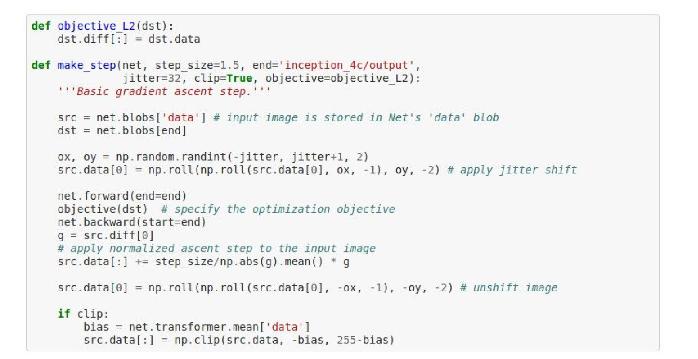
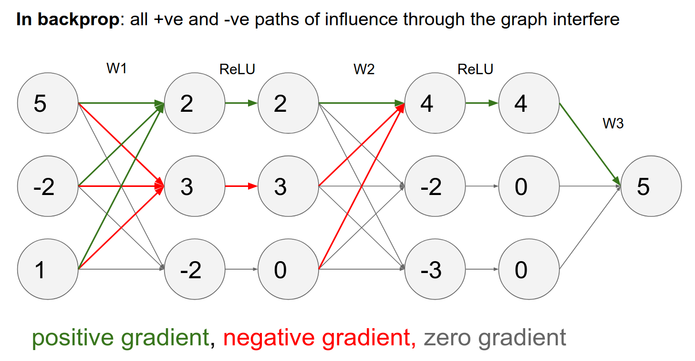

 Part of [CS231n Winter 2016](../index.md)

---
# Andrej Karpathy is Back Baby! 🥰

---
# Understanding ConvNet's 🤨

One of the favorites of Andrej to give.

`A2` is almost running out. Midterm is next week. They just dropped the winning weights.

Wide variety of application domains for CNN's.

We saw how Conv Nets work. We saw all the basics.

A lot of different Computer Vision Tasks. We looked at R-CNN, Fast R-CNN, Faster R-CNN and YOLO. 

Multiple heads on top of a Conv Net, so some heads are doing classification and some heads are doing regression. They are all trying to solve the problem at hand.

## This lecture is mostly about - Understanding ConvNet's 🤔

We will go over all of these bullet points, hopefully.

Might be simplest way to understand what ConvNet is doing, is looking to the raw activations of a ConvNet.

In a CNN we pass image into bottom, we will get activation volumes in between.

We can select a random Neuron - on say pool 5 - layer, we can pipe a lot of images into ConvNet and see what excites that neuron the most.

Some of them likes dogs, some of them likes flags. Some of them like text, some of them like lights.
### Another way to understand ConvNet's is to look at weights.

On first layer, we can visualize the weights. In the first layer of convolution we have a filter bank that we slide over the image, so we can visualize raw filter weights.

When we do not have weights touching to image, it does not really make sense. It only makes sense in 1st layer.

You can still do it. Doesn't make as much sense though.

Pretty much anything you throw at an image where you try to learn a feature, with different algorithms you can almost always achieve these gabor like features. The inverse is hard to do for the first layer actually. The example Andrej gave is PCA's, they do not give gabor like stuff, they give sinusoidals.

### Another way to study ConvNet's is more global representation view.

We looked at filters, we looked at the weights.

Another way to look at it we can take a lot of images through ConvNet, we can look at the ==FC-7 Features.==

$406$ numbers just before the classifier. So these numbers are summarizing the content of the image. These are codes, we can use them:

## t-SNE visualization - Important Tool for your Toolkit

You give it a collection of high dimensional vectors, it finds an embedding in 2D. Such that points that are nearby in the original space is nearby in the embedding.

It does that in clever way that gives us really nice looking pictures.

Down below you can see the embeddings for MNIST:

### Whatever is close in the visualization is close in the mind of the network. 🍉

Here is [the link](https://cs.stanford.edu/people/karpathy/cnnembed/), here is the full image down below. All the boats are close, all the spaghetti is close. All the dogs, animals.

This is what ConvNet's consider similar.
### Occlusion experiments are also might be useful to get meaning. 🐔

_Visualizing and Understanding Convolutional Networks" by Matthew D. Zeiler and Rob Fergus_, published in 2013.

The main idea behind occlusion experiments is to understand which parts of an input image are crucial for a CNN's decision-making process. This is achieved by systematically occluding (covering) different parts of the input image and observing how the network's output changes as a result.

 - A patch of zeros, occluder, (in grey). 
 - we will slide it on image
 - as we do that we are looking at the probability of the class and how it varies as a function of the spatial location of that occluder.

We would like to have the probability go down when we cover up the dog maybe. That is basically what happens.

We are going to get a kind of heat map from this.

Same for the dog and the car wheel. 

In the last picture, interestingly, when you cover the person on the left. the probability goes up!

Because the ConvNet is not sure that there is an class in there or not. When you remove it, ConvNet becomes more sure.

## DeepVis toolbox ?

Jason Yosinski! Running ConvNet in the real time, you can summon your camera feed and play with the ConvNet to see all the activations.

2 Methods:

- De-Convolution
- Optimization Based

Watching [the video](https://www.youtube.com/watch?v=AgkfIQ4IGaM)!

Neural Networks are really good at classification, thanks to Convolutional Neural Networks. 

**Conv Layer 1** - Light to dark or dark to right, different layers like different stuff. Some layers like head and shoulders, and ignores the rest of the body.

Some layers are activating when seen cats. Some are activating on non smooth (wrinkle) clothes (not clothing itself). Some just like texts.

You can investigate and debug Conv Nets in read time.
### *2 approaches* - 1) Deconv Approach

How would you compute the gradient of any neuron wrt image?

Normally we have a computational graph and we pass the image through and get a loss in the end, we start with $1.00$ in our computational graph because the gradient of loss with respect to loss is 1.

We want to backpropopogate backwards and find the influence of all the inputs on that output.
### How would you do it now, if you wanted a specific unit in the ConvNet and find the gradient for it? 🤨

- We forward until some layer. 
- We have activations for that layer.
- We are interested in some specific neuron.
- We will 0 out all the gradients in that layer except for the neurons gradient - which we are interested in - we'll set that neurons gradient to $1.00$.
- Run backward from that point on, back propagate.
- When you back propagate to the image you will find the gradient of the image with respect to any arbitrary neuron by playing with the gradients.

You will find something like this.

Deconv approach will change the backward pass a bit, not really clear.
### So we'll use guided back propagation!

Much cleaner images, with the cat's face.

This is a figure from paper:

Image goes through layers, we get an activation map any some place.

We 0 out all the gradients except the one we are interested in.

To get your Deconv to give you nice images, we will be running back propagation but we will change the backprop in the **ReLU** layer!

You can see in ==c)== we have the activation, just like we described.

If your input was negative, you will block the gradient in the backward pass, as a ReLU.

In guided back propagation, we will change the backward ReLu in the following way:

We are computing what we had before but in addition we had this additional term, which says we only back propagate through our ReLU neurons, only the parts that the ReLU neurons that have positive gradient.

Normally we would pass any gradients that corresponds to the ReLU neuron which had less than zero input. Now in addition to that we will block out all the gradients that corresponds to negative gradients.
### But what is this mean?

- We are trying to compute the influence from the input on some arbitrary neuron on the Conv Net.
- A negative gradient means that, that ReLU neuron has a negative influence on this neuron that we are trying to find what activates it highly.
- Doing that, we only end up passing through gradients that ==entirely positive influence== on the activations.
### In normal back propagation, the gradient signal is really just Neurons communicating to each other what should increase or decrease, they are fighting each other and adding up.

The reason we get weird images like in the one with the cat, some of them are positive and some of them are negative from every single pixel to the neuron we are trying to see what activates it.

In ==guided back propagation== we only use positive influences. Only the positive gradients from the ReLU.

You will get much cleaner images.

Another approach is `DeconvNet`:

- It ignores the ReLU gradient
- Just pass through positive gradient, it does not care the activations coming to the ReLU is positive or negative.
- It works well.

Similar idea to guided back propagation.

From Layer 3 on forward, you see shapes.

In third row, 3 column, you are seeing human face as red. This means, this gradient is telling you if you made this persons face more red, that would have a locally positive effect on this neurons activation.

Layer 4 is starting to form objects.

Andrej is not a big fan of DeConv approach. You will get pretty images, but yeah.
### *2 approaches* - 2) Optimization to Image

We will do a bit more work compared to DeConv route.

We are going to try to ==optimize the image==, and keep the Convolutional Neural Network fixed.

We are going to try to maximize an arbitrary score in the ConvNet.

We are trying to find an image $I$ such that your score is maximized and there is some regularization and $I$ 

- L2 Regularization - Discourages some of the pieces of your input might be way too large.

We will start out from a Zero Image. We will feed it into a Conv Net. 

In terms of gradient at that point, we set the gradient at that point to be all 0's expect for a 1 that we are interested in.

This is just normal back propagation.

We will do forward, we do backward, we do updates.

Iterate this over an over and do optimization on the image.

### Goose everywhere! 10 goeses are more likely goose. 🥰

Another way of interpreting the gradient signal at the image is the paper as follows:
### Area of Influence in the Image

They forward the image (the dog) they set the gradient to be 1 and do back propagation. 

You arrive at your image gradient and they squish it through channels with a $max$

What would you expect?

In the black parts of the image, if you wiggle a black pixel, the score for that image does not change at all. Conv Net does not care about it.

So the gradient signal can be used (in a **grabcut** segmentation) as a measure of area of influence on the input image.

You can crop of images just based on the gradient signal. 

Seems suspicious. -> Cherry picked examples..

We were maximizing the full score and optimizing the image. We can do this for any arbitrary neuron.

This penalty L2 we have been using so far. Is there a better way for this?

- Ignore the penalty
- Do forward and backward
- Blur the Image a bit (this prevents the image of accumulating high frequencies )
- This blurring will help you for cleaner visualizations for classes.

This looks a bit better. 4 different results with 4 different initialization.

You can go down layers to see.

In Layer 5 there is some part of an ocean.

These just come out of the optimization. What these neurons are really like to see.
### Effective Receptive Field ?

In a first layer for VGG is just $3x3$ as you go down, the effective layer field gets bigger. So you see neurons that are the functions of entire image.
### How much information in these codes?

Can you invert the image with just **the code**.

- We are given a particular feature
- We want find an image, to best match that code

Instead of maximizing any arbitrary feature we just want to have a specific feature and we just want to exactly match it in every single dimension.

When you run the optimization, you will get something like this.

You can do reconstruction at any place in the Conv Net. Down below is even better than our first example.

The bird location is pretty accurate, so this is proof that the code is rich in information.

You can also look at single image and see how much information is thrown away as you move forward.

You can compare reconstruction at different layers. When you are very close to the image you can do a very good job of reconstruction.

A flamingo example:

You can get really funky images, as you are trying to optimize image. 100 line code one python notebook.

This is based on a inception network. We choose the layer we want to dream at.

`make_step` will be called repeatedly.

We do forward the network, we call the objective on the layer we want to dream at, we do backward.

You have a Conv Net you pass the Image through to some layer, where you want to dream, the gradients at that point becomes ==exactly identical== to the activations at that point than you back prop to the Image.

There are so many features that really care about Dogs because there is so many of them in training data for the ImageNet, large portion of Conv Net features really like dogs.

We want to boost what we know. If a cloud resembles a dog, so the image will be refined to be more dog like.

Funky things.

If you deep dream lower, the features are more like edges and shapes.

Funny videos.

### Neural Style 🧹

You can take a picture of something in a different style.

This is achieved ==Optimization on the raw image with Conv Nets==.

Examples.

We have content and style image.

We will pass content image in the Conv Net. Hold the activations as it represents the content.

We will take the style image, pass it through the Conv Net. 

Instead of keeping track of the raw activations, the paper authors found that the style was not in the raw activations but in their pairwise statistics.

We got a $224x224x64$ activation at Conv1 Layer. We want some fibers from it. $64x64$ (gram martices) is what we want.
##### How often each pair of features fire together?

We will do this on every Conv layer.

- We want to match the content (all the actual activations from content) in style (the gram matrices)
- These 2 guys are fighting it out. 
- In practice we run content in Layer 5 (a single layer) and a lot more style.

This is best optimized with L-BFGS, we do not have a huge dataset, everything fits in memory, the second order stuff (instead of Adam, Adagrad)works really well here.

---
### can we fool ConvNets?

We saw all the optimizations on Image.

You can make a school bus, or anything into an ostrich. 

We will get the gradient on that image for making for the Ostrich class.

We forward the Image. we set all gradients to 0 except for the class we want (ostrich) we do a backward pass, we will get a gradient of what to change in the image to make that more like an Ostrich.

Distortion is you need is really small. You can turn anything into anything.

You can start from random noise.

You can use weird geometric shapes.

This is not really new, this happened before.

HOG representation is identical but images are so different than each other.

### Adversarial Examples - Arbitrary things happen outside of your manifold - the `shadows` 😮

Images are super high dimensional objects. 150000 dimensional space.

Real images that we train on, they have a special statistical structure and they constrained to a tiny manifolds in that space.

We train Conv Nets on these. These Conv Nets work really well on these on that tiny manifold,  where the statistics of images are actually image like.

We are putting these linear functions on top of it, we only know a little part, there are a lot of shadows.

Let's just work with a logistic regression.

$x$ is 10 dimensional. $w$ is multi dimensional vector and $b$ is bias.

We are putting that in trough a sigmoid. We are interpreting the output of that sigmoid probability as the input $x$ is of class 1.

We are computing the score with this classifier. The input is a class $1$ if the score is greater than 0 or equivalent or sigmoid output is greater than $0.5$.

No bias, example:

Just dot product of the vectors. This setting of weights, this classifier thinks %95 class 0.

### Adversarial X 😮 - `really tiny changes`

We want to slightly modify the x and ==confuse the classifier==.

We want to make really tiny changes. In every single column we can do this.

All the changes added up together.

We blown out the probability. This was just a small number of input. 

In images -> We can nudge 150528 in really small way, we can do any class we want.

---

We can do this in linear classifiers (has nothing to do with deep learning or Conv Nets).

We can make templates for all datasets.

We can make mix a bit of Goldfish weights, %100 goldfish LOL.

We can do this with original images altered too.

We can make a goldfish a daisy.

This has nothing to do with ConvNets or Deep Learning.

We can do this in any other modality, speech recognition too.

To prevent this, you can train the ConvNet with part of the image or augmented to make it a little stronger.

You can try to train the ConvNet with training data and adversarial examples (as negative scores) but you can always find new adversarial examples.

You can change the classifier and this kinda works but now your classifiers do not really work as it used to.
### Why is this a big problem? Because these may inherit.

We saw that backpropping to the image can be used for **understanding**, **segmenting**, **inverting**, **fun** *and* **confusion**.

We will go into RNN's.

what are these?

what are these?

what are these?

Done!
