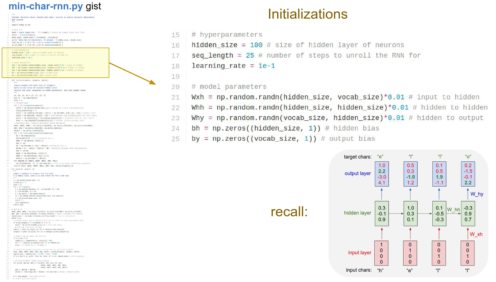
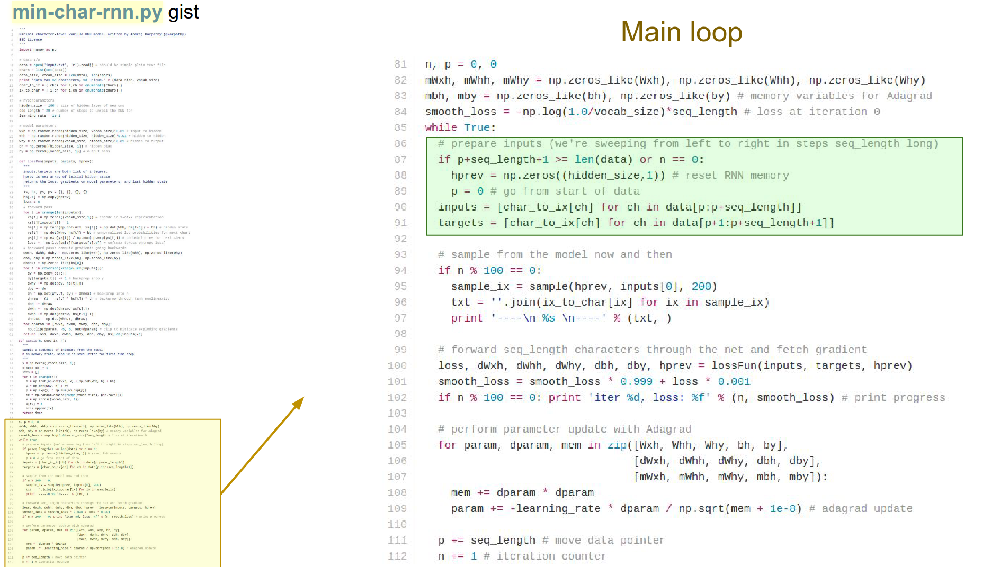
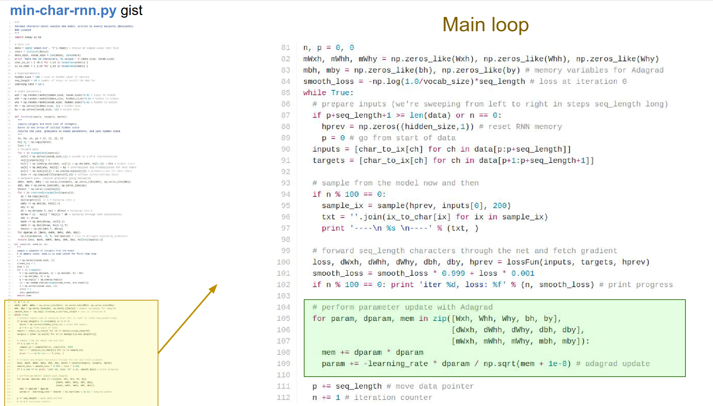
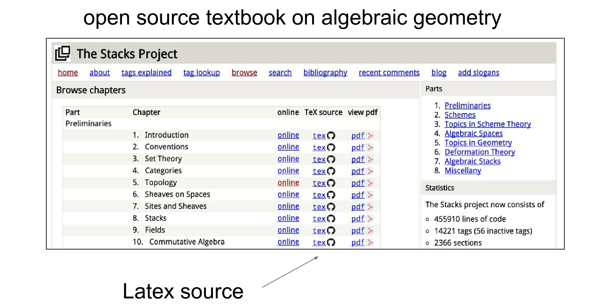
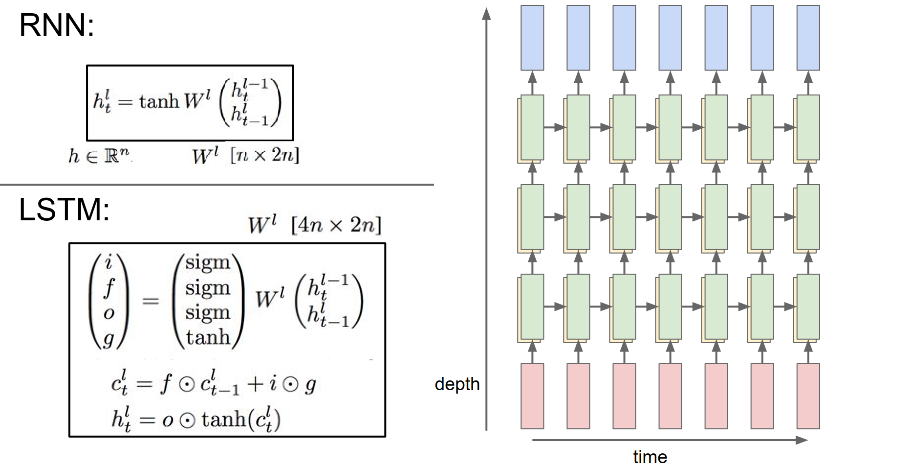

Part of [CS231n Winter 2016](../index.md)

---
# From Andrej Karpathy

---
# Recurrent Neural Networks

Midterm coming up, A3 is going to be released.

We tried to understand Convolutional Neural Networks, saw ConvNets, Style Transfer and Adversarial Inputs.

A lot of different examples here.

Pretty cool stuff. I think this is like deep dream with a fancy filter.

We will talk about Recurrent Neural Networks.
## RNN's will give you flexibility

### Definition:

**Recurrent neural networks**, also known as RNN's, are a class of neural networks that allow previous outputs to be used as inputs while having hidden states.

In Vanilla NN, you have an fixed size input (red), you process it with some hidden layers (green) and you will get an fixed sized output (blue).

We can operate on sequences with RNN's. At the input/output or both in the same time.

In the case of Image captioning, you are given a fixed sized image and through RNN, you will get a sequence of words that ==describe the content== of that image.

IN sentiment classification in NLP we are consuming number of words in sequence, we are trying to classify whether the sentiment of that is positive or negative.

### Seq to Seq 🌉

In an Machine translation, we can have a RNN that takes a number of words and says English, and it is asked to produce a number of words in French as a translation.  

Maybe we want to do video classification, classifying every single frame of video with some number of classes, we want the prediction to be made on not on only single frame but with frames before it.

RNN's allow you to fire up an architecture, where the prediction at every single timestamp is a function of all the frames that have come up until that point.

Even if you do not have sequences as inputs and outputs, you can still use RNN even if the case on the very left. You can process your fixed sized inputs or outputs sequentially.
### Deepmind - Transcribe House Numbers

Instead of just feeding this big image into a ConvNet and trying to classify the house numbers are in it, they come up with an RNN policy.

A small ConvNet **steered** around the image spatially with a RNN. The RNN learned to basically ==read out house numbers from left to write==, sequentially.

So we have a fixed size input but we are processing sequentially.

Conversely, we can think about,  `Draw` [paper](https://arxiv.org/pdf/1502.04623.pdf). 

_DRAW: A Recurrent Neural Network For Image Generation:_

This is a generative model what you are seeing are samples from model, it is coming up with these digit samples, we are not predicting the digits at a single time, we have an RNN we think as the ==output as a canvas== and RNN goes in an paints it overtime. 

You are giving yourself more chance to do some computation before you produce your output. More powerful form of processing data.

## What is an RNN ?

This is a box that has some state internally and it gets input vectors. It can modify it's state as a function of what it receives at every single timestamp.

There will be weights inside RNN, as we tune the weights the RNN will have different behavior in terms of how it's state evolve as it receives inputs.

We can also be interested to producing an output based on RNN's state, so we can produce these vectors on top of the RNN.

RNN is just the block in the middle.

The RNN has state vector $h$,  we are going to base it as a function of previous hidden state $h_{t-1}$ and current input $x_{t}$.
### This is our ==recurrence function== !

We apply the same function at every single time step. That allows us to use the RNN on sequences, without having to commit on the size of the sequence.

Because we apply the same function no matter how long the input or output sequences are.

### Simplest RNN ? 

Simplest way is just a single hidden state.

Recurrence formula tells us how we should update the hidden state $h$ as a function of previous hidden state and the current input $x_{t}$.
### the weight matrices $W_{hh}$ and $W_{xh}$ 

They will project the hidden state from previous step and the current input.

They will add and we will squish them with a $tanh()$.
### squish them with a $tanh()$.

That's how we update the hidden state at time $t$

We can base predictions on top of h using another projection on top of hidden state.

Simple example, we will feed a sequence of characters into RNN, at every single time step we will ask the RNN to predict next character in the sequence.

So we will predict an entire distribution of what it thinks should come next in the sequence that it has seen so far.

We will feed all characters one at a time. Encoding characters with One Hot Representation
### One Hot Encoding 🥰

We will use the recurrence formula, suppose we started with h's at all zero. 

We use the same recurrence formula at every step to update hidden state with the sequence it has seen until than.

We will predict at every single time step, what should be the next character in the sequence.

For example, in very first time step, RNN computed unnormalized log probabilities:
It thinks

- $h = 1$
- $e = 2.2$
- $l = -3$
- $o = 4.1$

likely right now.

We want "$e$" to be high and all the other numbers to be low. 

In every single time step we have a ==target== for what next character should come in the sequence. That is encoded in the gradient signal of the loss function. That gets back propagated through these connections.

Another way to think about it, every single time step we have a softmax classifier, over the next character, and every single point we know what the next character should be.

We get all the losses flowing down from the top, they will all flow through this graph backwards through all the arrows, we are going to get gradients on the weight matrices, then we will know how to shift the matrices so that the correct probabilities are coming out of the RNN.

We will be shaping the weights so that the RNN has the correct behavior as we feed in data.

wip at 12:00.

At multiple time steps we used all $W$'s are same. In back propagation you have to consider this. This allows us to process variably sized inputs, because at every time step we are doing the same thing, we are not a function of absolute amount of things in the input.
### first h == 0 -> initially. This is common.

### What if words were in different order?

If this was a longer sequence, the order always matters. The hidden state depends on everything it has seen, so the order matters.

### specific example - `char-rnn` 🎈

The [char-rnn gist](https://gist.github.com/karpathy/d4dee566867f8291f086) link here. Let's work on it.

Only dependency is numpy. Input is large sequence of characters. 

We find all the unique characters and we make these maps for characters to indices and indices to characters.

Our `hidden_size` is a hyperparameter. Learning rate is also.

`seq_length` -> if sequence too large, we wont be able to keep it all in memory and run back propagation on it.

We will be going with chunks of $25$. We cannot afford to do backpropagation for longer. Because we would have to remember all that stuff.

We have all the $W$ matrices and biases $b$, initialized randomly. These are all of our parameters.

Skip the loss function for now, get to the main loop.

Some initializations.

We are looping forever:

- Sample a batch of data. 25 integers -> `inputs` list.
- `targets` are offset by 1 into the future.

Sampling code. What the sequences look like? 

In test time, we are going to seed it with some characters, RNN always gives us distribution of next character in the sequence. You can imagine sampling from it and then you feed in the next character again.

You keep feeding all the samples on to the RNN, you can just generate arbitrary text data. It calls `sample_ix` function, we will go to that in a bit.

Loss function receives the `inputs`, `targets` and `h_prev`. Hidden state vector from previous chunk.

What is the hidden state vector at the end of your 25 letters? When we feed in the next batch we can use this! 

We are only back propagating those 25 time steps.

We get the `loss` and gradients in all the weight matrices and the biases. Just print the loss.

Parameter update, we know all the gradients.

Perform the update, this is `Adagrad` update. We have all these cached variables for the gradient squared which we are accumulating and using.

This is the loss function. Forward and Backward pass.

In forward pass, you should recognize, we get `inputs`, `targets` and `hprev`, we received these 25 indices an we are now iterating through them from 1 to 25.

We make this x input vector (which is just zeros). We make ==one hot encoding==. 

Whatever the index on the input is, we turn that bit on with a $1$.

We are feeding into character with a one hot encoding, then we will compute the recurrence formula. 

`hs[t] , ys[t], ps[t]` -> Using dictionaries to keep track of everything.

We compute the hidden state vector and the output.

Compute the softmax function -> normalizing this so we get probabilities.

Last line is just a softmax classifier -> $-log()$.

Now we will back propagate through the graph.

In the backward pass we will go backwards from that sequence, we will back propagate through a softmax, back propagate through the activation functions, back propagate through all of it.

We will just add up all the gradients and all the parameters.

One thing to note: gradients on weight matrices like `whh` we are using a `+=` because at every single time step all of these weight matrices get a gradient, and we need to accumulate all of it into all the weight matrices.

Because we are going be keep using all these weight matrices at every time step. So we just back prop onto them overtime. 

That gives us the gradients, we can use that in the loss function and perform parameter update.

Here we have finally a sampling function. 

Here is where we try to actually get the RNN to generate new text data based on what it has seen and based on the statistics of the characters, how they follow each other.

- We initialize with some random character.
- We go on until we are tired.
- We compute the recurrence formula.
- Get the probability distribution
- Sample from that distribution
- Re-encode in one hot representation
- Feed it in at a next time step.
### why no regularization? Andrej thinks it is not common in RNN's - sometimes it gave him worse results.

### This RNN does not know anything about words or language.

We can now can take a whole bunch of text and feed the RNN with it 🐤

We can take all of the Shakespeare works, concatenate all -> Just giant sequence of characters.

At first the RNN has random parameters, will just produce garbel in the end.

When you train more, there are things like spaces, there is words, it starts to experiment with quotes, it basically learned various short words!

When you train with more and more, It learns to close quotes, it learns to end sentences with a dot.

Here is an example down below.
### Can this generate a quote longer than 25??🤔 Will be investigating 

They fed it with a `.tex` file.

RNN can learn to generate mathematics! -> 

RNN spiles out LateX, It does not compile it right away, we had to tune it, but than voila!

It knows to put squares at the end of proofs, it makes lemmas, and etc.

Sometimes it tries to make diagrams, but varying amount of success! 😅
### Proof. Omitted. LOL

Source code is really difficult -> 700 MB of just C code and header files.

It can generate code.

Syntax wise it makes very little mistakes. It knows about variables, it knows indentation, it makes bogus comments LOL.

It declares variables that never ends up using. It uses variables never declared.

It knows how to cite, GNU licence character by character. 🥳

Include files, some macros and some code.

### was this `min_char_rnn` ? no that is a very small toy. 

### there is `char_rnn` more mature implementation on torch, runs on GPU. - This is actually a 3 layer LSTM. 😌

Adventures on RNN:

Andrej and Justin, they pretended that they are neuroscientists, they threw a character level RNN on some test text.

The RNN is reading the text, and as the text flows, they are looking at the hidden state of the RNN, and they are coloring the text whether or not that cell is excited or not.

Many of the hidden state neurons are not really interpretable. They fire on and off randomly.

But some cells are really interpretable.
### Quote detection cell - quote Starts - Quote Ends.

It turns on when it sees a quote and it stays on until the quote closes. 

RNN decides that character level statistics are different inside and outside of quotes. This is a useful feature to learn. SO it dedicates some of it hidden state to keep track whether or not you are inside a quote.

### Can this generate a quote longer than 25?? 🤔 investigating now

This RNN was trained on sequence length of a 100. If you measure the length of this quote is much more than 100, more like 250.

We back propagated up to a 100, that the only length that this RNN can learn itself. It would not be able to spot dependencies that are much longer than that.

But this seems to show that, you can train this character level detection cell as useful on sequences less than 100 than it generalizes properly to longer sequences.
#### So this cell seems to work fine for more than 100 steps even if it was only able spot dependencies less than 100.

This is from War & Peace.

In this dataset there is a `\n` after roughly 80 characters, every line.

There is a line length tracking cell they found, it starts at 1 at it slowly decays overtime. A cell like this is really useful because this RNN needs to count 80 time steps so that it knows, likely a newline coming up next.

There are cells that only respond inside `if` statements.

Cells that only respond inside quotes/strings. 

Some cells get more excited the deeper you nest an expressions.

### how did you figure out what individual cell is excited about?

In this LTSM you have 21000 cells, you just kinda go through them. Manually.

Most of them looks random, in %5 you spot something interesting.

We ran the entire RNN in tact, we are only looking at the firing of a one single cell in the RNN.

We are just recording from one cell in the hidden state, if that makes sense. I am only visualizing one part of the hidden state in the image above.

These hidden cells are always in between $-1$ and $1$ , the scale between blue and red ones.

----
## RNN's are pretty cool and they can be used in CV

### Image Captioning

RNN's are pretty good to understand how sequences for over time.

Work from 1 year ago, Andrej's [paper](https://arxiv.org/abs/1412.2306).

Two modules, CNN processing of the image, RNN is really good with modeling sequences.

This is just playing with lego blocks.

We are conditioning RNN generative model we are not just telling it to sample text at random, we are conditioning that generative process by the output of the CNN.

This is how the forward pass happens in NN.

We have a test image and we are trying to describe with sequence of words.

We plug it into a CNN, this is a `VGGnet`. We go through Conv and MaxPools, until we arrive at the end.

We would normally have this softmax classifier that gives us a probability distribution 1000 classes in Image Net. We are going to ==remove that classifier==.

We are going to redirect the representation at the top of network, into the RNN.

We begin with a special start vector. The input at this RNN is roughly 300 dimensional.

At first iteration we always use this special vector. Than we perform the ==recurrence formula== in as we saw in Vanilla RNN.

Normally we would compute the before mode. Now we are doing different. Not only with current input and current hidden state (which we initialized with 0 - That term goes away at the first timestep).
### We are adding $W_{ih}$ -> this v is the top of the ConvNet.

This tells us how the image information is merged into the very first time step of the RNN.

There are many ways to do this plug in. This is only one of them. One of the simpler ones.
### How does this work?

The ==straw== textures can be recognized by the CNN as like ==straw== like stuff. 

Through this interaction of $W_{ih}$ it might condition the hidden state to a particular state, where the probability of the word ==straw== can be slightly higher.

So you can image the textures of an image can influence the word "straw" so one of the numbers inside $y0$ to be higher, because there is straw textures in there.

RNN From now on has to juggle two tasks, it has to predict the next word in the sequence and it has to remember the image information.

So we sample from that softmax - and suppose the most likely word that we sampled from that distribution is indeed the word ==straw== - we would take straw and we would try to plug it in to the RNN on the bottom ***again***.

This is done by using word level embeddings.

So the ==straw== word is associated with a 300 dimensional vector.

Which we are going to learn by the way - we are going to learn 300 dimensional representation every single unique word in the vocabulary. 

We plug in those 300 number into the RNN and forward it again, to get a distribution over the second word in the sequence - inside $y1$ . 

We get all these probabilities, we sample from it again.

Suppose the word ==hat== is likely now. We take ==hat== 300 dimensional representation vector, plug it in  and get the distribution over there.

We sample again. And we sample until we sample a special `<end>` token. Which is just period at the end of the sentence.

That tells us the RNN is now done generating. The RNN have described this image as - ==straw hat.==

The number of dimensions in this $y$ vector is `number of words in your vocabulary + 1` for the special end token.

We are always feeding these 300 dimensional vectors that correspond to different words. And a special start token.

We are always back propagating through the whole thing, at a single time.

You can initialize at random, or you can initialize your VGG net pretrained from ImageNet. The RNN tell you the distributions, you encode the gradient, you back prop the whole thing as a single model.

#### Q: 300 embeddings, are they depending on image??

No, 300 dimensional embeddings, they are independent from the image. Every word has 300 numbers associated with it.
#### Q: how is that generative? 

We are going to back prop into it, these vectors x - so these embeddings will shift around. They are just a parameter.

It is equivalent of having a one hot representation of all the words, and a giant $W$ matrix where we multiply $W$ with one hot representation. If that $W$ has 300 output size it is essentially plucking out a single row of $W$ which ends up being your embedding.
#### Q: How do you end? 

Every training data has a special ==end token== in it.
#### Q: Do you use image only once?

Yes. You can plug the image at every single time step for RNN but that performs worse. The juggle between jobs make it harder. It has to remember what image has in it and it has to produce outputs.
#### Q: When you train it, how do you control data flow?

At training time a single instance will corresponds an image and sequence of words, we would plugin the words to RNN and we would plug in that image to CNN.

You have to be careful for different length sequences - images. 

_I'm willing to process batches up to 20 words_ and some of the sentences will be shorter and longer, and you need to (in your code) regulate that.

We train this Image Sentence Dataset. - MS COCO! - 120K images 5 sentences each.

Results are down below - _Boy is doing a back flip_

Failure cases: _Cat sitting on a couch with a remote control_ - _There is no horse._

A lot of people play with these.

Paper from last year (2015) - _Show Attend and Tell_ - [Link](https://arxiv.org/abs/1502.03044). 

In the current model we only feed the image at a single time at the beginning.

Instead, You can adjust the RNN to be able to **look back to the image**, and reference parts of the image while it is describing the words.

As you are generating every single word, you allow the RNN to make a lookup back to the image and look for different features what it might want to describe next. You can actually do this in a fully trainable way. So that the RNN not only makes the words but also decides where to look next in the image.
### `Attention` in 2 minutes.

RNN not only outputs the probability distribution of the next word in a sequence, but this ConvNet gives you this volume, $14x14x512$ activation volume, and at every single time step you do not just emit that distribution but you also emit $512$ distributional vector that is kinda like a lookup key.

This key is for what you want to look next within an image.

(This implementation might be not in the paper but this is one way you could do.)

This key vector is emitted from the RNN, it is just predicted using some weights. This vector can be **dot producted** with all these $14x14$ locations for the $14x14x512$ activation volume.

We do all these dot products, we compute $14x14$ ==compatibility map== and then we put a softmax on this, so basically we normalize this so you get what we call ==the attention== of the image.

$14x14$ probability map over what's interesting for the RNN, right now, over the image. Then we use this probability mask to do a weighted sum of these guys (the activation volume - $14x14x512$) with this saliency.

So this RNN can basically emit these vectors of what it thinks is currently interesting for it.

It goes back, and you end up doing a weighted sum of different kinds of features that the LSTM (RNN) wants to look at this point in time.
#### For example:

As the RNN generating, it might decide like: _okay, i'd like to look for something object like now_

It emits a vector of 512 numbers of object like stuff. It interacts with the ConvNet activation volume, and maybe some of the object like regions of that volume ==light up==.

And the saliency map, in the $14x14$ array, and you end up focusing your attention on that part of the image, through this interaction.
#### Basically, you can do lookups into the image while generating the sentence.

## This is called Soft Attention.

We will go into this. RNN can have selective attention over it's inputs as it's processing the inputs.

If we want to make RNN's more complex, we can stack them up in layers.

More deep stuff usually works better.

There are many ways to do this. One way is to straight up plug RNN's into each other.

___The input for one RNN is the hidden state vector of the previous RNN.___

In the image down below, we have time in horizontal axis and different RNN's in vertical.

3 separate RNN's. Each with their own set of weights. These RNN's just feed into each other. This is trained jointly. Single computational graph we back propagate through.

We are still doing the exact same thing as we are doing before. Using the same formula.

We are taking a vector from ==below in depth== and ==before in time==, we are concatenating them and we are putting them through this $W^l$ transformation, and squish them with a $tanh()$.

What we had before:
$$h = tanh(W_{xh} * x + W_{hh} * h)$$

You can rewrite this as a concatenation of $x$ and $h$ multiplied by single matrix.

As if you stacked x and h into a single vector.
$$\begin{bmatrix}
    x \\
    h \\
  \end{bmatrix}$$
Than I have this $W$:
$$\begin{bmatrix}
W_{hx} & W_{xx}
\end{bmatrix}
$$

We can use this to have a single $W$ transformation.

These RNN's are now indexed by both **time** and **layer** in which they occur.

Another way to stack them is to use a ==better recurrence formula==.

In practice you will rarely use a formula like this. This is very rarely used.

Instead you will use:
## LSTM - Long Short Term Memory

This is used in all the papers now. 

Everything is the exactly the same as within RNN, it's just that the recurrence formula is a slightly more complex function.

We are still taking the hidden vector from from below in depth, like your input and before in time, previous hidden state. We are concatenating them, putting them through a $W$ transform.

But now we have this new complexity on how we achieve the new hidden state at this point in time.

We are just being slightly more complex in how we combine the vector from below and below to perform the update of the hidden state.

### Why is it a better idea to use LSTM instead of RNN?

Why are we using sigmoids and tanh() together ??

These diagrams are not helping anyone. They really scared Andrej in the first time he saw them.

LSTM is tricky to put in diagram, so let's go over it step by step.

x is input, h is previous hidden state, we mapped them through the transformation $W$, and if both $x$ and $h$ are of size $n$ - there is $n$ numbers in them - we are going to end up producing $4n$ numbers.

We have 4 dimensional vectors, $i$ , $f$, $o$ and $g$ (they are short for input, output. forget and g).

The $i$ , $f$, $o$  go through sigmoid gates. The $g$ goes through tanh gate.

Normally and RNN only has a single vector $h$ at every single time step, LSTM has 2 vectors at every single time step, the hidden vector $h$ and the cell state vector $c$.

Above of the image above, we have green $h$ vectors and yellow $c$ vectors for LSTM. 

LSTM's are operating this cell state, so depending on what's before you and below you (that is your context) you end up operating on the cell state with these $i$ , $f$, $o$ and $g$ elements.

Think of $i$ , $f$, $o$ as binary, either 0 or 1 (we are computing them based on our context). We of course gate them with sigmoids because we want to backpropogate over them, we want them to be differentiable.

The $c$ formula is, based on what the gates are, and what $g$ is, we are going to update this $c$ value.

In particular, the $f$ is called the ==forget== gate, that will be used to reset some of the cells to zero.

The cells are best thought as counters. These counters, we can either reset them to zero with the $f$ interaction ($f . c_{t-1}$). Or we can also add to a counter, through the interaction of $i.g$.

Since $i$ is between 0 and 1 and $g$ is between -1 and 1, we are basically adding a number between -1 and 1 to every cell.

At every single time step we have these counters, and all the cells. We can reset the counters to 0 with a forget gate or we can choose to add a number between -1 and 1 to every single cell.
### That's how we perform the cell update - $c$.

The hidden update ends up being a squashed cell - $tanh(c)$ that is modulated with this output gate $o$.

==Only some of the cell state ends up leaking into the hidden state as modulated by this vector $o$==

We only chose to reveal some of the cells to the hidden state in a learnable way.

---

We are adding a number between -1 and 1 with $i.g$ here. That might be confusing, because if we only had a $g$ there instead, $g$ is already between -1 and 1.
### why do we need $i.g$ instead of just $g$ ???

If you think about $g$, it is a linear function of your ==context== squashed by $tanh()$.

If we were adding just $g$ instead of $i.g$, that would be a really simple function, so by adding the $i$ in there having a multiplicative interaction, you are going to end up having a richer function, that you can express.

Express in terms of what we are adding to our cell state as a previous $h$'s.

Another way to think about this, we are decoupling these two concepts of, 
- how much do we want to add to a cell state (which is $g$)
- do we want to add to a cell state (which is $i$)

$i$ is do we actually want this operation to go through, and $g$ is what do we want to add.

By decoupling these 2, that also dynamically has some nice properties in terms of how this LSTM trains.

### cells going through

Think about this as ==cells going through==, the first interaction is $f . c$

$f$ is an output of a sigmoid. So $f$ is basically gating your cells with a multiplicative interaction. -> If $f$ is 0, you will shut off the cell and reset the counter.

This $i.g$ part, is basically adding to the cell state.

And then the cell state leaks into the hidden state, but it only leaks through a tanh(). And that gets gates by $o$.

The $o$ vector can decide **which parts of the cell state to actually reveal** to the hidden cell.

Then you will notice that, this hidden state not only goes to the next iteration of the LSTM, but it also flows up to higher layers ->

Because this is the hidden state vector we end up plugging into further LSTM's above us. Or that goes into a prediction.

When you unroll this, basically the way it look like is kinda like down below.
### Now I have a confusing diagram of my own 😅

## LSTM Summary 😍

You get you input vectors from below, your hidden state from before.

The $x$ and $h$ determine your gates, $i$, $f$, $g$ and $o$ -> they are all  n dimensional vectors.

They end up modulating how you operate over the cell state.

This cell state can, once you actually reset some counters and once you add numbers between -1 and +1 to your counters, the cells state leaks out (some of it) in a learnable way, than it can either go up to the prediction or it can go to the next iteration of the LSTM going forward.

### why did we go through all of this? 🤔

There are many variances to an LSTM, people play with a lot with these equations (the hidden state and the cell state), we have converged on this (what we explained) as the being the reasonable thing. There is many little tweaks that you can make that do not deteriorate your performance by a lot.

You can ==remove== some of the gates. 

The $tanh()$ of $c$ can be just a single $c$ , that will work fine. $tanh()$ will make it work slightly better.

It actually kinda makes sense, in terms of, just these counters can be reset to zero or you can add small numbers between -1 and 1 to them.
### why is this much better than a RNN? 🤔

RNN has some state vector. You are operating over it, and you are completely transforming it through this recurrence formula.

So you end up changing your hidden state formula from time step to time step.

LSTM instead has these cell states flowing through, we are looking at the cells, some of it leaks into the hidden state, based on the hidden state we are deciding how to operate over the hidden cell.

And if you ignore the forget gates than we end up with basically just tweaking the cell by additive interaction.

There is some stuff that is a function of the cell state, then whatever it is we end up, additively changing the cell state, ==instead of just transforming it right away.==

It's an additive instead of trans-formative interaction.

## This is basically the same thing as we saw in the ResNets.

Normally with a ConvNet we are transforming the representation, ResNets has these ==skip connections==, so ResNets has these additive interaction, so we have this $x$ (identity in the image down below), we do some computation based on $x$, than we have an additive interaction with $x$.
### That is the basic block of a ResNet and that basically happens in LSTM as-well.

We have these additive interactions, where $x$ is basically your cell, and we go off and we do some function and we choose to add to this cell state.

But LSTM's unlike ResNets have these forget gates, these forget gates can choose to shut off some parts of the signal. Otherwise it very much looks like a ResNet.

We are converging into like very similar looking architectures that works in ConvNet's and in RNN's where it seems like dynamically it is much nicer to have these additive interactions that allow you to back propagate much more effectively.
### back propagation dynamics of RNN vs LSTM 🤔

In the LSTM, if we inject some gradients signal at some time steps here, if we inject some gradient signal at the end of the diagram, then these plus interactions (in the image above) are just like a ==gradient super highway==.

These gradients will flow through all the addition interactions, because addition distributes gradients equally.

So if we plug in any gradient any point in time here it is just going to flow all the way back. 

And of course the gradient also flows through these $f$'s and they end up contributing their own gradients into the gradient flow, but you will never end up with what we referred to with RNN's problem called ==vanishing gradients==.
### vanishing gradients - RNN 🆚 LSTM

Where these gradients are just die off - go to zero - as we back propagate through. In RNN we have this vanishing gradient problem, in LSTM because of this super high way of additions, these gradients at every single time step that we inject into the LSTM's from above, just flow through to cells. Your gradients do not end up vanishing.

---

Extra image, magenta line in bottom is hidden state, green line at top is cell state.

---
### why RNN's have terrible backward flow?? 😮

In the link we are unrolling a RNN in many time steps. We are injecting gradient at $128$ time step. And we are back propagating the gradients through the network. And we are looking at what is the gradient for input to hidden matrix, at every single time step.

In order to get the full update through the batch, we end up adding all these gradients here.

So we made this injection and we are back prop through time. The image is just showing the slices of that backpropagation.

There is just a grey image in the RNN, LSTM is kinda like all random.

The LSTM will give you a lot of gradients through this back propagation. A lot of information that is flowing through.

In the RNN it just dies off, gradient vanishes. Just becomes tiny numbers.

In kinda like 8-10 time steps, all the gradient information that we injected, did not flow through the network. So you cannot learn very long dependencies because of all the correlation structure has been just dying down.

---

We have an RNN here that Andrej will unroll.

Not showing inputs, we only have hidden state updates.

`whh` is hidden to hidden interaction. We will basically forward this Vanilla RNN for some `t` timesteps.

`whh` times previous time step `hs[t-1]` and ReLU on top of that -> `np.maximum()`

This was the forward pass, ignoring the inputs.

In the backward pass, injecting a random gradient at the last time step. Then we will go backwards and back propagate. When we back prop this we have to back prop through a ReLU, we need to back prop through a `Whh` multiply, and ReLu again and `Whh` multiply and so on.

In the `for` loop down below (`for t in reversed(xrange(T))`), we are just thresholding anything that where the inputs were less than zero. And we are back propping the `Whh * h` operation.

Something funky going on when you look at what is happening to this `dhs` which is the gradient on the `h`'s, as you go backwards through time, it has a funny structure that is worrying. As you look at how this gets chained up in the loop.
### What are we doing with these time steps? what is not good? 🤔

We are multiplying by this `Whh` matrix over and over and over again.

When we back prop through all the hidden states, we end up back propagating this `Whh * hs`, the back prop turns out to be that, you take you gradients signal and than you multiply by the `Whh` matrix.

So we end up with 50 times multiplication with `Whh` - thresholded ...

You can think of this as two scalars. You have a random number 1 and you keep multiplying with number 2, over and over and over again. What happens?

If number 2 is not $1$, the number either dies - 0 - or explodes. 

Here we have matrices not numbers, but the same thing happens.

If the spectral radius of this `Whh` matrix - which is the largest eigenvalue of that matrix - if it is greater than one, than this gradient will explode. If it is lower than 1, the gradients will die.

Terrible dynamics. In practice, you can control the exploding gradient - one simple hack is to clip it. 
### really patchy solution - gradient clipping 🤭

When they vanish, GG in RNN. LSTM is really good for vanishing gradients, because of these highways of cells which are only changed with additive interactions where the gradients just flow, they never die down.

We always use LSTM's and we do gradient clipping, because the gradients can explode still.

Do not forget, these super highways are only true when we do not have any forget gates (because they can just make gradients 0). People play with that bias in forget gate sometimes.

---

They tried really different things on LSTM. 

"[LSTM: A Search Space Odyssey](https://arxiv.org/abs/1503.04069)"  by Greff et al. presents a comprehensive analysis of various Long Short-Term Memory (LSTM) variants and their impact on the performance of recurrent neural networks (RNNs). 

What they do:
- The authors evaluate eight different LSTM variants, each with a single modification to the standard LSTM architecture.
- They test these LSTM variants on three representative tasks: speech recognition, handwriting recognition, and polyphonic music modeling.
- To ensure a fair comparison, the authors use random search to select the hyperparameters for each dataset and LSTM variant, resulting in a total of 5,400 trials.

Why they do it:

- LSTMs have become the state-of-the-art models for many machine learning problems, but there is a lack of systematic studies on the utility of the different computational components within the LSTM architecture.
- The authors aim to fill this gap by isolating the impact of each LSTM component and understanding its contribution to the overall performance of the model.

What they achieve:

- The study provides valuable insights into the effectiveness of various LSTM components, such as the forget gate, input gate, and output gate, among others.
- The results show that some LSTM variants perform better than the standard LSTM architecture on certain tasks, suggesting that the optimal LSTM configuration may depend on the specific problem and dataset.
- The authors also discuss the historical evolution of the LSTM architecture, highlighting the importance of understanding the role of each component in the model's performance.

In summary, the "LSTM: A Search Space Odyssey" paper conducts a comprehensive analysis of LSTM variants, aiming to shed light on the utility of different computational components within the LSTM architecture. The findings contribute to a deeper understanding of LSTM models and can guide future research and development in the field of recurrent neural networks.

---
### there is this thing called GRU ? [Paper](https://arxiv.org/abs/1406.1078) 💖

It is a change on an LSTM, also has this additive interactions, but what is nice about it it has a shorter smaller formula. And it only has a only single $h$ vector. Implementation wise this is nicer - in forward pass.

Smaller, simpler that seems to have the benefits of an LSTM, it almost always works equally which LSTM.

Raw RNN does not work really well. LSTM's and GRU's are used. They have these additive interactions which allows to solve the vanishing gradient problem. 

We gotta do gradient clipping.

We need better understanding.
