Part of [CS231n Winter 2016](../index.md)

---
## Lecture 11: CNNs in Practice

We will cover low-level implementation details that are essential for getting these models to work during training.

The TAs have graded the Midterms.

Assignment 3 is due in a week.

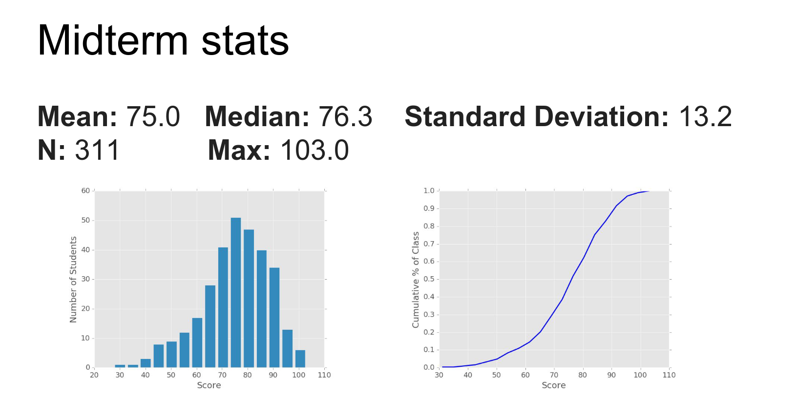

Someone got 103.

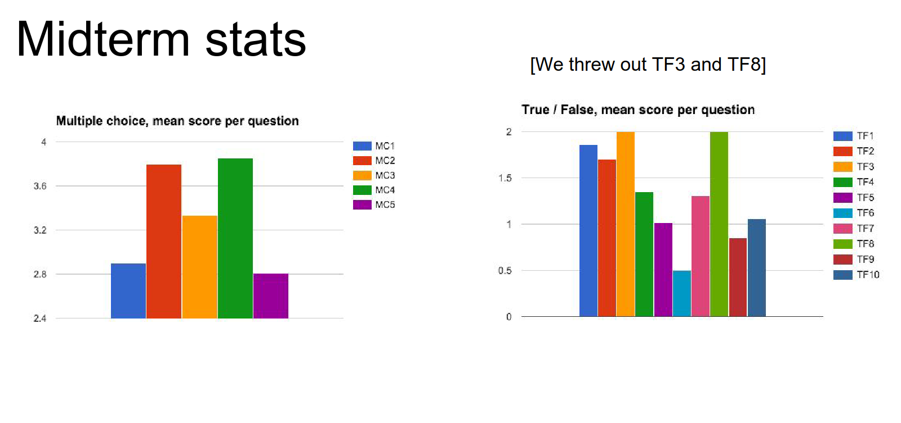

Question per stats.

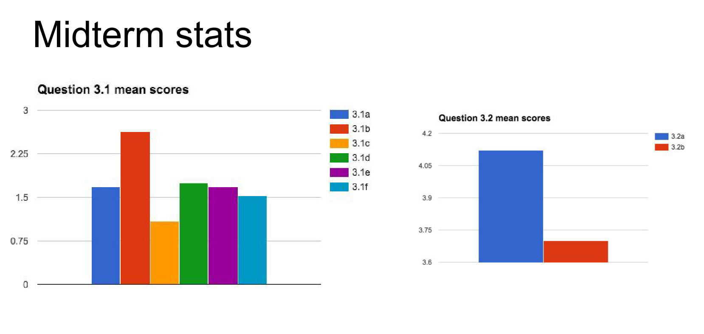

Have fun.

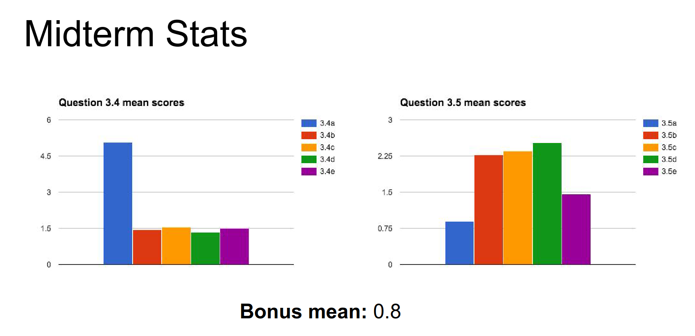

We discussed RNNs and how they can model different kinds of sequence problems. We covered two particular implementations: Vanilla RNNs and LSTMs.

You'll implement both of those on the assignment.

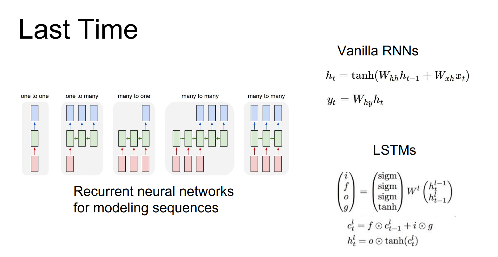

We saw how RNNs can be used for language models.

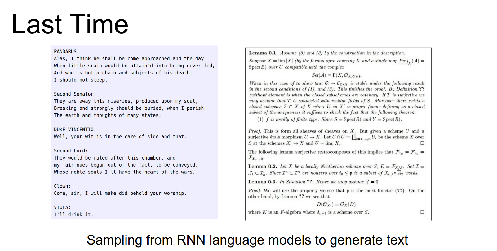

We talked about how we can combine recurrent networks with convolutional networks to do image captioning. We played the role of RNN neuroscientists, diving into the cells to see what excites them.

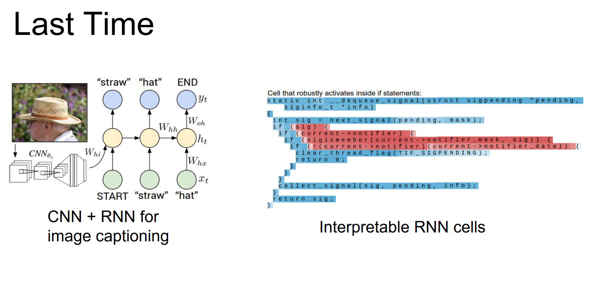

Today, we will discuss many low-level details required to get CNNs working in practice.

- First, we will look at squeezing all the juice out of your data using **data augmentation** and **transfer learning**.
- We will dive deep into **convolutions**, discussing how to design efficient architectures using them and how they are efficiently implemented in practice.
- Finally, we will discuss implementation details that often don't make it into papers, such as the differences between CPUs and GPUs, training bottlenecks, and distributing training over multiple devices.

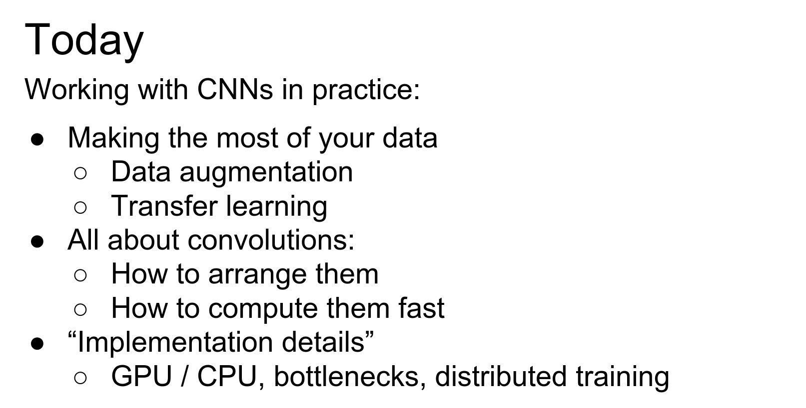

Let's start.

You're familiar with this pipeline: load images and labels off the disk, put your image through a CNN.

Then you use the image together with the label to compute some loss function, backpropagate, update the CNN, and repeat forever.

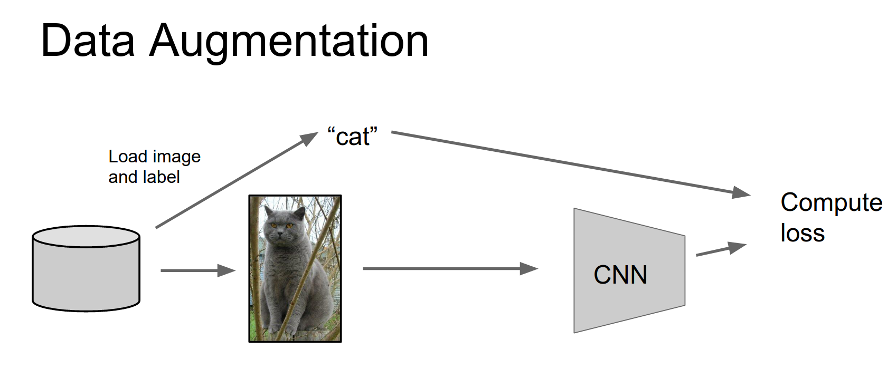

Data augmentation adds one little step to this pipeline.

After we load the image off the disk, we transform it in some way before passing it to the CNN.

This transformation should preserve the label. We then compute loss, backpropagate, and update the CNN. It's simple, and the trick is deciding what kinds of transforms to use.

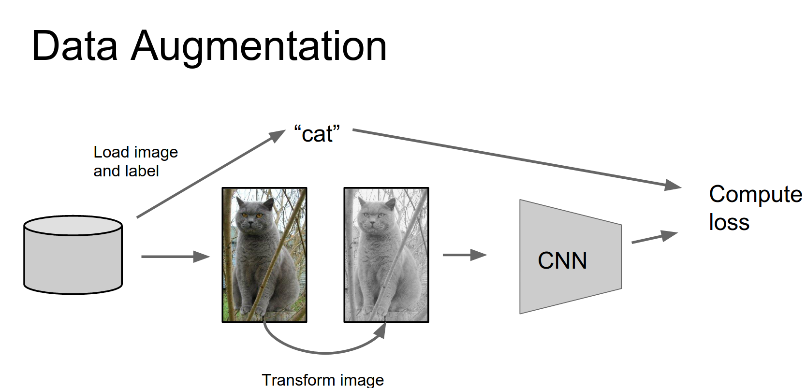

The idea of data augmentation is really simple: it lets you artificially expand your training set through clever usage of different kinds of transformations.

The computer sees these images as giant grids of pixels. There are different kinds of transformations we can make that should preserve the label but will change all of the pixels.

If you imagine shifting a cat one pixel to the left, it's still a cat, but all the pixels change. When you use data augmentation, you are expanding your training set. These new fake training examples will be correlated, but it still helps you train bigger models with less overfitting.

This is very widely used in practice. Pretty much any CNN you see that's winning competitions or doing well on benchmarks is using some form of data augmentation.

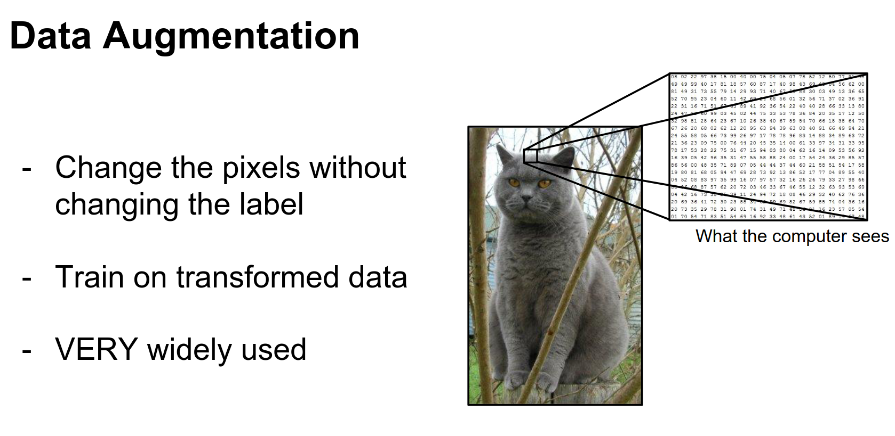

The easiest form of data augmentation is horizontal flipping.

### Horizontal Flipping

If we take this cat and look at the mirror image, the mirror image should still be a cat. This is really easy to implement in numpy; you can do it with a single line of code.

It is similarly easy in Torch and other frameworks. This is widely used.

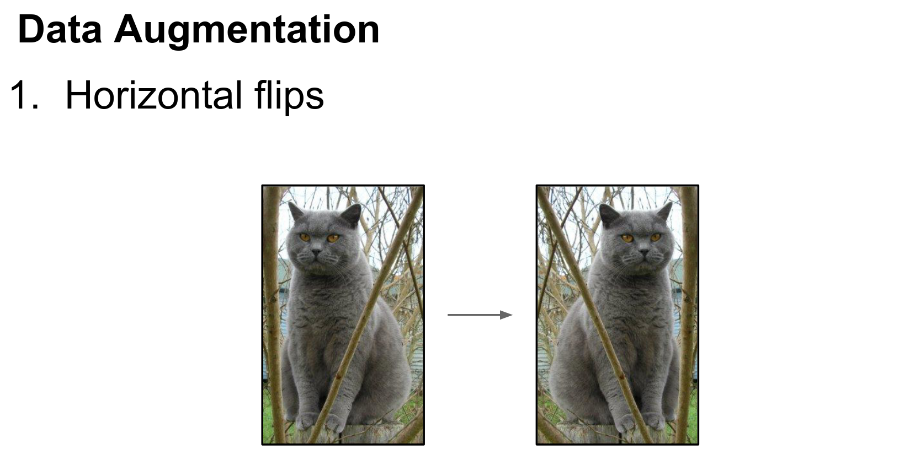

### Random Cropping

Something else that's very widely used is taking random crops from the training images.

At training time, we load our image, take a patch of that image at a random scale and location, resize it to whatever fixed size our CNN expects, and then use that as our training example.

Again, this is very widely used. Just to give you a flavor of how exactly this is used, here are the details for ResNets:

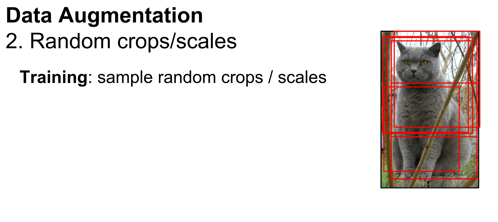

They first pick a random number, resize the whole image so that the shorter side is that number, then sample a random $224 \times 224$ crop from the resized image, and use that as their training example.

That's pretty easy to implement and usually helps quite a bit.

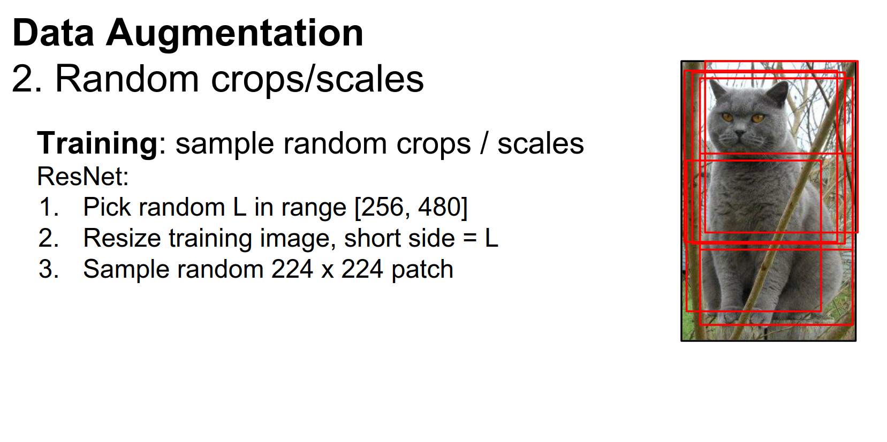

When you're using this form of data augmentation, things change a little bit at **test time**.

At training time, the network is not really trained on full images; it's trained on these crops. It doesn't really make sense or seem fair to force the network to look at whole images at test time.

So usually in practice, when you're doing this kind of random cropping for data augmentation, at test time you'll have some fixed set of crops and use these for testing.

Very commonly, you'll see ten crops: the upper left-hand corner, the upper right-hand corner, the two bottom corners, and the center. That gives you five; adding their horizontal flips gives you ten. You take those ten crops at test time, pass them through the network, and average the scores.

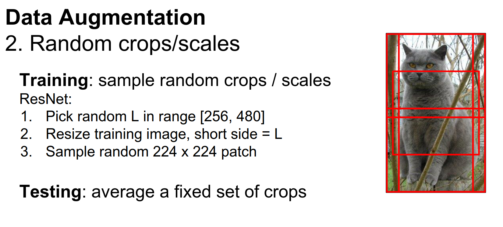

ResNet actually takes this one step further and does multiple scales at test time as well. This tends to help performance in practice.

Again, very easy to implement and very widely used.

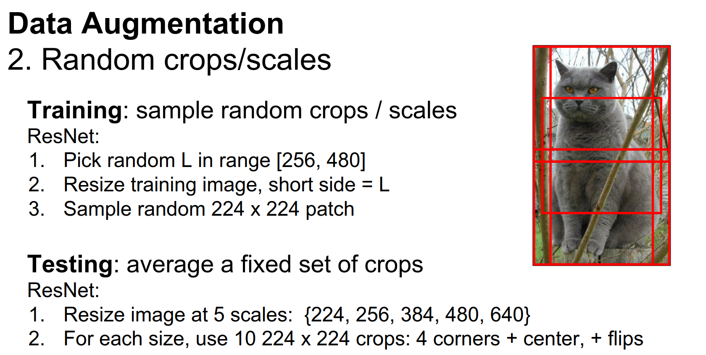

Another thing we usually do for data augmentation is color jittering.

### Color Jittering

If you take this picture of a cat, maybe it was a little bit cloudy that day or a little bit sunnier. If we had taken the picture then, a lot of the colors would have been quite different.

One thing that's very common is to change the color of our training images a little bit before we feed them to the CNN. A very simple way is just to change the contrast. This is again very easy to implement.

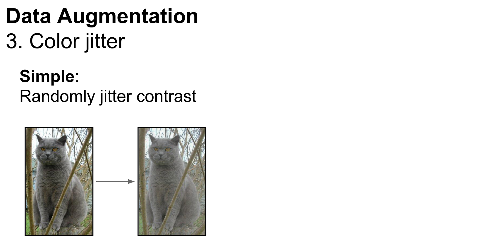

In practice, you'll see that simple contrast jittering is a little less common. Instead, you often see a slightly more complex pipeline using Principal Component Analysis (PCA) over all the pixels of the training data.

#### PCA Color Augmentation

Each pixel in the training data is a vector of length three (RGB). If we collect those pixels over the entire training dataset, we get a sense of what kinds of colors generally exist in the training data.

Using PCA gives us three principal component directions in color space, which tell us the directions along which color tends to vary in the dataset.

At training time, for color augmentation, we can use these principal components of the color of the training set to choose exactly how to jitter the color.

It's a little more complicated, but it is pretty widely used. I think it was introduced with the AlexNet paper in 2012. It is also used in ResNets.

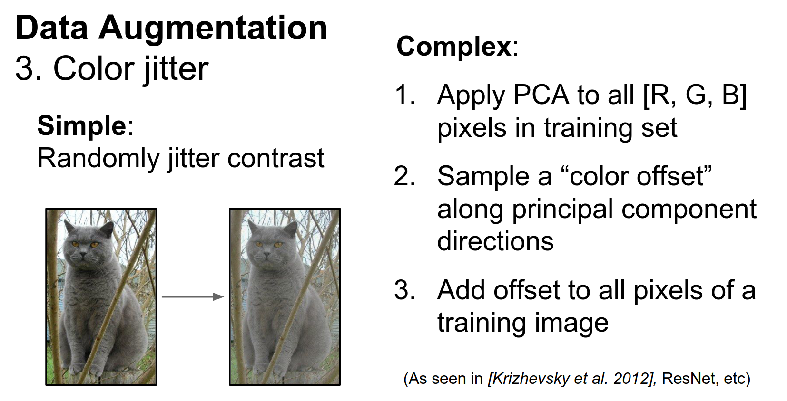

Data augmentation is a very general concept. You just want to think about what kinds of transformations you want your classifier to be invariant to for your dataset.

Then you want to introduce those types of variations to your training data at training time.

#### Invariance Considerations

Depending on your data, maybe rotations of a couple of degrees make sense. You could try different kinds of stretching and shearing to simulate affine transformations.

You could really go crazy here, get creative, and think of interesting ways to augment your data.

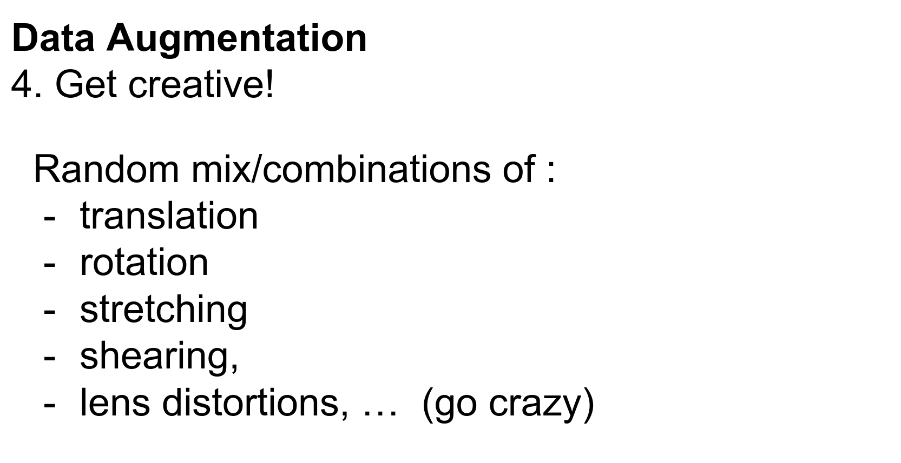

The idea of data augmentation fits into a larger theme that we've seen repeated many times throughout the course.

This theme is that one useful way to prevent overfitting (as a regularizer) is to add some kind of weird stochastic noise during the forward pass when training our network to mess with it.

- For example, with **data augmentation**, we're modifying the training data that we put into the network.
- With things like **Dropout** or **DropConnect**, you're taking random parts of the network and setting the activations or weights to zero randomly.
- This also appears with **Batch Normalization**, since your normalization constants depend on the other things in the mini-batch. During training, the same image might appear in mini-batches with different other images, introducing noise.

But in all of these examples, at test time ***we average out this noise***.

- For data augmentation, we take averages over many different samples of the training data.
- For Dropout and DropConnect, you can evaluate and marginalize this out more analytically.
- For Batch Normalization, we keep running means.

This unifies a lot of regularization ideas: add noise at the forward pass and then marginalize over it at test time.

#### Noise Marginalization

Keep that in mind if you're trying to come up with other creative ways to regularize your networks.

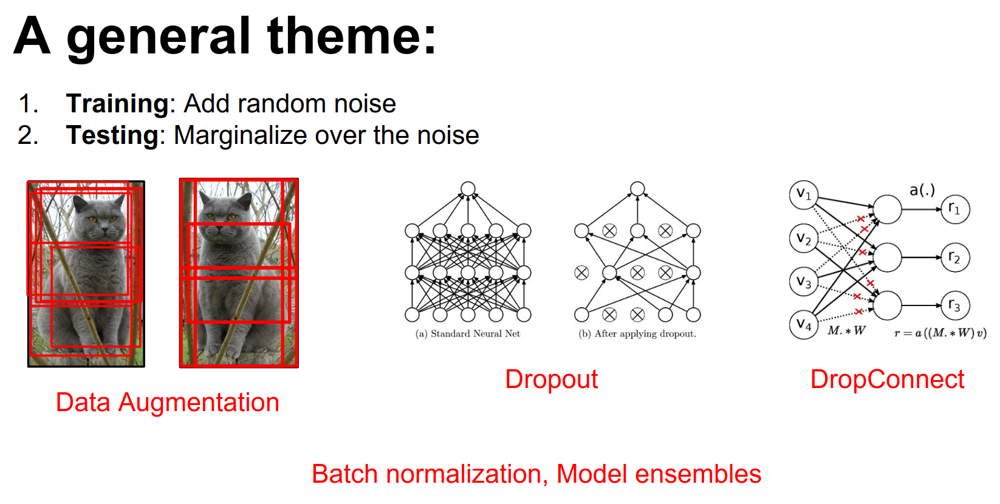

The main takeaways for data augmentation are:

1. It's usually really simple to implement.
2. It's very useful, especially for small datasets (which many of you are using for your projects).
3. It fits nicely with this framework of noise at training and marginalization at test time.

#### Pre-computation vs Live Resampling

**Q:** Do you pre compute your augmented dataset or you resample live as you are training?

**A:** A lot of times you'll actually resample it live at training time because it would take a lot of disk space to dump these things to disk.

Sometimes people get creative and have background threads that are fetching data and performing augmentation.

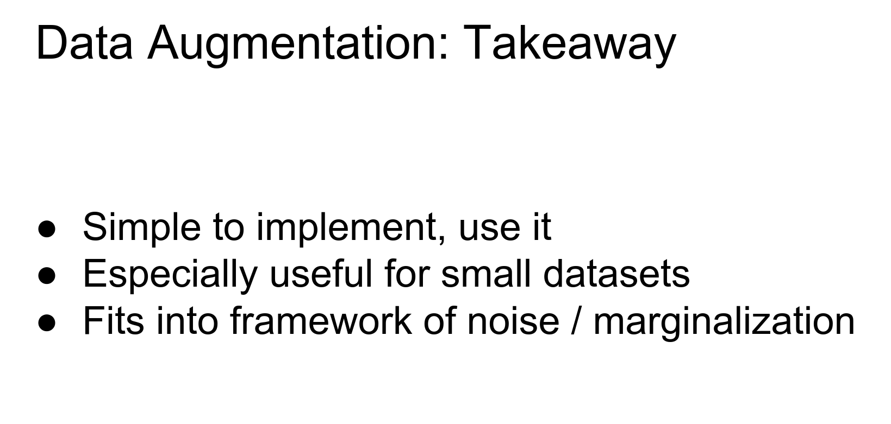

There's this myth floating around that when you work with CNNs, you really need a lot of data.

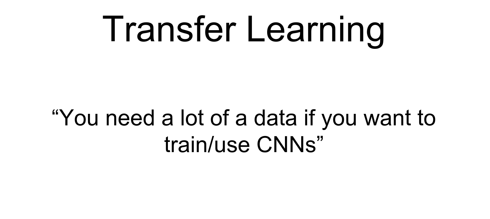

But it turns out that with **Transfer Learning**, this myth is busted.

There's a really simple recipe that you can use for transfer learning.

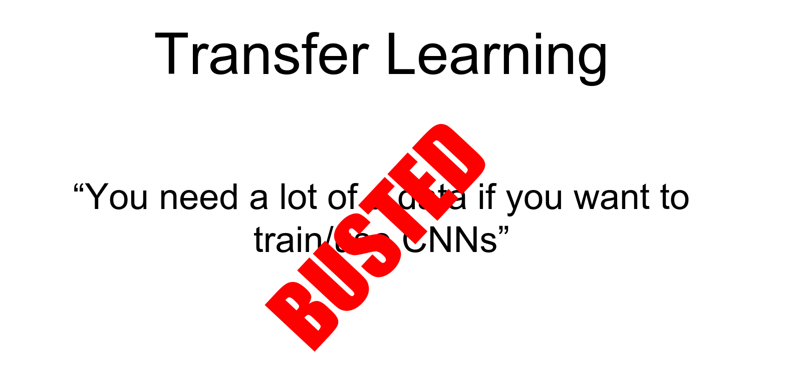

First, you take your favorite CNN architecture—be it AlexNet, VGG, or what have you—and you either train it on ImageNet yourself or, more commonly, download a pretrained model from the internet.

That's easy to do; it just takes a couple of minutes to download. It takes many hours to train, but you probably won't do that part.

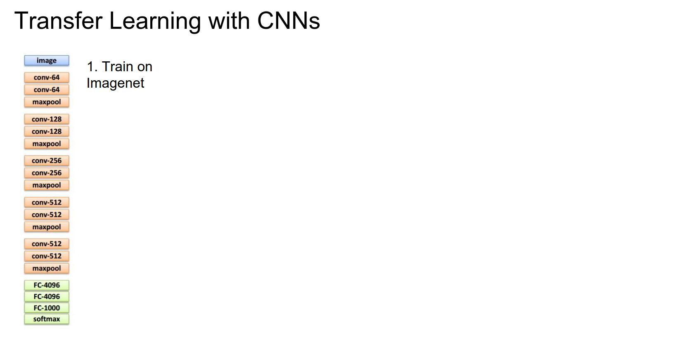

Next, there are two general cases:

If your dataset is really small and you don't have many images, you can treat this classifier as a fixed feature extractor.

### Fixed Feature Extractor

You take the last layer of the network (the softmax, if it's an ImageNet classification model), remove it, and replace it with a linear classifier for the task you actually care about. Now you freeze the rest of the network and retrain only that top layer.

This is equivalent to training a linear classifier directly on top of features extracted from the network. In practice, for this case, you often dump features to disk for all your training images as a preprocessing step and then work entirely on top of those cached features.

That can speed things up quite a bit. It's easy to use and very common. It usually provides a very strong baseline for many problems you might encounter.

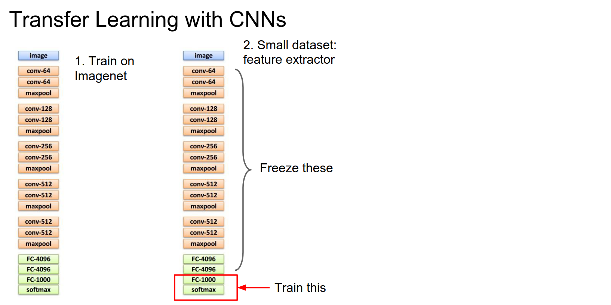

If you have a little bit more data, you can afford to train more complex models. Depending on the size of your dataset, usually, you'll freeze some of the lower layers of the network and then, instead of retraining only the last layer, you'll pick some number of the last layers to train.

Generally, when you have a larger dataset available for training, you can afford to train more of these final layers.

Similar to the trick above, you'll commonly see that instead of explicitly computing the frozen part, you'll just dump these last layer features to disk and then work on the trainable part in memory. That can speed things up quite a lot.

#### Weight Requirements

It depends. Sometimes you will run through the forward pass, but sometimes you'll just run the forward pass once and dump these to disk. That's pretty common because it saves compute.

#### Freezing Strategy

Typically, this final layer you'll always need to swap in and reinitialize from random because you'll probably have different classes or you're doing a regression problem.

But these other intermediate layers you'll initialize from whatever was in the pretrained model.

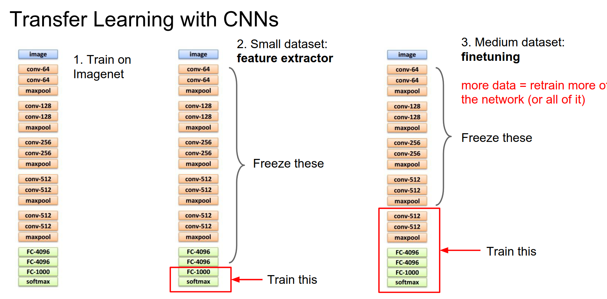

Actually, in practice, when you're fine-tuning, a nice tip is that there are literally three types of layers:

1.  **Frozen layers**: Think of these as having a learning rate of zero.
2.  **New layers**: Reinitialized from scratch. Typically these have a higher learning rate, but not too high—maybe 1/10th of what your network was originally trained with.
3.  **Intermediate layers**: Initialized from the pretrained network but modified during optimization. These tend to have a very small learning rate, maybe 1/100th of the original.

#### Data Similarity

That's a good question. Some people have investigated that and found that generally, fine-tuning works better when the network was originally trained with similar types of data. But in fact, these very low-level features are things like edges, colors, and Gabor filters, which are probably going to be applicable to just about any type of visual data.

So especially these lower-level features are generally pretty applicable to almost anything.

Another tip you sometimes see in practice for fine-tuning is a ***multi-stage approach***. First, you freeze the entire network and only train the last layer. Then, after this last layer seems to be converging, go back and fine-tune the rest.

You can sometimes have the problem that because this last layer is initialized randomly, you might have very large gradients that mess up the initialization of the pretrained layers.

The two ways we get around that are either freezing this at first and letting it converge or by having this varying learning rate between the two regimes of the network.

#### Learning Rate Schedules 🥰

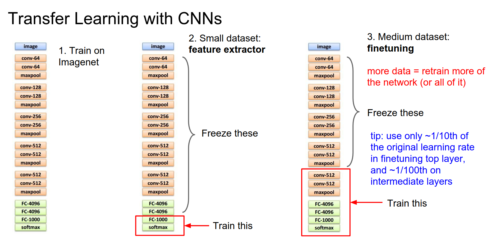

This idea of transfer learning works really well.

There were a couple of early papers from 2013-2014 when CNNs first started getting popular.

This one in particular, the ***Astounding Baseline paper***, was pretty cool: *"The Astounding Performance of Solitary Convolutional Neurons as Visual Feature Extractors"*.

They took what was at the time one of the best CNNs, OverFeat, extracted features from it, and applied these features to a bunch of different standard datasets and problems in computer vision.

They compared it against what were at the time very specialized pipelines and architectures for each individual problem.

For each problem, they just replaced the specialized pipeline with very simple linear models on top of features from OverFeat.

They found that, in general, these OverFeat features were a very strong baseline. For some problems, they were actually better than existing methods, and for others, they were a little worse but still quite competitive.

This was a really cool paper; they demonstrated that these are really strong features that can be used in a lot of different tasks and tend to work quite well.

Another paper along those lines was from Berkeley, the DeCAF paper. DeCAF later became [Caffe](https://github.com/BVLC/caffe), so there's a lineage there.

---
### Origins of Caffe 😍

The paper you're referring to is "DeCAF: A Deep Convolutional Activation Feature for Generic Visual Recognition" by Donahue et al., published in 2014. Here's a summary of the key points:

1.  **Motivation**: The paper aimed to explore the use of deep CNNs as generic feature extractors for a wide range of visual recognition tasks.
2.  **Approach**: They developed a deep CNN architecture called DeCAF, trained on ImageNet. They used activations from intermediate layers as generic visual features.
3.  **Experiments and Results**: They evaluated DeCAF features on benchmarks like Caltech-101, PASCAL VOC, and MIT Indoor Scenes. DeCAF features consistently outperformed traditional hand-crafted features like SIFT and HOG.
4.  **Key Findings**: Deep CNN features are effective generic visual representations, highlighting the importance of transfer learning.
5.  **Impact**: This work led to the development of the Caffe deep learning framework.

---

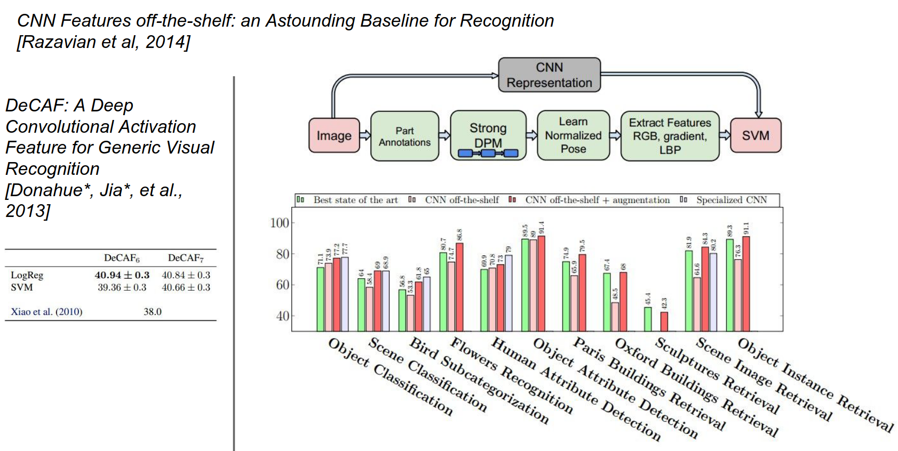

The recipe for transfer learning involves thinking about this $2 \times 2$ matrix: how similar is your dataset to the pretrained model, and how much data do you have?

#### Transfer Learning Matrix

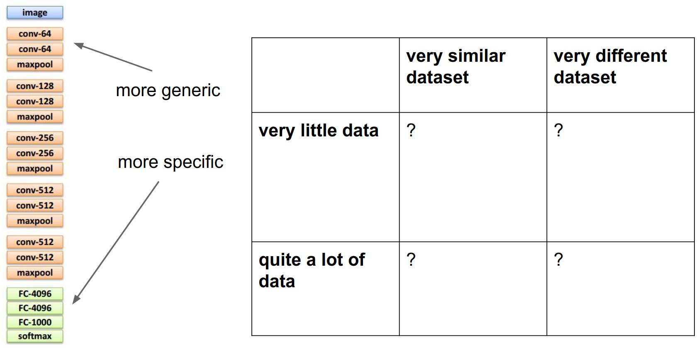

-   If you have a **very similar dataset and very little data**, just use the network as a fixed feature extractor and train simple linear models on top.
-   If you have a **little bit more data**, you can try fine-tuning: initialize the network from pretrained weights and run optimization from there.

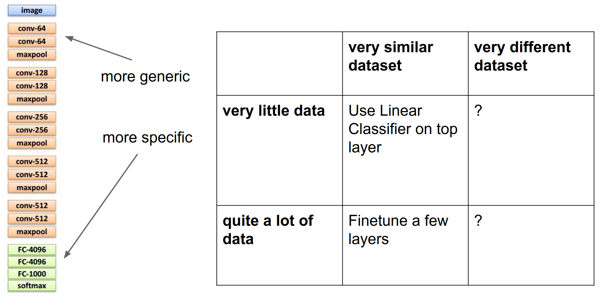

-   The top-left box (very different dataset, little data) is trickier. You might be in trouble. You can try to get creative; maybe instead of extracting features from the very last layer, try extracting features from different layers. The intuition is that top-level features are very specific to ImageNet categories, but low-level features (edges, etc.) **might be more transferable** to non-ImageNet datasets.
-   In the bottom-right box (different dataset, lots of data), you're in better shape. You can just initialize and fine-tune.

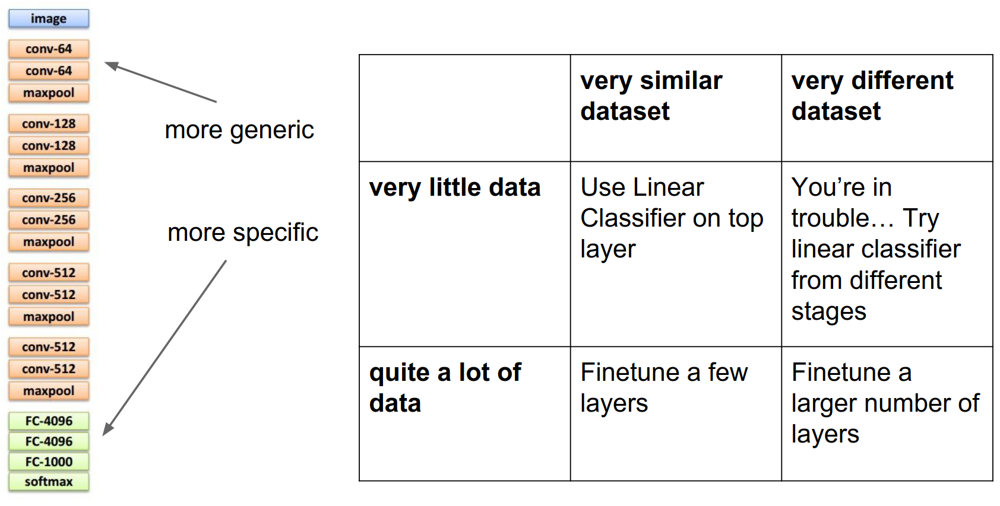

This idea of initializing with pretrained models and fine-tuning is standard practice in almost any larger system you'll see in computer vision.

We've actually seen two examples of this already in the course.

For object detection, we had a CNN looking at the image and region proposals. For image captioning, we had a CNN looking at the image.

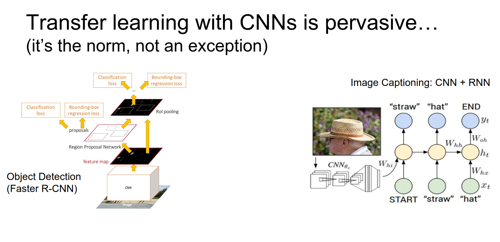

In both cases, those CNNs were initialized from ImageNet models. That really helps to solve these other more specialized problems even without gigantic datasets.

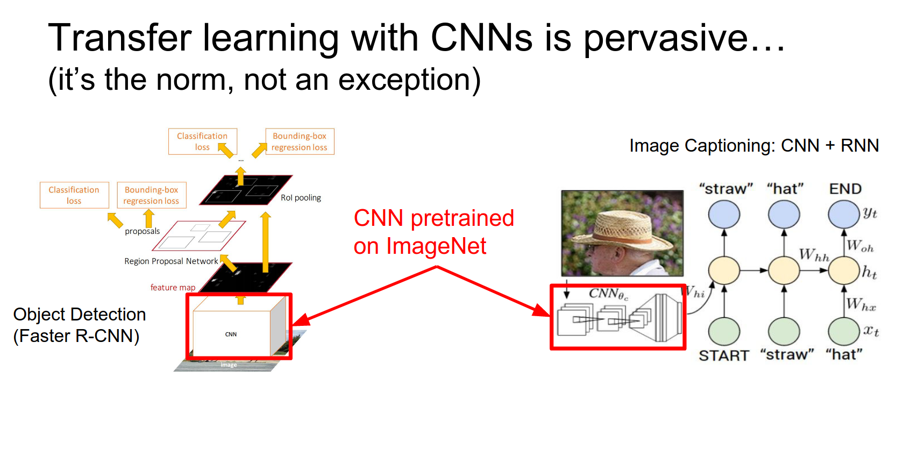

Also, for the image captioning model, part of the model includes word embeddings. Those word vectors can be initialized from something else that was pretrained on a bunch of text.

That can sometimes help in situations where you might not have a lot of captioning data available.

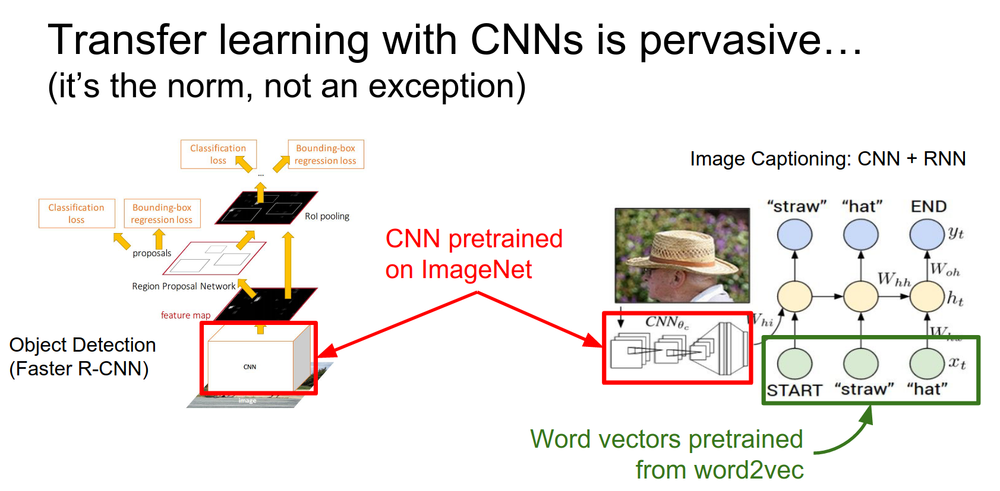

The takeaway about fine-tuning is that it's a really good idea.

It works really well in practice; you should probably almost always be using it. You generally don't want to be training these things from scratch unless you have really large datasets available.

In almost all circumstances, it's much more convenient to fine-tune an existing model.

By the way, Caffe has a Model Zoo where you can download many famous ImageNet models. The Residual Networks official model got released recently, so you can download that and play with it.

These Caffe Model Zoo models are a standard in the community, so you can even load Caffe models into other frameworks like Torch.

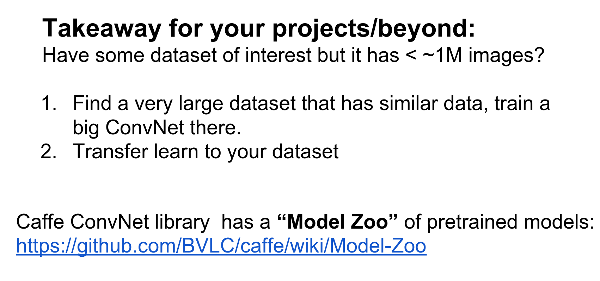

We should talk more about convolutions.

For all these networks we've talked about, convolutions are the computational workhorse doing a lot of the work.

We need to talk about two things regarding convolutions: **the first is how to stack them.**

### Efficient Architecture Design

Suppose we have a network that has two layers of $3 \times 3$ convolutions. The question is: for a neuron on this second layer, how big of a region on the input does it see?

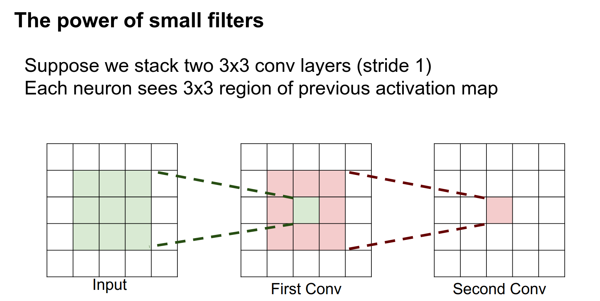

This was on your midterm, so I hope you all know the answer.

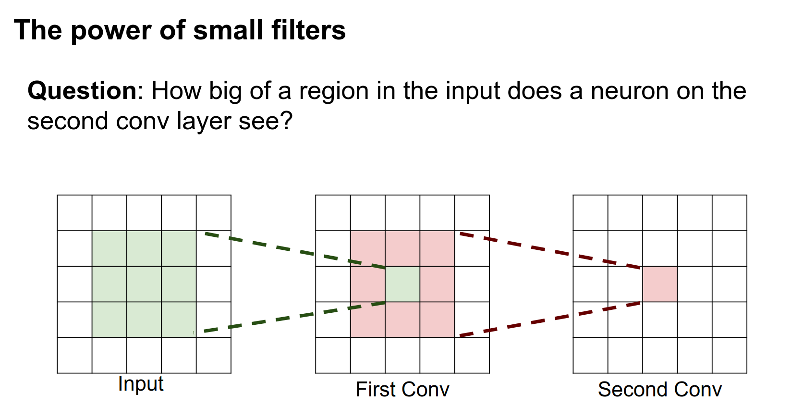

It is a $5 \times 5$.

It's pretty easy to see from this diagram why. This neuron after the second layer is looking at this entire volume in the intermediate layer. This pixel in the intermediate layer is looking at a $3 \times 3$ region in the input. When you look at all three of these, the neuron in the third layer is actually looking at this entire $5 \times 5$ volume in the input.

So this neuron actually sees the entire input!

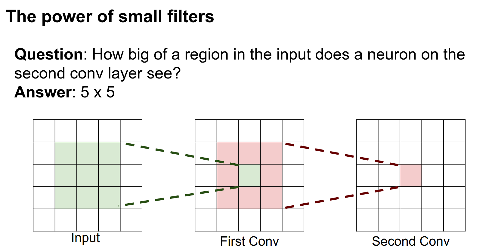

Now, if we had three $3 \times 3$ convolutions stacked in a row, how big of a region in the input would they see?

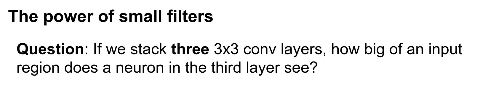

The receptive fields build up with successive convolutions. Three $3 \times 3$ convolutions actually give you a very similar representational power to a single $7 \times 7$ convolution.

#### Stacked Convolutions

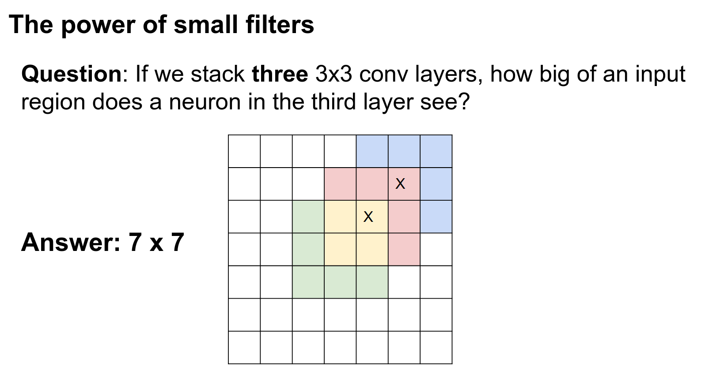

You could try to prove theorems about it, but intuitively, three $3 \times 3$ convolutions can represent similar types of functions as a single $7 \times 7$ convolution since they look at the same input region.

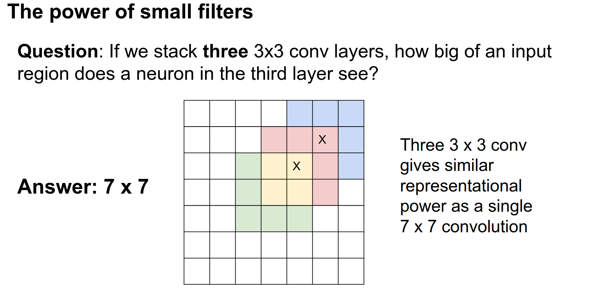

Now we can dig further and compare more concretely between a single $7 \times 7$ convolution versus a stack of three $3 \times 3$ convolutions.

#### Comparison: 7x7 vs 3x3

Let's suppose we have an input image that's $H \times W \times C$ and we want to have convolutions that preserve the depth.

So we have $C$ filters and we want to preserve height and width, so we set padding appropriately.

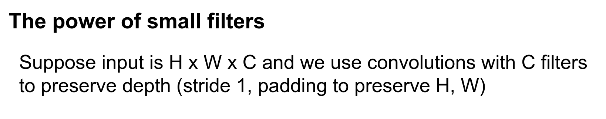

**Parameter Comparison**

How many weights do each of these two things have?

(Forget about biases because they are confusing.)

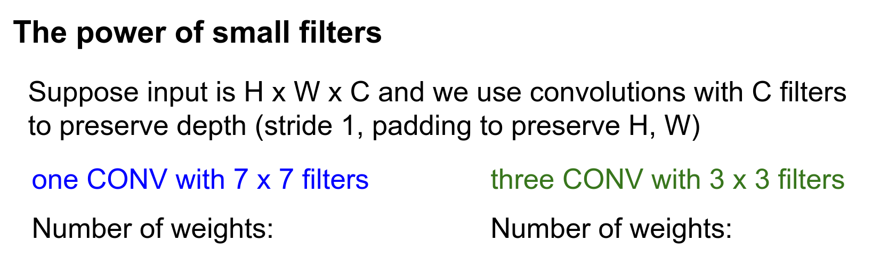

For the $7 \times 7$ convolution: each filter is looking at a depth of $C$, and you've got $C$ such filters, so $49 C^2$.

For the three $3 \times 3$ convolutions: we have three layers. Each filter is $3 \times 3 \times C$, and each layer has $C$ filters.

When you multiply that all out, we see that three $3 \times 3$ convolutions only have $27 C^2$ parameters.

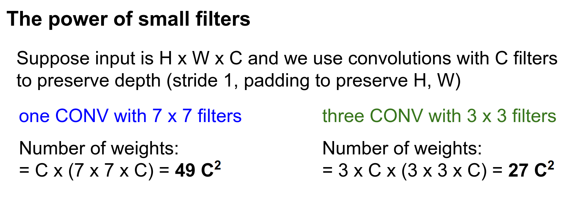

Assuming that we have ReLU between each of these convolutions, the stack of three $3 \times 3$ convolutions actually **has fewer parameters** (which is good) and **more non-linearity** (which is good).

This gives you some intuition for why a stack of multiple $3 \times 3$ convolutions might be preferable to a single $7 \times 7$ convolution.

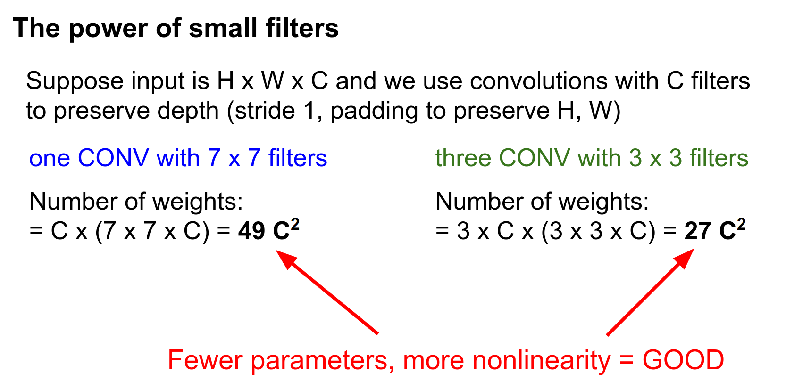

**FLOPs Comparison**

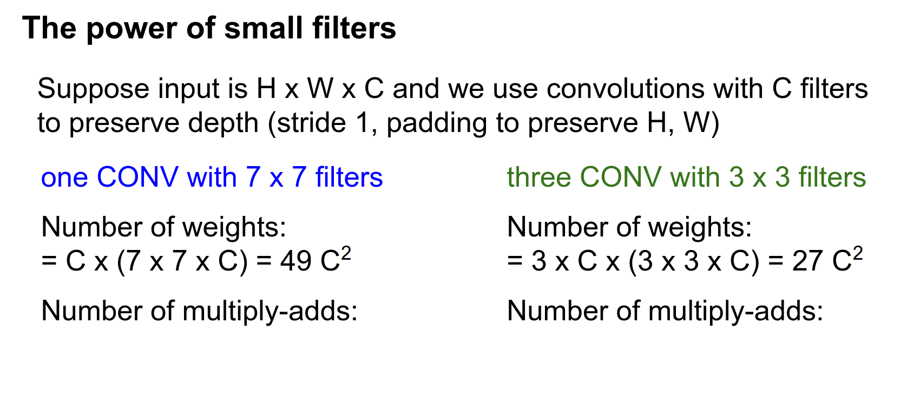

For each of these filters, we're going to be using it at every position in the image.

So the number of multiply-adds is just **height $\times$ width $\times$ the number of learnable filters**.

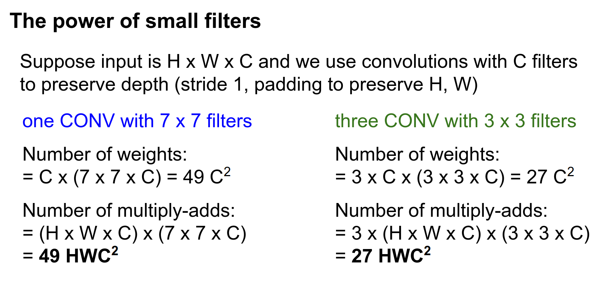

Comparing these two, the $7 \times 7$ actually not only has more learnable parameters, but it also costs a lot more to compute.

So the stack of three $3 \times 3$ convolutions gives us more non-linearity for less compute.

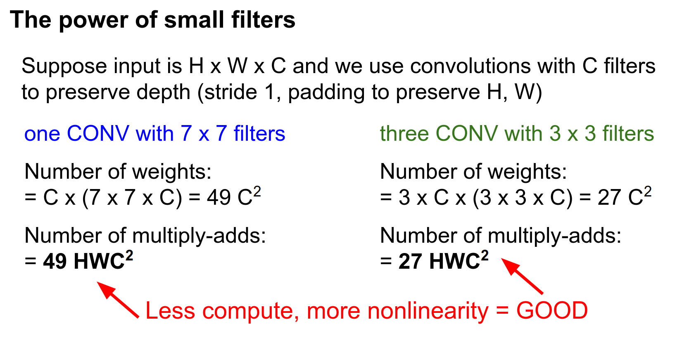

Then you can think of another question:

#### Smaller Filters

Maybe the same logic would extend?

The problem is you don't get the receptive field.

Let's compare a single $3 \times 3$ convolution versus a slightly fancier architecture called **a bottleneck architecture**.

Here we assume an input of $H \times W \times C$. We can do a cool trick: use a single $1 \times 1$ convolution with $C / 2$ filters to reduce the dimensionality of the volume.

So now this thing will have the same spatial extent but half the number of features in depth.

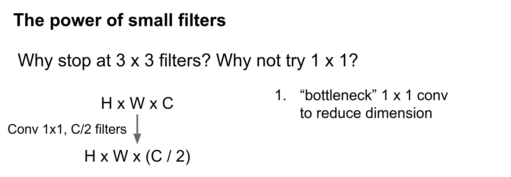

After this bottleneck, we do a $3 \times 3$ convolution at this reduced dimensionality.

This $3 \times 3$ convolution takes $C/2$ input features and produces $C/2$ output features.

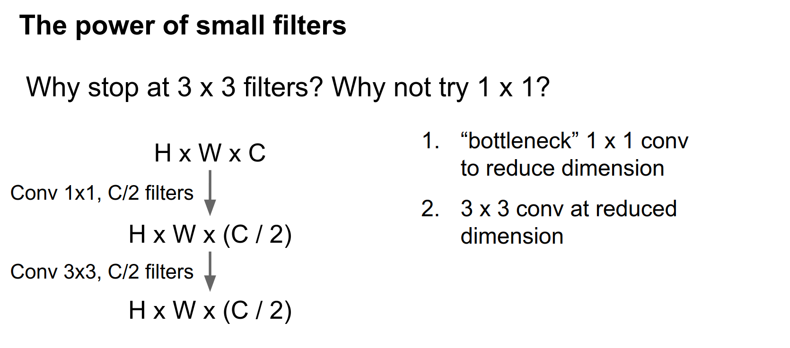

And now we restore the dimensionality with another $1 \times 1$ convolution to go from $C / 2$ back to $C$. This idea of using $1 \times 1$ convolutions everywhere is sometimes called ***Network in Network***.

#### Network in Network

The intuition is that a $1 \times 1$ convolution is kind of similar to sliding a fully connected network over each part of your input volume.

This idea also appears in GoogLeNet and in ResNet.

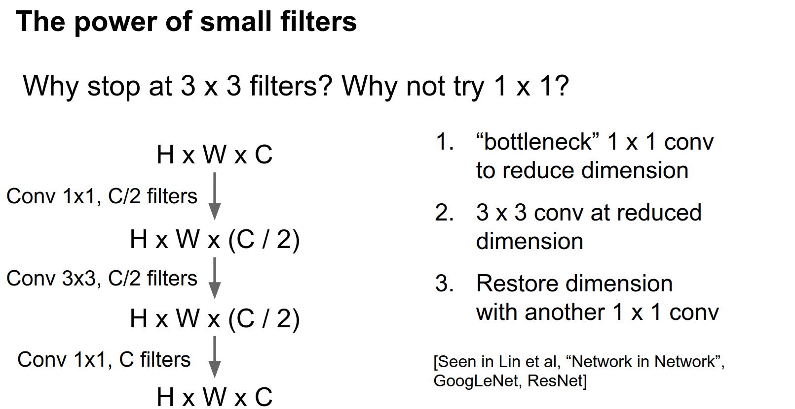

We can compare this bottleneck sandwich to a single $3 \times 3$ convolution with $C$ filters.

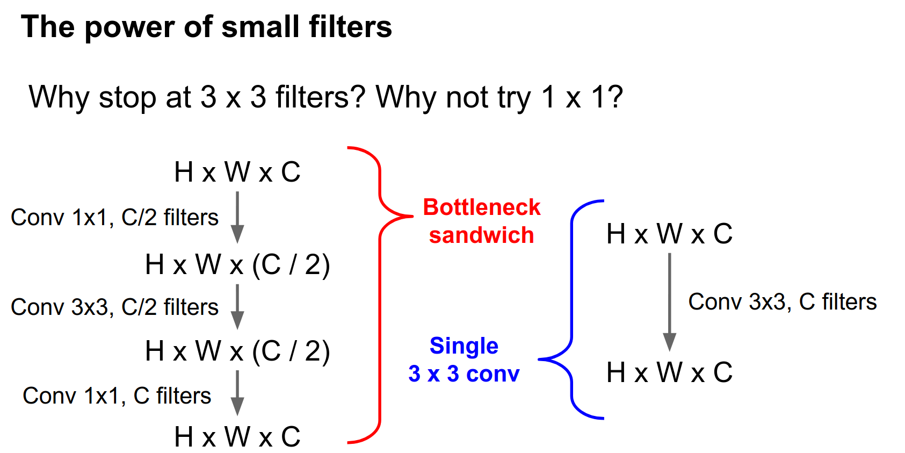

This bottleneck stack has $3.25 C^2$ parameters, whereas the single convolution has $9 C^2$ parameters.

If we stick ReLUs in between, this bottleneck sandwich gives us **more non-linearity for fewer parameters**.

The number of parameters is tied directly to the amount of computation. So this bottleneck sandwich is also much faster to compute.

**Parameter-Compute Relationship 💕**

This idea of $1 \times 1$ bottlenecks has received quite a lot of usage recently in GoogLeNet and ResNet especially.

**1x1 Convolutions**

Those convolutions are learned. You might think of it as a projection from a lower-dimensional feature back to a higher-dimensional space.

If you stack many of these things on top of each other (as in ResNet), then coming immediately after this one is going to be another $1 \times 1$, so you're stacking multiple $1 \times 1$ convolutions.

A $1 \times 1$ convolution is a little bit like sliding a multi-layer fully connected network over each depth channel.

It turns out that you don't really need the spatial extent. Even just comparing this sandwich to a single $3 \times 3$ Conv, you have the same input-output sizes, but with more non-linearity, cheaper computation, and fewer learnable parameters.

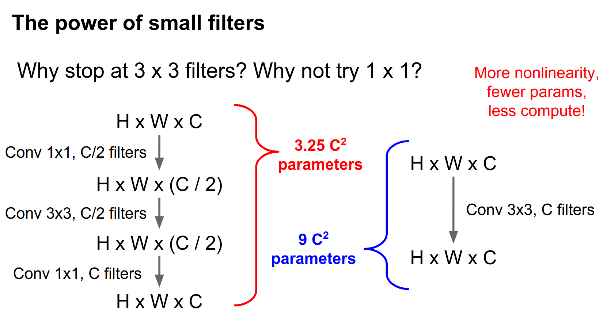

There's one problem with this: we're still using a $3 \times 3$ convolution in there somewhere. Do we really need this?

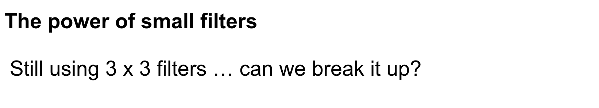

The answer is no. One crazy thing I've seen recently is that you can factor this $3 \times 3$ convolution into a $3 \times 1$ and a $1 \times 3$.

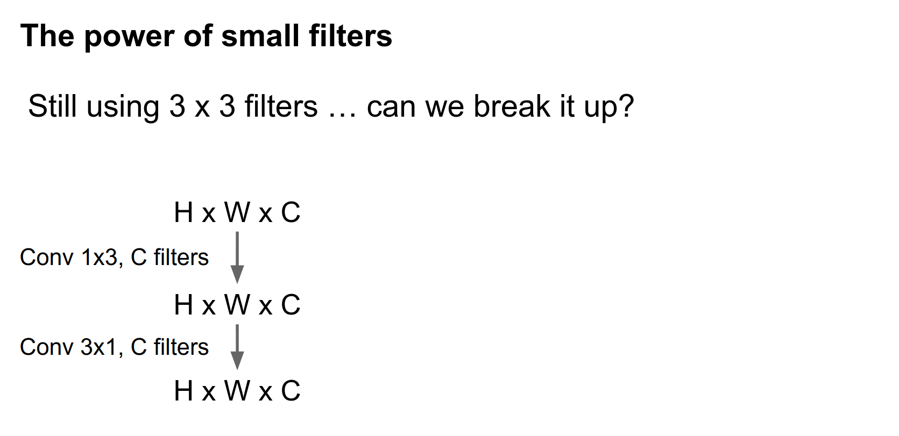

Compared with a single $3 \times 3$ convolution, this ends up saving you some parameters as well.

You can even combine this $1 \times 3$ and $3 \times 1$ together with this bottlenecking idea, and things just get really cheap.

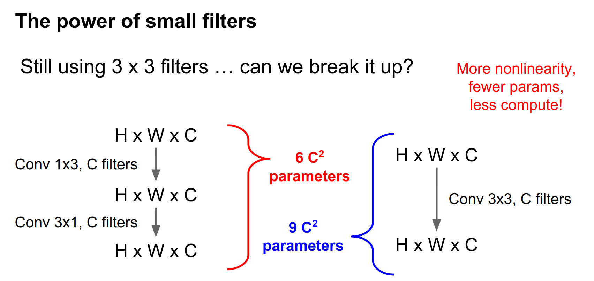

That's basically what Google has done in their most recent version of Inception.

*Rethinking the Inception Architecture for Computer Vision*, where they play a lot of these crazy tricks about factoring convolutions in weird ways and having a lot of $1 \times 1$ bottlenecks.

If you thought the original GoogLeNet was crazy, these are the inception modules that Google is now using in their newest Inception Net.

The interesting features here are that they have these $1 \times 1$ bottlenecks everywhere and asymmetric filters to save on computation.

This stuff is not super widely used yet, but it's out there.

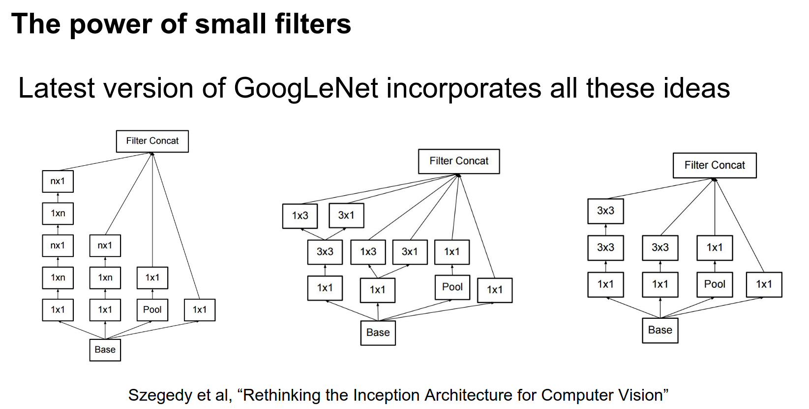

### Convolution Stacking Recap

-   It's usually better to break up a single large convolution into multiple smaller filters. This explains the difference between VGG (many $3 \times 3$ filters) and AlexNet (fewer larger filters).
-   The idea of $1 \times 1$ bottlenecking is pretty common (GoogLeNet, ResNet) and helps save a lot on parameters.
-   Factoring convolutions into asymmetric filters is maybe not so widely used right now but may become more common.

The overarching theme for all of these tricks is that they let you have ***fewer learnable parameters, less compute, and more non-linearity***.

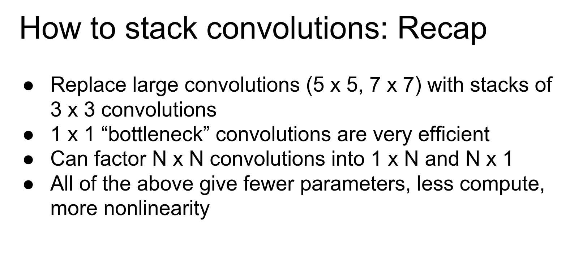

### Computing Convolutions 🤔

Once you've decided on how you want to wire up your convolutions, you actually need to compute them.

There has been a lot of work on different ways to implement convolutions. We asked you to implement it on the assignments using `for` loops, and as you may have guessed, that doesn't scale too well.

A pretty easy approach that's simple to implement is the `im2col` method.

The intuition here is that we know matrix multiplication is really fast. Pretty much for any computing architecture out there, someone has written a really well-optimized matrix multiplication routine or library.

So the idea of `im2col` is: given that matrix multiplication is really fast, is there some way that we can take this convolution operation and recast it as a matrix multiply?

#### Matrix Multiplication Recasting

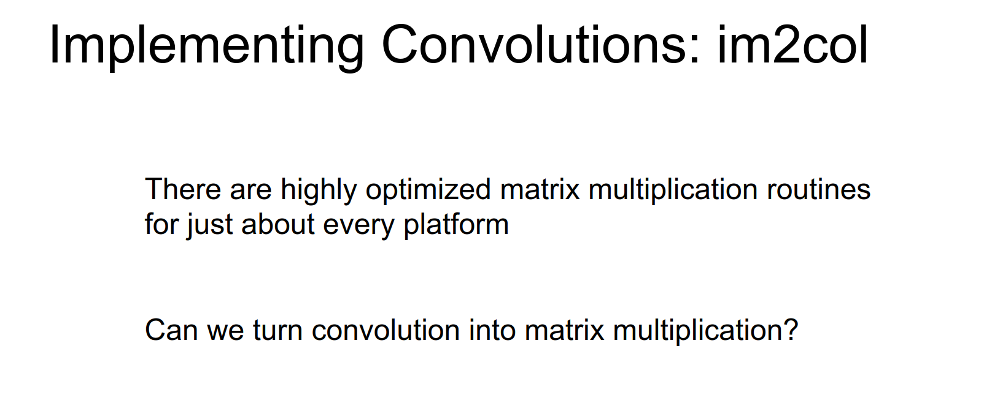

It turns out that this is somewhat easy to do once you think about it.

We have an input volume that's $H \times W \times C$ and a filter bank of convolutional filters. Each one of these is going to be a $K \times K \times C$ volume, so it has a $K \times K$ receptive field and a depth of $C$ to match the input.

We're going to have $D$ of these filters, and we want to turn this into a matrix multiply problem.

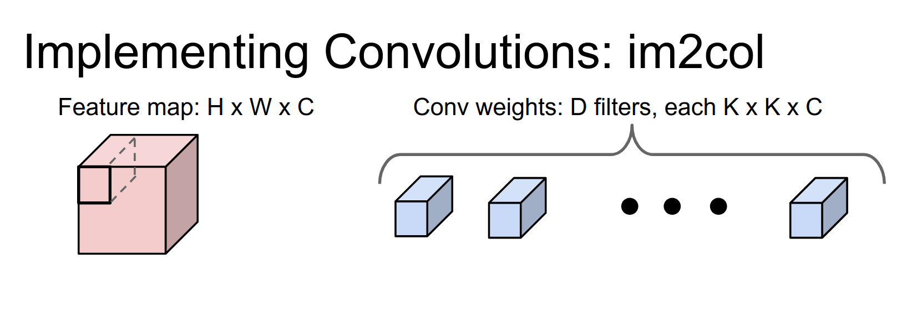

The idea is that we're going to take the first receptive field of the image, which is this $K \times K \times C$ volume in the input, and reshape it into a column of $K^2 C$ elements.

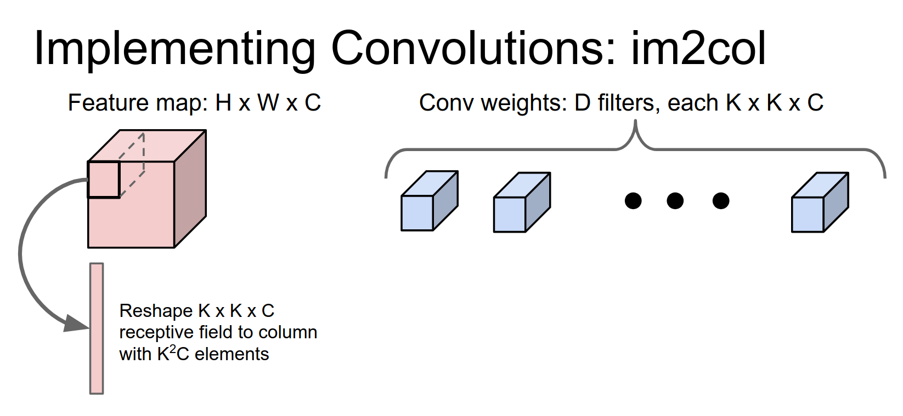

Then we're going to repeat this for every possible receptive field in the image.

There are going to be $N$ different receptive field locations.

So now we've taken our image and reshaped it into this giant matrix of $N \times (K^2 C)$. Does anyone see a potential problem with this?

TODO - Cont.

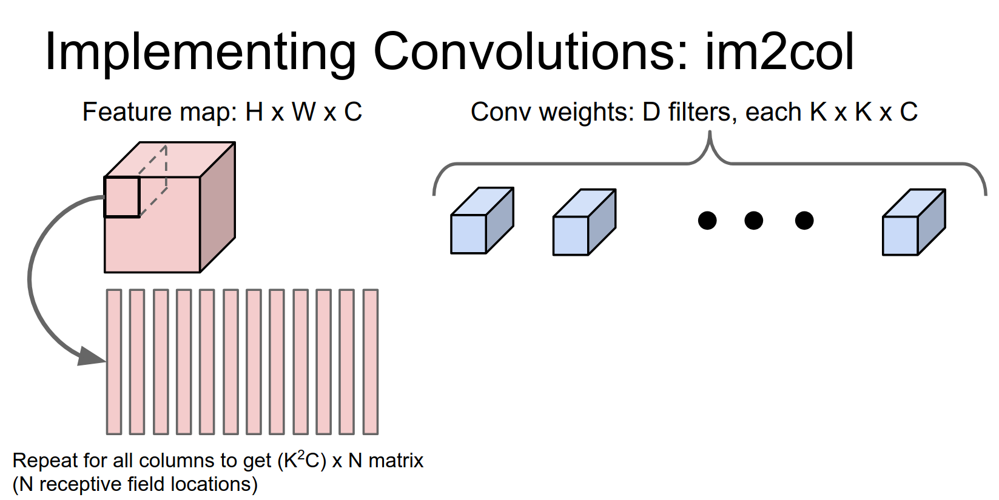

This tends to use a lot of memory. Any element in this input volume, if it appears in multiple receptive fields, will be duplicated in multiple columns.

This gets worse the more overlap there is between your receptive fields.

But it turns out that in practice, that's actually not too big of a deal, and it works fine.

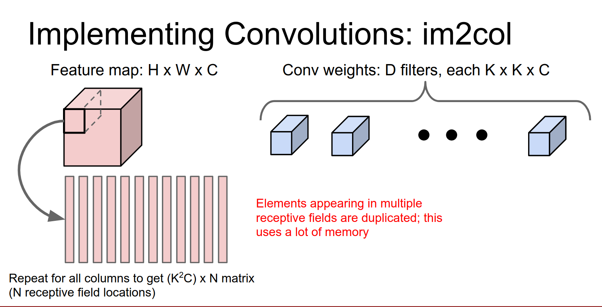

We're going to run a similar trick on these convolutional filters. If you remember what a convolution is doing, we want to take inner products with each convolutional weight against each receptive field location in the image.

Each of these convolutional weights is a $K \times K \times C$ tensor, so we're going to reshape each of those to be a $K^2 C$ row.

Now we have $D$ filters, so we get a $D \times (K^2 C)$ matrix.

The matrix on the left contains all the receptive fields (one column per receptive field), and the matrix on the right has the weights (one row per filter).

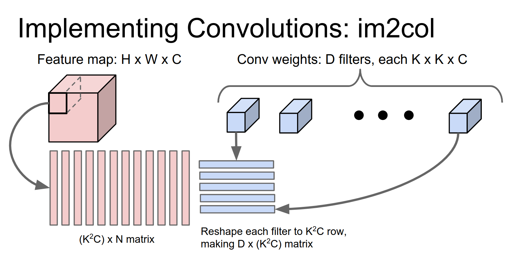

Now we can easily compute all of these inner products at once with a single matrix multiply.

(I apologize for these dimensions not working out perfectly in the slide; I probably should have swapped these two to make it more obvious, but I think you get the idea.)

This gives you a $D \times N$ result, where $D$ is our number of output filters and $N$ is for all the receptive field locations in the image.

Then you play a similar trick to take this and reshape it into your 3D output tensor.

You can actually extend this to mini-batches quite easily. If you have a mini-batch of $N$ of these elements, you just add more rows and have one set of rows per mini-batch element.

**Reshape Cost**

It depends on your implementation, but then you have to worry about things like memory layout to make it fast.

Sometimes you'll even do that reshape operation on the GPU so you can do it ==in parallel==.

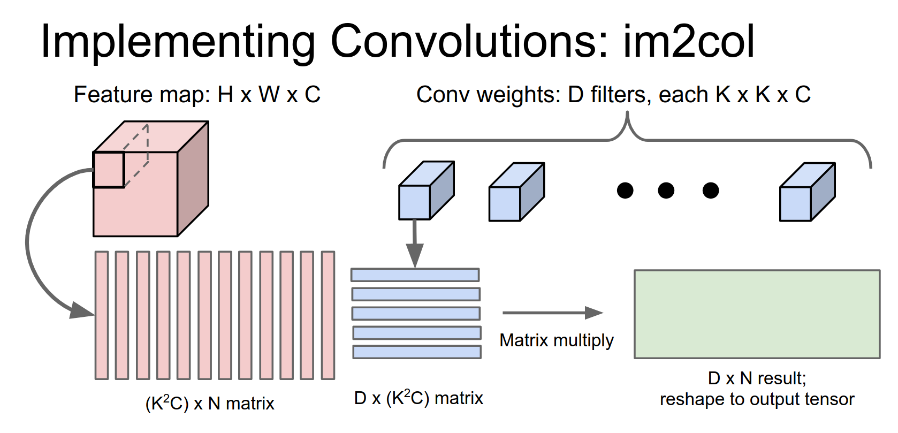

This is really easy to implement. If you don't have a convolution technique available and you need to implement one fast, this is probably the one to choose.

If you look at early versions of Caffe, this is the method they used for doing convolutions.

This is the convolution forward code for the native GPU convolution in Caffe.

You can see in this red chunk, they're calling this `im2col` method to take their input image and reshape it into this column GPU tensor.

Then they're going to do a matrix multiply calling `cuBLAS` and then add the bias.

These things tend to work quite well in practice.

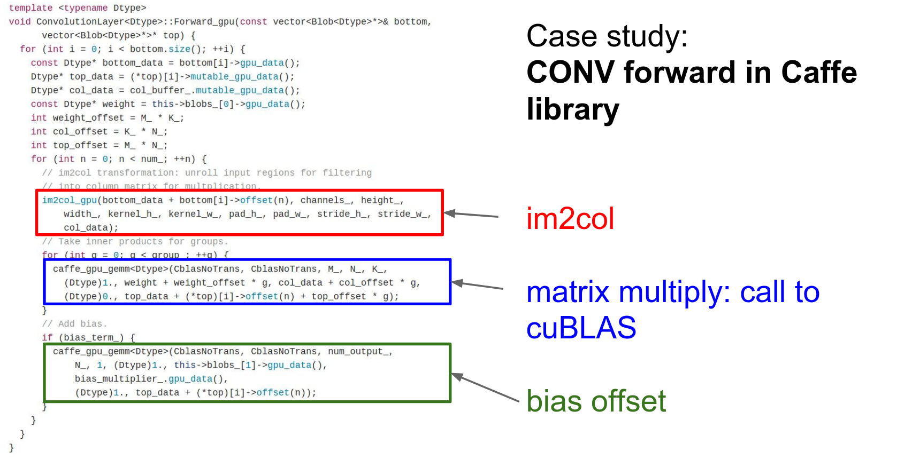

As another case study, if you remember the `fast_layers` we gave you in the assignments, it actually uses this exact same strategy. Here we actually do an `im2col` operation with some crazy numpy tricks, and then we can do the convolution inside the fast layers with a single call to numpy matrix multiplication.

And you saw in your homework that this usually gives maybe a couple hundred times speedup over using for loops. It works pretty well and is pretty easy to implement.

**Backward Pass**

Yes. If you think really hard, you'll realize that the backward pass of a convolution is actually also a convolution (which you may have figured out if you were thinking about it on your homework). It's a type of convolution over the upstream gradients.

So you can actually use a similar type of `im2col` method for the backward pass as well.

In the backward pass, you need to sum gradients from across overlapping receptive fields in the upstream, so you need to be careful about the `col2im` operation; you need to sum in `col2im`.

You can check out the fast layers in the homework; it implements that too.

(Although actually, for the fast layers on the homework, the `col2im` is in Cython because I couldn't find a way to get it fast enough in raw Numpy.)

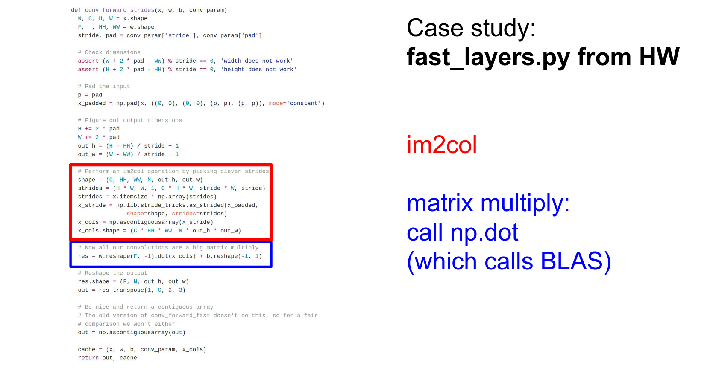

There's actually another way that sometimes people use for convolutions.

#### FFT Convolutions 🌠

That's this idea of a Fast Fourier Transform (FFT).

If you have memories from a signal processing class, you might remember the Convolution Theorem.

It says that if you have two signals and you want to convolve them (either discretely or continuously), the Fourier transform of the convolution is the same as the element-wise product of the Fourier transforms.

There's this amazing thing called the ==Fast Fourier Transform== that actually lets us compute Fourier transforms and inverse Fourier transforms really, really fast.

There are versions of this in 1D and 2D, and they're all really fast.

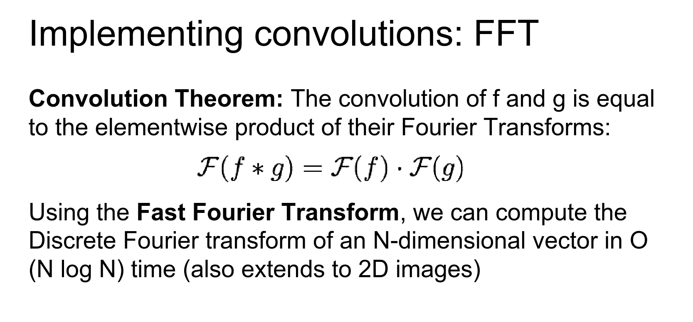

We can actually apply this trick to convolutions.

The way this works is:
1.  Use the FFT to compute the Fourier transform of the weights.
2.  Compute the Fourier transform of our activation map.
3.  In Fourier space, do an element-wise multiplication (which is really fast and efficient).
4.  Use the FFT to do the inverse transform on the output of that element-wise product.

And that implements convolutions for us in this cool, fancy, clever way.

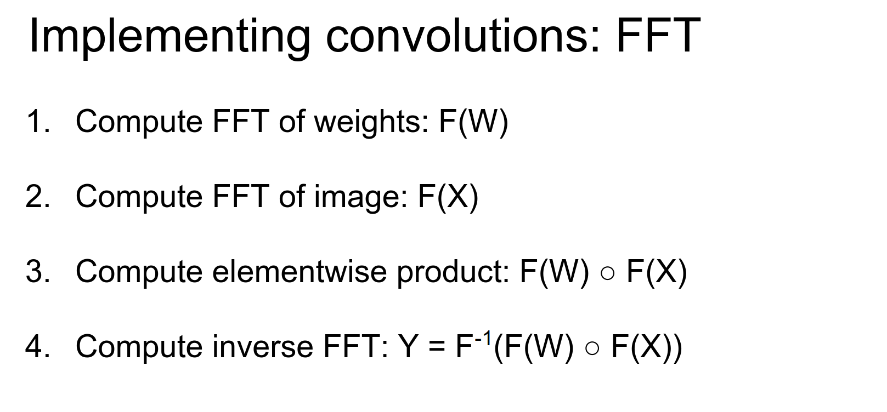

This has actually been used. Some folks at Facebook had a paper about this last year, and they actually released a GPU library to compute these things.

The sad thing about these Fourier transforms is that they give you really big speedups, but really only for large filters.

When you're working on these small $3 \times 3$ filters, the overhead of computing the Fourier transform is not worth it compared to doing the computation directly in the input pixel space.

And as we discussed earlier, those small convolutions are really nice and appealing for lots of reasons.

So it's a little bit of a shame that ==this Fourier trick doesn't work out too well in practice== for modern architectures.

But if for some reason you do want to compute really large convolutions, then this is something you can try.

Another downside is that ==they don't handle striding too well==.

For normal strided convolutions in input space, you only compute a small subset of those inner products, saving a lot of computation.

But the way you tend to implement strided convolutions in Fourier transform space is you just compute the whole thing and then throw out part of the data. That ends up not being very efficient.

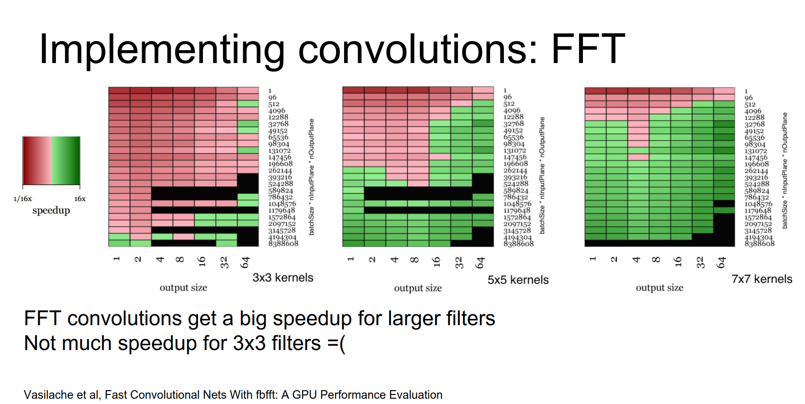

There's another trick that is not widely known.

You may remember from an algorithms class something called Strassen's Algorithm.

When you do a naive matrix multiplication of two $n \times n$ matrices, it takes $O(n^3)$ operations. Strassen's Algorithm computes crazy intermediates and recombines them to compute the output asymptotically faster.

From `im2col`, we know that we can implement convolution as matrix multiplication. So intuitively, you might expect that similar types of tricks might theoretically be applicable to convolution.

It turns out they are.

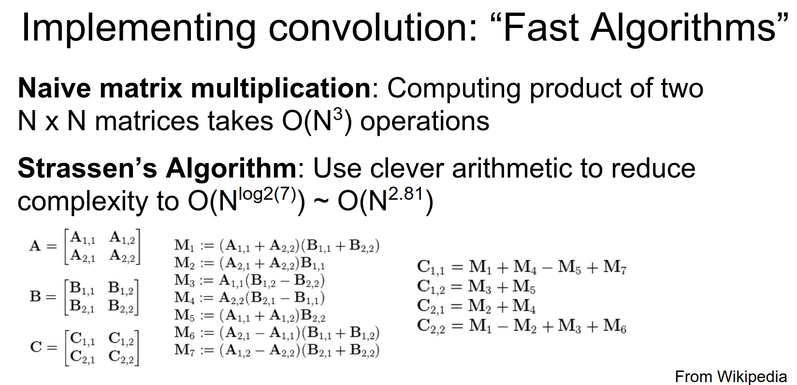

There's a really cool paper that just came out over the summer, where these two guys worked out very explicitly some very special cases for $3 \times 3$ convolutions.

It involves a similar flavor to Strassen's Algorithm, where you're computing very clever intermediates and then recombining them to save a lot on computation.

These guys are really intense; they are not just mathematicians, they also wrote highly optimized CUDA kernels to compute these things. They were able to speed up VGG by a factor of two, which is really impressive.

---
#### Winograd Algorithms

Here's a summary of the key points from the paper "Fast Algorithms for Convolutional Neural Networks" by Andrew Lavin and Scott Gray:

1.  **Motivation**: CNNs are computationally expensive. The authors aim to develop fast algorithms to speed up CNN computations.
2.  **Winograd's Minimal Filtering Algorithms**: The paper focuses on using Winograd's algorithms to speed up convolution, reducing the number of required multiplications.
3.  **Winograd Convolution**: The authors derive formulas for 2D convolution and show how they can be applied to CNN layers.
4.  **Efficient Implementation**: The paper provides efficient GPU implementations, including techniques to reduce memory usage.
5.  **Evaluation**: They show significant speedups (up to 2.5x) compared to standard convolution with minimal accuracy degradation.

---

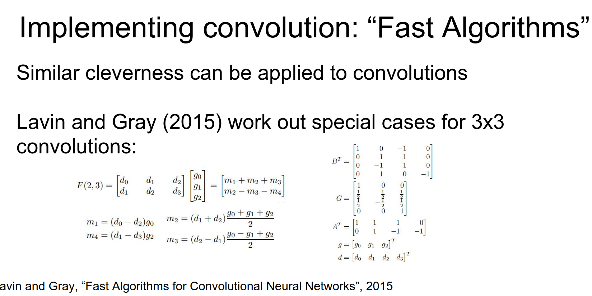

This type of trick might become pretty popular in the future, but for the time being, it's not very widely used.

But these numbers are crazy, and especially for small batch sizes, they're getting a $6x$ speedup on VGG. That's really impressive.

The downside is that you kind of have to work out these explicit special cases for each different size of convolution. But maybe if we only care about $3 \times 3$ convolutions, that's not such a big deal.

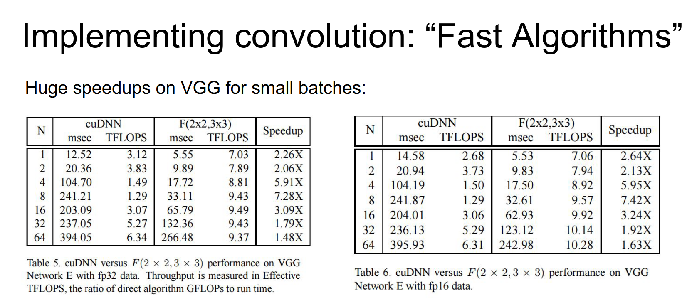

### Summary: Computing Convolutions

-   The really fast, easy, quick-and-dirty way to implement these things is `im2col`. Matrix multiplication is fast, and it's usually not too hard to implement. If you really need to implement convolutions yourself, I'd recommend `im2col`.
-   FFT seems cool from a signal processing perspective, but it turns out it only gives speedups for big filters, so it's not as useful as you might hope for modern CNNs.
-   There is hope because these fast algorithms (Winograd) are really good at small filters. Code already exists to do it, so hopefully, these things will catch on.

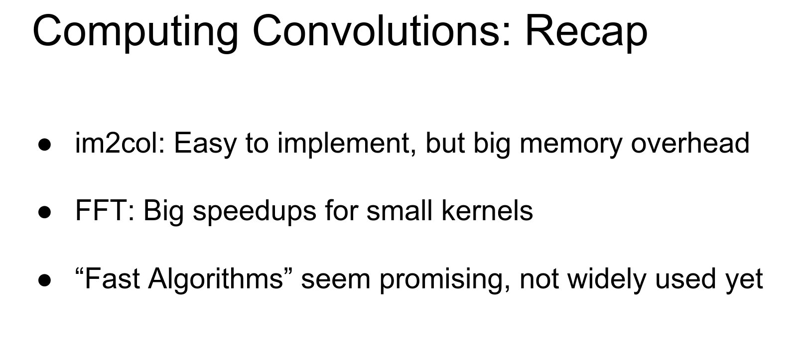

Next, we're going to talk about some implementation details.

Who can spot the CPU?

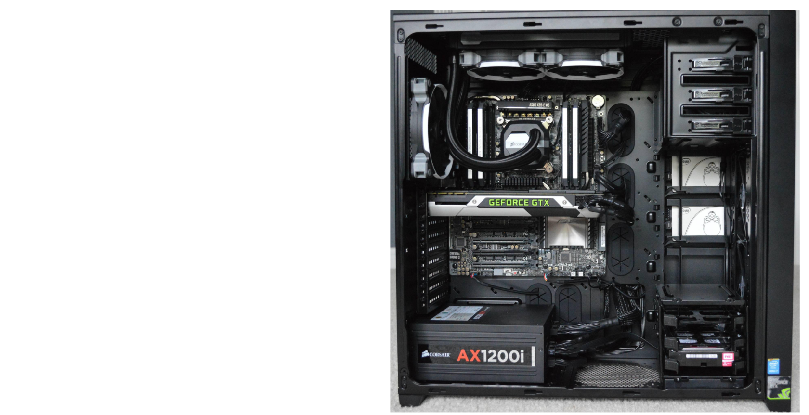

The CPU is this little guy right here.

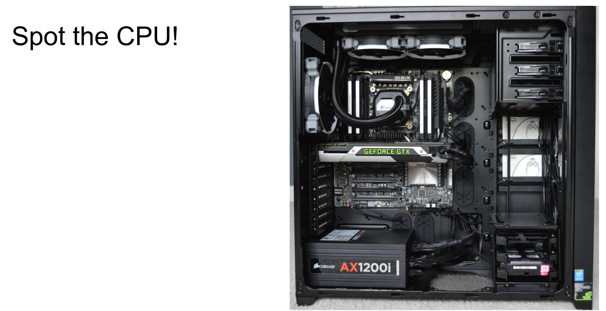

Actually, a lot of it is the cooler. The CPU itself is a tiny part inside; a lot of this is the heat sink and cooling.

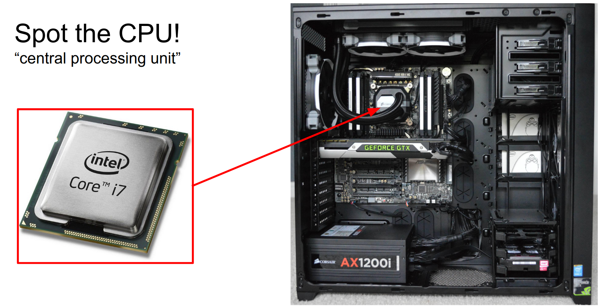

Who can spot the GPU? Yeah, it's the thing that says GeForce on it.

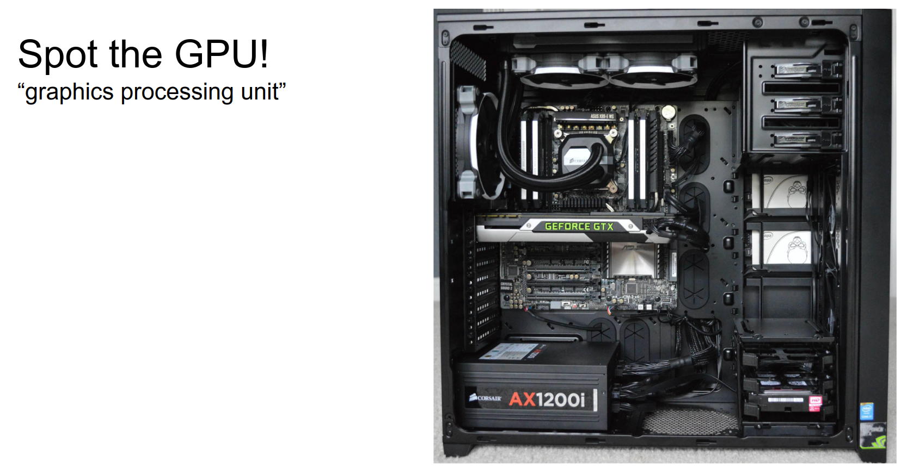

It's taking up more space in the case, so that's an indication that something exciting is happening.

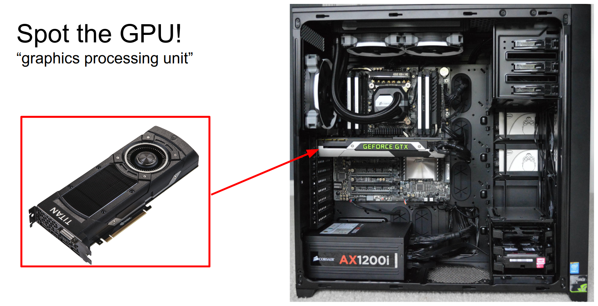

If you play games, you have opinions on this.

It turns out a lot of people in machine learning and deep learning have really strong opinions too, and most people are on this side (NVIDIA).

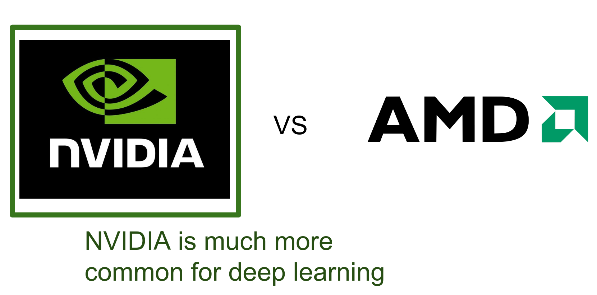

NVIDIA is much more widely used than AMD for deep learning in practice. NVIDIA has done a lot in the last couple of years to really dive into deep learning and make it a core part of their focus.

As a cool example, last year at GTC (NVIDIA's big conference), Jensen Huang (CEO of NVIDIA and Stanford alum) introduced the ==Titan X==, their flagship GPU. The benchmark he used to sell it was how fast it can train AlexNet.

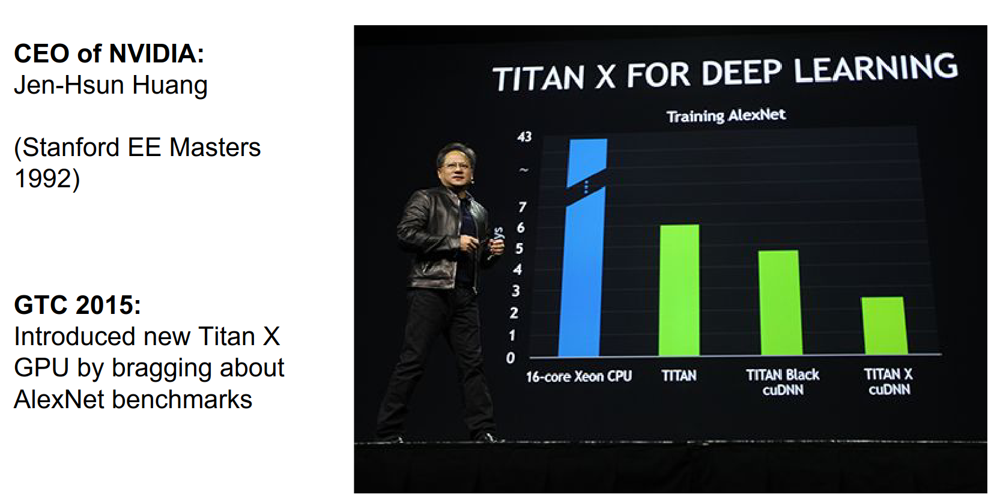

A CPU is really good at fast sequential processing and tends to have a small number of cores (1-4 in laptops, up to 16+ in servers).

GPUs, on the other hand, tend to have many cores. A Titan X can have thousands of cores. Each core can do less (lower clock speed, less per instruction cycle), but they are designed for highly parallel operations.

They were originally designed for computer graphics, but they have evolved as a more general computing platform.

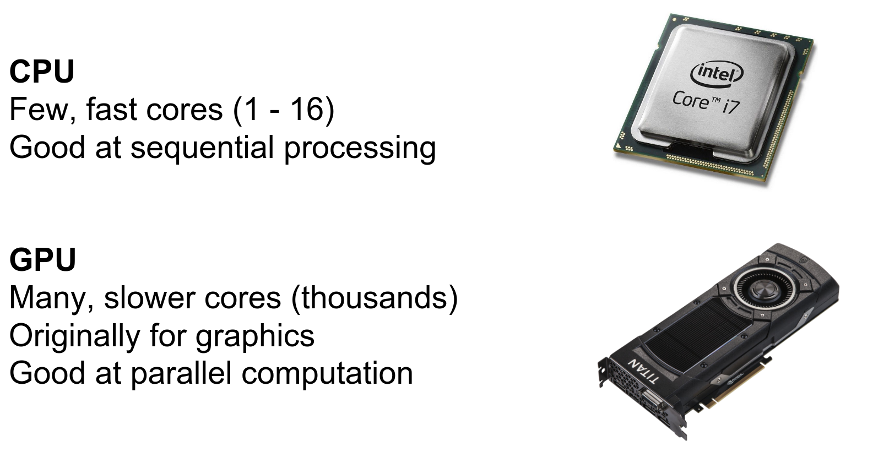

There are different frameworks that allow you to write generic code to run directly on the GPU.

-   **CUDA**: From NVIDIA, a variant of C to write code that runs directly on the GPU.
-   **OpenCL**: A similar framework that works on pretty much any computational platform.

Open standards are nice, but in practice, CUDA tends to be a lot more performant and has better library support. So for deep learning, most people use CUDA.

If you're interested in learning how to write GPU code yourself, there's a really cool Udacity course.

However, in practice, if all you want to do is train ConvNets, you usually don't have to write any of this code yourself. You just rely on external libraries.

---
### cuDNN

cuDNN is a higher-level library, kind of like cuBLAS.

cuDNN (CUDA Deep Neural Network library) is a GPU-accelerated library of primitives for deep neural networks developed by NVIDIA. It provides highly tuned implementations of standard operations like convolution, pooling, normalization, and activation functions.

Key features:
1.  **Performance Optimization**: Highly optimized for NVIDIA GPUs.
2.  **Ease of Integration**: Integrated with TensorFlow, PyTorch, Caffe, etc.
3.  **Hardware Abstraction**: Abstracts away low-level details.
4.  **Specialized Algorithms**: Includes specialized algorithms for convolution, etc.

---

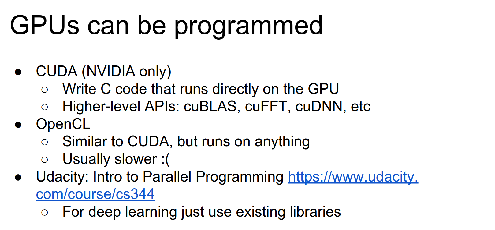

One thing that GPUs are really good at is matrix multiplication.

Here's a benchmark (from NVIDIA's website, so a bit biased) showing matrix multiplication time as a function of matrix size. A beefy 12-core CPU vs. a Tesla K40 GPU. The GPU is much faster.

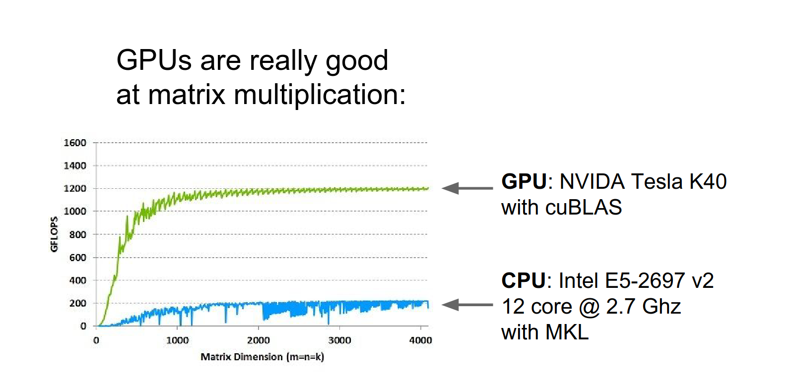

GPUs are also really good at convolutions. NVIDIA has cuDNN, which has specifically optimized CUDA kernels for convolution.

Compared to CPU, it's way faster. This graph compares `im2col` convolutions from Caffe with cuDNN convolutions.

Frameworks like Caffe and Torch have integrated cuDNN. So you can utilize these efficient convolutions in any of these frameworks now.

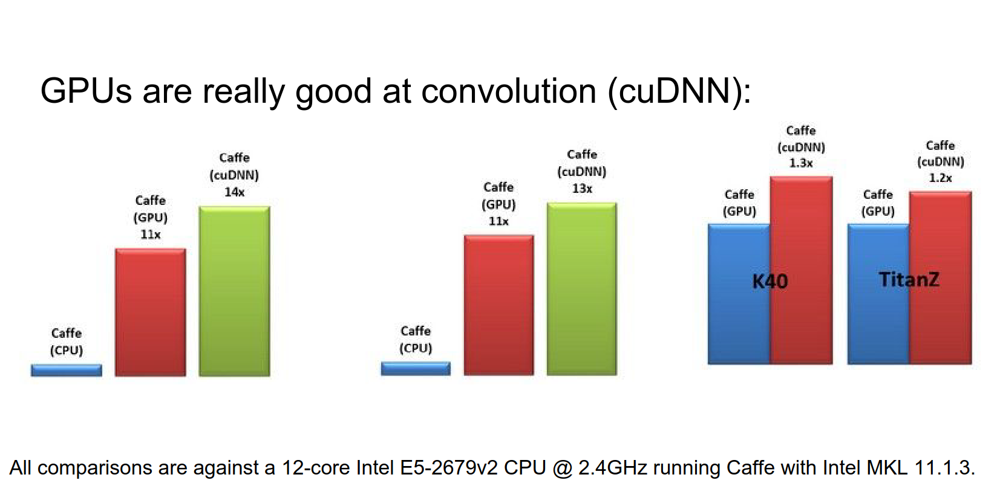

But the problem is that even with these really powerful GPUs, training big models is still kind of slow. VGGNet was famously trained for something like ==2 to 3 weeks== on 4 Titan Blacks.

A recent reimplementation of ResNet-101 also took about two weeks to train on four GPUs.

The easy way to split up training across multiple GPUs is just to split your mini-batch across the GPUs.

### Just split your mini-batch across the GPUs 🎱 🎱 🎱 🎱

Especially for something like VGGNet, which takes a lot of memory, you can't compute with very large mini-batch sizes on a single GPU.

You'll have a mini-batch of images (maybe 128). You split the mini-batch into four equal chunks. On each GPU, you compute a forward and a backward pass for that chunk.

You compute gradients and weights, ==sum those gradients after all four GPUs finish, and make an update to your model.==

This is a really simple way that people tend to implement distribution on GPUs.

### TensorFlow's Claim 💖

TensorFlow claims to automate this process and efficiently distribute it.

In Torch, there's a data parallel layer that you can drop in to automatically do this type of parallelism.

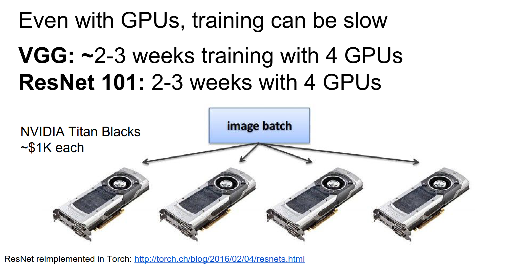

A slightly more complex idea for multi-GPU training comes from Alex Krizhevsky (AlexNet).

The idea is to do data parallelism on the lower layers (split mini-batch across GPUs). But once you get to the fully connected layers (which are big matrix multiplies), it's actually more efficient to have the GPUs work together to compute this matrix multiply (model parallelism).

This is a cool trick, not very commonly used, but fun to mention.

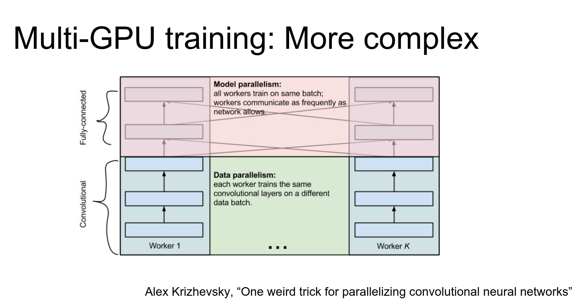

## Before Google had TensorFlow, they had DistBelief

DistBelief was their previous system, which was ==entirely CPU-based==.

The first version of GoogLeNet was trained in DistBelief on CPU, so they had to do massive amounts of distribution to get these things to train.

There's a paper from Jeff Dean describing this. You use data parallelism where each machine has an independent copy of the model. Each machine computes forward and backward on batches, but you have a **Parameter Server** storing the parameters. Independent workers communicate with the parameter server to make updates.

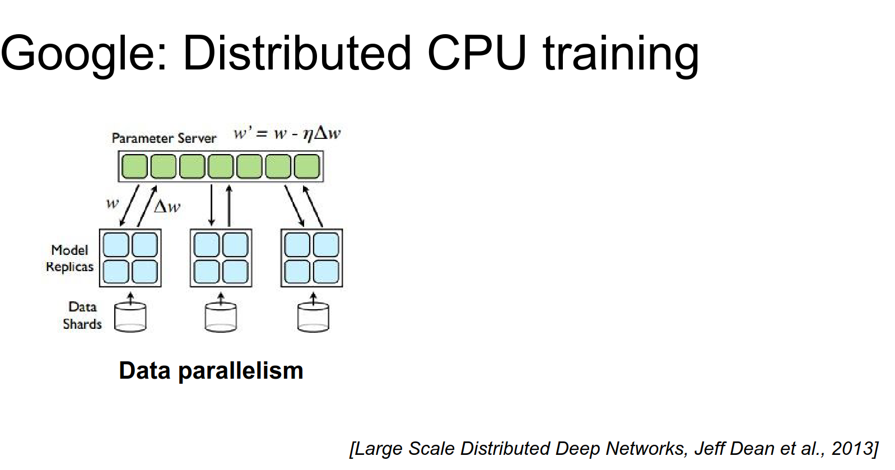

They contrast this with model parallelism, where you have one big model and different workers compute different parts of it.

In DistBelief, they optimized this to work really well across many CPUs. Now they have TensorFlow, which should do these things more automatically.

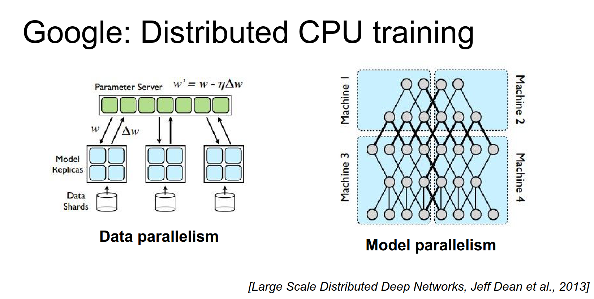

When doing these updates, there's the idea of Asynchronous SGD vs. Synchronous SGD.

## Asynchronous SGD and Synchronous SGD 🧠

**Synchronous SGD** is the naive thing you might expect. You have a mini-batch, split it across workers, each worker computes gradients, you add them up, and make a single update. This simulates computing on a larger machine. But synchronization can be slow, especially across many CPUs.

**Asynchronous SGD**: Each model makes updates to its own copy of the parameters, and they periodically synchronize with the parameter server (eventual consistency). It seems complicated and hard to debug, but they got it to work.

TensorFlow aims to make this type of distribution much more transparent to the user.

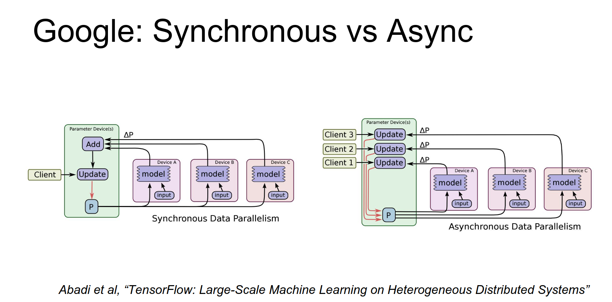

There are a couple of bottlenecks you should be aware of in practice.

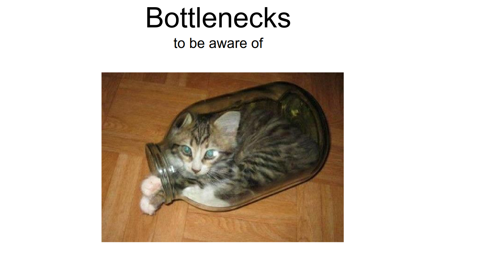

Usually, you can go a long way with just a single GPU on a single machine.

One bottleneck is communication between the CPU and the GPU.

In many cases, especially when data is small, the most expensive part is copying the data onto the GPU and copying it back.

## Slowdown - Copying data to/from GPU

Once you get things onto the GPU, computation is fast, but copying is slow. Ideally, you want the whole forward and backward pass to run on the GPU at once to avoid memory copies.

Another technique is a **multi-threaded approach**: have a CPU thread prefetching data off disk/memory in the background, applying data augmentations, and shipping mini-batches to the GPU while the GPU is computing.

Caffe implements this prefetching data layer. In other frameworks, you might have to roll your own.

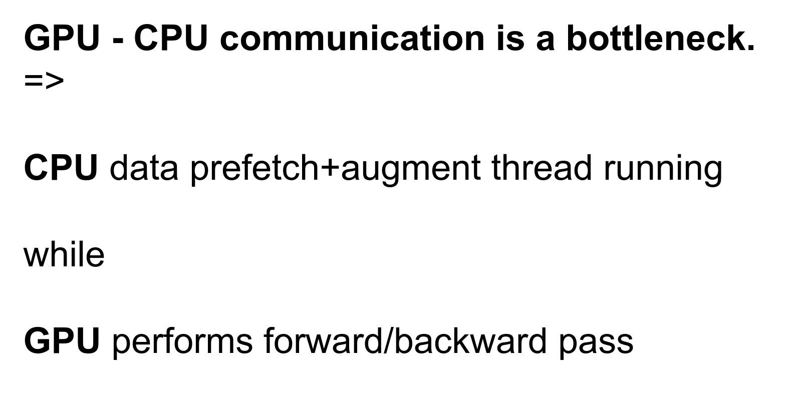

Another problem is the CPU-Disk bottleneck. Hard disks are slow. SSDs are faster but smaller/more expensive.

Both work best when reading data sequentially.

### SSDs and Disks have this in common: they work best when reading sequentially.

Having a folder full of individual JPEG images is bad because of random seeks and decompression overhead.

In practice, you often preprocess data by decompressing it and writing out raw pixels for the entire dataset in one giant contiguous file (e.g., `leveldb` in Caffe, or `HDF5`).

This takes a lot of disk space, but we do it for speed.

During training, you can't store all data in memory ==you have to read it off disk==, so you want that read to be as fast as possible.

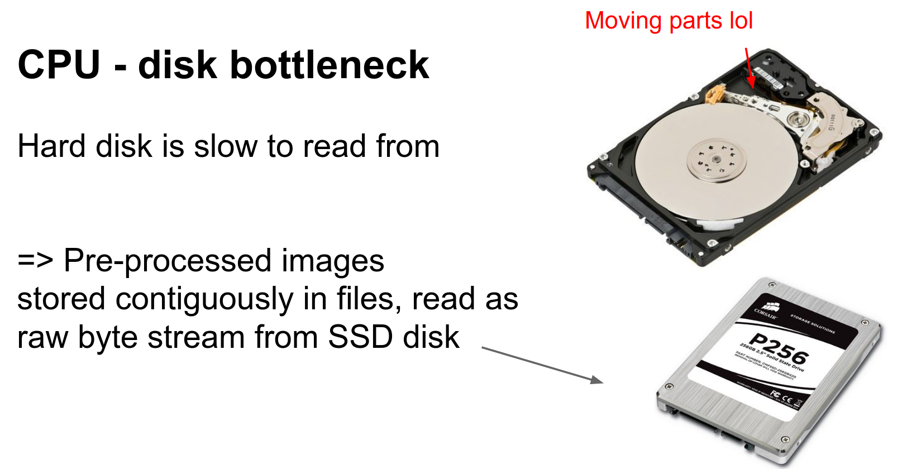

Another thing to keep in mind is GPU memory bottlenecks.

## GPU Memory Bottlenecks

The biggest GPUs right now (Titan X, K40) have 12 GB of memory.

You can bump up against this limit easily with big networks like ResNet or VGG.

Efficient convolutions and architectures help with this. If you can have a powerful model using less memory, you can train faster and use bigger mini-batches.

For scale: AlexNet with batch size 256 takes about 3 GB of GPU memory.

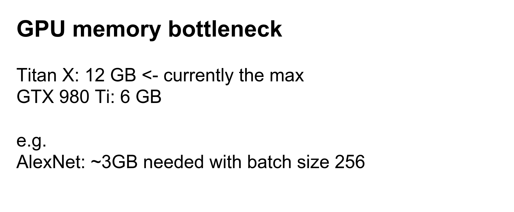

Another thing to talk about is floating-point precision.

## Floating-Point Precision 🍓

We often imagine these are just real numbers, but in practice, you need to think about how many bits you are using.

Default in many places is double precision (64-bit).

More commonly used for deep learning is ==single precision (32-bit)==.

### Fewer bits = store more numbers, less compute. ✨

In general, we want smaller data types.

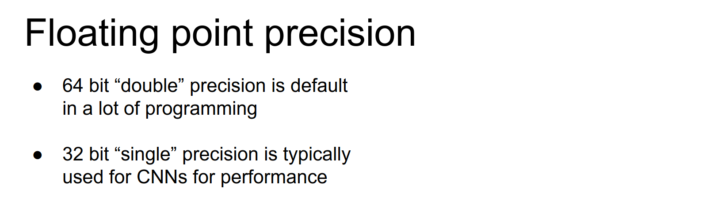

This was an issue on the homework. Numpy defaults to 64-bit, but we cast to 32-bit for the models. Switching to 32-bit gives decent speedups.

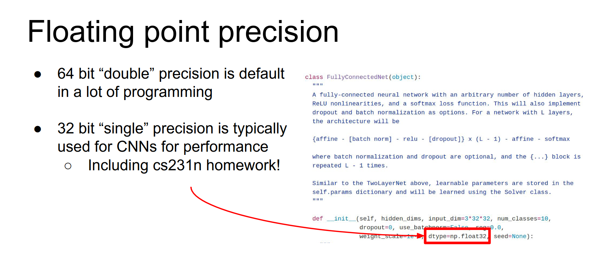

### If 32 bits are better than 64, can we use less?

There is a standard for 16-bit floating-point (==half precision==). Recent cuDNN versions support this.

Nervana has 16-bit implementations that are currently the fastest convolutions out there.

But with 16-bit, you might worry about numeric precision. $2^{16}$ is not that big of a number.

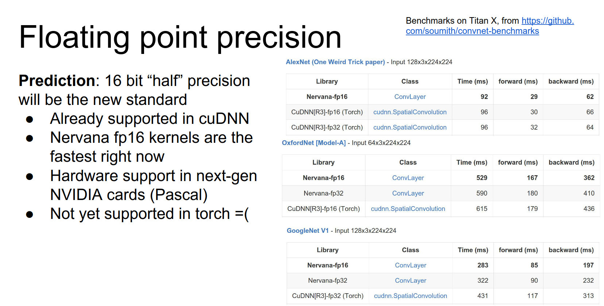

A paper from a couple of years ago experimented with low precision. They found that naive implementation caused networks to diverge.

A simple trick was ==stochastic rounding==.

Store parameters in 16-bit, up-convert to higher precision for multiplication, then probabilistically round back down. This allows networks to converge nicely.

### Can we go even lower?

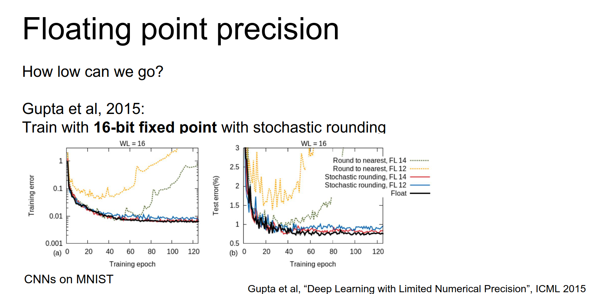

Another paper in 2015 got down to 10 and 12 bits.

They found you need more precision in some parts of the network (gradients) and less in others (activations).

## Can we go further?

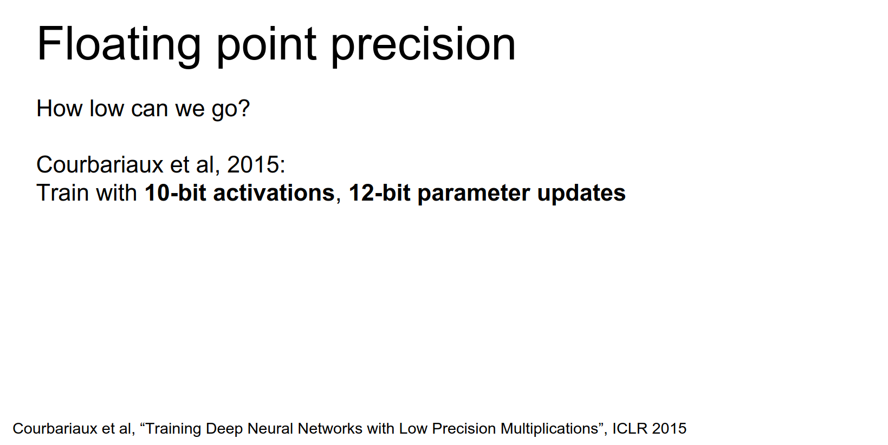

A paper just last week (BinaryConnect/BinaryNet) proposed using only **one bit**.

#### They are either one or negative one.

This makes computation super fast (bitwise operations).

On the forward pass, everything is binary. On the backward pass, they compute gradients using higher precision to update the parameters.

This is a really cool idea. At test time, your network is super fast and all binary.

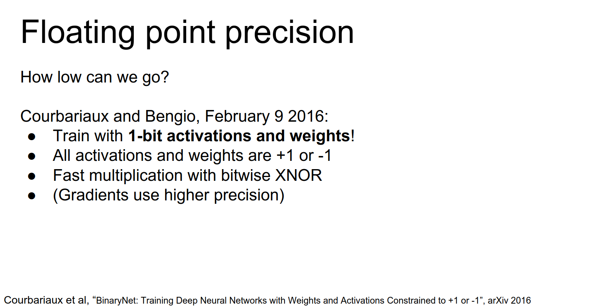

## Recap on Implementation Details

-   **GPUs** are much faster than CPUs.
-   **Distributed training** is common (across GPUs or nodes).
-   Be aware of **bottlenecks**: CPU-GPU communication, Disk I/O, GPU memory.
-   **Floating-point precision** makes a huge difference.
-   **Binary Nets** might be the next big thing.

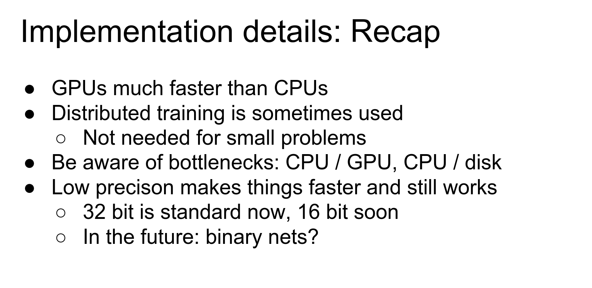

Today we talked about:
-   **Data Augmentation** to help with small datasets and overfitting.
-   **Transfer Learning** to initialize from existing models.
-   **Convolutions**: how to stack them efficiently and how to compute them.
-   **Implementation Details**: Hardware, bottlenecks, and precision.

That's all for today.

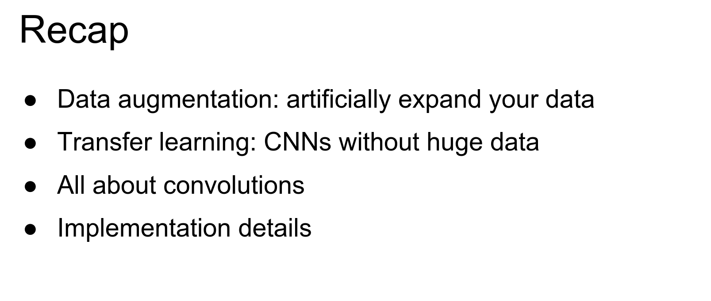

Done!
