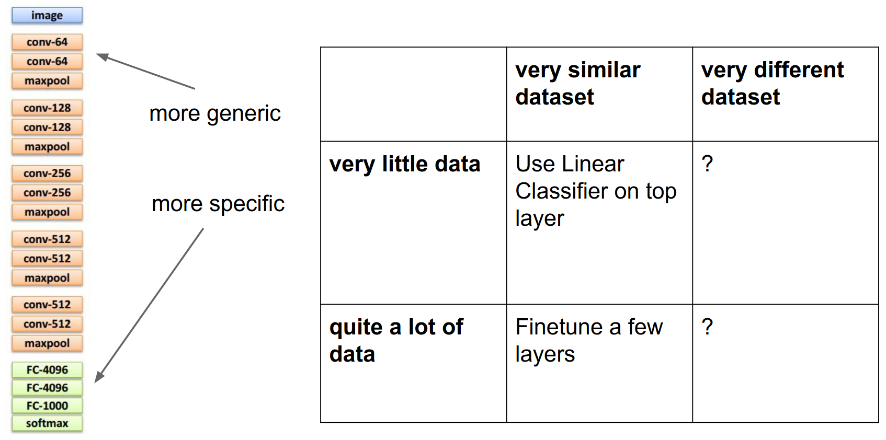
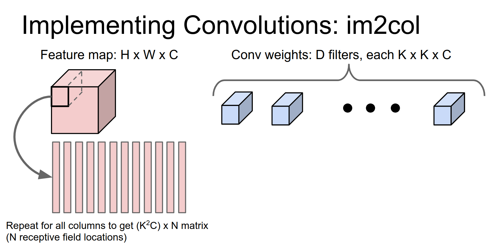

Part of [CS231n Winter 2016](../index.md)

---
# From Justin Johnson 😉

---
# CNN's in Practice

Low level implementation details, that are really common to get these things to work when you are training things.

TA's graded the Midterms, wow.

Assignment 3 is due a week.

Someone got 103.

Question per stats.

Have fun.

We were talking about RNN's. How they can model different kinds of sequence problems, we talked about two particular implementations of RNN's Vanilla RNN's and LSTM's.

You'll implement both of those on the assignment.

How RNN;s can be used for language models.

We talked about how we can combine recurrent networks with convolutional networks to do image captioning. Being RNN neuroscientists and dicing into the cells, what makes them excite?

Today we will talk about a lot of low level things to know to get CNN's working in practice.

- the first is really squeezing all the juice that you can out of your data: data augmentation and transfer learning.
- we're going to really dive deep into convolutions and talk a lot more about those both how you can design efficient architecture is using convolutions and also how convolutions are efficiently implemented in practice.
- Finally we're going to talk about something that usually gets lumped under implementation details and doesn't even make it into papers but that stuff like what as a CPU what is a GPU what kind of bottlenecks do you experience in training, how might you distribute training over multiple over multiple devices.

Let's start.

You're really familiar with this type of pipeline, load images and labels off the disks, you are going to put your image through CNN.

Then you're going to use the image together with the label to compute some loss function, then back propagate and update the CNN and repeat forever

Data augmentation is we just add one little step to this pipeline.

After we load the image up off disk we're going to transform it in some way before passing it to the CNN.

This transformation should preserve the label, so we're going to compute loss back propagate and update the CNN, so it's really simple and the trick is just, what kinds of transforms you should be using?

Data augmentation the idea is really simple it's sort of this way that lets you artificially expand your training set through clever usage of different kinds of transformations 

If you remember the computer is really seeing these images as these giant grids of pixels and there are these different kinds of transformations we can make that should preserve the label but which will change all of the pixels.

If you imagine like shifting that cat one pixel to the left it's still a cat, but all the pixels are going to change. When you talk about data augmentation you're sort of imagine that you're expanding your training set these training set. These new fake training examples will be correlated but it'll still help you train models with with bigger models with less overfitting.

And this is very very widely used in practice, pretty much any CNN you see that's winning competitions or doing well on benchmarks is using some form of data augmentation.

so the easiest form of data augmentation is horizontal flipping.
## horizontal flipping

If we take this cat and we look at the mirror image the mirror image should still be a cat. This is really really easy to implement in numpy you can just do it with a single line of code.

Similarly easy in Torch other frameworks this is really easy and widely used.

## random cropping

Something else that's very widely used is to take random crops from the training images. 

So at training time we're going to load up our image and we're going to take a patch that image at a random scale and location resize it to our fixed whatever size our CNN is expecting and then use that as our training example 

Again this is very very widely used. Just to give you a flavor of how exactly this is used I looked up the details for ResNets ->

They first pick a random number, resize the whole image so that the shorter side is that number then sample a random $224 X 224$ crop from the resized image and then use that as their training example.

So that's pretty easy to implement and usually helps quite a bit.

When you're using this form of data augmentation, usually things change a little bit at ==test time==.

So at training time when you're using this form of data augmentation, the network is not really trained on full images it's trained on these crops. It doesn't really make sense or seem fair to try to force the network to look at whole images at test time. 

So usually in practice when you're doing this kind of random cropping for data augmentation, at test time you'll have some fixed set of crops and use these for testing.

So very commonly you'll see that you'll see ten crops you'll take the upper left-hand corner the upper right-hand corner the two bottom corners and the center that gives you five together if they're horizontal flips gives you ten. You'll take those ten crops at test time pass them through the network and average the scores of those ten crops.

ResNet actually takes this a little bit one step further and they actually do multiple scales at test time as well. This is something that tends to help performance in practice 

And again very easy to implement very widely used.

another thing that we usually do for data augmentation is color jittering 
## color jittering 

So if you take this picture of a cat, maybe it was a little bit cloudy or that day or a little bit sunnier that day and if we would have taken a picture then a lot of the colors would have been quite different.

So one thing that's very common to do is just change the color a little bit of our training images before we feed it to the CNN so a very simple way is just to ==change the contrast==. This is again very easy to implement very simple to do.

But actually in practice you'll see that this contrast jittering is a little bit less common, and what instead you see is this slightly more complex pipeline using principal component analysis over all the pixels of the training data.
### Principle component analysis over training data ?

For each pixel in the training data is this vector of length three - RGB - and if we collect those pixels over the entire training data set, you get a sense of what kinds of colors generally exist in the training data.

Then using principal component analysis, gives us three principal component directions in color space, that kind of tell us what are the directions along which color tends to vary in the data set. 

So at training time for color augmentation, we can actually use these principal components of the color of the training set to choose exactly how to jitter the color at training time.

A little bit more complicated but it is pretty widely used. I think was introduced with the AlexNet paper in 2012. It is also used in ResNets.

Data augmentation is this very general thing, you just want to think about for your data set what kinds of transformations do you want your classifier to be invariant to.

And then you want to introduce those types of variations to your training data at training time.
### what types of in-variances make sense for your data ? 

Depending on your data maybe rotations of a couple degrees make sense you could try like different kinds of stretching and shearing to simulate maybe affine transformations of your data.

You could really go crazy here and try to get creative and think of interesting ways to augment your data.

Idea of data augmentation really fits into kind of a larger theme that now we've seen repeated many times throughout the course. 

This theme is that one way that's really useful in practice for preventing overfitting as a regularizer is that, during the forward pass when we're training our network we add some kind of weird stochastic noise to kind of mess with the network.

For example with data augmentation we're actually modifying the training data that we put into the network

With things like drop out or drop connect you're taking random parts of the network and either setting the activations or the weights to zero randomly 

This also appears kind of with batch normalization, since with batch normalization your normalization contents depend on the other things in the mini batch 

During training the same image might end up appearing in mini batches with different other images so it actually introduces this type of noise a training time.

But for in all of these examples at test time ==we average out this noise==. 

For data augmentation we'll take averages over many different samples of the training data 

for dropout and drop connect you can sort of evaluate and marginalize this out more analyze more analytically 

For batch normalization we keep to keep these running means so 

That's kind of a nice way to unify a lot of these ideas for regularization is that when you can add noise at the forward pass and then marginalize over it at test time.
###  you can add noise at the forward pass and then marginalize over it at test time.

Keep that in mind if you're trying to come up with other creative ways to regularize your networks.

Main takeaway is for data augmentation are that one it's usually really simple to implement. It's very very useful especially for small data sets (which I think many of you are using for your projects) and it also fits in nicely with this framework of noise at training and marginalization at test time.
### Do you pre compute your augmented dataset or you resample live as you are training?

That's a good question so a lot of times you'll actually resample it live at training time, because it would take a lot of disk space to try to dump these things to disk.

Sometimes people get creative and even have like background threads that are fetching data and performing augmentation.

There's this myth floating around that when you work with CNN's you really need a lot of data.

But it turns out that with transfer learning this myth is busted

There's this really simple recipe that you can use for transfer learning.

First you take whatever your favorite CNN architecture is be it Alex net or VGG or what have you and you either train it on ImageNet yourself or more commonly you download a pre train model from the internet.

That's easy to do just takes a couple minutes to download, many hours to train but you probably won't do that part.

Next there's sort of two general cases:

If your data set is really small and you really don't have any images whatsoever then you can just treat this classifier as a fixed feature extractor. 
### Fixed feature extractor

So one way to look at this is that you'll take the last layer of the network the softmax - if it's an image net classification model - you'll take it away and you'll replace it with some kind of linear classifier for the tasks that you actually care about and now you'll freeze the rest of the network and retrain only that top layer. 

So this is sort of equivalent to just training a linear classifier directly on top of features extracted from the network. So what you'll see a lot of times in practice for this case is that sort of as a pre-processing step you'll just dump features to disk for all of your training images and then work entirely on top of those cached features. 

That can help speed things up quite a bit, that's quite easy to use it's very common. It's usually provides a very strong baseline for a lot of problems that you might encounter in practice.

If you have a little bit more data then then you can actually afford to train more complex models. So depending on the size of your data set usually you'll freeze some of the lower layers of the network and then instead of retraining only the last layer you'll pick some number of the last layers to train, depending on how large your data set is. 

Generally when you have a larger data set available for training, you can afford to train more of these final layers.

If you're similar to the similar to the trick over here what you'll see very commonly is that instead of actually explicitly computing this part you'll just dump these last layer features to disk and then work on this part in memory. So that can speed things up quite a lot.
### Do you still need all the weights for each layer you still like run running through the forward pass,  you just don't do the back propagation ? 

It depends, sometimes you you actually will run through the forward pass but sometimes you'll just run the forward pass once and dump these two discs both it's kind of that's that's pretty common actually. Because it that saves compute. 
### When you are freezing - do you freeze all?

Typically this final layer you'll always need to swap in and reinitialize from random because you'll probably have different classes or you're doing a regression problem or something. 

But then these these other intermediate layers you'll initialize from whatever was in the pre trained model.

Actually in practice when you're fine-tuning, a nice tip it to actually do this, is that they're literally three types of layers when you're fine-tuning.

There'll be the frozen layers which you can think of as having a learning rate of zero. 

There are these these new layers that you've reinitialize from scratch and typically those have maybe a higher learning rate but not too high maybe one tenth of what your network was originally trained with.

And then you'll have these intermediate layers that you are initializing from the pre trained network but you're planning to modify during optimization and fine-tuning.

So these intermediate layers you'll tend have a very small learning rate maybe 1/100 of the original.
### does the pretrained model has to be trained with similar kind of data?

That's a good question. Some people have tried to investigate that and found that generally fine-tuning this type of transfer learning fine-tuning approach works better when the network was originally trained with similar types of data - whatever that means -. But in fact these these very low-level features are things like edges and colors and Gabor filters which are probably going to be applicable to just about any type of visual data.

So especially these lower level features I think are generally pretty applicable to almost anything.

Another tip that use that you sometimes see in practice for fine tuning is that um you might actually have a ==multi-stage approach== where first you freeze the entire network and then only train this last layer and then after this last layer it seems to be converging then go back and actually fine-tune these.

You can sometimes have this problem that these because this last layer is initialized randomly you might have very large gradients that kind of mess up this initialization.

So that the two ways that we get around that are either freezing this at first and letting this converge or by having this varying learning rate between the two regimes of the network 
## varying learning rate between two regimes of the network 🥰

This idea of transfer learning actually works really well.

So there was a couple pretty early papers from 2013-2014 when CNN's first started getting popular. 

This one in particular the ==astounding baseline paper== was was pretty cool - _"The Astounding Performance of Solitary Convolutional Neurons as Visual Feature Extractors"_.

What they did is they took the what at the time was one of the best CNN'S out there was over feet so they just extracted features from over feet and applied these features to a bunch of different standard data sets and standard problems in computer vision.

The idea is that they compare it against what was at the time these very specialized pipelines and very specialized architectures for each individual problem and data set. 

And for each problem they just replace this very specialized pipeline with very simple linear models on top of features from OverFeat.

And they did this for a whole bunch of different datasets and found that in general over all these OverFeat features were a very very strong baseline.

And for some problems they were actually better than the existing methods and for some problems they were a little bit worse but still quite competitive.

So this this was I think a really cool paper they just demonstrated that these are really strong features that can be used in a lot of different tasks and tend to work quite well.

Another paper along those lines was from Berkeley the decaf paper and decaf later became became caffeinated and became cafe so that's that's kind of a lineage there.

---
## Tangent - Origins of Caffe 😍

The paper you're referring to is "DeCAF: A Deep Convolutional Activation Feature for Generic Visual Recognition" by Donahue et al., published in 2014. Here's a summary of the key points from this paper:

1. Motivation:
    - The paper aimed to explore the use of deep convolutional neural networks (CNN's) as generic feature extractors for a wide range of visual recognition tasks.
    
2. Approach:
    - The researchers developed a deep CNN architecture called DeCAF, which was trained on the ImageNet dataset for image classification.
    - They then used the activations from the intermediate layers of the DeCAF model as generic visual features for various recognition tasks, such as object recognition, scene classification, and fine-grained categorization.
    
3. Experiments and Results:
    - The researchers evaluated the performance of the DeCAF features on a diverse set of visual recognition benchmarks, including Caltech-101, PASCAL VOC, and MIT Indoor Scenes.
    - They compared the performance of the DeCAF features to traditional hand-crafted features, such as SIFT and HOG, as well as other state-of-the-art methods.
    - The results showed that the DeCAF features consistently outperformed the traditional features and achieved competitive or even superior performance on many of the tasks.
    
4. Key Findings:
    - The paper demonstrated the effectiveness of using deep CNN features as generic visual representations, which can be applied to a wide range of recognition tasks without the need for task-specific architecture design or fine-tuning.
    - It highlighted the importance of transfer learning, where the knowledge acquired by a deep CNN on a large-scale dataset (ImageNet) can be effectively leveraged for other visual recognition problems.
    
5. Impact and Relation to Caffe:
    - The DeCAF framework and the findings of this paper were influential in the development of the Caffe deep learning framework, which was also created at UC Berkeley.
    - Caffe was initially named "Caffe" as a reference to the "DeCAF" paper, as it was built upon the same principles of using deep CNN features as generic visual representations.
    - The Caffe framework became widely adopted in the deep learning community and has been used in numerous research projects and real-world applications.

In summary, the "DeCAF" paper from UC Berkeley was a pioneering work that demonstrated the power of deep CNN features as generic visual representations, paving the way for the development of the influential Caffe deep learning framework.

---

Recipe for transfer learning is that there you should kind of think about to this little two-by-two matrix how similar is your dataset to what the pre train model was and how much data do you have?
### What should you do in those four different columns ? 

So generally if you have a very similar data set and very little data just using the network as a fixed feature extractor and training simple maybe linear models on top of those features tends to work very well 

If you have a little bit more data then you can try to try fine-tuning and try actually initializing the network from fine tune from pre train weights and running optimization from there 

This other column is little trickier (top left), in this box you might be in trouble. You can try to get creative and maybe instead of extracting features from the very last layer you might try extracting features from different layers of the continent.

And that can sometimes sometimes help. The intuition there is that maybe for something like MRI data probably these very top level features are very specific to ImageNet categories, but these very low-level features are things like **edges** and and stuff like that that **might be more transferable** to tune on into non image net type datasets.

And obviously in this box (bottom right) you're in better shape and again you can just sort of initialize and fine-tune.

This idea of initializing with pre trained models and fine tuning is actually not the exception this is pretty much standard practice in almost any larger system that you'll see in computer vision

We've actually seen two examples of this already in the course

So for example if you remember from a few lectures ago we talked about object detection, where we had a CNN looking at the image and region proposals and this other all this and all this crazy stuff but this part was a CNN looking at the image and for image captioning we had a CNN looking at the image.

So in both of those cases those CNN's were initialized from ImageNet models.

That really helps to solve these other more specialized problems even without gigantic data sets.

And also for the image captioning model in particular, part of this model includes these word embeddings - that you should have seen by now on the homework if you started on it but - those word vectors you can actually initialize from something else that was maybe pre trained on a bunch of text.

And that can sometimes help maybe in some search in some situations where you might not have a lot of captioning data available.

So the takeaway about fine tuning is that um you should really use, it's a really good idea.

It works really well in practice you should probably almost always be using it to some extent you generally don't want to be training these things from scratch unless you have really really large data sets available.

In almost all of our circumstances it's much more convenient to fine tune in an existing model.

And by the way Caffe has this existing model view you can download many famous image net models actually the residual networks the official model got released recently so you can even download that and play with it that'd be pretty cool.

And these Caffe model zoo models are sort of like a little bit of a standard in the community so you can even load Caffe models into other other frameworks like torch so that's that's something to keep in mind that these Caffe models are quite useful.

We should talk more about convolutions

For for all these networks we've talked about really the convolutions are the computational workhorse that's doing a lot of the work in the network.

So we need to talk about two things about convolutions ==the first is how to stack them==.

### How can we design efficient network architectures that combine many layers of convolution to achieve some some nice results? 

Suppose that we have a network that has two layers of $3x3$ convolutions, so the question is for a neuron on this second layer how big of a region on the input does it see?

This was on your midterm so I hope I hope you guys all know the answer.

Maybe that was a hard midterm question, but this is this is a $5x5$. 

It's pretty easy to see from this diagram why so that this neuron after the second layer is looking at this entire volume in the intermediate layer, so in particular this pixel in the intermediate layer is looking at this $3x3$ region in the input so when you averaged across when you look at all of all three of these then this layer this neuron in the in the second the third layer is actually looking at this entire $5x5$ volume in the input.

So this neuron actually sees the entire input!

Now the question is if we had three 3x3 convolutions stacked in a row how big of a region in the input would they see? 

The same kind of reason is that these receptive field just kind of build up with successive convolutions, so the point here to make is that you know three $3x3$ convolutions actually give you a very similar representational power is my claim to a single $7x7$ convolution. 
### 3 piece 3x3 convs == 1 piece 7x7 conv

You might debate on the exact semantics of this and you could try to prove theorems about it and things like that. But just from an intuitive sense they can three three by three convolutions can represent similar types of functions as a similar seven by seven convolution since it's looking at the same input region, in the input.

So now the idea now actually we can dig further into this idea and we can compare more concretely between a single seven by seven convolution versus a stack of three three by three convolutions.
## $7x7$ conv 🆚 3 piece $3x3$ convs

Let's suppose that we have an input image that's $H x W x C$ and we want to have convolutions that preserve the depth.

So we have C filters and we want to have them preserve height and width, so we just set padding appropriately.

### We want to compare concretely what is the difference between a single seven by seven versus a stack of three by three ?

How many weights to each of these two things have?

You can forget about biases becuase they are confusing. 

49 $C^2$  because you've got this seven by seven convolution each one is looking at a depth of C and you've got C such filters so 49 $C^2$ 

But now for the three by three convolutions we have three layers of convolutions each filter is $3x3xC$ and each layer has C filters.

When you multiply that all out we see that three three by three convolutions only has 27 $C^2$ parameters. 

Assuming that we have ReLU after between each of these convolutions we see that the stack of three $3x3$ convolutions actually ==has fewer parameters== which is good and ==more non-linearity== which is good.

This kind of gives you a sum intuition for why a stack of three bite of multiple $3x3$ convolutions might actually be preferable to a single $7x7$ convolution.

### We can actually take this one step further and think about not just the number of learnable parameters but actually how many ==floating-point operations== do these things take? 

So actually this is pretty easy, because for each of these filters we're going to be using it at every position in the image.

So actually the number of multiply adds is just going to be ==height times width times the number of learnable filters.==

Comparing between these two the $7x7$ actually not only has more learnable about parameters, but it actually costs a lot more to compute as well.

So the stack of three $3x3$ convolutions again gives us more non-linearity for less compute.

So that kind of gives you some intuition for why actually having multiple layers of $3x3$ convolutions is actually preferable to large filters.

Then you can think of another question:
## We've been pushing towards smaller and smaller filters but why stop at three by three right we can actually go smaller?

Maybe the same logic would extend? 

Problem is you don't get the receptive field.

Let's compare a single $3x3$ convolution versus a slightly fancier architecture called ==a bottleneck architecture.==

Here we're going to assume an input of $hxwxc$ and here we can actually do - this is a cool trick - we do a single $1x1$ convolution with $C / 2$ filters to actually reduce the dimensionality of the volume.

So now this thing is going to have the same spatial extent, but half the number of features in depth.

After we do this bottleneck we're going to do a $3x3$ convolution at this reduced dimensionality.

Now this $3x3$ convolution takes C/2 input features and produces C/2 output features.

And now we restore the dimensionality with another $1x1$ convolution to go from $C / 2$ back to $C$ so this is kind of a kind of a funky architecture this idea of using $1x1$ convolutions everywhere is sometimes called ==network in network==.
### Network in Network - Google Net - ResNet

Because it has this intuition that you're a $1X1$ convolution is kind of similar to sliding a fully connected network over each part of your input volume.

This idea also appears in GoogleNet and in ResNet this idea of using these $1x1$ bottleneck convolutions.

So we can compare this this bottleneck sandwich to a single $3x3$ convolution with C filters. And Run through the same logic. 

This bottleneck stack has $3.25C^2$ parameters whereas this one over here has $9C^2$ parameters.

And again if we're sticking ReLU's in between each of these convolutions, then this bottleneck sandwich is giving us more ==more non-linearity for a fewer number of parameters==.

Similar to we saw on the on the three by three versus seven by seven the number of parameters is tied directly to the amount of computation. So this bottleneck sandwich is also much faster to compute.
## the number of parameters is tied directly to the amount of computation 💕

So this to this idea of $1x1$ bottlenecks has received quite a lot of usage recently in GoogleNet and ResNet especially.
### What is the point of the last $1x1$ Convolutions ?

Those convolutions are learned. You might think of it as a projection from like a lower dimensional feature back to a higher dimensional space.

And then if you think about stacking many of these things on top of each other as happens in ResNet, then coming immediately after this one (last $1x1$ in the image) is going to be another $1x1$ so you're kind of stacking many many want multiple one by one convolutions on top of each other.

One by one convolution is a little bit like sliding a multi-layer fully connected network over each depth channel. 

It's turns out that actually you don't really need the spatial extent, even just comparing this sandwich to a single $3x3$ Conv you're having the same input-output sizes, but with more non-linearity and cheaper to compute and you're fewer learnable parameters. 

There's one problem with this is that and that's we're still using a $3x3$ convolution in there somewhere and you might wonder if we really need this?

And the answer is no - it turns out - so one crazy thing that I've seen recently is that you can factor this $3x3$ convolution into a $3X1$ and a $1X3$. 

Compared with a single $3x3$ convolution this ends up saving you some parameters as well.

You can even combine this $1x3$ and $3x1$ together with this bottle-necking idea and and things just get really cheap.

And that's basically what Google has done in their most recent version of Inception.

_Rethinking the inception architecture for computer vision_, where they play a lot of these crazy tricks about factoring convolutions in weird ways and having a lot of one by one bottlenecks and then projections back up to different dimensions

If you thought the original GoogleNet with what their inception module was crazy, these are the inception modules that Google is now using in their newest Inception Net.

The interesting features here are that they have these one by one bottlenecks everywhere and actually you have these asymmetric filters to again save on computation.

This stuff is not super widely used yet but it's out there and it's in Google net so I thought it's something cool to mention.

## recap on convolutions and how to stack them

The quick recap from convolutions and and how to stack them: 

- It's usually better instead of having a single large convolution with a large filter size it's usually better to break that up into multiple smaller filters and that even maybe helps explain the difference between something like VGG which has many many $3x3$ filters with something like AlexNet that had fewer smaller filters 
- some another thing that's actually become pretty common I think is this idea of one-by-one bottle-necking you see that in both versions of GoogleNet and also in ResNet and that actually helps you save a lot on parameters so I think that's a useful trick to keep in mind.
- And this idea of factoring convolutions into these asymmetric filters I think is maybe not so widely used right now but it may become more commonly used in the future I'm not sure.

The basic overall overarching theme for all of these tricks is that it lets you have ***fewer earnable parameters and less compute and more non-linearity*** which are all sort of nice features to have in your architectures.

## how to compute convolutions ? 🤔

The next thing is that once you've actually decided on how you want to wire up your convolutions, you actually need to compute them.

And this this there's actually been a lot of work on different ways to implement convolutions. We asked you to implement it on the assignments using `for` loops and that as you may have guessed doesn't scale too well.

A pretty easy approach that's pretty easy to implement is this idea of an `im2col` method.

So the intuition here is that, we know matrix multiplication is really fast. Pretty much for any are any computing architecture out there someone has written a really well optimized matrix multiplication routine or library.

So the idea of `im2col` is thinking, well given that matrix multiplication is really fast is there some way that we can take this convolution operation and recast it as a matrix multiply ? 
### convolution operation recasted as a matrix multiply.

I turns out that this is somewhat easy to do once you think about.

The idea is that we have an input volume that's $HxWxC$ and we have a filter Bank of convolutions - of convolutional filters - each one of these is going to be a $KxKxC$ volume so it has a $KxK$ receptive field and a depth of C to match the input.

We're going to have D of these filters and then we want to turn this into a into a matrix multiply problem.

The idea is that we're going to take the first receptive field of the image, which is going to be this $KxKxC$ in the input volume and we're going to reshape it into this column of $K^{2}C$ elements.

And then we're going to repeat this for every possible receptive field in the image.

There's going to be n different receptive field locations.

So now we've taken our our image and we've taken reshaped it into this giant matrix of $NK^{2}C$ , anyone see what a potential problem with this might be?

This tends to use a lot of memory. So any elements in this input volume if it appears in multiple receptive fields then it's going to be duplicated in multiple of these columns. 

So and this is going to get worse the more overlap there is between your receptive fields.

But it turns out that in practice that's actually not too big of a deal and it works fine.

We're going to run a similar trick on these convolutional filters. So if you remember what a convolution is doing we want to take each of these convolutional weights and take inner products with each convolutional wait against each receptive field location in the image.

So each of these convolutional weights is is this $KxKxC$ tensor so we're going to reshape each of those to be a $K ^{2} C$ row 

Now we have D filters, so we get a $DxK^{2}C$ matrix.

This guy (columns on the left) contains all the each column is a receptive field we have one column per receptive field in the image, and now this matrix (rows on the right) has one each row is a different weight.

Now we can easily compute all of these inner products all at once with this single matrix multiply.

I apologize for these dimensions not working out these I probably should have swapped these two to make it more obvious but I think you get the idea.

So this gives you a $DxN$ result so that D is our number of output filters and that N is for all the receptive field locations in the image.

So then you play a similar trick to take this and reshape it into your into your into your 3D output tensor.

You can actually extend this to mini-batches quite easily. if you have a mini batch of N of these elements you just add more rows and have one set of rows per mini batch element.
### How expensive is the reshape operation?

It depends on your implementation right but then you have to worry about things like memory layout and stuff like that to make it fast.

But sometimes you'll even do that reshape operation on the GPU so you can do it ==in parallel==.

This is really easy to implement, if you don't have a convolution technique available and you need to implement one fast, this is probably the one to choose. 

And if you look at actually Caffe in early versions of Caffe this is the method that they used for doing convolutions.

So this is the convolution forward code for like for the GPU like the native GPU convolution in Caffe.

So you can see in this red chunk, they're calling it - this `im2col` method is taking their input image, and then they're going to reshape this calling this `im2col` method and then store it in this in this column GPU tensor.

Then they're going to do a matrix multiply calling it - `cuBLAS` through the matrix multiply and then add the bias.

These things tend to work quite well in practice.

And also as another case study, if you remember the `fast layers` we gave you in the assignments actually uses this exact same strategy. So here we actually do an `im2col` operation with some crazy numpy tricks, and then now we can actually do the convolution inside the fast layers with a single call to the numpy matrix multiplication.

And you saw in your homework's this usually gives maybe a couple hundred times faster than using for loops. It works pretty well and it's it's pretty easy to implement.
### can we use this in backward pass as well?

Yes, if you think really hard you'll realize that the backward pass on a convolution is actually also a convolution - which you may have figured out if you were thinking about it on your homework -  but the backward pass of a convolution is actually also a type of convolution over the upstream gradients.

So you can actually use a similar type of image at all method for the for the backward pass as well.

In the backward pass you need to sum gradients from across overlapping receptive fields in the upstream so you need to be careful about the `col2im` you need to sum in the `col2im` in the backward pass.

You can actually check out in in the fast layers in the homework it implements that too.

Although actually for the in the fast layers on the homework the `col2im` is in `Cython` I couldn't find a way to get it fast enough in raw Numpy.

So there's actually another way that sometimes people use for convolutions. 
## FFT for convolutions ??? 🌠

That's this idea of a fast Fourier transform. 

So if you have some memories from like a signal processing class or something like that you might remember this thing called the convolution theorem. 

That says that you if you have two signals and you want to convolve them, either discretely or continuously with an integral. The Fourier transform of the convolution's is the same as the element-wise product of the Fourier transforms.

You might remember - from again a signal processing class or an algorithms class -  but there's this amazing thing called the ==Fast Fourier transform== that actually lets us compute Fourier transforms and inverse Fourier transforms really really fast. 

You may have seen it there's versions of this in 1D and 2D and they're all really fast.

We can actually apply this trick to convolutions.
 
The way that this works is that:

- first we're going to compute use the fast Fourier transform to compute the Fourier transform of the weights 

- also compute the Fourier transform of our activation map 

- and now in Fourier space we just do an element-wise multiplication which is really really fast and efficient 

- and again use the fast Fourier transform to do the inverse transform on the output of that elemental wise product 

and that implements convolutions for us in this kind of cool fancy clever way.

And this has actually been used and faced some folks at Facebook had a paper about this last year and they actually release the GPU library to do this to compute these things.

The sad thing about these Fourier transforms is that they actually give you really really big speed ups over other methods, but really only for large filters.

And when you're working on these small $3x3$ filters the overhead of computing the Fourier transform is not worth it, compared to the computation of doing the computation directly in the in the input pixel space.

And as we just talked about earlier in the lecture, those small convolutions are really really nice and appealing and great for for lots of reasons.

So it's a little bit of a shame that ==this Fourier trick doesn't work out too well in practice.==

But if for some reason you do want to compute really large convolutions then this is something you can try yeah.

Another thing to point out is that one kind of downside about Fourier transforms convolutions is that ==they don't handle striding too well==.

so for a normal computer when you're computing strided convolutions in sort of normal input space you only compute a small subset of those inner products so you actually save a lot of computation when you do strided convolutions on there like directly on the input space 

But the way you tend to implement strided convolutions in Fourier transform space is you just compute the whole thing and then you throw out part of the data.

So that ends up not being very efficient.

So there's another trick that is not widely known. 

You may remember from an algorithms class something called Strassens algorithm.

There's this idea that when you do a naive matrix multiplication of two $nxn$ matrices kind of if you count up all the multiplications and additions that you need to do, it's going to take $n^3$ operations.

And Strassens algorithm is this like really crazy thing, where you compute all these crazy intermediates and it somehow magically works out to compute the output asymptotically faster than the naive method.

From `im2col` we know that we can implement convolution as matrix multiplication. So intuitively you might expect that these similar types of tricks might theoretically be applicable to convolution.

It turns out they are.

So there's this really cool paper that just came out over the summer, where these two guys worked out very explicitly some very special cases for $3x3$ convolutions.

And it involves this obviously I'm not going to go into details here but it's a similar flavor to Strassens algorithm, where you're computing very clever intermediates and then recombining them to actually save a lot on the computation.

And these guys are actually really intense and they are not just mathematicians they actually wrote also highly optimized CUDA kernels to compute these things. We were able to speed up VGG by a factor of two so that's really really impressive.

---
### tangent - paper summary:

here's a summary of the key points from the paper "Fast Algorithms for Convolutional Neural Networks" by Andrew Lavin and Scott Gray:

1. Motivation: Convolutional neural networks (CNNs) are computationally expensive, especially for the convolution operations. The authors aim to develop fast algorithms to speed up CNN computations.
2. Winograd's Minimal Filtering Algorithms: The paper focuses on using Winograd's minimal filtering algorithms to speed up the convolution operations in CNNs. These algorithms can reduce the number of required multiplications compared to the standard convolution.
3. Winograd Convolution: The authors derive the Winograd convolution formulas for 2D convolution and show how they can be applied to CNN layers. This involves transforming the input feature maps and filters before performing the convolution.
4. Efficient Implementation: The paper provides efficient GPU implementations of the Winograd convolution, including techniques to reduce memory usage and exploit parallelism.
5. Evaluation: The authors evaluate the proposed Winograd convolution on various CNN architectures and show significant speedups (up to 2.5x) compared to standard convolution, with minimal accuracy degradation.
6. Limitations and Future Work: The paper discusses the limitations of the Winograd approach, such as the need for specialized kernels, and suggests potential future research directions to further improve the efficiency of CNNs.

In summary, the key contribution of this paper is the application of Winograd's minimal filtering algorithms to speed up the convolution operations in CNNs, leading to significant computational savings without compromising accuracy.

---

This type of trick might become pretty popular in the future but for the time being I think it's not very widely used.

But these numbers are crazy and especially for small batch sizes they're getting a $6x$ speed up on VGG so that's that's really really impressive and I think it's a really cool method.

The downside is that you kind of have to work out these explicit special cases for each different size of convolution, but maybe if we only care about $3x3$ convolutions that's not such a big deal.

### The recap on computing convolutions in practice 

- Is that the really fast easy quick and dirty way to implement these things is `im2col`. Matrix multiplication is fast it does it's usually not too hard to implement these things so if for some reason you really need to implement convolutions yourself I'd really recommend `im2col`.
- FFT is something that coming from signal processing you might think would be really cool and really useful but it turns out that it's it does give speed ups but only for big filters so it's not as useful as you might have hoped.
- But there is hope because these fast algorithms are really good at small filters. And there already exists code somewhere in the world to do it so hopefully these these things will catch on and become more widely used.

Next we're going to talk about some implementation details.

Who can spot the CPU? 

CPU is this little guy right.

Actually a lot of it is the cooler so the CPU itself is a little tiny part inside of here a lot of this is actually the heat-sink and the cooling.

Who can spot the GPU? Yeah it's the thing this is geforce on it. 

IT's taking up more space in the case so that's that's kind of an indication that something exciting is happening.

If you play games, you have opinions on this.

It turns out a lot of people in machine learning and deep learning have really strong opinions too and most people are on this side.

NVIDIA is actually much much more widely used than AMD for using GPUs in practice. And the reason is that NVIDIA has really done a lot in the last couple years to really dive into deep learning and make it a really core part of their focus.

As a cool example of that last year at GTC which is an NVIDIA's sort of yearly big gigantic conference where they announced new products Jensen Huang - who's the CEO of NVIDIA and actually also a Stanford alum - introduced this latest and greatest amazing new GPU called the ==Titan X== like their flagship thing and the benchmark he used to sell it was how fast it can train AlexNet.

A CPU as you probably know is really good at fast sequential processing and they tend to have a small number of cores. Ones in your laptop probably have like maybe between one and four cores and big things on a server might have up to 16 cores.

These things are really good at computing things really really fast and in sequence.

GPU is on the other hands tend to have many cores for a big guy like a tight necks it can have up to thousands of cores. Each core can do less they tend to run a lower clock speed and be able to do less per instruction cycle.

So these GPU's again were actually were originally developed for processing graphics - graphics processing units - so they're really good at doing sort of highly paralyzed operations where you want to do many many things in parallel independently.

They were originally designed for computer graphics, but since then they've sort of evolved as a more general computing platform. 

So there are different frameworks that allow you to write generic code to run directly on the GPU. 

So from NVIDIA we have this framework called CUDA - a variant of C - to actually write code that runs directly on the GPU.

And there's a similar framework called OpenCL that works on pretty much any computational platform.

Open standards are nice and it's quite nice that OpenCL works everywhere but in practice CUDA tends to be a lot more performent and have a little bit nicer library support.

So at least for deep learning most people use CUDA instead.

And if you're interested in actually learning how to write GPU code yourself there's a really cool Udacity course I would it's pretty cool they have fun assignments all that, but lets you write code to run things on the GPU.

Although in practice if all you want to do is train ConvNets and do research and that sort of thing you end up usually not having to write any of this code yourself.

You just rely on external libraries.

---
### what is cuDNN ?

cuDNN a higher level library kind of like cublas.

cuDNN (CUDA Deep Neural Network library) is a GPU-accelerated library of primitives for deep neural networks developed by NVIDIA. It is designed to provide highly tuned implementations of standard deep learning operations, such as convolution, pooling, normalization, and activation functions, to enable efficient execution of deep neural networks on NVIDIA GPUs.Some key features and benefits of cuDNN:

1. Performance Optimization:
    - cuDNN provides highly optimized and efficient implementations of deep learning operations, leveraging the parallel processing capabilities of NVIDIA GPUs.
    - This allows deep learning frameworks and applications to achieve significant performance improvements compared to CPU-based implementations.
    
2. Ease of Integration:
    - cuDNN is integrated with popular deep learning frameworks like TensorFlow, PyTorch, Caffe, and others, making it easy for developers to take advantage of the library's optimizations.
    - The library provides a standardized API that can be used across different deep learning frameworks.
    
3. Hardware Abstraction:
    - cuDNN abstracts away the low-level details of the underlying GPU hardware, allowing developers to focus on high-level deep learning operations.
    - This helps improve portability and maintainability of deep learning models across different NVIDIA GPU architectures.
    
4. Specialized Algorithms:
    - cuDNN includes specialized algorithms and implementations for common deep learning operations, such as convolution, pooling, and normalization, which are highly optimized for NVIDIA GPUs.
    - These specialized algorithms can provide significant performance improvements compared to generic implementations.
    
5. Continuous Improvements:
    - NVIDIA regularly updates cuDNN with new features, optimizations, and support for the latest GPU architectures, ensuring that deep learning frameworks and applications can take advantage of the latest hardware capabilities.
    
In summary, cuDNN is a crucial library that enables efficient and high-performance execution of deep neural networks on NVIDIA GPUs, making it an essential component in the deep learning ecosystem.

---

One thing that GPUs are really really good at is matrix multiplication.

So here's a benchmark I mean this is from NVIDIA's website so it's a little bit biased.

But this is showing a matrix multiplication of time as a function of matrix size a pretty beefy CPU this is a 12 core guy that would live in a server.

So that's like quite a quite a healthy CPU and this is running the same size matrix multiply on a Tesla K40 which is a pretty beefy GPU and it's much faster, I mean that's no big surprise.

GPUs are also really good at convolutions so as you mentioned NVIDIA has a library called cuDNN that is specifically optimized CUDA kernels for convolution.

So compared to CPU I mean it's way faster and this is actually comparing the `im2col` convolutions from Caffe with the cuDNN convolutions.

I think these graphs are actually from the first version of cuDNN version 4 just came out maybe a week ago and but this is the only version where they actually had a CPU benchmark since then the benchmarks have only been against previous versions so it's gotten a lot faster.

But the way this the way this fits in is that something like `cublas` or `cuDNN` is a C library so it provides functions in C that just sort of abstract away to GPU as a C library.

So if you have a tensor in memory in C you can just pass a pointer to the cuDNN library and it'll will run it on the GPU maybe asynchronously and return the result.

So frameworks like Caffe and torch all have now integrated the cuDNN stuff into their own frameworks.

So you can utilize these efficient convolutions in any of these frameworks now.

But the problem is that even when once we have these really powerful GPU's, training big models is still kind of slow. VGGNet was famously trained for something like ==2 to 3 weeks== on 4 Titan blacks and those aren't cheap. 

And it was actually a re-implementation of ResNet recently, there's a really cool write-up there's really cool blog post describing it here.

They actually retrained the ResNet-101 layer model and it also took about two weeks to train on four GPUs, so that's not good.

The easy way to split up training across multiple GPUs is just to split your mini batch across the GPU's.
### just to split your mini batch across the GPU's. 🎱 🎱 🎱 🎱

Especially for something like VGGNet it takes a lot of memory so you can't compute with very large mini batch sizes on a single GPU. 

What you'll do is you'll have a mini batch of images maybe 128 or something like, that you'll split the mini batch into four equal chunks on each on each GPU you'll compute a forward and a backward pass for that mini batch.

And you'll compute gradients and the weights, ==you'll sum those weights after all four GPUs finish and make a update to your model.==

So this is a really simple way that people tend to implement a distribution on GPU's.
### TensorFlow's claim  💖

Tensorflow claims to automate this process and really  efficiently distribute it which is really exciting I think but um I haven't played around with it too much myself yet.

And also at least in torch there's a data parallel layer that you can just drop in and use that'll sort of automatically do this type of parallelism very easily.

A slightly more complex idea for multi-GPU training actually comes from Alex Krizhevsky of AlexNet.

The idea is that we want to actually do data parallelism on the lower layers, so on the lower layers we'll take our image mini-batch split it up across two GPUs, and in GPU one will compute the convolutions for the first part first part of the mini batch, and just at least just this convolution part will be distributed equally across the GPU's. 

But once you get to the fully connected layers he found it's actually more efficient - because those are just really big matrix multiplies - then it's more efficient to actually have the GPUs work together to compute this matrix multiply. 

This is kind of a cool trick it's not very commonly used but I thought it's it's fun to mention.

## Before Google had Tensorflow, they had Disbelief ?

Disbelief was their their previous system, which was ==entirely CPU based== which from the benchmarks a few slides ago you can imagine was going to be really slow.

But actually the first version of GoogleNet was all trained in disbelief on CPU, so they actually so they had to do massive amounts of distribution on CPU to get these things to Train.

So there's this cool paper from Jeff Dean a couple years ago that describes this in a lot more detail but you use data parallelism or you have each machine have an independent copy of the model. 

Each machine is computing forward and backward on batches of data but now it actually you actually have this parameter server that's storing the parameters of the model. And these independent workers are making communication with the parameter server to make updates on the model. 

And they contrast this with model parallelism which is where you have one big model and you have different workers computing different parts of the model.

So in disbelief they really did a really good job optimizing this to work really well across many many CPUs and many many machines.

But now they have tensorflow which hopefully should do these things more automatically.

And once you're doing these these these updates, there's this idea between asynchronous SGD and synchronous SGD
## asynchronous SGD and synchronous SGD 🧠

So synchronous SGD is kind of the thing like the naive thing you might expect. You have a mini batch, you split it up across multiple workers, each worker does forward and backward, computes gradients then you add up all the gradients and make a single model update.

This will sort of exactly simulate just computing that mini batch on a larger machine. But it could be kind of slow since you have to synchronize across machines. This tends to not be too much of a big deal when you're working with multiple on a single node.

But once you're distributing this across many many CPU's that district that synchronization can actually be quite expensive.

So instead at least they also have this concept of ==asynchronous SGD== where each model is just sort of making updates to the to its own copy of the parameters and those have some notion of eventual consistency, where they sometimes periodically synchronize with each other.

And it's seems really complicated and hard to debug but they got it to work.

So these two figures are both from the TensorFlow paper and one of the pitches of TensorFlow is that it should really make this type of distribution much more transparent to the user.

If you do happen to have access to a big cluster of GPU's and CPU's and whatnot, TensorFlow should automatically be able to figure out the best way to do these kinds of distributions combining data and model parallelism and just do it all for you.

There's a couple bottlenecks you should be aware of in practice.

Usually when you're training these things like this distributed stuff is nice and great but you can actually go a long way with just a single GPU on a single machine.

And there's a lot of bottlenecks that can get in the way one is the communication between the CPU and the GPU.

Actually in a lot of cases especially when the data is small, the most expensive part of the pipeline is copying the data on to the GPU and then copying it back.
## slowdown - copying the data on to the GPU and then copying it back.

Once you get things onto the GPU you can do computation really really fast and efficiently, but the copying is the really slow part. So one one idea is you want to make sure to avoid the memory copy like one thing that sometimes you see is like, at each layer the network is copying back and forth from CPU to GPU and that'll be really inefficient and slow everything down.

So ideally you want the whole forward and backward pass to run all on the GPU at once.

Another thing you'll sometimes see is a multi-threaded approach where you'll have a CPU thread that is a prefetching data off disk or off memory in one thread in the background possibly also applying data augmentations online. And then this this background CPU thread will be sort of preparing mini batches and possibly also shipping them over to GPU. 

So you can kind of coordinate this loading of data and computing pre processing and  shipping the mini batch data to the GPU and actually doing the computations and actually you can get pretty involved with coordinating all the all these things in a multi-threaded way and that can give you some good speed ups.

Caffe in particular, I think already implements this pre fetching data layer for certain types of data storage's and in other frameworks you just have to roll your own.

Another problem is the the CPU disk bottleneck so these these things are kind of slow they're cheap and they're big but they actually are not the best.

So as a so these are hard disks that now these solid-state drives are much more common but the problem is that solid-state drives are you know smaller and more expensive but they're a lot faster so they get used a lot in practice.

Although one common feature to both hard disks and solid-state drives is that they work best when you're reading data sequentially off the disk.
###  ssd's and disks have this in common -  they work best when you're reading data sequentially off the disk

So one thing that would be really bad for example is to have a big folder full of JPEG images because now each of these images could be located in different parts on the disk so it could be really you'd up to do a random seek to read any individual JPEG image and now also once you read the JPEG you'd have to decompress it into pixels so that's quite inefficient.

So what you'll see a lot of times in practice is that you'll actually pre process your data by decompressing it and just writing out the raw pixels for your entire data set in one giant contiguous file to disk.

So that that takes a lot of disk space but we do it anyway because it's all for the good of the ConvNets.

In Caffe we do this with a couple with like a `leveldb` is one commonly used format.

I've also used `hdf` files a lot for this but the idea is that you want to just get your data all sequentially on disk and already turned into pixels.

So in a training, when you're training, you can't store all your data in memory ==you have to read it off disk== then you want to make that read as fast as possible.

And again you with clever amounts of prefetching and multi-threaded stuff you might have one thread fetching data off disk while other computation is happening in the background.

Another thing to keep in mind is GPU memory bottlenecks. 
## GPU memory bottlenecks

The biggest GPUs you can buy right now are the Titan X and the K forty have 12 gigs of memory and that's pretty much as big as you're going to get right now. Next gen should be bigger.

You can actually bump up against this limit without too much trouble especially if you're training something like a ResNet or a VGG or if you're having recurrent networks for a very very very long time steps, it's actually not too hard to bump up against this memory limit.

So that's something you need to keep in mind when you're training these things 

Some of these points about you know these efficient convolutions and cleverly creating architectures actually helps with this memory as well, if you can have a bigger more powerful model with using less memory then you'll be able to train things faster and use bigger mini-batches and everything is good.

And even just just for a sense of scale, AlexNet is pretty small with compared to a lot of the models that are state-of-the-art now, but Alex net with a 256 batch size already takes about 3 GB of GPU memory.

Once you move to these bigger networks it's actually not too hard to bump up against the 12 GB limit.

So another thing we should talk about is floating-point precision 
## floating-point precision 🍓 

So when I'm writing code a lot of times I like to imagine that you know these things are just real numbers and they just work but in practice that's not true.

And you need to think about things like how many bits of floating-point are you using.

A lot of types of numeric code that you might write, sort of is with a double precision by default so this is using 64 bits.

More commonly used for deep learning is ==this idea of single precision so this is only 32 bits==. 
### The idea is that, if each number takes fewer bits then you can store more of those numbers within the same amount of memory, so that's good. ✨

With fewer bits, you need less compute to operate on those numbers so that's also good. So in general we would like to have smaller data types because they're faster to compute and they use less memory.

As a case study this was actually even an issue on the homework. So you may have noticed that in numpy the default data type is this ==64-bit double-precision== but for all of these models that we provided you on the homework we had this cast to a 32-bit floating-point number

And you can actually go back on the homework and try switching between these two and you'll see that switching to the 32-bit actually gives you some decent speed ups.

### So then the obvious question is that if 32 bits are better than 64 bits then maybe we can use less than that, right? 

In addition to 32-bit floating-point there's also a standard for a 16-bit floating-point which is sometimes called ==half precision== and actually recent versions of cuDNN do support computing things in half precision so that's cool.

And actually there there are some other existing implementations from a company called Nirvana who also has these 16-bit implementations so these are the fastest convolutions out there right now. 

There's this nice [github repo](https://github.com/soumith/convnet-benchmarks) that has different kinds of ComNet benchmarks for different types of convolutions and frameworks and everything and pretty much everything winning all these benchmarks right now are these 16-bit floating-point operations from Nirvana.

Which is not surprising right because again you have fewer bits so it's faster to compute with them.

But right now there's actually not framework support in things like cafe or torch for utilizing the 16-bit computation, but it should be coming very soon.

But the problem is that even if we can compute, it's pretty obvious that if you have 16-bit numbers you can compete with them very fast but once you get to 16 bit then you might actually be worried about numeric precision.

Because $2^16$ is not that big of a number anymore so there's actually not too many real numbers you can even represent.

There was this paper from a couple years ago that um it did some experiments on a low precision floating point.

They actually use a fixed width rather than a floating-point implementation and they found that with this sort of naive implementation of this low of these low precision methods, the networks had a hard time converging.

Probably due to these low precision numeric issues that kind of accumulate over multiple rounds of multiplication and whatnot.

They found a simple trick was actually this idea of ==stochastic rounding.== 

So all their parameters and activations are stored in 16-bit, but when they perform a multiplication they up convert to a slightly higher precision floating point value and then they round that back down to a lower precision.

And actually doing that rounding in a stochastic way that is not rounding to the nearest number but probabilistically rounding to different numbers depending on how close you are, tends to work better in practice.

These were 16-bit fixed point numbers with two bits for integers and between 12 and 14 bits for the floating point for the for the fractional part, that when you use this idea of always rounding to the nearest number these networks tend to diverge.

But when you use these stochastic rounding techniques then you can actually get these networks to converge quite nicely, even with these low precision floating point numbers.
### But you might want to ask well 16-bit is great but can we go even lower than that?? 

There was another paper in 2015 that got down to ten and twelve bits.

From the previous paper we already had this intuition that, when you're using very low precision floating point numbers, you actually need to use more precision in some parts of the network and lower precision in other parts of the network.

So in this paper, they were able to get away with using storing the activations in ten bit values and computing gradients using twelve bits.

And they got this to work which is pretty amazing.
## But anyone think that that's the limit can we go further?

There was actually a paper just last week, so this is actually the from the same author as the previous paper and this is crazy I was I was amazed about this.

Here the idea is that all activations and weights of the network use only one bit.
#### There either one or negative one.

So that's pretty fast to compute now you don't even really have to do multiplication you can just do like bitwise stuff so that's pretty cool.

But the trick is that on the forward pass all of the gradients and activations are either one or minus one, so the forward pass is super super fast and efficient.

But now on the backward pass they actually compute gradients using a higher precision, and then these higher precision gradients are used to actually make updates to these single bit parameters.

So it's actually a really cool paper and I'd encourage you to check it out, but the pitch is that um it may be a training time you can afford to use maybe a more floating-point precision, but then at test time you want your network to be super super fast and all binary.

So I think this is a really cool idea.

So the the recap from implementation details is that 

 - overall GPUs are much much faster than CPU's 
 - sometimes people use distributed training -  distributing over multiple GPUs in one system is pretty common if you're Google and using Tensorflow then distributing over multiple nodes is maybe more common.
 - Be aware of different kinds bottlenecks between the CPU and the GPU between the GPU in the disk and between the GPU memory 
 - And also pay attention to floating-point precision it might not be the most glamorous thing but it actually I think makes huge differences in practice 
 - And maybe Binary Nets will be the next big thing that'd be pretty exciting. 

We talked about today that we talked about data augmentation as a trick for improving when you have small datasets and help prevent overfitting.

We talked about transfer learning as a way to initialize from existing models to help with your training.

We talked in a lot of detail about convolutions both how to combine them to make efficient models and how to compute them.

We talked about all these implementation details so I think that's that's all we have for today.

Done!
