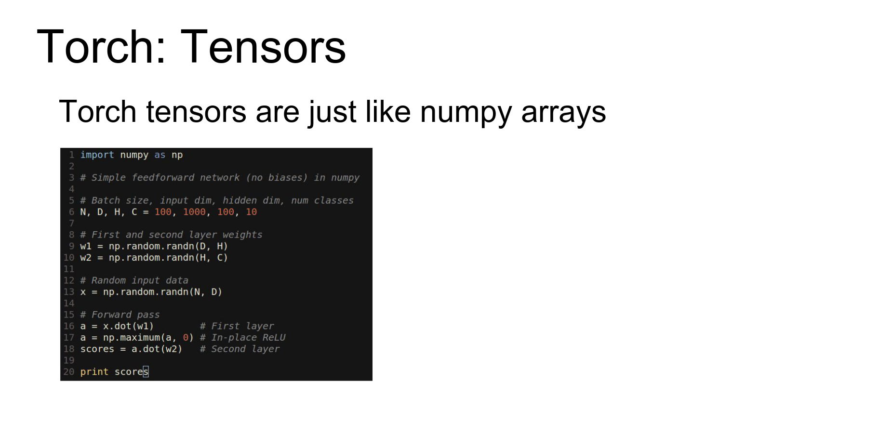
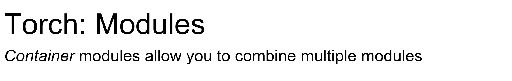
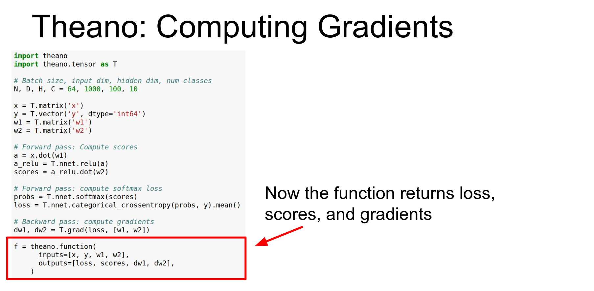

Part of [CS231n Winter 2016](../index.md)

---
# From Justin Johnson

---
# Software Packages - Deep Learning Libraries

Today we're going to go over these ==four major software packages== that people commonly use for deep learning.

Final assignment is going to be due on Wednesday.  Project Milestones.

---

Another thing that I should point out is that if you're actually planning on using terminal for your projects which I think a lot of you are then make sure you you're backing up your code and data and things off of the terminal instances every once in a while.

We've had some problems where the instances will crash randomly and in most cases the the terminal folks have been able to get the data back but it sometimes takes a couple days. And there's been a couple of cases where actually people lost data because it was just on terminal and it crashed. 

---
##  Caffe /  Torch / Theano / Tensorflow 

As a little bit of disclaimer at the beginning, personally I've mostly worked with Caffe and torch so those are the ones that I know the most about I'll do my best to give you a good flavor for the others as well.

But just throwing that disclaimer out there.
# Caffe - Last commit 5 years ago 😕

The first one is Caffe. We saw in the last lecture that really Caffe sprung out of this paper at Berkeley that was trying to re-implement AlexNet and use AlexNet features for other things.

And since then Caffe has really grown into a really popular widely used package for especially convolutional neural networks.

So Caffe is from Berkeley that I think a lot of you people have know and it's mostly written in C++. And there's actually bindings for Caffe you can access the Nets and whatnot in python and Matlab that are super useful.

And in general Caffe is really widely used and its really good if you just want to train sort of standard feed-forward vanilla convolutional Networks.

And actually Caffe is somewhat different than the others other frameworks in this respect you can actually train big powerful models in Caffe without writing any code yourself.

So for example the the ResNet image and classification model that one image that won everything last year, you can actually train a ResNet using Caffe without writing any code which is pretty amazing.

So the most important tip when you're working with Caffe is that the documentation is not is sometimes out of date and not always perfect so you need to not be afraid to just dive in there and read the source code yourself.

It's C++ so hopefully you can read that and understand it, but in general the the C++ code that they have in Caffe is pretty well structured pretty well organized and pretty easy to understand.

So if you have doubts about how things work in Caffe your best bet is just to go on GitHub and read the source code.

So Caffe is this huge big project with like probably tens of thousands of lines of code and it's a little bit scary to understand how everything fits together.

But there's really ==four major classes in Caffe== that you need to know about the first one is a `blob` so blobs store all of your data and your weights and your activations in the network.

So these blobs are things in the network so your weights are stored in a `blob` your data which would be like your pixel values are stored in a `blob` and your labels your Y's are stored in a `blob` and also all of your intermediate activations will also be stored in blobs.

So blobs are these n dimensional tensors sort of like you've seen in numpy except that they actually have four copies of an n-dimensional tensor inside, they have a data version of the tensor which is storing the actual raw data and they also have a parallel tensor called `diffs` that Caffe uses to store gradients with respect to that data and that gives you two 

And then you actually have four because there's a CPU and a GPU version of each of those things.

The next important class that you need to know about in Caffe is `layer` and a layer is sort of a function.

So similar to the ones you wrote on the homework's, layers receives some input blobs - Caffe calls inputs bottoms - and then produces output blobs - that Caffe calls top blobs-.  

So the idea is that your layer will receive pointers to the bottom blobs with the data already filled in. And then it'll also receive a pointer to the top blobs and it will and in forward pass it will expect it to fill in the values for the data elements of your top blobs.

Then in the backward pass the layers will compute gradients. So they will expect to receive a pointer to the top blobs, with the gradients and the activations filled in. And then they'll also receive a pointer to the bottom blobs and fill in the gradients for the bottoms.

And `layer` is this a pretty well structured abstract class that you can go and I have the the links with a source and the header file here and there's a lot of sub classes that implement different types of layers.

A common Caffe problem there's no really good list of all the layer types, you pretty much just need to look at the code and see what types of CPP files there are.

The next thing you need to know about is a net so a `Net` just combines a bunch of layers.

A net is basically a directed acyclic graph of layers and is responsible for running the forward and the backward methods of the layers in the correct order.

You probably don't need to touch this class ever yourself but it's kind of nice to look at to get a flavor of how everything fits together.

And the final class that you need to know about is a `Solver` so the solver is you know we had this thing called solver on the homework that was really inspired by Caffe.

So a solver is intended to dip into the net run the net forward and backward on data actually update the parameters of the network and handle checkpointing and resuming from checkpoints and all that sort of stuff.

And in Caffe solver is this abstract class and the different update rules are implemented by different subclasses so there's for example a stochastic gradient descent solver there's an ADAM solver there's an rmsprop solver etc.

And again just to see what kinds of options are available you should look at the source code.

So this kind of gives you a nice little overview of how these things all fit together that this whole thing on the right would be a net, the net contains in the green boxes blobs each bob contains data and dips the red boxes are layers that are connecting blobs together and then the whole thing would get optimized with a solver.

So Caffe makes heavy use of this funny thing called ==protocol buffers== any of you guys ever intern to Google? Yeah you guys know about this.
### protocol buffers are this almost like a binary strongly typed JSON

But protocol buffers are this almost like a binary strongly typed JSON, I sort of like to think about it that are used very widely inside Google, for serializing data to disk and for passing it over the network. 

So protocol buffers there's this `.proto` file that defines the different kinds of fields that different types of objects have so in this example there's a person that has a name and an ID and an email and this lives in a `.proto` file.

`.proto` files define a type of a class and you can actually serialize instances to human readable `.prototxt` files so for example this fills in the name it gives you the ID it gives you the email and this is an instance of a person that can be saved into this text file.

Then protobuf includes this compiler that actually lets you generate classes in various programming languages to access these data types. So after running the protobuf compiler on this `.proto` file it produces classes that you can then import in Java and C++ and Python and Go and just about everything.

So actually Caffe makes wide use of these protobuf protocol buffers and they use them to store pretty much everything in Caffe.

Like I said to understand that you need to read the code to understand Caffe. 

And Caffe has this one giant file called `caffe.proto` that just defines all of the protocol buffer types that are used in Caffe. 

So this is a gigantic file it's it's I think it's a couple thousand lines long but it's actually pretty well documented and is I think the most up-to-date documentation of what all the layer types are what the options for those layers are how you specify every all the options for solvers and layers and nets and all that.

So I'd really encourage you to check out this file and read through it if you have any questions about how things work in Caffe.

Just to give you a flavor on the left here this shows you this defines the net parameter which is the of protocol buffer that Caffe uses to represent nets

And on the right is this solver parameter which use which Caffe uses to represent solvers 

So the solver parameter for example takes a reference to a net and it also includes things like learning rate and how often to check point and other things like.

When you're working in Caffe actually it's pretty cool you don't need to write any code in order to train models. 

So when working with Caffe you generally have this four step process:

- so first you'll convert your data and especially if you just have an image classification problem you don't have to write any code for this you just use one of the existing binaries in Caffe ships with 
- Then you'll define your your net file that you'll do by just writing or editing one of these prototxt's 
- then you'll define your solver which again will just live via prototxt text file that you can just work with in a text editor 
- And then you'll pass all of these things to this existing binary to train the model 
 
And that'll spit out your train Caffe model to disk that you can then use for other things.

So even if you wanted to Train ResNet on image-net you could just follow this simple procedure and train a giant network without writing any code so that's really cool.

And so step one generally you'll need to convert your data so Caffe uses I know we've talked a little bit about HDF5 as a format for storing pixels on disk contiguously and then reading from them efficiently, but by default Caffe uses this other file format called LMDB.

So there's a if you if all you have is a bunch of images each image with a label, then Caffe just has a script to convert that whole data set into a giant LMDB that you can use for training.

This is really easy, you just create a text file that has the path to your images and separated by the label and you just pass it to your Caffe script wait a couple hours if your datasets big and you end up with a giant LMDB file on disk.

If you're working with something else like HDF5 then you'll have to create it yourself probably.

So Caffe it does actually have a couple other options for reading data in, there's this data layer the no data layer for for detection it actually can read from HDF5 and there's an option for reading stuff directly from memory that's especially useful with a Python interface.

But at least in my point of view all of these types of other methods of reading and data to Caffe are a little bit second-class citizens in the Caffe ecosystem and LMDB is really the easiest thing to work with.

So l if you can you should probably try to convert your data into LMDB format with Caffe.

So step two for Caffe is to define your net object so like I said you'll just write a big `.prototxt` to define your net.

So here this is a this just defines a simple model for logistic regression you can see that I did not follow my own advice and I'm reading data out of an HDF5 file here, then I have a fully connected layer which isn't called inner product in Caffe.

Then the right so that's fully connected layer tells you the number of classes and how to initialize the values.

Then I have a soft max loss function that reads the labels and produces loss ingredients from the outputs of the fully connected layer.

So a couple things to point out about this file, are that one every layer you typically include some blobs which to store the data and the gradients and the weights, and the layers blobs and the layer itself typically have the same name.

So that can be a little bit confusing.

Another thing is that a lot of these layers will have two blobs one for weight and one for bias. And actually right in here you'll define the learning rates for those two blobs.

So that's learning rate and regularization for both the weight and the bias of that layer.

Another thing to note is that to specify the number of output classes is just the `num_output` on this fully connected layer parameter.

And finally the the quick and dirty way to freeze layers in Caffe is just to set the learning rate to zero for that for the blobs associated to that Layers weights or biases.

Another thing to point out is that for ResNet and other large models like google net this can get really out of hand really quickly.

So Caffe doesn't really let you define like compositionality so for ResNet they just repeat the same pattern over and over and over in the `.prototxt` file.

So the ResNet `.prototxt` is almost 7,000 lines long so you could write that by hand but in practice people tend to write little Python scripts to generate these things automatically.

If you want to fine tune a network rather than starting from scratch then you'll typically download some existing `.prototxt` and some existing weights file and work from there.

The `.prototxt` file that we've seen here before defines the architecture of the network and then the pre-trained weights live in this dot Caffe model file that's a binary thing and you can't really inspect it.

But the way that it works is it's basically key-value pairs where inside the Caffe model it matches these names that are scoped to layers.

So this `fc7.weight` would be the would be the weight corresponding to this a final fully connected layer in AlexNet.

So then when you want to fine tune on your own data when you start up Caffe and you load a Caffe model and a `.prototxt` it just tries to match the key value pairs of names and weights between the Caffe model and the `.prototxt`.

So if the names are the same, then your new network gets initialized from the values in the `.prototxt` which is really really useful and convenient for fine tuning.

But if the names don't match then it those layers actually get initialized from scratch, so this is how for example you can reinitialize the output layer in Caffe.

So to be a little bit more concrete if you maybe download an image net model, then this final fully connected layer that's outputting class scores will have a thousand outputs.

But now maybe for some problem you care about you only want to have ten outputs.

So you're going to need to reinitialize that final layer and reinitialize it randomly and fine-tune the network. So the way that you do that is you need to change the name of the layer in the prototype aisle to make sure that it's actually initialized randomly and not reading from the Caffe model. 

If you forget to do this then it'll actually crash and it'll give you a weird error message about the shapes not aligning 

Because it'll be trying to store this thousand dimensional weight matrix into this ten dimensional thing from your new file and it won't work.

So the next step when working with Caffe is to define the solver. 

The solver is also just a `.prototxt` file you can see all the options for it in that giant `.proto` file that I gave a link to. But it'll look something like this for AlexNet maybe.

So that will define your learning rate and your learning rate decay and your regularization how often to checkpoint everything like that. 

But these end up being much less complex than than these `.prototxt`s for the networks this AlexNet guy is just maybe 14 lines.

Although what you will see sometimes in practice is that if people want to have sort of complex training pipelines, where they first want to train with the one learning rate in certain parts of the network then they want to train with another learning rate certain parts of the network, that you might end up with a cascade of different solver files and actually run them all independently.

We your are sort of fine-tuning your own model in separate stages using different solvers.

So once you've done all that then you just train your model.

So if you if you followed my advice and just use LMDB and written all these things then you just call this binary that is it that exists in Caffe already.

So here you just pass it your solver and your `.prototxt` and your pre trained weights file if you're fine-tuning and it'll run maybe for a day maybe for a long time and just check point and save things to disk and you'll be happy.

One thing to point out here is that you specify which GPU it runs on this is 0 indexed, but you can actually run in CPU only mode by setting this flag to mine to -1.

Actually recently some time in the last year Caffe added data parallelism, to let you split up mini batches across multiple GPUs in your system, so you can actually add multiple GPUs on this flag and if you just say `-all` then Caffe will automatically split up mini batches across all the GPUs on your machine.

So that's really cool you've done multi-GPU training without writing a single line of code, pretty cool.

## So the question is how would you go about in doing some more complex initialization strategy where you maybe want to initialize the weights from a pre train model and use those same weights in multiple parts of your network?

You probably can't do that with a simple mechanism.

Caffe has this really great model zoo you can download lots of different types of pre train models on ImageNet and other data sets so this this model zoo is really top-notch you've got AlexNet and VGG you've got ResNets up there.

Lots of really good models are up there so that's a really really strong part point about Caffe that it's really easy to download someone else's model and run it on your data or fine-tune it on your data.

Caffe has a Python interface like I mentioned I since there's so many things to cover I don't think I can dive into detail here but as is kind of par for the course in Caffe, there's not really really great documentation about the Python interface so you need to read the code.

And the whole the the Python interface for Caffe is mostly defined in these two in these two files this `.cpp` file uses boost Python if you've ever used that before to wrap up some of the C++ classes and expose them to Python and then in this `.py`file, it actually attaches additional methods and gives you a more pythonic interface.

So if you want to know what kinds of methods and data types are available in the Caffe Python interface, your best bet is just read through these two files.

So the Python interface in general is pretty useful it lets you do maybe crazy weight initialization strategies if you need to do something more complex than just copy from a pre-trained model.

It also makes it really easy to just get a network and then run it forward and backward on with from numpy arrays.

So for example you can implement things like deep dream and class visualizations similar to that you did on the homework, you can also do that quite easily using the Python interface on Caffe.

You just need to take data and then run it forward and backward through different parts of Network.

The Python interface is also quite nice if if you just want to ==extract features== like you have some data set you have some pre trained model and you want to extract features from some part of the network and then maybe save them to disk maybe to an HDF5 file for some downstream processing, that's quite easy to do with a Python interface.

You can also actually Caffe has a kind of a new feature where you can actually define layers entirely in Python but this is I've never done it myself but it seems cool it seems nice but the downside is that then those layers will be CPU only.

So we talked about communication bottlenecks between the CPU and the GPU that if you write layers in Python then every forward and backward pass you'll be incurring a overhead on that transfer.

Although one nice place where Python layers could be useful is custom loss functions so that's maybe something that you could keep in mind.

## Caffe pros and cons 

If all you want to do is kind of train a simple basic feed-forward network especially for classification then Caffe is really easy to get things up and running.

You don't have to write any code yourself you just use all these pre-built tools and it's quite easy to run.

It has a Python interface which is quite nice for using a little bit more a little bit more complex use cases.

But it can be cumbersome when things get really crazy when you have these really big networks like ResNet or Google net especially with repeated module patterns it can be tedious.

And for things like RNN's where you want to share weights between different parts of the network can be kind of kind of kind of cumbersome in Caffe it is possible but it's probably not the best thing to use for that 

And the other downside the other big downside from my point of view is that when you want to define your own type of layer in Caffe you end up having to write C++ and CUDA code, so that's doesn't give you a very quick development cycle.
## can you do cross-validation ?

In the Train Val `prototxt` you can actually define a training phase and a testing phase so generally you'll write like a train-val `prototxt` and a deploy `.prototxt`and the deploy will be used at on the test set and the test phase of the train-val `.prototxt` will be used for validation.

So the next one is torch so torch is really my personal favorite so I have a little bit of bias here.
# Torch - [Website](https://github.com/torch/torch7) Last Commit 7 years ago

So torch is originally from NYU it's written in C and in Lua and it's used a lot at Facebook and Deepmind especially. I think also a lot of folks at Twitter use torch.

so one of the big things that freaks people out about torch is that you have to write in Lua.

Which I had never learned I had never heard of or used before starting to work with torch but it actually isn't too bad that Lua is this high level scripting language that is really intended for embedded devices so it can run very efficiently.

Very similar to JavaScript in a lot of ways. So another cool thing about Lua is that because it's meant to be run on embedded devices that you can actually do for loops are really fast in torch you know how in Python if you write a for loop it's going to be really slow that's actually totally fine to do in torch because it actually um uses just-in-time compilation to make these things really fast. 

And Lua is most similar to JavaScript in that it is a functional language functions are first class citizens and it's very common to pass callbacks around to different parts of your code

Lua also is has this idea of prototypical inheritance where there's sort of one data structure which in Lua is a table which you can think of as being very similar to an object in JavaScript. 

And you can implement things like object oriented programming using prototypical inheritance in a similar way as you would in JavaScript and 

One of the Downs one of the downsides is actually the standard library in Lua is kind of annoying sometimes and things like handling strings and whatnot can be kind of cumbersome. And maybe most annoying is that it's one indexed so all of your intuition about for loops will be a little bit off for a while 

But other than that it's pretty easy to pick up and I gave a link here to this website claiming that you can learn Lua in 15 minutes.

They might be over selling it a little bit but I think it is pretty easy to pick up Lua and start writing code in it pretty fast.

So the main idea behind torch is this tensor class.

So you guys have been working in numpy a lot on your assignments and the way the assignments are kind of structured is that, the numpy array gives you this really easy way to manipulate in whatever way you want. 

Then you can use that numpy array to build up other abstractions like neural net libraries and whatnot.

But really the numpy array just lets you manipulate data numerically in whatever way you want in complete flexibility.

Here's an example of some numpy code that should be very familiar by now where we're just computing a simple forward pass of a two-layer ReLU network

We're computing some some constants, we're computing some weights, we're getting some random data, and we're doing a matrix multiply ReLU and another matrix multiply.

So that's very easy to write in numpy.

This has almost a one-to-one translation into torch tensors so now on the right this is the exact same code but using torch tensors in Lua.

So here we're defining our batch size input size and all that. We're defining our weights which are just Torch tensors.

We're getting a random input vector, we're doing a forward pass this is doing a matrix multiply of torch tensors, the `c-max` is a element-wise maximum so that's a ReLU and then we can compute scores using another matrix multiply.

So in general pretty much any kind of code you're used to writing in numpy is pretty much has almost a 1 by 1 line by line translation into using torch tensors instead.

So you also remember in numpy that it's really easy to swap and use different data types.

We talked about this ad nauseam in the last lecture, but at least in numpy all to switch to maybe a 32-bit floating-point all you need to do is cast your data to this other data type and it turns out that that's very easy to do in torch as well

That our data type is now this this string and then we can easily cast our data to another data type.

But here's where - here's the row so this next slide is the real reason why torch is infinitely better than numpy and that's that the GPU is just another data type

So when you want to run code on the GPU in torch, you import another package and you have another - another data type which is `torch.CUDATensor` and now you cast your tensors to this other data type and now they live on the GPU.

And running any kind of numerical operations on CUDA tensors just runs on the GPU.

So it's really easy in torch to just write generic tensor scientific computing code to run on a GPU and be really fast.

These tensors are really you should think of them as similar to numpy arrays. And there's a lot of documentation on the different kinds of methods that you can work with in tensors up here on GitHub.

This documentation isn't super complete but it's it's not bad so you should take a look at it.

In practice you end up not really using the tensors too much in torch, instead you use this other package called `nn` neural networks.

So `nn` is this pretty thin wrapper that actually defines a neural network package just in terms of these tensor objects.

So you should think of this as being like a beefier more industrial-strength version of the homework codebase where you have this this ndarray this tensor abstraction and then you implement a neural net library on top of it in a nice clean interface.

So here's this same two layer network using the NN package, so we define our network as a sequential so it's going to be a stack of sequential operations.

It's gonna we're going to first have a linear which is a fully connected layer from our input dimension to our hidden dimension. We're going to have a ReLU and another linear.

Now we can actually get the weights and gradients in one tensor for each using this `get_parameters` method.

Now `weights` will be a single torch tensor that will have all the weights of the network and `grad_weights` will be a single torch tensor for all of the all of the gradients.

We can generate some random data.

To do a forward pass we just call the forward method on the net object using our data and this gives us our scores.

To compute our loss we have a separate criterion object, that is our loss function.

So we compute our loss by calling the forward method of the criterion now we've done our forward pass very easy.

For our backward pass we first set our gradients to zero, call a backward on the loss function and then a backward on the network.

Now this has updated all of the gradients for the network in the Grad params so we can just make a gradient step very easily.

So this would be multiplying the `grad_weights` by the opposite of the `learning_rate` and then adding it to the weights.

That's a simple a gradient descent update. 

We have a net.

We have weights grad_weights.

We have our loss function.

We get random data.

Run forward.

Run backward.

Make an update.

As you might expect from looking at the tensor, it's quite easy to make this thing run on GPU so to run one of these networks on the GPU.

We import a couple new packages `cutorch` and `cunn` which are CUDA versions of everything.

Then we just need to cast our network and our loss function to this other data type.

We also need to cast our data and labels and now this whole network will run and train on the GPU so it's it's pretty easy. In forty lines of code we've written a fully connected Network and we can train on the GPU.

But one problem here is that we're just using vanilla gradient descent which is not so great and as you saw in the assignments other things like Adam and rmsprop tend to work much better in practice.

To solve that torch gives us the `optim` package, so `optim` quite easy to use.

Again we just import a new package up here.

And now what changes is that we actually need to define this callback function.

So before we were just calling forward and backward exclude explicitly ourselves instead we're going to define this callback function that will run the network forward and backward on data and then return the loss and the gradient.

And now to make an update step on our network we'll actually pass this callback function to this Adam method from the optim package.

So this this is maybe a little bit awkward but we you now we can use any kind of update rule using just a couple lines of change from what we had before.

And again this is very easy to add to run on a GPU by just casting everything to CUDA.

Caffe sort of implements everything in terms of nets and layers.

Caffe has this really hard distinction between a net and the layer.

In torch they don't we don't really draw this distinction everything is just a module. So the entire network is a module, and also each individual layer is a module.

So modules are just classes that are defined in Lua that wrote that are implemented using the  tensor API.

So these modules are since they're written in Lua they're quite easy to understand.

So `Linear` is the fully connected layer in Lua and this is the constructor, you can see it's just setting up tensors for the weight and the bias.

Because this tensor API in torch lets us easily run the same code on GPU and CPU, then all of these layers will just be written in terms of the tensor API and then easily run on both devices.

So these modules need to implement a forward and backward, so for forward they decided to call it `updateOutput` 

Here's the example of the update output for the fully connected layer.

They need to deal with a couple different cases here to deal with mini-batch versus non mini-batch inputs but other than that this should be quite easy to read.

For for the backward pass there's a pair of methods `updateGradInput` which receives the upstream gradients and computes the gradients with respect to the input, and again this is just implemented in the tensor API, so it's very easy to understand. 

It's just a just the same type of thing you saw in homework.

And we also implement and `accGradParameters` which computes the gradients with respect to the weights of the network.

As you saw in the constructor the weights and the biases are held in instance variable of this module and accumulate grad parameters will receive gradients from upstream and accumulate gradients of the parameters with respect to the upstream gradients.

And again this is very simple just using the tensor API.

So torch actually has a ton of different modules available, the documentation here can be a little bit out of date but if you just go on GitHub you can see all the `.lua` files that give you all the goodies to play with.

And these actually get updated a lot, these three were just added in last week so torch is always adding new modules to that you can add to your networks which is pretty fun.

But when these existing modules aren't good enough it's actually very easy to write your own so because you can just implement these things using the tensor API and just implement the `forward` and `backward` it's not much harder than implementing layers on the homeworks.

Here's just a small example, a  dummy module that just takes its input and multiplies that by two and you can see we implement the `updateOutput` and the `updateGradInput` and now we've implemented a new layer in torch in just 20 lines of code.

That's really easy and then it's very easy to use in other code, just import it and I you can add it to networks. The really cool thing about this is, because this is just the tensor API, you can do whatever kind of arbitrary thing you want inside of these forward and backward.

If you need to do for loops or complicated imperative code or any or maybe stochastic things for dropout or Batch normalization then whatever kind of code you want on the forward and backward pass you just implement it yourself inside these modules.

So it's usually very easy to implement your own new types of layers in torch.

But of course using individual layers on their own isn't so useful we need to be able to stitch them together into larger networks.

So for this torch uses containers.

We already saw one in the previous example, which was this `Sequential` container so sequential container is just a stack of modules that all where one receives the output from the previous one and just goes in a linear stack.

So that's probably the most commonly used.

Another one you might see is this `ConcatTable()` so maybe if you have an input and you want to apply different two different modules to the same input, then the `ConcatTable()` lets you do that and you receive the output as a list.

Another one you might see is a `ParalelTable()` 

If you have a list of inputs and you want to apply different modules to each element of the list then you can use a `ParalelTable()`  for that sort of a construction.

Those containers that I just told you should in theory make it possible to implement just about any topology you want.

But it can be really hairy in practice to wire up really complicated things using those containers.

So torch provides another package called NN graph, that lets you hook up things in more complicated topologies pretty easily.

So here's an example if we have three inputs and we want to produce one output, and we want to produce them with this pretty simple update rule.

That corresponds to this type of computational graph that we've seen many times in lecture for different types of problems.

You could actually implement this just fine using parallel and sequential and ConcatTable but it could be kind of a mess.

So when you want to do things like this it's very common to use NNgraph instead.

This function is going to build a module using nn graph and then return it.

So here we import the NNgraph package.

This is actually not a tensor this is defining a symbolic variable so this is saying that our our tensor object is going to receive x y and z as inputs and now here we're actually doing symbolic operations on those inputs.

So here we're saying that a we we want to have a point wise addition of x and y store that in a, we want to have point wise multiplication of a and Z and store that in B, and now point wise addition of a and B and store that in C.

These are not actual tensor objects these are now sort of symbolic references that are being used to build up this computational graph in the back end.

And now we can actually return a module here, where we say that our module will have inputs X,Y and Z and outputs C and this `nn.gModule` will actually give us an object conforming to the module API that implements this computation.

So then after we build the module we can construct concrete torch tensors and then feed them into the module that will actually compute the function.

Torch actually is quite good at pre trained models.

There's a package called load Caffe that lets you load up many different types of pre train models from Caffe and it'll convert them into their torch equivalents so you can load up the Caffe `.prototxt` and the Caffe model file and it'll turn into a giant stack of sequential layers 

`loadCaffe` is not super general though it only works for certain types of networks.

But in particular load Caffe will let you load up AlexNet and CaffeNet and VGG so they're probably the some of the most commonly used.

There are also a couple different implementations that let you load up GoogleNet into torch and actually very recently Facebook went ahead and re implemented the residual networks straight up in torch and they released pre-trained models for that 

So between AlexNet CaffeNet VGG GoogleNet and ResNet I think that's probably everything you need , ll the pre train models that most people want to use.

## luarocks instead of pip

Another point is that because torch is using Lua we can't use pip to install packages and there's another very similar idea called `lurarox` lets you easily install new packages and update packages.

This is kind of just a list of some packages that I find very useful in torch:

- so there are `cuDNN` bindings you can read and write to HDF5 files, you can read and write json
- there's this funny one from Twitter called `autograd` that is a little bit like Theano which we'll talk about in a bit but I haven't used it but it's kind of cool to look at 
- Facebook has a pretty useful library for torch as well that implements FFT convolutions and also implements data parallel and model parallelism 

A very typical workflow in torch is that you'll have some pre-processing script often in Python that'll pre process your data and dump it on to some nice format in disk usually HDF5 for big things and json for little things.

You will typically write a `train.lua` that'll read from the HDF5 and train the model and optimize the model and save checkpoints to disk.

And then usually I'll have some evaluate script that loads up the train model and then does it for something useful.

So a case study for this type of workflow is this project I put up on GitHub like a week ago that implements character level language models in torch 

So here there's a pre-processing script that converts text files into HDF5 files

There's a training script that loads from HDF5 and trains these recurrent networks 

And then there's a sampling script that loads up the checkpoints and lets you generate text

So that's that's kind of like my typical work flow in torch.

## quick pros and cons about torch 🤔

- It's Lua this is a big turn-off for people but I don't think it's actually that big a deal.
- it's definitely less plug-and-play than Caffe:
	- so you'll end up writing a lot of your own code typically which maybe is a little bit more overhead but also gives you a lot more flexibility. 
- it has a lot of modular pieces that are easy to plug and play and 
- the standard library, because it's all written in Lua, it is quite easy to read and to understand 
- there's a lot of pre trained models which is quite nice.
- but unfortunately it's it's a little bit awkward to use for recurrent networks in general.

When you want to have multiple modules that share weights with each other you can actually do this in torch but it's it's kind of brittle and you can run into subtle bugs there.

So that's probably the biggest caveat is that recurrent networks can be tricky.
### Compare performance of Python - JavaScript and Lua ?

Python is interpreted right so that that's really why for loops are really bad in Python because it's interpreted and every four loop is actually doing quite a lot of memory allocation and other things behind the scenes.

But if you've ever used JavaScript then loops in JavaScript tend to be pretty fast because the runtime actually compiles the code on the fly down to native code, so loops in JavaScript are really fast.

And Lua actually has a similar mechanism where it'll sort of automatically and magically compile the code for you into native code so your loops can be really fast. 

# Theano - [Website](https://github.com/Theano/Theano?tab=readme-ov-file) - It's no longer. 

Theano is from Yoshua Bengio's group at University of Montreal and it's really all about computational graphs.

So we saw a little bit in NN graph from torch that computational graphs are this pretty nice way to stitch together big complicated architectures.

Theano really takes this idea of computational graphs and runs with it to the extreme.

And it also has some high-level libraries Keras and Lasagna that we'll touch on as well.

So here's the same computational graph we saw in the context of nn.graph before and we can actually walk through an implementation of this into in Theano.

So you can see that in here we're importing Theano and the Theano tensor object

And now here we're defining x,y&z as symbolic as symbolic variables. This is actually very similar to the NNgraph example we saw just a few slides ago, so that these are actually not numpy arrays these are sort of symbolic objects in the in the computation graph.

Then we can actually compute to these outputs symbolically so x,y&z are these symbolic things and we can compute a B and C just using these overload operators and that'll be building up this computational graph in the backend.

Then once we built up our computational graph we actually will want to be able to run certain parts of it on real data.

So we call this `Theano.function` thing so this is saying that we want to take our function we'll take inputs X, Y and Z and it'll produce outputs C and this will return an actual Python function that we can evaluate on real data 

And I'd like to point out that this is really where all the magic in Theano is happening that when you call to function it can be doing crazy things it can simplify your computational graph to make it more efficient, it can actually symbolically divide derived gradients and other things and it can actually generate native code.

So when you call function it connect it actually sometimes compiles code on the fly to run officially on the GPU.

So all the magic in Theano is really coming from this from this little innocent-looking statement in Python.

But there's a lot going on under the hood here.

And now once we've gotten this magic function through all this crazy stuff then we can just run it on actual numpy arrays.

So here we're instantiating `xx`, `yy` and `zz` as actually as actual numpy arrays

Then we can just evaluate our function and pass in these actual numpy arrays to get the values out.

This is doing the same thing as we were doing these computations explicitly in python, except that the Theano version could be much more efficient due to all the magic under the hood.

And the Theano version could be running on the GPU if you have that configured.

But unfortunately we don't really care about computing things like this we want to do neural nets.

So here's an example of a simple two-layer ReLU in Theano.

So the idea is the same, that we're going to declare our inputs, but now instead of just x, y&z we have our inputs in X our labels in Y which are a vector and our two weight matrices `W1` and `W2`.

So we're just sort of setting up these symbolic variables that will be elements in our computational graph.

Now for our forward pass we it looks kind of like numpy but it's not. These are operations on these symbolic objects that are building up the graph in the backend

So here we're computing activations with this dot that is matrix-multiply between these symbolic objects.  We're doing a ReLU using this this library function and we're doing another matrix multiply.

We can actually compute the loss the probabilities and the loss using a couple other library functions and again these are all operations on these symbolic objects that are building up the computational graph.

So then we can just compile this function, so our function is going to take our data our labels and our two weight vector and our two weight matrices as inputs. 

And as outputs that will return the loss in a scalar and our classification scores and a vector.

And now we can run this thing on real data just like we saw on the previous slide where we can instantiate some actual numpy arrays, and then pass them into the function.

So this is great but this is only the forward pass we actually need to be able to train this network and compute gradients.

Here we just need to add a couple lines of code to do that.

So this is the same as before we're defining our symbolic variables for our inputs and our weights and so forth. We're combining running the same forward passes before to compute the loss symbolically. 

Now the difference is that we actually can do symbolic differentiation here so this `DW1` + `DW2` we're telling Theano that we want those to be the gradients of the loss with respect to those other symbolic variables `W1` and `W2`.

So this is really cool, Theano just lets you take arbitrary gradients of any part of the graph with respect to any other part of the graph and now introduce introduce those as new symbolic variables in the graph.

Here in this case we're just going to return those gradients as outputs.

So now we're going to compile a new function that again is going to take our input pixels x and our labels Y along with the two weight matrices.

And it's going to return our loss the classification scores and then also these two gradients.

Now we can actually use this set up to train a very simple neural network. 

We can actually just implement gradient descent in just a couple lines using this computational graph.

So here we're instantiating actual numpy arrays for the data set and the vectors and some random weight matrices as again actual numpy arrays.

And now every time we make this call to `f` then we get back numpy arrays containing the loss and the scores and the gradients.

So now that we have the gradients we can just make a simple gradient update on our weights and then run this in a loop to train our network.

But there's actually a big problem with this especially if you're running on a GPU ??

So the problem is that this is actually incurring a lot of communication overhead between the CPU and the GPU 

Because every time we call this `f` function and we get back these gradients that's copying the gradients from the GPU back to the CPU and that can be an expensive operation

And now we're actually making our gradient step this is CPU computation in numpy so it would be really nice if we can make those gradient updates to our parameters actually directly on the GPU.

The way that we do that in Theano is this with with this cool thing called a shared variable 
### shared variable ?? Theano Special

A shared variable is a value that lives inside the computational graph and actually persists from call to call.

So here this is this is actually quite similar to before that now we're defining that our same symbolic variables x and y for the data and the labels.

Now we're defining a couple of these new funky shared variables for our two weight matrices and we are initializing these weight matrices with numpy arrays

This is the exact same code as before we're computing the forward pass using these library functions, all symbolically then we're computing the gradients.

But now the difference is in how we define our function, so now this compiled function does not receive the weights as inputs because those actually live inside the computational graph instead we just received the data and the labels.

And now we are going to output the loss rather than outputting the gradients explicitly.

And instead we actually provide these update rules that should be run every time the function is called.

So these update rules notice our little functions that operate on these symbolic variables. So this is just saying that we should make these gradient descent steps to update `W1` and `W2` every time we run this computational graph.

We include this update.

Now to train this network all we need to do is call this function repeatedly, and every time we call the function those we will make a gradient step on the weights.

So we can just train this network by just calling this thing repeatedly.

And in practice when you're make when you're doing this kind of thing in Theano you'll often define a training function that you'll call that'll update the weights and then also an evaluate function that'll just output the scores and not make any updates.

So you can actually have multiple of these compiled functions that evaluate different parts of the same graph.
### the question is how we compute gradients in Theano?

and it actually does it symbolically, sort of parsing out the ast (abstract syntax tree).

Well it's not actually parsing out the ast because every time you make these calls it's a sort of building up this computational graph object 

And then you can compute gradients by just adding nodes onto the computational graph object.

For every of these basic operators it knows what the derivative is and it's still the normal type of back propagation that you'll see in other frameworks.

The pitch with Theano is that,  it works on these very very low-level basic operations like these element wise things and matrix multiplies. Then it is hoping that it can compile efficient code that combine those and simplify it symbolically.

---
### tangent - how to calculate gradients ? 🍒

In the context of deep learning and neural network training, "parsing out the AST (Abstract Syntax Tree) for calculating gradients" refers to the process of automatically differentiating the computational graph of a neural network to compute the gradients of the model parameters with respect to the loss function.Here's a more detailed explanation:

1. **Computational Graph**: When building a neural network in a deep learning framework like PyTorch or TensorFlow, the network is represented as a computational graph. This graph consists of nodes (representing operations like matrix multiplication, activation functions, etc.) and edges (representing the flow of tensors between operations).
2. **Automatic Differentiation**: To train a neural network using gradient-based optimization methods (like stochastic gradient descent), we need to compute the gradients of the model parameters with respect to the loss function. This process is known as automatic differentiation or backpropagation.
3. **Abstract Syntax Tree (AST)**: The computational graph of a neural network can be represented as an AST, which is a tree-like data structure that captures the structure of the computations performed by the network. Each node in the AST represents an operation, and the edges represent the dependencies between the operations.
4. **Parsing the AST**: To compute the gradients, the deep learning framework needs to "parse" the AST of the computational graph. This involves traversing the AST, identifying the operations, and applying the chain rule of differentiation to compute the gradients of the model parameters with respect to the loss function.
5. **Gradient Calculation**: By parsing the AST, the deep learning framework can automatically compute the gradients of the model parameters with respect to the loss function. This is done by applying the chain rule of differentiation, starting from the output of the network and working backwards through the computational graph.

The ability to automatically differentiate the computational graph and compute the gradients is a key feature of modern deep learning frameworks like PyTorch and TensorFlow. It allows developers to focus on defining the neural network architecture and the loss function, without having to manually derive and implement the gradient calculations.This automatic differentiation process, enabled by parsing the AST of the computational graph, is a crucial component that allows deep learning models to be trained efficiently using gradient-based optimization methods.

---

A lot of other advanced things that you can do in Theano that we just don't have time to talk about:

So you can actually include conditionals directly inside your computational graph using these if-else and switch commands.

You can actually include loops inside your computational graph using this this funny scan function that I don't really understand. But theoretically it lets you implement recurrent networks quite easily because you can imagine a for to implement a recurrent Network in one of these computational graphs all you're doing is passing the same weight matrix into multiple nodes and scan actually lets you sort of do that in a loop and have the loop be part of an explicit part of the graph.

We can actually go crazy with derivatives we can compute derivatives with respect with out of any part of the graph with respect to any other part we can also compute Jacobians by computing derivatives of derivatives. We can use l and r operators to efficiently do make um big matrix vector multiplies of vectors and Jacobians.

So you can do about a pretty cool derivative type stuff in Theano that's maybe tough and other frameworks

And it also has some support for sparse matrices it tries to optimize your code on the fly and do some other cool things. 

Theano does have multi GPU support, there's this package that claims that you can get data parallelism so distribute a mini-batch split it up over multiple GPUs.

And there's experimental support for model parallelism where this computational graph will be divided among the different devices but the documentation says it's experimental so it's probably really experimental.

You saw in when working with Theano that the API is a little bit low level and we need to sort of implement the update rules and everything ourselves.

So Lasagne is this high level wrapper around Theano that sort of abstract away some of those details for you.

So again we're sort of defining symbolic matrices.

And Lasagne now has these layer functions that will automatically set up the shared variables.

We can compute the probability in the loss using these convenient things from the Lasagne library.

And Lasagne can actually write these update rules for us to implement Adam and Nesterov momentum and other fancy things.

And now when we compile our function, we just pass in these update rules that were already written for us by lasagna and all of the weight objects were taken care of for us by lasagna as well.

At the end of the day we just end up with one of these compiled Theano functions and we use it the same way as before.

There's another wrapper for Theano that's pretty popular called Keras
## Keras ??

Which is a little bit is, even more high-level.

So here we're having making a sequential container and we're adding a stack of layers to it so this is kind of like torch.

And we're having this making this SGD object that is going to actually do updates for us.

Now we can train our network by just using the `model.fit` method.

So this is super high level and you can't even tell that using Theano and in fact Keras will actually use TensorFlow as a back-end as well so you don't have to use Theano with it.

But there's actually one big problem with this piece of code and I don't know if you've if you're experienced with Theano but this code actually crashes. 

And it crashes in a really bad way 

This is the error message so we get this giant stack trace none of which is through any of the code that we wrote, and we get this giant value error that doesn't make any sense to me.

So I'm not really an expert in Theano so this was really confusing to me so.

We wrote this kind of simple looking code and Keras but because it's using Theano as a back-end it crapped out and gave us this really confusing error message 

So that's I think one of the common pain points and failure cases with anything that uses Theano as a back-end 

That debugging can be kind of hard.

So like any good developer I googled the error, and I found out that I was encoding the y-variable wrong and I was supposed to use this other function to convert my Y variable, and that made the problem go away.

But that was not obvious from the error message so that's something to be worried about when you're using Theano.

Theano actually has pre trained models, so we talked about Lasagna.

Lasagna actually has a pretty good model zoo of a lot of different popular model architectures that you might want

So in lasagna you can use AlexNet and GoogleNet and VGG. I don't think they have ResNet yet but they have quite a lot of useful things there.

And there are a couple other packages I found that don't really seem as good except, this one's clearly awesome (Caffe-Theano-conversion) because it was a cs231n project from last year.

But if you're going to pick one I think probably the lasagna models do is really good.

So from my one day experience of playing with Theano - The pros and cons that I could see:

It's Python and numpy so that's great.

This computational graph seems like really powerful idea especially around computing gradients symbolically and all these cool optimizations.

It especially with RNN's I think could be much easier to implement using this computational graph.

Raw Theano is kind of ugly but especially lasagna looks pretty good to me and sort of takes away some of the pain.

The error messages can be pretty painful as we saw. 

Big models from what I've heard can have really long compile times so that that when we're compiling that function on the fly for all these simple examples that pretty much runs instantaneously but when you're doing big complicated things like neural Turing machines I've heard stories that that could actually take maybe half an hour to compile.

So that's that's not good and that's not good for iterating quickly on your models and 

Another sort of pain point is that the API is much fatter than torch that it's doing all this complicated stuff in the background so it's kind of hard to understand and debug that's actually happening to your code 

And then pre-trained models are maybe not quite as good as Caffe or torch but it looks like lasagna is pretty good.

Okay so we've got 15 minutes now to talk about TensorFlow 
# TensorFlow - [Website](https://github.com/tensorflow/tensorflow) - last commit today

TensorFlow is from Google it's really cool and shiny and new and everyone's excited about it.

And it's actually very similar to Theano in a lot of ways, that they're really taking this idea of a computational graph and sort of building on that for everything.

So TensorFlow and Theano actually very closely linked in my mind and that sort of why Keras can get away with using either one as a back-end.

One point to make about TensorFlow is that it's sort of the first one of these frameworks that was designed from the ground up by professional engineers.

So a lot of these other frameworks sort of spun out of academic research labs and they're really great and they let you do things really well.

But they were sort of maintained by grad students especially, so torch especially is maintained by some engineers at Twitter and Facebook now but it was originally an academic project.

And for all of these I think TensorFlow was the first one that was from the ground up from industrial place so maybe theoretically that could lead to better code quality or test coverage or something, I don't know, I'm not sure.

I didn't try to look into the codebase, I thought they both seemed pretty scary.

So here's our favorite two layer ReLU, we did it and all the other frameworks let's do it in tensor flow. 

So this is actually really similar to Theano.

So you can see that we're importing tensor flow and in Theano remember we had these matrix and vector symbolic variables, in tensor flow they're called placeholders but it's the same idea.

These are just creating input nodes in our computational graph.

We're also going to define weight matrices, in Theano we have these shared things that lived inside the computational graph, same idea and TensorFlow except they're called variables.

Just like in Theano we computed our forward pass using these library methods that operate symbolically on these on these things and build up a computational graph, so that lets us easily compute the probabilities and the loss and everything like that symbolically.

This part actually I think to me looks more like Keras or rather looks a little bit more like Keras or Lasagna than raw Theano, but we're using this gradient descent optimizer and we're telling it to minimize the loss.

So here we're not explicitly spitting out gradients and we're not explicitly writing out writing update rules.

We're instead using this pre-built thing that just sort of adds whatever it needs to into the graph in order to minimize that loss.

Now just like in Theano, we can actually instantiate using actual numpy arrays are some some small data set.

And then we can run in a loop.

So in TensorFlow when you actually want to run your code, you need to use you need to wrap it in this session code.

What it's doing is that all this stuff is sort of setting up your computational graph and then the session is actually doing whatever optimization it needs to to actually allow you to run it.

TensorFlow wants one hot

When we actually want to train this network then we call take-in so in in Theano remember we actually compiled this function object, and then call the function over and over again the equivalent in TensorFlow is that we use call the `run` method on the session object and we tell it which outputs we want it to compute.

So here we're telling it that we want to compute the `train_step` output and the `loss` output and we're going to feed it these numpy arrays into these inputs.

This is kind of the same idea as Theano except we're just calling the run method rather than explicitly compiling a function.

And in the process of evaluating this train step object it'll actually make a gradient descent on the weights

So then we just run this thing in the loop and it'll the loss goes down and everything is beautiful.

So one of the really cool things about TensorFlow is this thing called TensorBoard that lets you easily visualize what's going on in your network.
### Cool thing is the TensorBoard ! 🐍

Here it is pretty much the same code before, except we've added these three little lines.

So here we're computing a scalar summary of the loss and that's giving us a new symbolic variable called `loss_summary` and we're computing a `histogram_summary` of the weight matrices `w1` and `w2` and those are getting us new symbolic variables `w1_hist` and `w2_hist.

Now we're getting another symbolic variable called merged that kind of merges all those summaries together using some magic I don't understand and we're getting this `SummaryWriter` object that we can use to actually dump out those summaries to disk.

And now in our loop when we're actually running the network then we tell it to evaluate  the training step and the loss like before and also this `merged` summary object.

So in the process of evaluating this merged summary object it will compute gradient it will compute histograms of the weights and dump those summaries to disk.

And then we tell our writer to actually add the summary so I guess that's where the writing to disk happens.

While this thing is running it's sort of constantly streaming all this information about what's going on in your network to disk.

And then you just start up this this web server that ships with TensorFlow called TensorBoard and we get these beautiful visualizations about what's going on in your network.

So here on the left remember we were telling we were getting a scalar summary of the loss so this actually shows that loss was going down, it was a big network and a small data set but that means everything is working.

This over here on the right hand side is showing you histograms over time showing you the distributions of the values in your weight matrices.

So this is really cool and I think this is a really beautiful debugging tool.

So when I've when I've been working on projects in torch I've written this kind of stuff myself by hand where I'm just kind of dumping JSON blobs out of torch and then writing my own custom visualizers to view these kind of statistics because they're really useful.

And with TensorFlow you don't have to write any of that yourself you just add a couple lines of code to your training script run their thing and you can get all these beautiful visualizations to help your debugging.

TensorFlow or TensorBoard can also help you even visualize what your network structure looks like.

So here we've annotated our variables with these names.

When we're doing the forward pass we can actually scope some of the computations under a namespace.

That sort of just lets us group together computations that should belong together semantically. 

Other than that it's the same thing that we saw before.

Now if we run this Network and load up TensorBoard we can actually get this beautiful visualization for how like what our network actually looks like.

We can actually click in and look and see what those gradients and the scores and really help debug what's going on inside this network.

And each you see these loss and scores these are the semantic namespaces that we defined it during the forward pass.

And if we click on the scores for example, it opens and lets us see all of the sub operations that  appear inside the computational graph for that node.

So I thought this was really cool right it lets you like really easily debug what's going on inside your networks while it's running.

And you don't have to write any of that visualization code yourself.

So TensorFlow does have support for multi GPU, so it has data parallelism like you might expect so I'd like to point out that actually this distribution part is probably one of the other major selling points of TensorFlow.

It can try to actually distribute the computational graph in different ways across different devices and actually place the distribute that graph smartly to minimize communication overhead and so on.

So one thing that you can do is data parallelism where you just split your mini batch across different devices and run each one forward and backward and then either some the gradients to do synchronous distributed training or just make asynchronous updates to your parameters and do asynchronous training.

The white paper claims you can do both of these things in TensorFlow but I didn't I didn't try it out.

You can also actually do model parallelism in TensorFlow as well that let's you split up the same model and compute different parts of the same model on different devices.

So one place where that might be useful is a multi-layer recurrent Network. There it might actually be a good idea to run different layers of the network on different GPUs.

Because those things can actually take a lot of memory. So that's the type of thing that you can actually do about theoretically you can do that in TensorFlow without too much pain.

TensorFlow is also the only of the frameworks that can run in distributed mode not just distribute across one machine and multiple GPU's but actually distribute them training the model across many machines.

So the the caveat here is that that part is not open source yet, right as of today the open source release of TensorFlow can only do single machine multi-GPU training.

Hopefully soon that part will be released too because that'd be really cool.

The idea is we can just it and TensorFlow is aware of communication costs both between GPU and CPU but also between different machines on the network.

So then it can try to smartly distribute the computational graph across different machines and then across different GPUs within the machines to compute everything as efficiently as possible.

So that's I think that's really cool and that's something that the other frameworks just can't do right now.

One pain point with TensorFlow is pre-trained models.

So I looked I did a thorough Google search and the only thing I could come up with was an inception module a pre trained inception model but it's only accessible through this Android demo.

Other than that I'm not I'm not really aware of other pre train models in TensorFlow but maybe maybe there are out maybe they're out there and I just don't know about them.

TensorFlow pros and cons from again my quick one-day experiment.

It's really good because it's Python and numpy that's really cool.

Similar to Theano it has this idea of computational graphs which i think is super powerful and actually takes this idea of computational graphs even farther than than Theano really and things like check-pointing and distributing across devices these all end up as just nodes inside the computational graph.

It's also claims to have much faster compile times than Theano I've heard horror stories about neural Turing machines taking half an hour to compile. Maybe that should be faster in TensorFlow.

TensorBoard looks awesome that looks amazing I want to use that everywhere it has really cool data and model model parallelism I think much more advanced than the other frameworks

Although the distributed stuff is still secret sauce at Google but hopefully that will come out to the rest of us eventually 

Maybe the scariest is the code base, to actually dig into and understand what's working under the hood. My fear about TensorFlow is that if you want to do some kind of crazy weird imperative code and you cannot easily work it into their computational graph abstraction that seems like you could be in a lot of trouble. 

Maybe in torch you can just write whatever imperative code you want inside the forward and backward passes of your own custom layers.

But that seems like the biggest a worrying point for me working with TensorFlow in practice.

Another kind of awkward thing is this lack of pre train models.

Apparently installing in 2016 was hard too.

So they should get their act together on that so I put together this quick overview table that kind of covers what I think people would care about on major points between the frameworks.

What are the languages what kind of pre train models are available, what kind of parallelism you have and how readable is the source code and whether they're good RNN's.

Suppose that all you wanted to do was extract AlexNet or VGG features which framework would you pick?

Yeah me too Caffe.

Let's say all we wanted to do was find two an AlexNet on some new data.

Probably Caffe.

Let's say we wanted to do image captioning with fine-tuning.

This is my thought process, for this problem we need pre trained models.

For pre-trained models we're looking at Caffe or torch or Lasagna

We need RNN's so Caffe is pretty much out even though people have done have implemented this stuff there it's just kind of painful 

So I'd probably use torch or maybe Lasagna.

How about semantic segmentation we want to classify every pixel right? 

So here we want to read an input image and then instead of giving a label to the whole output image we want to label every pixel independently.

We need a pre trained model here most likely. And here that we're talking about kind of a weird use case where we might need to define some of our own logic

So if this layer happens to exist in Caffe that would be a good fit otherwise we'll have to write it ourselves and writing this thing ourselves seems least painful in torch.

How about object detection ?

Caffe is an idea, so my thought process again we're looking at pre trained models so we need Caffe torch or Lasagne we actually could with detection you could need a lot of funky imperative code, that it might be possible to put in a computational graph but seems scary to me.

So Caffe plus Python is is one one choice that some of the frameworks we talked about actually went this route.

And I've actually done a similar project like this and I chose torch and it worked out good for me.

How about if you want to do language modeling like you want to do funky RNN's and you want to play with the recurrence rule?

Here if we just want to do language modeling and do funky kind of recurrence relationships, then we're not talking about images at all this is just on text, so we don't need any pre trained models and we really want to play with this recurrence relationship and easily work with our current networks.

So there I think that maybe Theano or TensorFlow might be a good choice.

How about if you want to implement batch norm? 

If you don't want to derive the gradient yourself then you could rely on one of these computational graph things like Theano or TensorFlow.

But because of the way that those things work as you saw in the homework for batch norm you can actually simplify the gradient quite a lot.

And I'm not sure if these computational graph frameworks would correctly simplify the gradient down to this nice efficient form.

So my quick recommendations on frameworks are that if you just want to do feature extraction or maybe fine tuning up existing models or just train sort of a vanilla straightforward task then Caffe is probably the right way to go

It's really easy to use you don't have to write any code.

If you want to work around with pre train models but maybe do weird stuff with pre train models and not just fine-tune them then you might have a better job in Lasagna or Torch because there it's easier to kind of mess with the structure of pre trained models.

If you really want to write your own layers for whatever reason and you don't think it can easily fit into these computational graphs then probably you should use torch.

If you really want to use RNN's and maybe other types of fancy things that depend on the computational graph then probably then maybe Theano or TensorFlow.

Also if you have a gigantic model and you need to distribute across an entire cluster and you have access to Google's internal code base then you should use TensorFlow.

Although hopefully that like I said that part will be released for the rest of us soon so that's also if you want to use TensorBoard and you got to use TensorFlow.
## the question is about speed ?

So there's actually a really nice page that compares on speed benchmark speed of all the different frameworks and right now the one that wins is none of these.

The one that wins is this thing called neon from Nirvana systems so these guys have actually written these guys are crazy they actually wrote their own custom assembler for NVIDIA Hardware they were not happy with like Nvidia's CUDA toolchain so they reverse engineer the hardware and wrote their own assembler and then implemented all these kernels in assembly themselves so these guys are crazy.

And their stuff is really fast so they're actually there their stuff is actually the fastest right now but I've never really used their framework myself and I think it's a little less common than these.

Although for the ones that are using cuDNN the speed is roughly the same 

Right now I think TensorFlow is quite a bit slower than the others for some silly reasons that I think will be cleaned up in subsequent releases. But at least fundamentally there's no reason TensorFlow should be should be slower than the others.

You can even use the assignment code for your project too.

That's actually not crazy there were quite a few quite a few teams last year that actually use assignment code for projects and it was fine yeah I should also mention that there are other frameworks that I just think these are the these four are the most common.
## The question is about graphing and torch ?

so torch actually has an ipykernel so you can actually use um itorch notebooks that's kind of cool.

Actually you can actually do some simple graphing in itorch notebooks but in practice what I usually run my torch model dump the data either to JSON or HDF5 and then visualize it in Python  which is a little bit a little bit painful but you just get the job done.

---

Down below are the extras, no time left.

