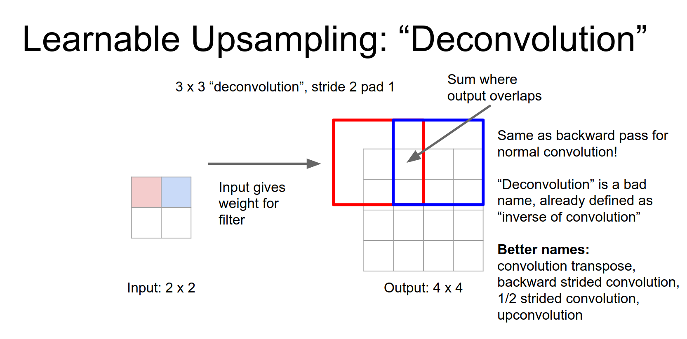
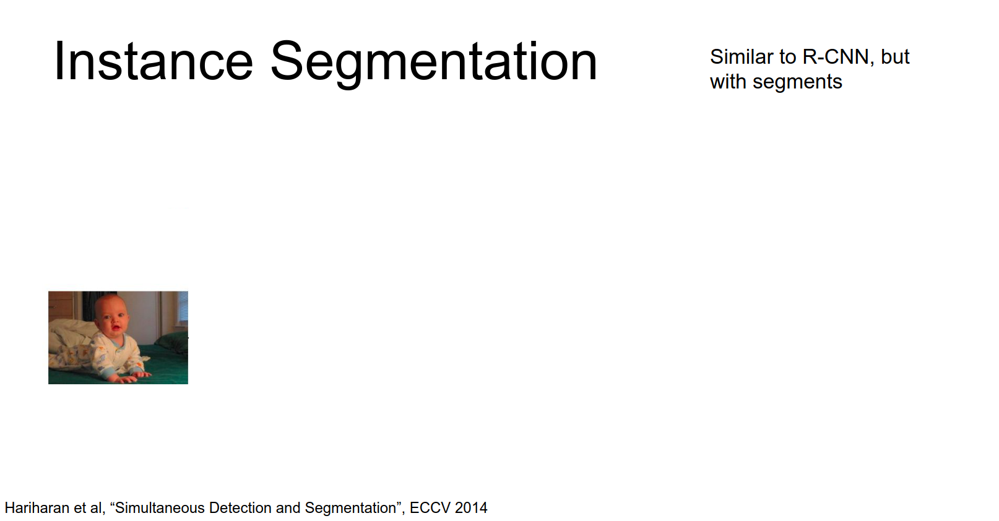
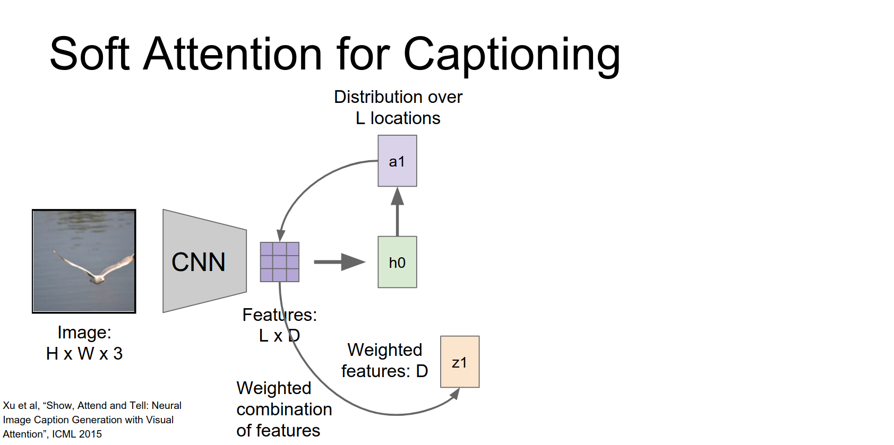
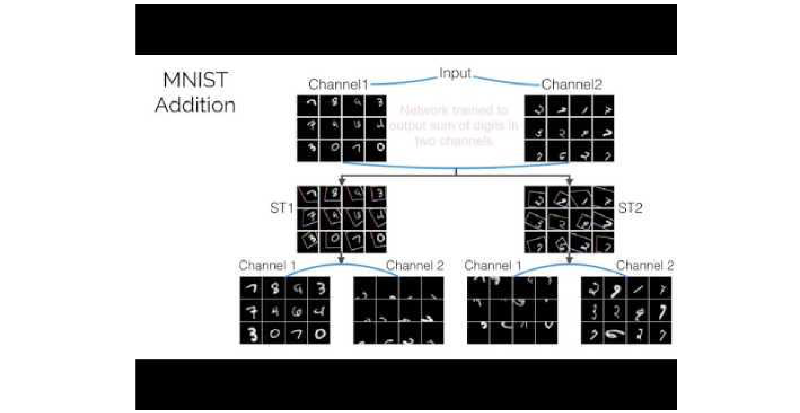

Part of [CS231n Winter 2016](../index.md)

---
# From Justin Johnson

---
# Segmentation and Attention

Assignment 3 is due tonight. Arguably it was easier than assignment 2.

That's hopefully gives you more time to work on your projects.

Last time we had a whirlwind tour of all the common software packages that people use for deep learning and we saw a lot of code on slides a lot of stepping through code and hopefully that you found that useful for your projects.

Today we're going to talk about two other topics we're going to talk about segmentation:

Within segmentation there are two sub problems semantic and instance segmentation 

We're also going to talk about soft attention and within soft attention again there's sort of two buckets that we've divided things into.

This is the ImageNet classification errors I think at this point in the class you've seen this type of figure many times right so in 2012 AlexNet 2013 ZF crushed it, recently GoogleNet and later ResNet won the classification challenge in 2015.

But turns out, as of today there's a new image net result so this paper came out last night so Google actually has now state-of-the-art on ImageNet with 3.08 percent top five error which is crazy.

And the way that they do this is with this thing that they call Inception v4
### Inception v4

This is a little bit of a monster so I don't want to go into too much detail.

But you can see that it's this really deep network that has these repeated modules, so here there's the stem is this guy over here a couple interesting things to point out about this architecture are actually they use some valid convolutions, which means they have no padding so that makes every all the math more complicated, but they're smart and they figured things out.
### valid convolutions - no padding !

An interesting feature here is they actually have in parallel strided convolution and also max pooling so they kind of do these two operations in parallel to down sample images and then concatenate again at the end.

Another thing is they are really going all out on these efficient convolution tricks that we talked about a couple lectures ago, so as you can see they've actually have these asymmetric filters like $1x7$ and $7x1$ convolutions they also make heavy use of these one by one convolutional bottlenecks to reduce computational costs

So this is just the stem of the network and actually each of these parts is sort of different.

So they've got four of these inception modules than this down sampling module.

Then what seven of these guys and then another down sampling module.

And then three more of these guys and then finally they have dropout and and fully connected layer for the class labels.

So another thing to point out is again there's no sort of fully connected hidden layers here they just have this global averaging to compute the final feature vector.

And another cool thing they did in this paper was inception ResNets.

So they proposed this residual version of the inception architecture which is also pretty big and scary the stem is the same as before.

And now these repeated inception blocks that they repeat throughout the network, they actually have these residual connections.

So that's that's kind of cool, they're kind of jumping on this residual idea and now improved state of the art out image net.

They have many repeated modules.

When you add this thing all up it's about 70 it's 75 layers assuming I did the math right last night.

So they also show that between there sort of new Inception v4 GoogleNet and their Residual version of GoogleNet that actually both of them perform about the same.

So this is a top five error as a function of epochs on image net so you can see that the inception Network in red actually is converging a bit faster but over time both of them sort of converts you about the same value.

So that that's kind of interesting, that's kind of cool.

Another thing that's kind of interesting to point out is this there's the raw numbers on the x axis here these are epochs on ImageNet these things are being trained for a 160 epochs on ImageNet so that's a lot of training time.

Today we're going to talk about two sort of two other topics that are sort of common things in research these days:

So those are segmentation, which is this sort of classic computer vision topic and also this idea of attention which has been a really popular thing to work on in deep learning over the past year especially.

## Segmentation

You may have remembered this slide from a couple lectures ago when we talked about object detection that was talking about different tasks that people work on in computer vision.

We spent a lot of time in the class talking about classification.

Back in lecture 8 we talked about different models for localization and for object detection.

But today we're actually going to focus on this of segmentation that we skipped over last time in this previous lecture.

Within segmentation there's sort of two different sub-tasks that we need to make that we need to define and people actually work on these things a little bit separately.

## Semantic Segmentation

The first task is this idea called semantic segmentation so here we have an input image and we have some fixed number of classes, things like buildings and tree and ground and cow and whatever kind of semantic labels you want. Usually have some small fixed number of classes.

Also typically you'll have some a background class for for things that don't fit into these classes.

And then the task is that we want to take as input an image and then we want to label every pixel in that image with one of these semantic classes.

So here we've taken this input image of these three cows in a field, and the ideal output is this image where instead of being RGB values we actually have one class label per pixel.

So we can do this on other images and maybe segment out the trees and the sky and the road the grass.

This type of task is pretty cool, I think it gives you sort of a higher level understanding of what's going on in images compared to just putting a single label on the whole image.

And this is actually a very old problem in computer vision, so this that predates sort of the deep learning revolution.

So this figure actually comes from a computer vision paper back in 2007 that didn't use any deep learning at all, people had other methods for this a couple years ago. 

The thing to point out here is that this thing is not aware of instances. Here this this image actually has 4 cows there's actually 3 cows standing up and 1 cow kind of laying on the grass taking a nap but here in this output it's not really clear how many cows there.

These different cows actually their pixels overlap so here in the output there's no notion that there are different cows, in this output we're just labeling every pixel so it's maybe not as informative as you might like.

And that could actually lead to some problems for some downstream applications.

## Instance Segmentation

To overcome this people have also separately worked on this newer problem called instant segmentation this also sometimes gets called simultaneous detection and segmentation.

Again similar to before we have some set of classes that we're trying to recognize and given an input image. We want to output all instances of those classes and for each instance we want to segment out the pixels that belong to that instance.

So here in this input image there are actually three different people, there's the two parents and the kid and now in the output we actually distinguish between those different people in the input image.

Which those three people are now shown in different colors to indicate different instances.

For each of those instances we're going to label all of the pixels in the input image that belong to that instance.

so these two tasks of semantic segmentation and instant segmentation people actually have worked on them a little bit separately.

So first we're going to talk about some models for semantic segmentation. Remember this is the task where you want to just label all the pixels in the image and you don't care about the instances.

So here the idea is actually pretty simple:

Given some input image this is the the fun one with the cows we are going to take some little patch of the input image.

Extract this patch that sort of gives local information in the image.

Then we're going to take this patch and we're going to feed it through some convolutional neural network. This could be any of the architectures that we've talked about so far in the class.

Now this convolutional neural network will actually classify the center pixel of the patch, so this neural network is just doing classification that's something we know how to do. This thing is just going to say that the center pixel of this patch actually is a cow.

Then we can imagine taking this network that works on patches and labels the center pixel. We just run it over the entire image and that will give us a label for each pixel in the image.

This actually is a very expensive operation right because now there's many patches in the image and it would be super expensive to run this network independently for all of them.

So in practice people use the same trick that we saw in object detection, where you'll run this thing fully convolutional II and get all the outputs for the whole image all at once. 

But the problem here is that if your convolutional network contains any kind of down sampling, either through pooling or through strided convolutions then now your output your output image will actually have a smaller spatial size and your input image.

So that's that's something that people need to work around when they're using this type of approach.
## the question is whether that patch wise thing just doesn't give you enough information in some cases?

That's true, so sometimes for these for these networks people actually have a separate offline refinement stage where they take this output and then feed it to some kind of graphical model to clean up the output a little bit. Sometimes that can help boost your performance a little bit. 

This raw input output mode out of setup tends toward pretty well, just as something easy to implement. 
## the question is how big of a receptive field do you need?

I'm not sure and I'm not sure exactly probably pretty big maybe a couple hundred maybe 100 pixels that order of magnitude.

So one extension that people have used to this basic approach is this idea of multi scale testing so actually sometimes a single scale isn't enough.
## multi scale testing - single scale is not enough

so here we're going to take our input image and we'll actually resize it to multiple different sizes.

This is sort of a common trick that people use in computer vision a lot it's called, ==an image pyramid== you just take the same image and you resize it make too many different scales.
### an image pyramid 😍

And now for each of these scales we're going to run it through a convolutional neural network that is going to predict these pixel wise labels for these different images at these different resolutions.

So another thing to point out here along the lines of your question that if each of these networks actually has the same architecture, then each of these outputs will have a different effective receptive field in the input due to the image pyramid.

So now that we've gotten these differently sized pixel labels for the image, then we can take all of them and just do some offline up sampling to up sample those responses to the same size as the input image.

So now we've gotten our three outputs of different sizes and we'll just up sample them and stack them.

This is actually a paper from Yann LeCun back in 2013 so they actually also have this separate offline processing step, where they do this idea of a bottom-up segmentation using these super pixel methods.
## super pixel methods 🤹

These are these sort of more classic computer vision image processing type methods that actually look at the differences between adjacent pixels and images and then try to merge them together to give you these coherent regions where there are not much change in image.

This method actually takes sort of runs the image offline through these other more traditional image processing techniques to get either a set of super pixels or a tree saying which pixels ought to be merged together in the image.

And they have this somewhat complicated process for merging all these different things together, because now we've gotten this sort of low-level information saying which pixels in the image actually are similar to a other based on sort of color and great and edge information.

We've got these outputs of different resolutions from the convolutional neural networks telling us semantically what the labels are at different points in the image.

They actually explore a couple different ideas for merging these things together to give you your final output.

So this actually also answers when addresses one of the earlier questions about maybe the ConvNet not being enough on its own.

So using these external super-pixel methods or these segmentation trees is another thing that sort of gives you additional information about maybe larger context in the input images.

Another sort of cool idea that people have used for semantic segmentation and this is this idea of iterative refinement.
## Iterative refinement ? 

We actually saw this a few lectures ago when when we mentioned pose estimation.

But the idea is that we're going to have an input image here they've separated out the three channels, and we're going to run that thing through our favorite sort of convolutional neural network to predict these low resolution patches or rather to predict this low resolution segmentation of the image.

And now we're going to take that output from the CNN together with a Down sampled version of the original image and we'll just repeat the process again.

So this allows the network to sort of increase its effective receptive field of the output and also to perform more processing on the on the input image.

And then we can repeat this process again.

If these three convolutional networks actually share weights then this becomes a recurrent convolutional network.
## Recurrent Convolutional Network ?

where it's sort of operating on the same input over through time, but actually each of these update steps is a whole convolutional network so it's actually a very similar idea to recurrent networks that we saw previously.

The idea behind this paper which was in I think ICML 2014 is that if you actually do more iterations of this same type of thing then hopefully it allows the network to sort of iteratively refine its outputs.

So here if we have this raw input image, then after one iteration you can see that actually there's quite a bit of noise especially around the boundaries of the objects.

But as we run for two and three iterations through this recurrent convolutional network it actually allows the network to clean up a lot of that sort of low-level noise and produce much cleaner and nicer results.

That was quite quite a cool, sort of merging together these idea of recurrent networks and sharing weights over time with this idea of convolutional networks to process images.

So another well known paper for semantic segmentation is this one from Berkeley that was published at CVPR last year.

So here it's a very similar model as before where we're going to take an input image and run it through some number of convolutions and eventually extract some feature map for the pixels.

But in contrast the previous methods all relied on this sort of hard coded up sampling to actually produce the final segmentation for the image.

But in this paper they proposed that well ==we're deep learning people we want to learn everything== so we're going to learn the up sampling as part of the network.

So their network includes at the last layer of this learnable up-sampling layer that actually up samples the feature map in a learnable way.

The way their model kind of looks is that, they have this at the time it was an AlexNet so they have their input image running through many phases of convolution and pooling.

Eventually they produce at this `pool5` output they have quite a down sampled spatial size compared to the input image.

And then there learnable up sampling re up samples that back to the original size of the input image.

Another cool feature of this paper was this idea of skip connections, so they actually don't use only just these `pool5` features, they actually use the convolutional features from different layers in the network

Which sort of exists at different scales so you can imagine that once you're in the `pool4` layer of AlexNet that's actually a bigger feature map then the `pool5` and `pool3` is even bigger than `pool4`.

So the intuition is that these lower convolutional layers might actually help you capture finer grain structure in the input image, since they have a smaller receptive field.
### Lower convolutional layers might help you capture finer grain structure in the input image, since they have a smaller receptive field.

In practice take these different convolutional feature Maps and apply a separate learned up sampling to each of these feature maps, then combine them all to produce the final output.

 
And in their results they show that actually adding these skipped connections tends to help a lot with these low-level details.

So over here on the left these are the results that only use these pool five outputs and you can see that it's sort of gotten the rough idea of a person on a bicycle.

But it's kind of blobby and missing a lot of the fine details around the edges.

When you add in these skip connections from these lower convolutional layers that gives you a lot more fine-grained information about the spatial locations of things in the image.

So adding those skip connections from the lower layers really helps you clean up the boundaries in some cases for these outputs.
### the question is how to classify accuracy ?

I think the two metrics people typically use for this are either just classification because you're classifying every pixel so you can use classification metrics.

Also sometimes people use intersection over Union (IOU) so for each class you compute what is the region of the image that I predict it as that class and what was the ground truth region of the image that had that class and then compute an intersection over union metric between those two

I'm not sure which which metric this paper used in particular.

So this idea of learnable up sampling is actually really cool and since this paper has been applied in a lot of other contexts.

Because we've seen that we can down sample our feature maps in a variety of different ways but being able to up sample them inside the network could actually be very useful and a very valuable thing to do.
### deconvolution - bad term for upsampling 

So this sometimes gets called a deconvolution that's not a very good term so we all talked about that in a couple minutes but it's a very common term.

Just to recap sort of when you're doing a normal sort of stride 1, $3x3$ convolution we have this picture that should be pretty familiar by now.

Given our $4x4$ input we have some $3x3$ filter and we plop that $3x3$ filter over part of the input compute a dot product, and that gives us one element of the output.

Because this thing is stride 1 to compute the next element of the output we move the filter over one slot in the input again compute a dot product and that gives us our 1 element in the output.

For stride 2 convolution it's a very similar type of idea.

Now our output is going to be a down sampled version a $2x2$ output for a $4x4$ input and again it's the same idea. 

We take our filter, we plop it down on the image, compute a dot product and that gives us one element of the output.

The only difference is that now we slide the convolutional filter over two slots in the input to compute one element to the output. 

The ==de convolutional layer== actually does something a little bit different.

So here we want to take a low-resolution input and produce a higher resolution output.

This would be maybe a $3x3$ deconvolution with a stride of 2 and a pad of 1.

This is a little bit weird, in a normal convolution you have your $3x3$ filter and you take dot products and the input. But here you have to image taking $3x3$ filter just copying it over to the output.

The only difference is that, the weights - like this one scalar value of the weight - in your input gives you a weight, you're going to re-weight that filter when you stamp it down into the output.

Now when we stride this thing along we're going to step one step over in the input and two steps over in the output.

So now we're going to take the same learned convolutional filter and we're going to plop it down in the output.

We're taking the same convolutional filter and we're plopping it down twice in the output.

The difference being that the red box that convolutional filter is weighted by this scalar value in the input and for the blue box that convolutional filter is weighted by the blue scalar value in the input.

And we are these where these regions overlap you just add.

So this kind of allows you to learn and up sampling inside the network.

So if you remember from your from implementing convolutions on the assignment, this idea of sort of especially striding and adding on overlapping regions that should remind you of the backward pass for a normal convolution.

It turns out that these are completely equivalent that this deconvolution forward pass is exactly the same as the normal convolution backward pass and the deconvolution backward pass is the same as the normal convolution forward pass.

So because of that actually the term deconvolution is maybe not not so great and if you have a signal processing background you may have seen that deconvolution already has a very well-defined meaning and that is the inverse of convolution.

So a ==deconvolution should undo a convolution operation which is quite different from what this is actually doing.==

So probably better names for this instead of deconvolution that you'll sometimes see, would be convolution transpose or our backward strided convolution or fractionally strided convolution or up convolution
## better names for deconvolution -> convolution transpose

Those are all kind of weird names I think deconvolution is popular just because it's easiest to say even though it's maybe less technically correct.

If you read papers you'll see that some people get angry about this.

So it's more proper to say convolution transpose instead of deconvolution and this other paper really wants it to be call it fractionally strided convolution.

So I think that I think the community is still deciding on the right terminology here but I agree with them that D convolution is probably not very technically correct.

This this paper in particular has a hole they felt very strongly about this issue and they had a one page in Dec appendix to the paper actually explaining why a convolution transpose is the proper term.

So if you're interested then I would really recommend checking out that it's a pretty good explanation.
## the question is how much faster is this relative to a patch base thing?

The answer is that in practice nobody even thinks to run this thing in a fully patch based mode because that would just be way too slow. So actually all of the papers that I've seen do some kind of fully convolutional thing in one way or another

Actually there is sort of another trick instead of up sampling that people sometimes use and 

That is that so suppose that your network is actually going to down sample by a factor of four

Then one thing you can do is take your input image shift it by 1 pixel and now run it through the network again 

And now you get another output and you repeat this for sort of 4 different 1 pixel shifts of the input.

Now you've gotten for output maps and you can sort of interleave those to reconstruct an original input map.

So that's that's another trick that people sometimes use to get around that problem, but I think that this learnable up sampling is quite a bit cleaner.

Despite the concerns about people calling a deconvolution like people just call it that anyway.

So there was this paper from ICCB that takes this idea of of this convolutional / fractionally strided convolutional idea and sort of pushed it to the extreme.

They took what amounts to two entire VGG networks flipped on their head.

Again the exact same model as before we want to input an image and output our pixel wise predictions for the semantic segmentation task.

But here we initialize with a VGG and over here is an upside down VGG and it trains for six days on a Titan X so this thing is pretty slow. 

But they actually got really really good results and I think it's also a very beautiful figure.
## the question is how is this figure made ?

the answer is I took a screenshot from their paper so I don't know.
## the question is training data? 

There exist datasets with this kind of thing where I think like there's a common one is the Pascal segmentation data set. So it just has a ground truth, you have an image and they have every pixel labeled in the output. 

It's kind of expensive to get that data, so the data sets tend to be a little smaller. In practice there's a famous interface called `labelme` where you could upload an image and then sort of draw a contour around the image or around different regions of the image

And then that you can convert those contours into sort of these segmentation masks. 

So that's how you tend to label these things in a UI way.

## Instance Segmentation

Just to recap, instance segmentation is this generalization or where we not only want to label the pixels of the image but we also want to distinguish instances.

So we're going to detect the different instances of our classes and for each one we want to label the pixels of that instance.

These models end up looking a lot like the detection models that we talked about a few lectures ago.

I should also point out that this is I think a much more recent task. 

This idea of semantic segmentation has been used in computer vision for a long time but I think this idea of the instance segmentation has gotten a lot more popular especially in the last couple years.

So this paper from 2014, they call it simultaneous detection and segmentation or ==SDS== that's kind of a nice name, and this is actually very similar to the R-CNN model that we saw for detection.

So here we're going to take an input image and if you'll remember in R-CNN we relied on these external region proposals that can - are these sort of offline computer vision low-level thing - that compute predictions of where it thinks objects in the image might be located.

Well it turns out that there's other methods for proposing segments instead of boxes.

So we just download one of those existing segment proposal methods and use that instead.

For each of these proposed segments we can extract a bounding box by just fitting a tight box to the segment and then run crop out that chunk of the input image and run it through a box CNN to extract features for that box.

Then in parallel we'll run through a region CNN, so here again we take that relevant that chunk from the input image and crop it out.

But here because we actually have this proposal for the segment, then we're going to mask out the background region using the mean color of the data set.

So this is kind of a hack that lets you take these kind of weird shaped inputs and feed it into a CNN, you just mask out the background part with us with a flat color.

So then they take these masked inputs and run them through a separate region CNN so now we've gotten two different feature vectors one sort of incorporating the whole box and one incorporating only the the proposed foreground pixels.

We concatenate these things and then just like in R-CNN we make a classification to decide on what class actually should this segment be.

And then they also have this region refinement step where we want to ==refine the proposed region== just a little bit. 

I don't know how well you remember the R-CNN framework, but this is actually very similar to R-CNN just apply to this simultaneous detection and segmentation task.

For this region refinement step there's actually a follow-up paper that proposes a pretty nice way to do it.

So here this is the you know follow-up paper from the same folks at Berkeley the following conference and here we want to take this this input which is this proposed segment and we want to clean it up somehow.

So we're actually going to take a very similar type multiscale approach that we saw in the in the semantic segmentation model a while ago.

So here we're going to take out our image, crop out the box with corresponding to that segment and then pass it through an AlexNet and we're going to extract convolutional features from several different layers of that AlexNet.

For each of those feature maps will up sample them and combine them together and now will produce this proposed figure-ground segmentation.

So this this is actually kind of a funny output but it's really easy to predict the idea is that this output image we're just going to do a logistic classify or inside each independent pixel.

Given these features we just have a whole bunch of ==independent logistic classifiers== that are predicting how much each pixel of this output is likely to be in the foreground or in the background

And they show that this type of multi scale refinement step actually cleans up the outputs of the previous system and gives quite nice results.

This actually is very similar to R-CNN but in the detection lecture we saw that R-CNN was just the start of the story, there's all these faster versions right?

So it turns out that a similar intuition from faster R-CNN has actually been applied to this instant segmentation problem as well.

So this is work from Microsoft and this model actually won the COCO instance segmentation challenge this year.

So they took their giant ResNet and they stuck this model on top of it and they and they crush everyone else in the COCO instant segmentation challenge.

So this actually is very similar to Faster R-CNN.

We're going to take our input image and just like in Fast and Faster R-CNN, our input image will now be pretty high resolution and we'll get this giant convolutional feature map over our high resolution image.

From this high resolution image we're actually going to propose our own region proposals.

In the previous method we relied on these external segment proposals, but here we're just going to learn our own region proposals just like Faster R-CNN.

Here we just stick a couple extra convolutional layers on top of our convolutional feature map and each one of those is going to predict several regions of interest in the image that using this idea of anchor boxes that we saw in the detection work.

The difference is that now once we have these region proposals we're going to segment them out using a very similar approach that we just saw on the last slide.

So for each of these proposed regions we're going to use this ROI warping or pooling and squish them all down to a fixed square size. And then run each of them through a convolutional neural network to produce these coarse figure-ground segmentation masks like we just saw in the previous slide.

So now at this point we've gotten our image, we've gotten a bunch of region proposals and now for each region proposal we have a rough idea of which part of that box is for ground and which part is background.

Now we're going to take this idea of masking so now that we've predicted the foreground background for each of these, segments we're going to mask out the predicted background and only keep the pixels from the predicted foreground.

And pass those through another couple layers to actually classify that segment as our different object categories.

So then this entire thing can just be learned jointly end to end.

With the idea that we've sort of got these three semantically interpreted outputs in intermediate layers of our network and each of them we can just supervise with ground truth data.

So for these regions of interest we know where the ground truths, the objects are in the image. So we can provide supervision on those outputs.

For these segmentation masks we know what the true foreground and background are is we can give supervision there.

We obviously know the classes of those different segments so we just provide supervision at different layers of these network and try to trade off all of those different loss terms and hopefully get the thing to converge.

This actually was trained end to end and they fine tune it into ResNet and it works really well.

So here is the the results figure that we have to show.

So these results are at least to me really impressive so for example this input image has all these different people sitting in this room, and the predicted outputs do a really good job of separating out all those different people even though they overlap and there's a lot of them and they're very close.

You can see it's not perfect so this potted plant it thought was blobier than it really was and it confused this chair on the right for a person and it missed a person there.

But overall these results are very very impressive and like I said this model one the Coco segmentation challenge this year.

The overview of segmentation is that we've got these two different tasks semantic segmentation and instance segmentation:

For semantic segmentation it's very common to use this Conv - deConv approach.

For instance segmentation you end up with these pipelines that look more similar to object detection.

We're going to move on to another pretty cool exciting topic and that's attention models.

So this is something that I think has gotten a lot of attention and last year in the community.

As a sort of a case study we're going to talk about the idea of attention as applied to image captioning.

So I think this model was previewed in the recurrent networks lecture but I want to step into a lot more detail here.

But first as a recap just so we're on the same page hopefully you know how image captioning works by now - since the homework is due in a few hours - but we're going to take our input image and run it through a convolutional net and get some features.

Those features will be used maybe to initialize the first hidden state of our RNN.

Then our start token or our first word together with that hidden state we're going to produce this distribution over words in our vocabulary.

Then to generate a word we'll just sample from that distribution and we'll just sort of repeat this process over time to generate captions.

The problem here is that this network only sort of gets one chance to look at the input image and when it does it's looking at the entire input image all at once.

And it might be cooler if it actually had the ability to: 

- look at the ==input image multiple times ==
- and also if it could focus on ==different parts== of the input image as it ran 
## Attention - look at input multiple times - focus on different parts of the image

A pretty cool paper that came out last year was this one called _Show Attend and Tell_ the original was _Show and Tell_ so they added the attend part.

The idea is is pretty straightforward so we're going to take our input image and we're still going to run it through a convolutional network but instead of extracting the features from the last fully connected layer we're going to pull features from one of the earlier convolutional layers.
## Not from last fully connected layer - earlier convolution layers

That's going to give us this grid of features rather than single feature vector.

So because these are coming from convolutional layers you can think of this as a 2D spatial grid of features and inside each point in the grid gives you features corresponding to some part of the input image.

So now again we'll use these these features to initialize the hidden state of our network in some way and now here's where things get different.

Now we're going to use our hidden state to compute not a distribution over words but instead a distribution over these different positions in our convolutional feature map.

So again this would probably be implemented with maybe an affine layer or two and then some softmax to give you a distribution.

But we just end up with this l dimensional vector giving us a probability distribution over these different locations in our input.

And now we take this probability distribution and actually use it to weight to give a weighted sum of those feature vectors at the different points in our grid. 

So once we take this weighted combination of features that takes our grid and summarizes it down to a single vector.

And this sort of Z vector summarizes the input image in some way -> and due to this probability distribution it gives the network the capacity to focus on different parts of the image as it goes.

So now this weighted vector that's produced from the input features gets fed together with the first word and now when we make our recurrence in our recurrent Network we actually have three inputs.
### 3 inputs in RNN now 😍

We have our previous hidden state, we have this attended feature vector and we have this first word.

And now all of of these together are used to produce our new hidden state.

And now from this hidden state we're actually going to produce two outputs.

We're going to produce a new distribution over the locations in our input image and we're also going to produce our standard distribution over words.

So these would probably be implemented as just a couple of fully connected layers on top of the hidden state.

And now this process repeats.

So given this new probability distribution we go back to the input feature grid and compute new summarization vector for the image.

Take the take that vector together with the next word in the sentence to compute the new hidden state.

Then we'll actually repeat this process over time to generate our captions.

## the question is how where does this feature grid come from?

The answer is when you're when you're doing an AlexNet for example you have Conv 1 Conv 2 Conv 3 Conv 4 Conv 5 and by the time you get to Conv 5 the shape of that tensor is now something like $7x7x512$.

So that corresponds to a seven by seven spatial grid over the input and in each a grid position that's a 512 dimensional feature vector

So those are just pulled out of one of the convolutional layers in the network.
## the question is about these probability distributions ? 

So we're actually producing two different probability distributions at every time step. 

The first one are these D vectors in blue so those are probability distribution over words in your vocabulary like we did in normal image captioning.

And also at every time step will produce a second probability distribution over these locations in the in the input image. That are telling us where we want to look on the next time step

What framework you wanted to use to implement this?

We talked about maybe how RNN's would be a good choice for Theano or TensorFlow and I think this qualifies as a crazy RNN.

How these attention vectors -  how these summarization vectors get produced?

This paper actually talks about two different methods for generating these vectors.

The idea - as we saw on the last slide - is that our we'll take our input image and get this grid of features coming from one of the convolutional layers in our network.

And then for each time step, our network will produce this probability distribution over locations.

So this would be a fully connected layer and then a softmax to normalize it.

The idea is that we want to take these grid of feature vectors together with these probability distributions and produce a single D dimensional vector that summarizes that input image.

The paper actually explores two different ways of solving this problem.

So the easy way is to use what they call soft attention 
## Soft Attention 🐮

So here our D dimensional vector Z, will just be a weighted sum of all the elements in the grid where each vector is just weighted by it's predicted probability.

This is actually very easy to implement, it's just another layer in a neural network.

These gradients like the derivative of this context vector with respect to our predicted probabilities P is quite nice and easy to compute. So we can actually train this thing on just using normal gradient descent and back propagation.

But they actually explore another another option for computing this feature vector and that's something called hard attention.
## hard attention 🐦

Instead of having this weighted sum we might want to select just a single element of that grid to attend to.

One simple thing to do is just to pick the element of the grid with the highest probability and just pull out the feature vector corresponding to that argmax position.

The problem is now if you think about in this argmax case, if you think about this derivative the derivative of Z with respect to our distribution P, it turns out that this is not very friendly for back propagation anymore.

So imagine in an argmax case, suppose that a that $P_{a}$ were actually the largest element in our input. And now what happens if we change $P_{a}$ just a little bit?

So if $P_{a}$ is the argmax and then we just jiggle the probability distribution just a little bit then $P_{a}$ will still be the argmax.

So we'll still select the same vector from the input.

Which means that actually the derivative of this vector Z with respect to our predicted probabilities is going to be zero almost everywhere.

So that's very bad, we can't really use back propagation anymore to train this thing.

So it turns out that they proposed another method based on reinforcement learning to actually train the model in this context where you want to select a single element of the input.

But that's a little bit more complex so we're not going to talk about that in this lecture, but just be aware that is something that you'll see this difference between soft attention and hard attention where you actually pick one.

So now we can look at some some pretty results from this model.

Since we're actually generating a probability distribution over grid locations at every time step we can visualize that probability distribution as we generate each word of our of our generated caption.

So then for this input image that shows a bird, they both their heart attention model and they're soft attention model in this case both produce the caption a bird flying over a body of water period.

And for these two models they've visualized what that probability distribution looks like for these two different models.

The top shows the soft attention so you can see that it's sort of diffused since it's averaging probabilities from every location and image, and in the bottom it's just showing the one single element that it pulled out. 

These actually have quite nice semantic interpretable meanings.
### Comparison of Soft and Hard Attention - In Visuals.

Especially the soft attention on the top I think is very nice results that when it's talking about the bird and talking about flying it sort of focuses right on the bird.

And then when it's talking about the water it kind of focuses on everything else

So another thing to point out is that it didn't receive any supervision a training time for which parts of the image it should be attending to.

It just made up its own mind to attend to those parts based on whatever would help it caption things better.

And it's pretty cool that we actually get these interpretable results just out of this captioning task.

We can look at a couple a couple other results because they're fun.

So we can see a woman throwing a Frisbee in the park, focus is on a Frisbee.

Talking about the dog it learns to recognize the dog and especially interesting is this guy in the bottom right. When it generates the word trees, it's actually focusing on all the stuff in the background and not just the giraffe. 

These are just coming out with no supervision all just based on the captioning task.
## the question is what are the when would you prefer hard versus soft attention ? 🏂

so there's I think sort of two motivations that people usually give for wanting to even do attention at all in the first place.

One of those is just to give nice interpretable outputs and I think you get nice interpretable outputs in either case at least theoretically. 

But the other motivation for using attention is to relieve computational burden especially when you have a very large input it might be computationally expensive to actually process that whole input on every time step.

And it might be more efficient computationally if we can just focus on one part of the input at each time step, and only process a small subset per time step.

So with soft attention because we're doing this sort of averaging over all positions we don't any computational savings we're still processing the whole input on every time step

but with hard attention we actually do get a computational savings since we're explicitly picking out some small subset of the input

So I think that's the that's the big benefit.

Also hard attention takes reinforcement learning and that's fancier and makes you look smarter that's kind of cool.
## the question is how does this work at all? 👨‍💻

I think the answer is it's really learning sort of ==correlation structures in the input==.

It's seen many examples of images with dogs and it's see many sentences with dogs.

But for those different images with dogs the dogs tend to appear in different positions in the input and I guess it turns out through the optimization procedure that actually putting more weight on the places where the dog actually exists actually helps the captioning tasks in some way.

So I don't think there's a very good answer it just happens to work.

These are pictures from a paper not like random results so I'm not sure how good it works on random images.

But another thing to really point out about this especially this model of soft attention is that it's sort of constrained to this fixed grid from the convolutional feature map.

We're getting these nice diffuse looking things but those are just sort of like blurring out this on this distribution.

And the model does not really have the capacity to look at arbitrary regions of the input.

It's only allowed to look at these fixed grid regions.

I should also point out that this idea of soft attention was not really introduced in this paper.

I think the first paper that really had this notion of soft attention came from machine translation. 

So here it's a similar motivation that we want to take some input sentence here in Spanish and then produce an output sentence in English. This would be done with recurrent neural network sequence to sequence model, where we would first read in our input sentence with a recurrent Network and then generate an output sequence very similar that as we would in captioning.

But in this paper they wanted to actually have attention over the input sentence as they generated their output sentence.

The exact mechanism is a little bit different but the intuition is the same. When we generate this first word `my` we want to compute a probability distribution ==not over regions in an image but instead over words in the input sentence.==

Here we're going to get a distribution that hopefully will focus on this first word in the Spanish sentence and then we'll take some features from each word and then reweighed them and feed them back into the RNN at the next time step.

And this process would repeat at every time step of the network.

This idea of soft attention is very easily applicable not only to image captioning but also to machine translation.
## the question is how do you do this for variable length sentences? 

That's something I gloss over a little bit. But the idea is you use what's called content-based addressing so for the image captioning we know ahead of time that there is this fixed maybe $7x7$ grid so we just produce a probability distribution directly.

Instead in this model as the encoder reads the input sentence it's producing some vector that encodes that each word in the input sentence.

So now in the decoder instead of directly producing a probability distribution it's going to spit out sort of a vector that will get dot producted with each of those encoded vectors in the input.

And then those dot products get used to get re-normalized and converted to a distribution.

So this idea of soft attention is actually pretty easy to implement and pretty easy to train.

So it's been very popular in the last year or so and there's a whole bunch of papers that apply this idea of soft attention to a whole bunch of different problems.

So there have been a couple papers looking at soft attention for ==machine translation== as we saw.

There have been a couple papers that actually want to do ==speech transcription== where they read in an audio signal and then output the words in English. So there been a couple papers that use soft attention over the input audio sequence to help with that task.

There's been at least one paper on using soft attention for ==video captioning== so here you read in some sequence of frames and then you output some sequence of words.

And you want to have attention over over the frames of the input sequence as you're generating your caption.

So you could see that maybe for this little video sequence they output someone is frying a fish in a pot and when they generate the word someone they actually attend much more to this second frame in the video sequence. And when they generate the word frying it attends much more to this last element in the in the video sequence.

There have also been a couple papers for this task of ==question answering== so here you the setup is that you read in a natural language question and you also read in an image and the model needs to produce the answer to that question in natural language.

There have been a couple papers that explore the idea of spatial attention over the image in order to help with this problem of question answering.

Another thing to point out is that some of these papers have great names. so there was _Show and Tell_ there was _Show and Attend and Tell_ there was _Listen Attend and Spell_ and this one is _Ask Attend and Answer_.

So I really enjoy the creativity with naming on this on this line of work 
### LOL 🤭

This idea of soft attention is pretty easy to implement so a lot of people have just applied it to tons of tasks.

But remember we saw this problem with this sort of implementation of soft attention and that's that we cannot attend to arbitrary regions in the input.

Instead we're constrained and can only attend to this fixed grid given by the convolutional feature map.
## so the question is whether we can overcome this restriction and still attend to arbitrary input regions somehow in a differentiable way? 🤔

I think a precursor to this type of work is this paper from Alex Graves back in 2013.

So here he wanted to read as input a natural language sentence and then generate as output actually an image that would be handwriting - writing out that that sentence in handwriting.

This actually has attention over this put image in kind of a cool way where now he's actually predicting the parameters of some Gaussian mixture model over the output image and then uses that to actually attend to arbitrary parts of the output image.

And this actually works really well. So on the right some of these are actually written by people and the rest of them were written by his network.

So can you tell the difference between the generated and the real handwriting?

I couldn't. So it turns out that the top one is real and these bottom four are all generated by the network.

Maybe the real ones have more variance between the letters or something like. 

These results work really well and actually he has an online demo that you can go on and try that runs in your browser. You can just type in words and it'll generate the handwriting for you so that's kind of fun.

Another paper that we saw already is `Draw` that sort of takes this idea of arbitrary attention then extends it to a couple more real-world problems not just handwriting generation.

So one task they consider is image classification. Here we want to classify these digits. But in the process of classifying we're actually going to attend to arbitrate regions of the input image in order to help with this classification task.

So this is kind of cool, it sort of learns on its own that it needs to attend to these digits in order to help with image classification.

And with `Draw` they also consider the idea of generating arbitrary output images with a similar sort of motivation as the handwriting generation. Where we're going to have arbitrary attention over the output image and just generate this output on bit by bit.

And I think we saw this video before but it's really cool.

So this is the the draw Network from from Deepmind. You can see that here we're going to do it we're doing a classification task. It learns to attend to arbitrary regions in the input.

And when we generate we're going to attend to arbitrary regions in the output to actually generate these digits. So it can generate multiple digits at a time and it can actually generate these house numbers.

So this was really cool and as you could see like the region it was attending to it was actually growing and shrinking over time and sort of moving continuously over the image and it was definitely not constrained to a fixed grid like we saw it with _Show Attend and Tell_.

The way that this paper works is a little weird and some follow-up work from deep mind I think actually was more clear

There's this follow-up paper that tape that uses a very similar mechanism for arbitrary attention called spatial transformer networks, but I think is much easier to understand and present it in a very clean way.
## Spatial Transformer Networks ? 

So the idea is that we want to have this input image - our favorite bird -  and then ==we want to have this sort of continuous set of variables telling us where we want to attend==.

So you might imagine that we have the center and width and height of some box of the region we want to attend to. And then we want to have some function that takes our input image and these ==continuous attention coordinates== and then produces some fixed size output.

We want to be able to do this in a differentiable way.
#### So this this seems kind of hard right?

Because you imagine that at least with the idea of cropping. then these inputs cannot really be continuous, they need to be sort of pixel values so we're constrained to integers.

And it's not really clear exactly how we can make this function ==continuous or differentiable.==

They actually came up with a very nice solution.

The idea is that we're going to write down a parameterized function that will map from coordinates of pixels in the output to coordinates of pixels in the input.

So here we're going to say that this upper right-hand pixel in the output image has the coordinates $x^{t}$, $y^{t}$ in the output.

And we're going to compute these coordinates $x^{s}$ and $y^{s}$ in the input image using this parameterized affine function.

So that's a nice differentiable function that we can differentiate with respect to these affine transform coordinates.

Then we can repeat this process and again for maybe the upper left hand pixel in the output image we again use this parameterized function to map to the coordinates of the pixel in the input.

Now we can repeat this for all pixels in our output which gives us something called a sampling grid.
## a sampling grid ✨

The idea is that this would be our output image and then for each pixel in the output the sampling grid tells us where in the input that pixel should come from.

Have you guys taken a computer graphics course, not many? 
### So this looks kind of like texture mapping doesn't it?

They take this idea from texture mapping in computer graphics and just use bilinear interpolation to compute the output once we have this sampling grid.

So now this allows our network actually attends to arbitrary parts of the input in a nice differentiable way, where our network will now just predict these transform coordinates theta and that will allow the whole thing to attends to arbitrary regions of the input image.

So they put this thing all together into a nice little self-contained module that they call a spatial transformer.
## They call this a spatial transformer. 🧠

The spatial transformer receives some input which you can think of as an raw input image and then actually runs this small localization network which could be a small fully connected Network or a very shallow convolutional network.

And this this localization network will actually produce as output these affine transform coordinates theta.

Now these affine transform coordinates will be used to compute a sampling grid.

So now that we've predicted these at this affine transform from the localization Network we map each pixel in the output the coordinates of each pixel in the output back to the input.

And ==this is a nice smooth differentiable function.==

Now once we have the sampling grid, we can just apply bilinear interpolation to compute the values in the pixels of the output.

If you think about what this thing is doing it's clear that every single part of this network is one continuous and two differentiable.

So this thing can be learned jointly without any crazy reinforcement learning stuff which is quite nice.

Although one one sort of caveat to note about bilinear sampling if you know how bilinear sampling works, it means that every pixel in the output is going to be a weighted average of four pixels in the input, so those gradients are actually very local.

So this is continuous and differentiable and nice but I don't think you get a whole lot of gradient signal through the bilinear sampling.

But once you have this spatial distance spatial transform or module we can just insert it into existing networks to sort of let them learn to attends to things.

So they consider on this classification task very similar to the draw paper where they want to classify these warped versions of MNIST digits. 

So they actually consider several other more complicated transforms not just these affine transforms you could also imagine that so that's the mapping from your output pixels back to your input pixels on the previous slide we showed an affine transform, but they also consider projective transforms and also thin plate splines. 

But the idea is you just want some parameterize and differentiable function and you could go crazy with that part.

Here on the left the network is just trying to classify these digits that are warped. On the Left we have different versions of warped digits on this middle column is showing these different thin plate splines that it's using to attends to a part of the image, and then on the right it shows the output of the spatial transformer module.

Which has not only attended to that region but also unwarped it corresponding to examine those splines.

And on the right is using an affine transform not these thin plate splines. So you can see that this is actually doing more than just attending to the input we're actually transforming the input as well. So for example in this middle column this is a 4 but it's actually rotated by something by something like 90 degrees.

So by using this affine transform the network can not only attends to the 4 but also rotate it into the proper position for the downstream classification Network.

And this is all very cool and again sort of similar to the soft attention, we don't need explicit supervision it can just decide for itself where it wants to attend in order to solve the problem.

So these guys have a fancy video as well which is very impressive. [Youtube](https://www.youtube.com/watch?v=Ywv0Xi2-14Y).

Explaning the video - [link is here](https://www.youtube.com/watch?v=Ywv0Xi2-14Y): 

This is the the transformer module that we just unpacked.

This is actually running a classification task but we're varying the input continuously so you can see that for these different inputs the network learns to attends to the digit and then actually canonicalize as that digit to sort of a fixed known pose.

And as we vary that input and move it around the image the network still does a good job of locking on to the digit.

And on the right you can see that sometimes it can fix rotations as well.

Here on the left we're actually rotating that digit and the network actually learns to unrotate digit and canonicalize the pose.

And again both with affine transforms or thin placed blinds this is using even crazier warping with projective transforms so you can see that it does a really good job of learning to attend and also to unwarp.

They do quite a lot of other experiments instead of classification they learn to add together two warps digits which is kind of a weird task, but it works.

So the network is receiving two inputs as two input images and it needs to output the sum. and it learns and even though this is kind of a weird task it learns that it needs to attend and unwarp those images.

This is during optimization right so this is a task called co-localization (at minute 1:11) so the idea is that the in the the network is going to receive two images of as input that are maybe two different images of 4's and the task is to say whether or not those images are the same or different.

And then also using spatial transformers it ends up learning to localize those things as well.

So you can see that over the course of training it learns to actually localize these things very precisely.

Even when we add clutter to the image then these networks still learn to localize very very precisely.

So that's a recent paper from deep mind that is pretty cool.

## the question is what is the what is the task that these things are doing?

In the vanilla version is just classification. So it receives this sort of input digit which could be warped or cluttered or whatnot and all it needs to do is classify the digit.

And sort of in the process of learning to classify it also learns to attend to the correct part so that's a really cool feature of this this of this work.

All right so then the sort of my overview of attention:

We have soft attention which is really easy to implement, especially in this context of fixed input positions.

We just produce distributions over our input and then re wait and refeed those those vectors back to the network somehow and this is really easy to implement in many different contexts and has been implemented for a lot of different task.

When you want to attend to arbitrary regions then you need to get a little bit fancier and I think spatial transformers is a very nice elegant way of attending to arbitrary regions in input images.

There are a lot of papers that actually work on hard attention and this is quite a bit more challenging due to this problem with the gradients.

So hard attention paper is typically use reinforcement learning and we didn't really talk about that today.
## the question is about the captioning before we got to spatial Transformers?

Yeah those captions were produced using this grid based on thing.

But in that network in particular, I think it was a $14x14$ grid so it's actually it has quite a lot of locations, but it's still is constrained to where it's allowed to look.
## the question is about interpolating between soft attention and hard attention?

One thing you might imagine is you train the network in a soft way and then during training you kind of penalize it to make that distribution sharper and sharper and then at test time you just switch over and use hard attention instead.

And I think I can't remember which paper did that but I'm pretty sure I've seen that idea somewhere.

But in practice I think of training with hard attention tends to work better than the sharpening approach.

But it's definitely something you could try.

Done!
