Part of [CS231n Winter 2016](../index.md)

---
## Lecture 14: Videos and Unsupervised Learning

From Andrej 💙

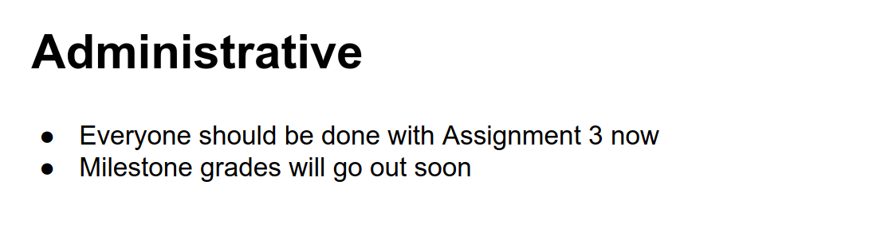

If you are not done with Assignment 3 by now, you are in trouble!

Last class we looked at segmentation and attention models. We saw how soft attention allows us to selectively focus on parts of an image, and how spatial transformers provide a differentiable way to crop and warp features.

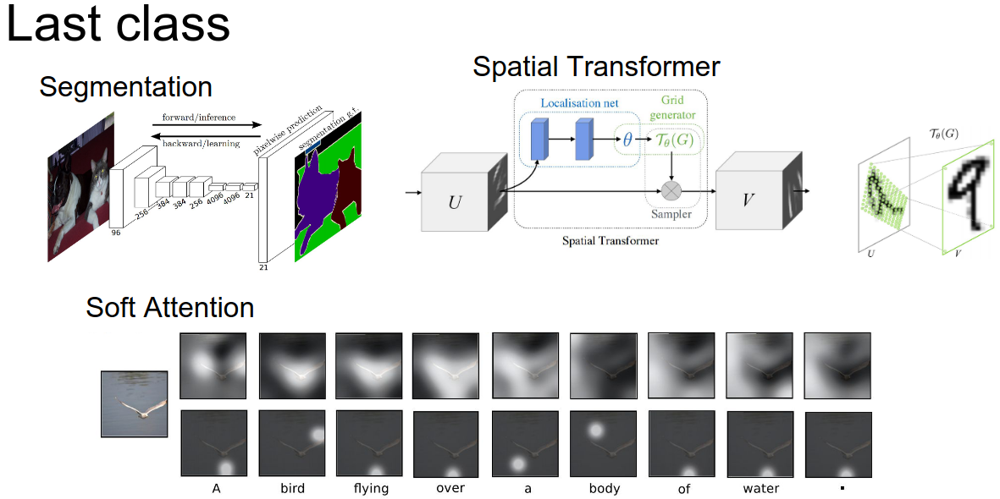

Today we will talk about **Videos** and **Unsupervised Learning**.

### Videos

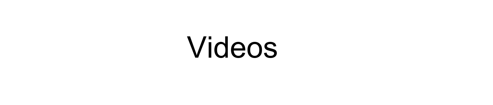

In image classification, we process a single image (e.g., $32 \times 32 \times 3$). In video classification, we have a sequence of frames, so our input is a volume like $32 \times 32 \times 3 \times T$, where $T$ is the number of frames.

Before ConvNets, people used feature-based methods.

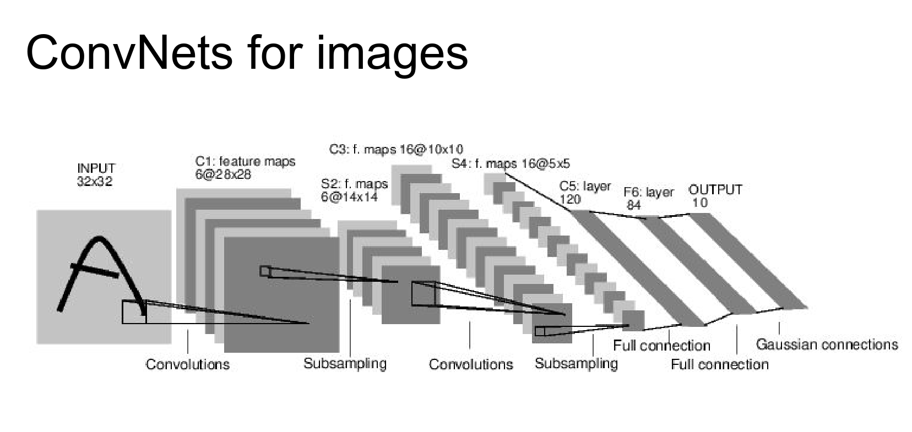

**Dense Trajectory Features**

A popular method was **Dense Trajectory Features** (Wang et al., 2011).

1.  **Detect keypoints** at different scales.
2.  **Track** these keypoints over time using optical flow to form "tracklets".
3.  **Extract features** (HOG, HOF, MBH) along these tracklets in their local coordinate systems.
4.  **Encode** these features (e.g., Bag of Words) and classify with an SVM.

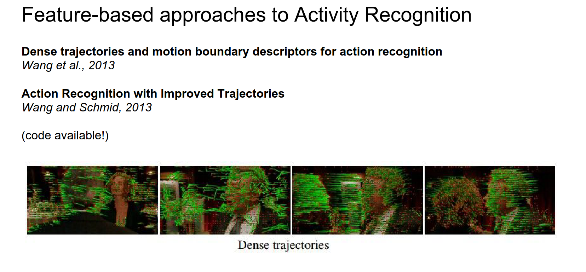

We detect feature points at different scales in the image I'll tell you briefly about how that's done in a bit.

Then we're going to track those features over time using optical flow methods.

**Optical Flow**: This gives a motion field between two frames, showing the displacement vector for every pixel.

Then we're going to extract a whole bunch of features but importantly we're not just going to extract those features at fixed positions in the image but we're actually going to be extracting these features in the local coordinate system of every single tracklet.

And so these ***histogram of gradients***, ***histogram of flows*** and ***MBH features*** we're going to be extracting them in the coordinate system of a tracklet.

And so HoG, here we saw histograms of gradients and two-dimensional images there are basically generalizations of that to videos and so that's the kind of things that people use to encode little spatial temporal volumes.

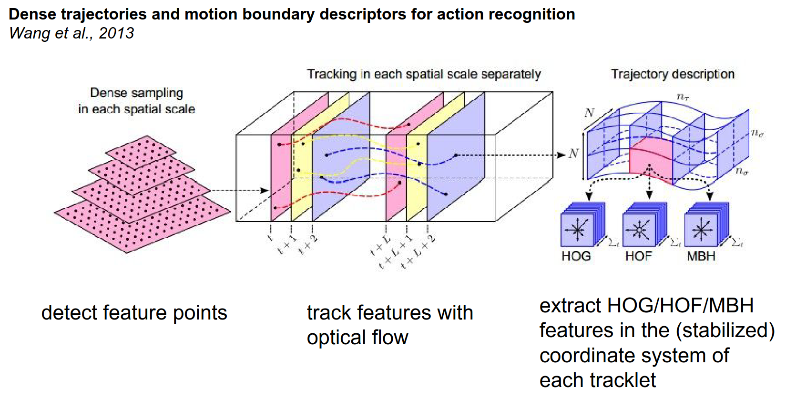

So in terms of the key point detection part there's been quite a lot of work on exactly how to detect good features and videos to track.

And intuitively you don't want to track regions in the video that are ***too smooth*** because you can't lock onto any visual feature.

There are ways for basically getting a set of points that are easy to track in a video. So there are some papers on this so you detect a bunch of features like this.

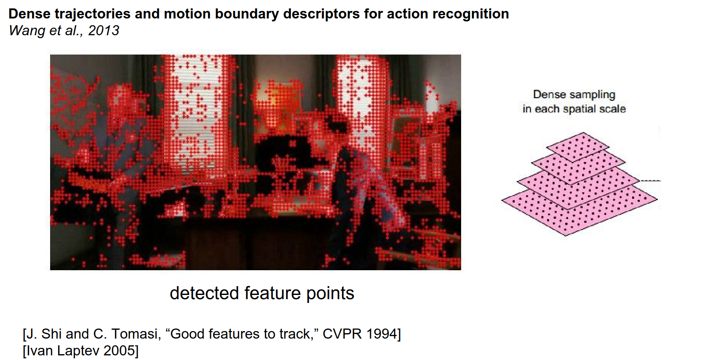

Then you run optical flow algorithms on these videos. 

An optical flow algorithm will take a frame and a second frame and it will solve for a motion field ***a displacement vector at every single position*** into where it traveled or how the frame moved.

Here are some examples of optical flow results. Basically here every single pixel is colored by a direction in which that part of the image is currently moving in the video. 

So for example this girl has all yellow meaning that she's probably translating horizontally or something like that. One of the most common ways to compute Optical Flow here is Brocks from Brock's and Malik, that's the one that is kind of like a default thing to use.

If you are computing optical flow in your own project I would encourage you to use this large displacement optical flow method.

Using this optical flow we have all these key points using optical flow. We know also how they move and so we end up tracking these load tracklets of maybe roughly 15 frames at a time.

We end up with these half a second roughly tracklets through the video.

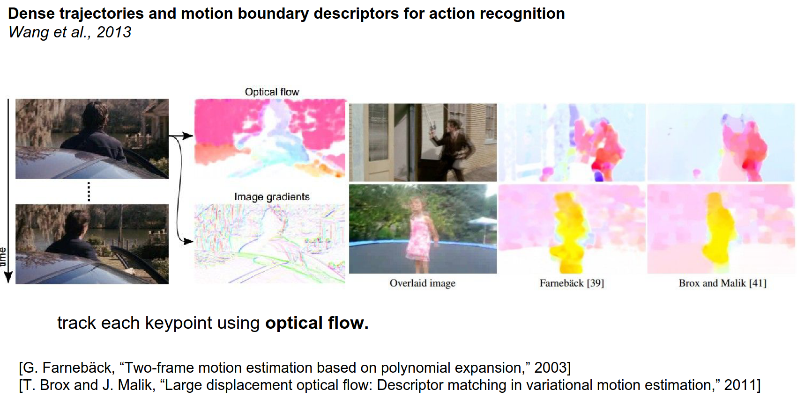

And then we encode regions around these tracklets with all these descriptors. Then we need to accumulate all these visual features into histograms and people used to play with different kinds of how do you exactly truncate video spatially, because we're going to have a histogram and independent histogram and every one of these bins.

And then we're going to basically make all these histograms per bin with all these visual features and all of this then goes into an SVM and that was kind of the rough layout in terms of how people address these problems in the past.

> Wait, what is a tracklet?

A tracklet, let's just think of it as it's going to be 15 frames and it's just $XY$ positions so a 15 $XY$ coordinates, that's a tracklet.

And then we extract features in the local coordinate system.

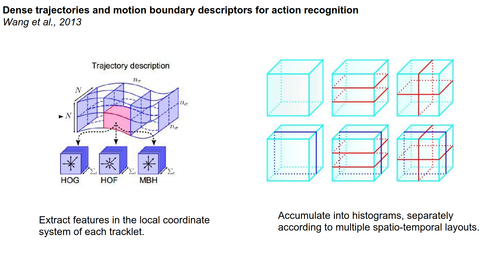

#### CNNs for Video

How do we apply ConvNets to video?

AlexNet takes a $227 \times 227 \times 3$ image. For video, we might have a block of frames, say $227 \times 227 \times 3 \times 15$.

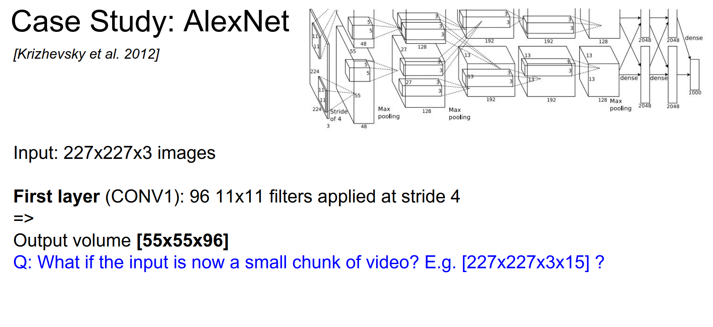

**3D Convolutions**

The standard approach is to **extend the filters in time**. Instead of $11 \times 11$ filters, we use $11 \times 11 \times T$ filters (e.g., $11 \times 11 \times 3$). These are **3D Convolutions**.

We slide these filters in space and time, producing activation volumes.

So you're introducing this time dimension into all your kernels and to all your volumes, they just have an additional time dimension along which we're performing the convolutions.

That's usually how people extract the features. Then you get this property where say T is 3 here and so then when we do the spatial temporal convolution we end up with this parameter sharing scheme going in time as well as you mentioned.

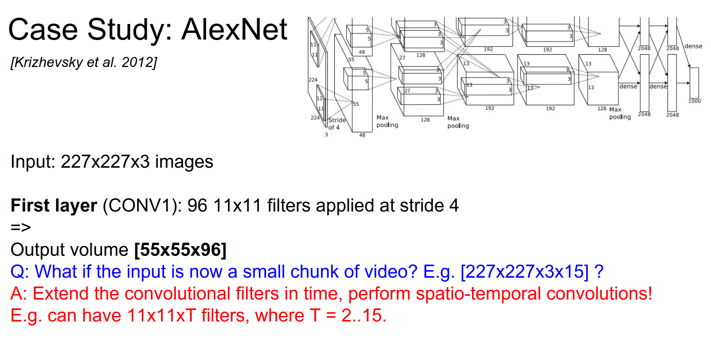

Early approaches (2010, 2011) used 3D convolutions for activity recognition.

So the idea here was that this is just a convolutional Network but instead of getting a single input of $60x40$ pixels we are getting in fact 7 frames of $60x40$ and then there convolutions our 3D convolutions as we refer to them.

So these filters for example might be seven by seven but now by three as well. We end up with a 3D Conv and these 3D convolutions are applied at every single stage here.

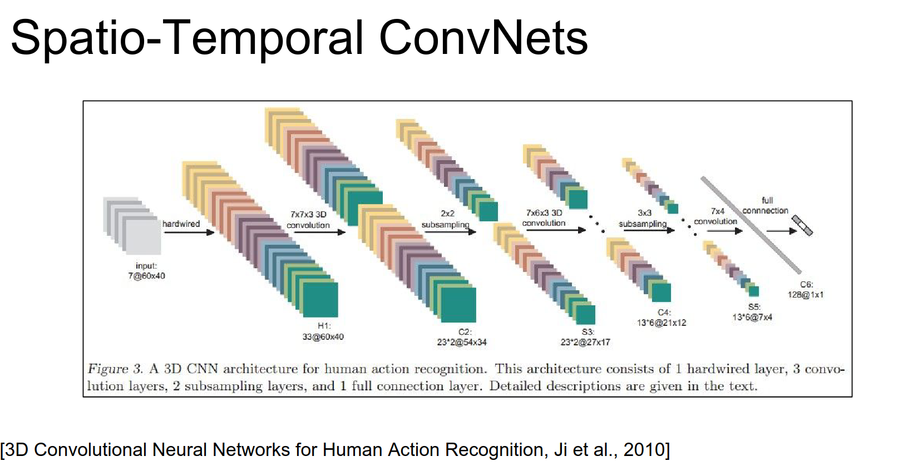

Similar paper also in from 2011 with the same idea.

We have a block of frames coming in, and you process them with 3D convolutions. You have 3D convolutional filters at every single point in this convolutional network. 

So these are from before actually AlexNet, these approaches are kind of like smaller neural network and convolutional network.

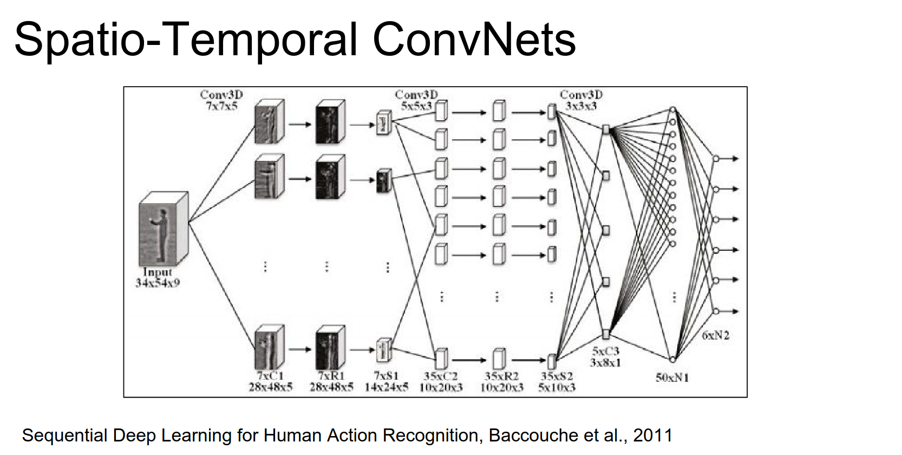

#### Fusion Architectures

In 2014, Karpathy et al. explored different ways to fuse temporal information:

1.  **Single Frame**: Baseline model looking at one frame at a time.
2.  **Early Fusion**: Concatenate frames at the input layer (e.g., $227 \times 227 \times (3 \times T)$) and use 2D convolutions.
3.  **Late Fusion**: Two separate ConvNets process frames far apart in time, and their outputs are fused in the fully connected layers.
4.  **Slow Fusion**: Use 3D convolutions to slowly fuse temporal information throughout the network.

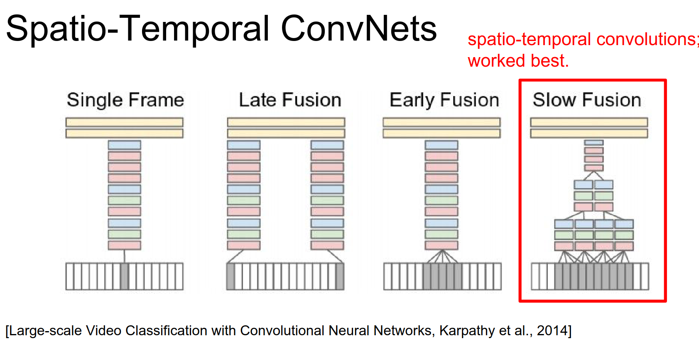

For the slow fusion model you can imagine that if you have three-dimensional kernels now on the first layer you can actually visualize them and these are the kinds of features you end up learning on videos.

So these are basically the features that we're familiar with ***except they're moving***.

Because now these filters are also extended a small amount in time so you have these little moving blobs and some of them are static and some of them are moving.

And they're basically detecting motion on the very first layer and so you end up with nice moving volumes.

So we have a video and we're still classifying fixed number of categories at every single frame, but now your prediction is not only a function of that single frame but also a small number of frames on both sides. So maybe your prediction is actually a function of say 15 frames - half a second of video.

- Slow Fusion learns spatio-temporal features (moving blobs) in the first layer.

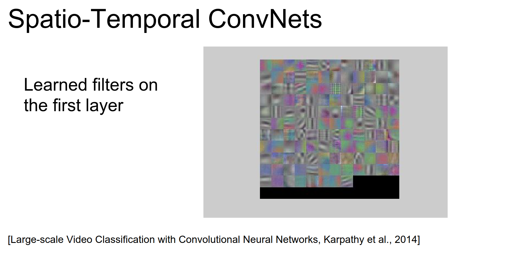

**Sports-1M Dataset**: They released a dataset of 1 million sports videos.

**Findings**:

-   Single frame baselines are very strong.
-   Motion information often provides only a small improvement (e.g., +1.6%).
-   For many classes (e.g., swimming vs. tennis), context/background is more important than local motion.

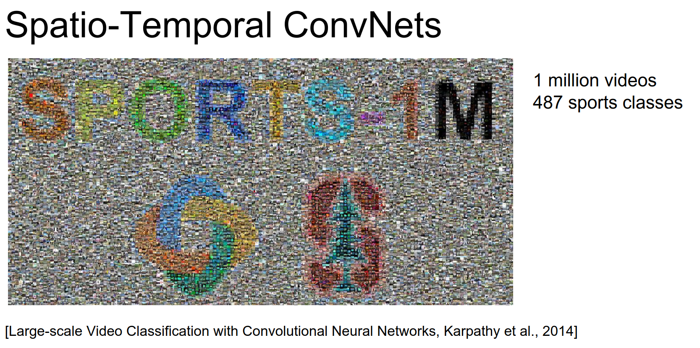

Sometimes people they think they have videos and they get very excited, they want to do 3D convolutions, LSTM's and they just think about all the possibilities that open up before them.

But actually it turns out that single frame methods are a very strong baseline and I would always encourage you to run that first.

So for example in this paper we found that a single frame baseline was about 59.3% classification accuracy in our data set. And then we tried our best to actually take into account small local motion but we ended up only bumping that by 1.6%.

So all this extra work / all the extra compute and then you ended up with relatively small gains.

And I'm going to try to tell you why that might. But basically video is not always as useful as you might intuitively think.

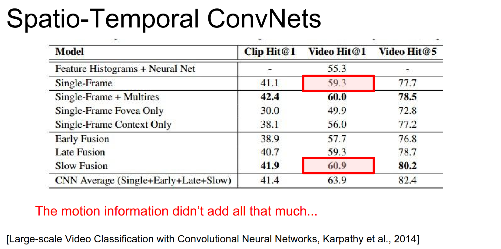

These are different datasets of sports and our predictions. And I think this kind of highlights slightly why adding video might not be as helpful in some settings. So in particular here if you're trying to distinguish sports and think about trying to distinguish say tennis from swimming or something like that.

It turns out that you actually don't need very fine local motion information if you're trying to distinguish tennis from swimming right. Lots of blue stuff lots of red stuff.

The images actually have a huge amount of information and so you're putting in a lot of additional parameters and trying to go after these local motions, but in most classes actually these local motions are not very important.

They're only important if you have very fine-grained categories where the small motion actually really matters a lot.

And so a lot of you if you have videos you'll be inclined to use a spatial-temporal crazy video networks. But think very hard about is that local motion extremely important in your setting because if it isn't you might end up with results like this where you put in a lot of work and it might not work extremely well.

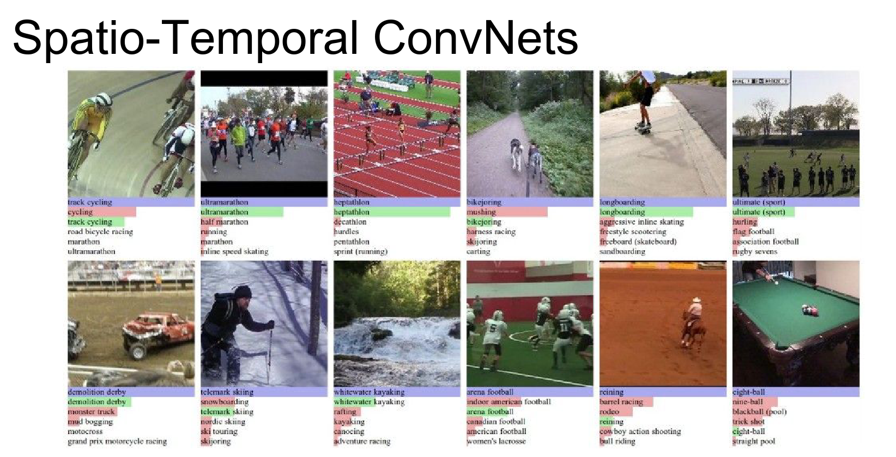

**C3D**

So this paper is from 2015 it's relatively popular. it's called C3D.

**C3D** (Tran et al., 2015) is a VGG-like network for video using $3 \times 3 \times 3$ convolutions and $2 \times 2 \times 2$ pooling throughout.

So the idea here is that basically let's do the exact same thing but extend everything in time. So going back to your point, you want very small filters so this is everything is $3x3x3$ Conv $2x2x2$ pool throughout the architecture.

It's a very simple kind of VGG net in 3D kind of approach and that works reasonably well and you can look at this paper for reference.

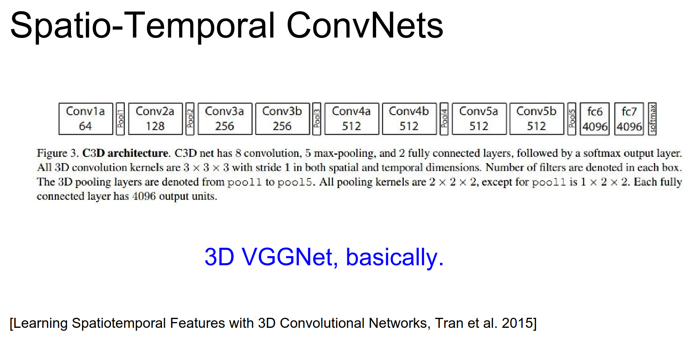

**Two-Stream Networks**

Simonyan and Zisserman (2014) proposed **Two-Stream Networks**.

-   **Spatial Stream**: A ConvNet processing a single RGB frame.
-   **Temporal Stream**: A ConvNet processing a stack of optical flow frames.

The predictions from both streams are fused (e.g., averaged) at the end.

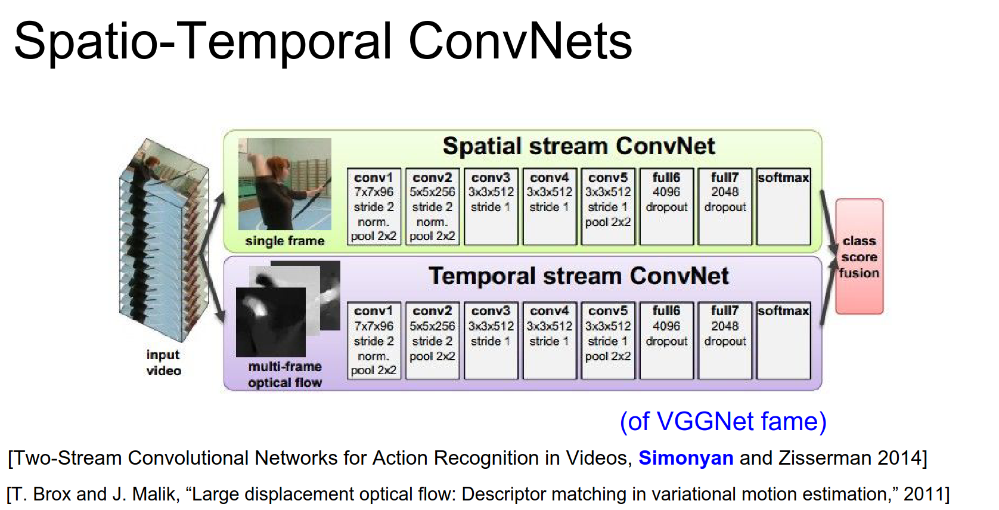

Interestingly, the temporal stream (optical flow) often outperforms the spatial stream. Fusing them gives the best results.

This suggests that explicitly computing optical flow is beneficial, likely because it's hard for ConvNets to learn motion features from raw pixels with limited data.

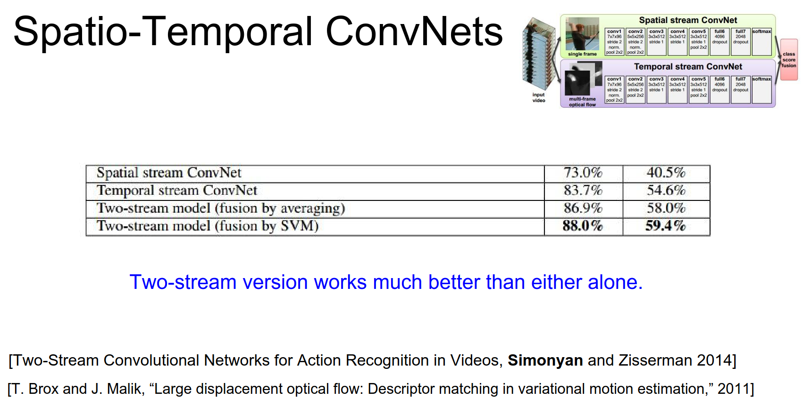

#### Long-term Modeling

So far, we've looked at short temporal extents. What about long-term dependencies?

We can use **Recurrent Neural Networks (RNNs)** or **LSTMs**.

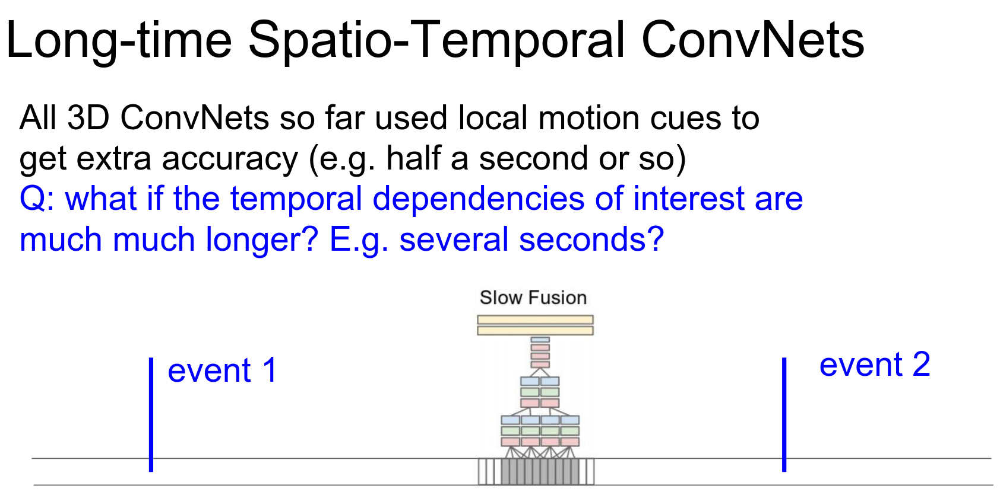

A 2011 paper (Baccouche et al.) actually combined 3D Convs with LSTMs way ahead of its time.

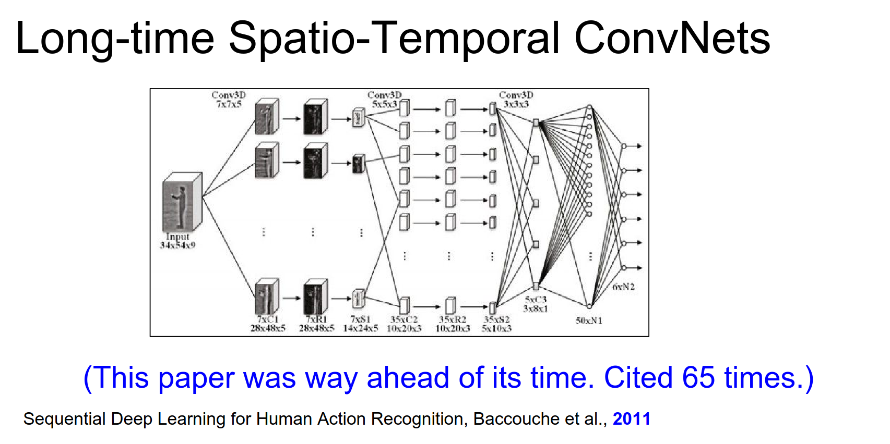

I'm not sure why it's not more popular. It recognizes both of these and actually use LSTM's way before I even knew about them.

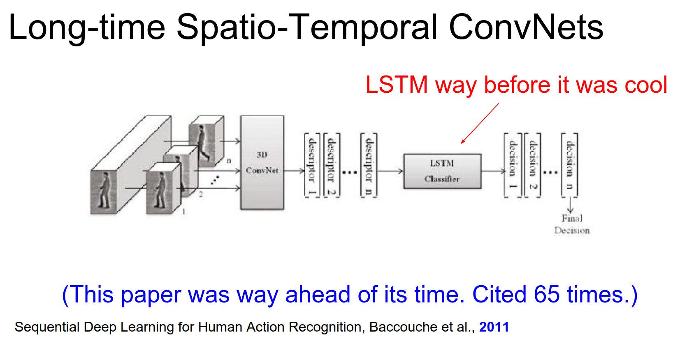

More recent works (Donahue et al., 2015; Ng et al., 2015) also use this **CNN + LSTM** approach:

1.  Process each frame (or chunk) with a CNN.
2.  Feed the CNN features into an LSTM to aggregate information over time.

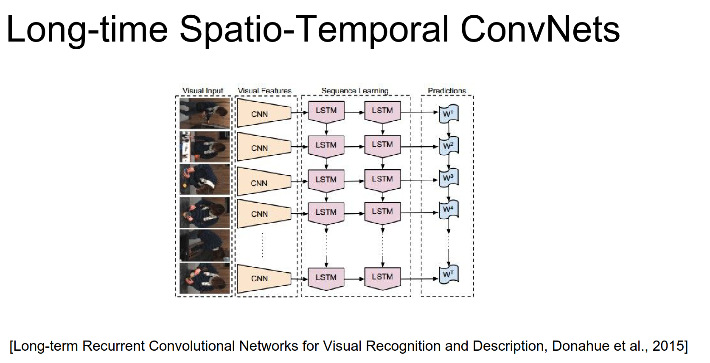

A similar idea also from a paper from I think this is Google. The idea here is that they have optical flow and images both are processed by ConvNet's and then again you have an LSTM that merges that over time.

Again this combination of ***local and global***.

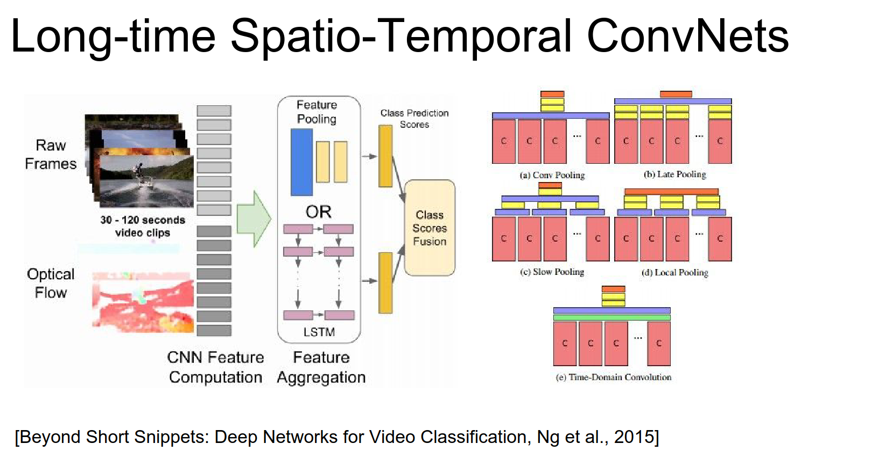

So far we've looked at kind of two architectural patterns in accomplishing video classification that actually takes into account temporal information.

Modeling local motion which for example we extend 3D Conv where we use optical flow.

Or more global motion where we have LSTM that string together sequences of learning time steps.

Or fusions of the two.

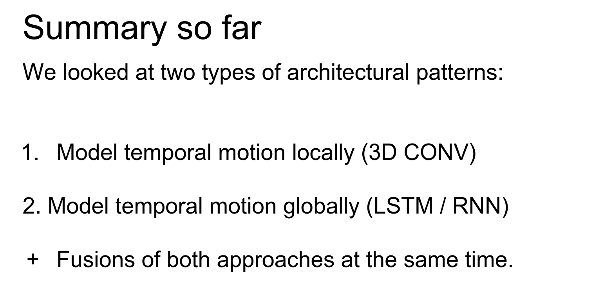

#### Recurrent Convolutional Networks

There is an "ugly asymmetry" in CNN + LSTM models: spatial processing is done by the CNN, and temporal processing is done by the LSTM at the top.

A recent idea is to make the ConvNet itself recurrent.

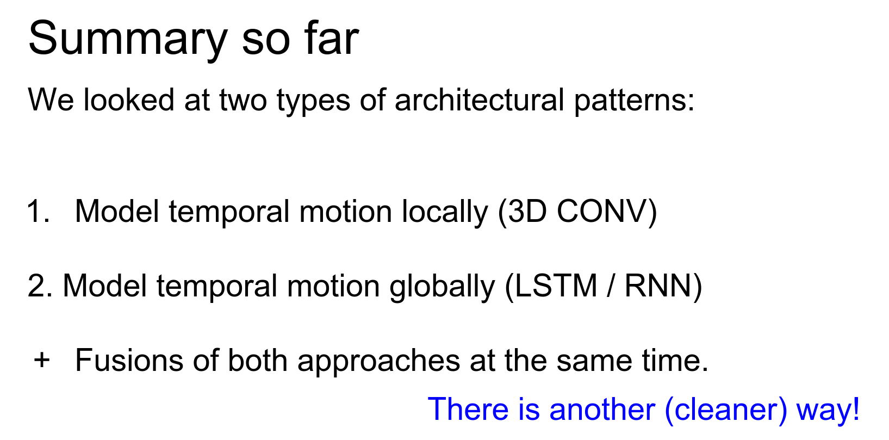

We're going to get rid of the RNN we're going to basically take a ConvNet and we're going to make every single neuron in that ConvNet be a small recurrent neural network like every single neuron becomes recurrent in the ConvNet.

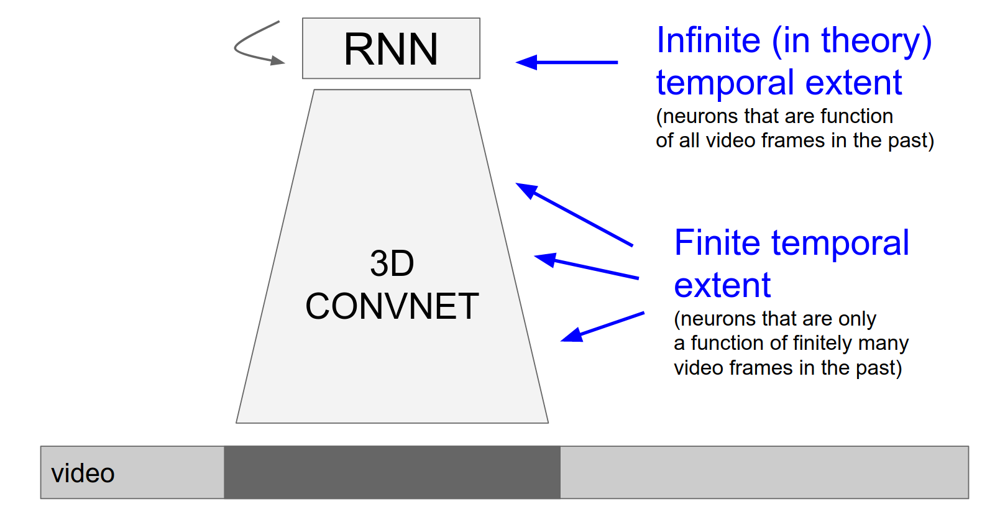

In a **Recurrent Convolutional Layer**:

-   Input: Features from the layer below ($X_t$) AND features from the same layer at the previous time step ($H_{t-1}$).
-   Operation: Convolve both inputs and combine them (e.g., using GRU updates).

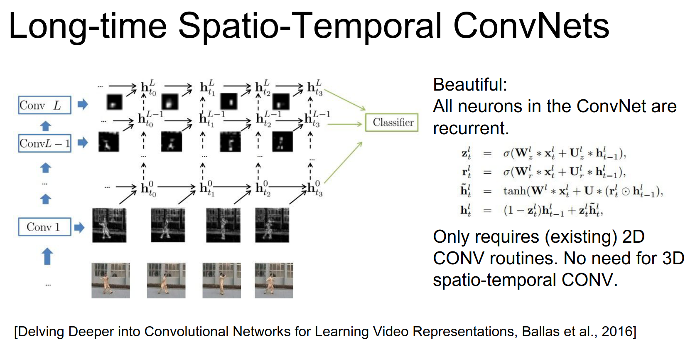

So in a normal ConvNet we have a Conv Layer somewhere in the neural network and it takes input from below, the output of a previous Conv layer something like that.

And we're doing convolutions over this to compute the output at this layer, right.

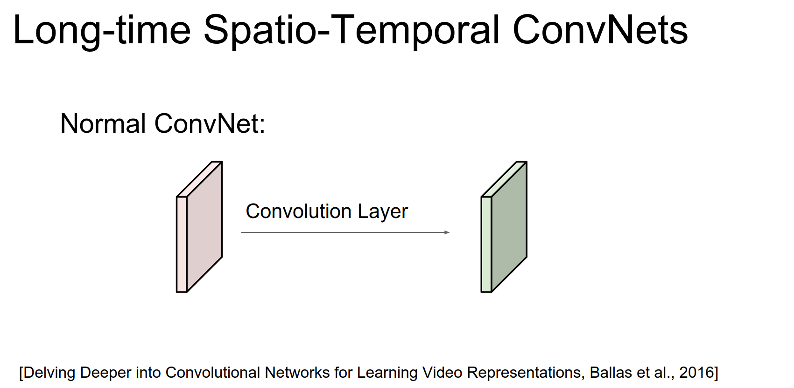

So the idea here is we're going to make every single convolutional layer a kind of a recurrent layer and so the way we do that is - just as before - we take the input from below us and we do Convs over it. 

But we also take our previous output from the previous time step of this Conv Layers output so that's this Conv Layers from previous time step in addition to the current input that this time step and we do convolutions over both this one (in the bottom) and that one (in the top).

And then, we done Convs, then we have these activations **from current input** and we have activations from **our previous output** and we add them up. We do a recurrent like, recurrent neural network like merge of those two to produce our output.

And so we're a function of the current input, but we're also a function of our previous activations.

We're in fact only using two-dimensional convolutions here. There's no 3D Conv anywhere, because both of these are width by height by depth right so the previous column volume is just width height depth from the previous layer. 

And we are with high depth from previous time and so both of these are two-dimensional convolutions but we end up with kind of recurrent process in here.

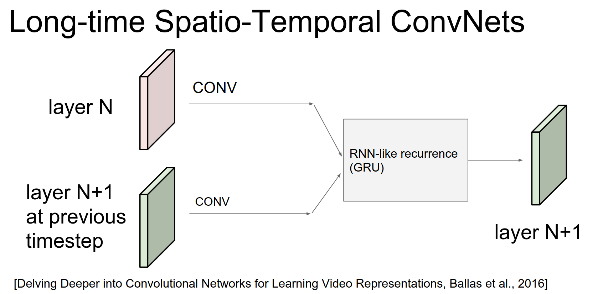

So one way to see this also with recurrent neural networks which we've looked at, is that you have this recurrence where you're trying to compute your hidden state and it's a function of your previous hidden state and the current input X. So we looked at many different ways of actually wiring up that recurrence, so there's a vanilla RNN or an LSTM or there's a GRU, which GRU is a simpler version of an LSTM if you recall, but it almost always has similar performance to an LSTM.

So GRU has slightly different update formulas for actually performing that recurrence.

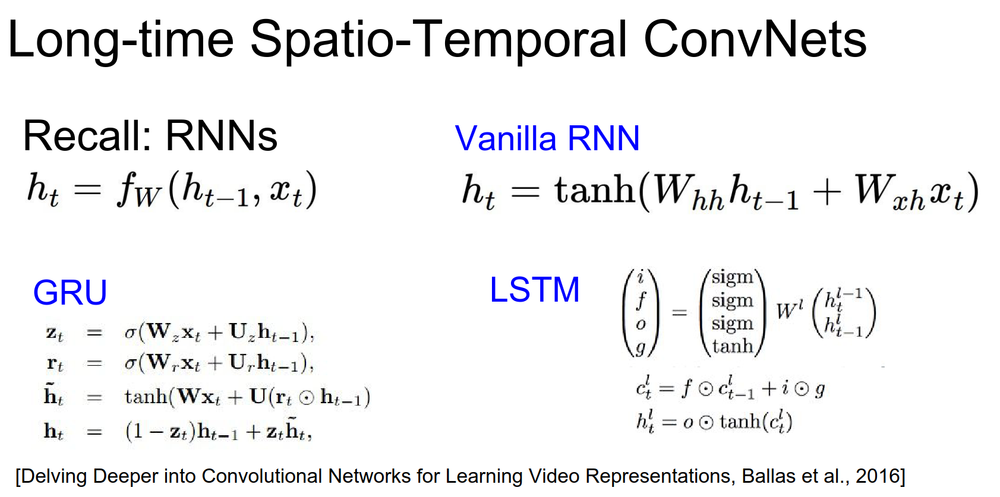

And so what they do in this paper is basically they take the GRU - because it's a simpler version of an LSTM that works almost just as well - but instead of every single matrix multiply it's kind of like replaced with a Conv if you can imagine.

That so every single matrix multiply here, just becomes a Conv so we convolve over our input and we convolve our output and that's the before and the below. And then we combine them with the recurrence just as in the GRU to actually get our activations.

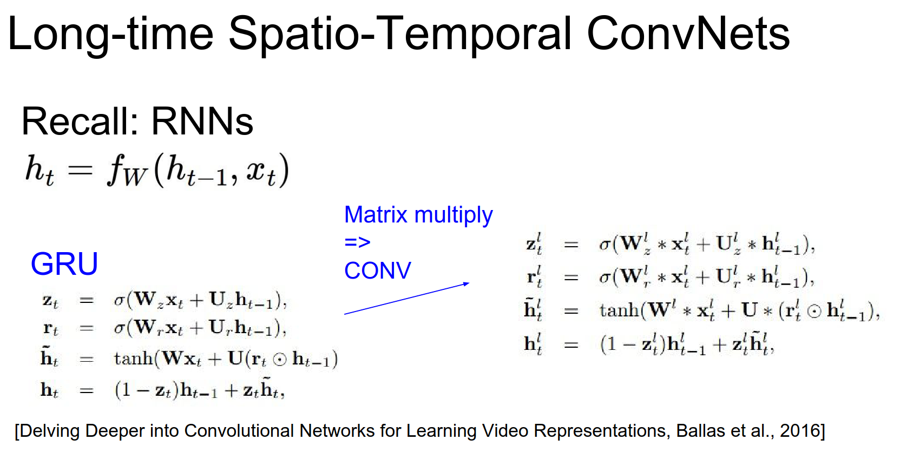

This makes every layer recurrent, unifying spatial and temporal processing.

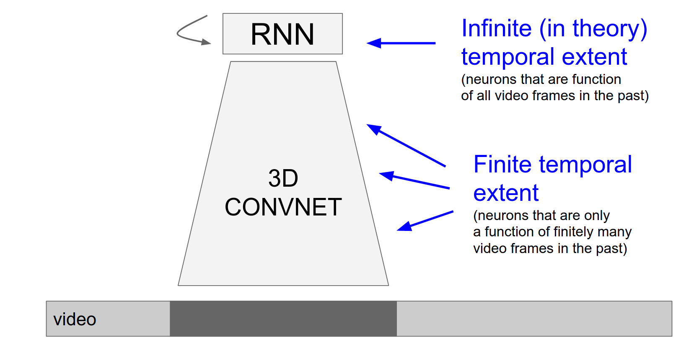

And now it basically just looks like that.

We don't have some parts being infinite in extent and some parts finite, we just have this RNN ConvNet, where every single layer is recurrent.

It's computing what it did before but also it's a function of its previous outputs. And so this RNN ConvNet that is a function of everything. 

And it's very kind of uniform, it's kind of like a VGG net you just do $3x3$ Conv $2x2$ max pool and your recurrent.

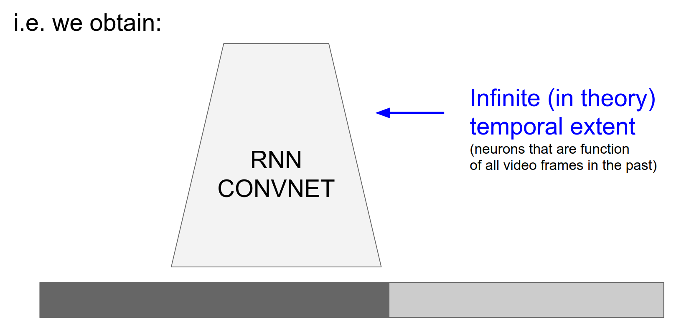

**Summary for Videos**:

1.  Start with single-frame baselines.
2.  If motion matters, try 3D Convs (C3D) or Two-Stream Networks (with Optical Flow).
3.  For long-term dependencies, use LSTMs on top of CNN features.

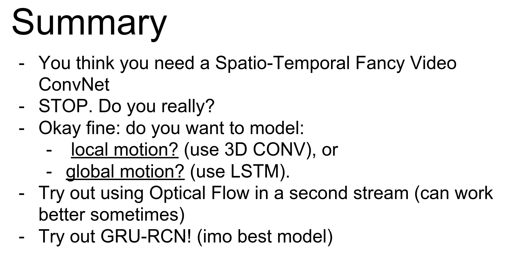
### Unsupervised Learning

We're going to go into unsupervised learning. Justin Continues the lecture.

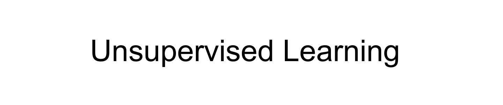

We're switching gears to **Unsupervised Learning**. So in particular we're going to talk about autoencoders and then this idea of adversarial networks.

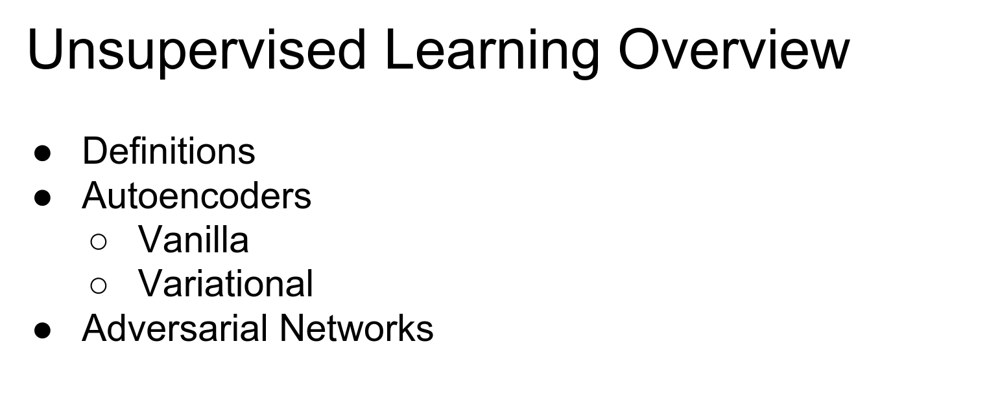

**Supervised Learning**:

Everything we've seen in this class so far is supervised learning.

-   Data: $(x, y)$
-   Goal: Learn function mapping $x \to y$.
-   Examples: Classification, Regression, Object Detection, Semantic Segmentation.

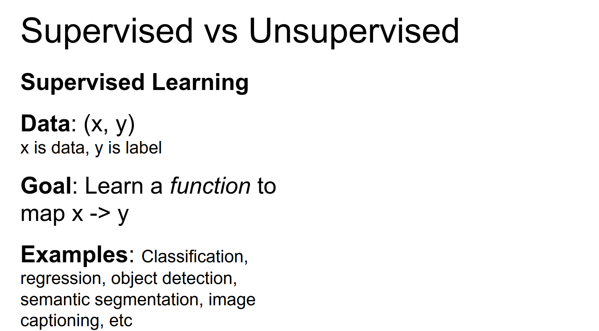

**Unsupervised Learning**:

-   Data: $x$ (Just data, no labels!)
-   Goal: Learn some underlying hidden structure of the data.
-   Examples: Clustering (K-Means), Dimensionality Reduction (PCA), Density Estimation.

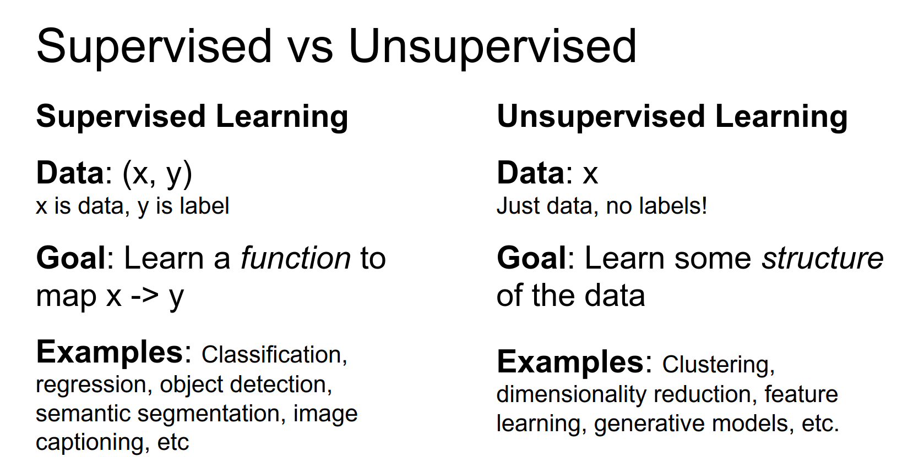

We will discuss two deep learning approaches to unsupervised learning: **Autoencoders** and **Generative Adversarial Networks (GANs)**.

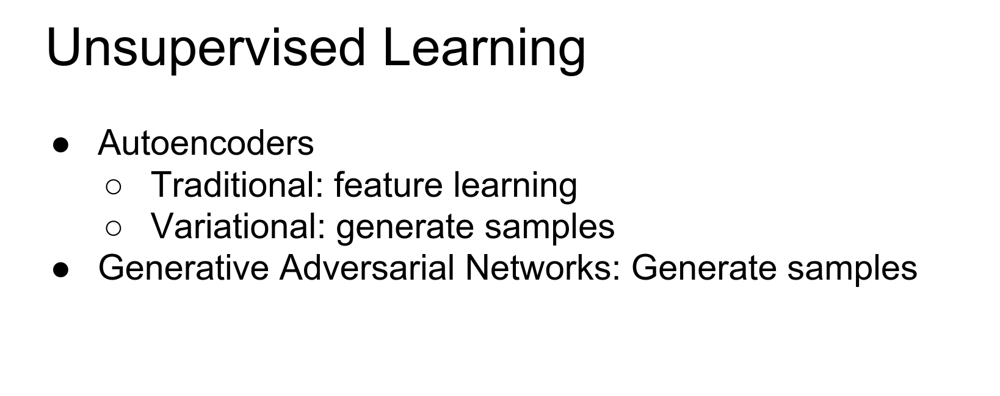

#### Autoencoders

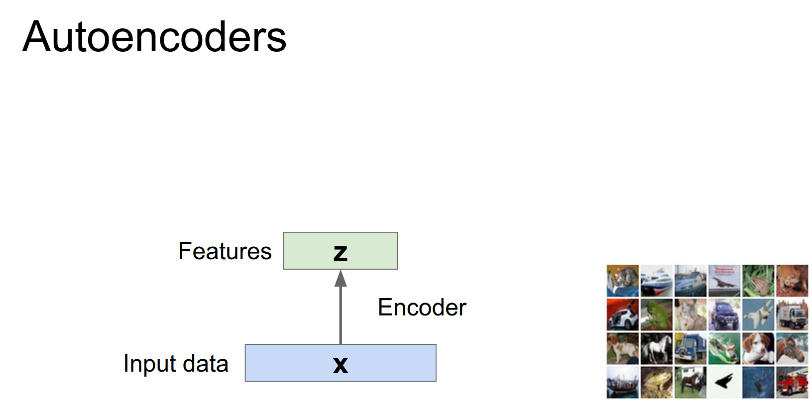

An autoencoder is a neural network that tries to reconstruct its input.

1.  **Encoder**: Maps input $x$ to a latent representation $z$.
    -   $z$ is usually smaller than $x$ (dimensionality reduction).
    -   Forces the network to learn meaningful features/compression.

2.  **Decoder**: Maps latent representation $z$ back to reconstruction $\hat{x}$.

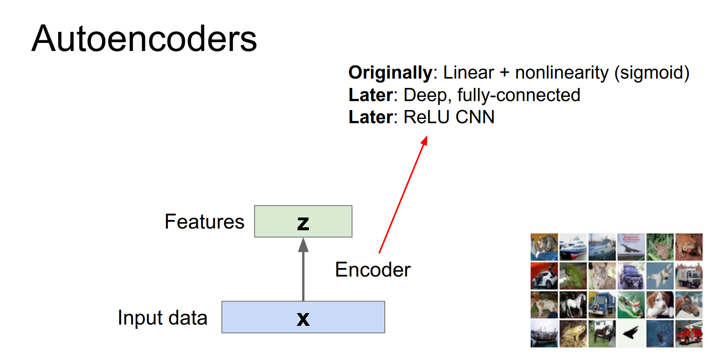

We don't want the network to just transform the data into some useless representation.

We want to force it to actually crush the data down and summarize its statistics in some useful way. That could hopefully be useful for some downstream processing. 

But the problem is that we don't really have any explicit labels to use for this downstream processing, so instead we need to invent some kind of a surrogate task that we can use using just the data itself.

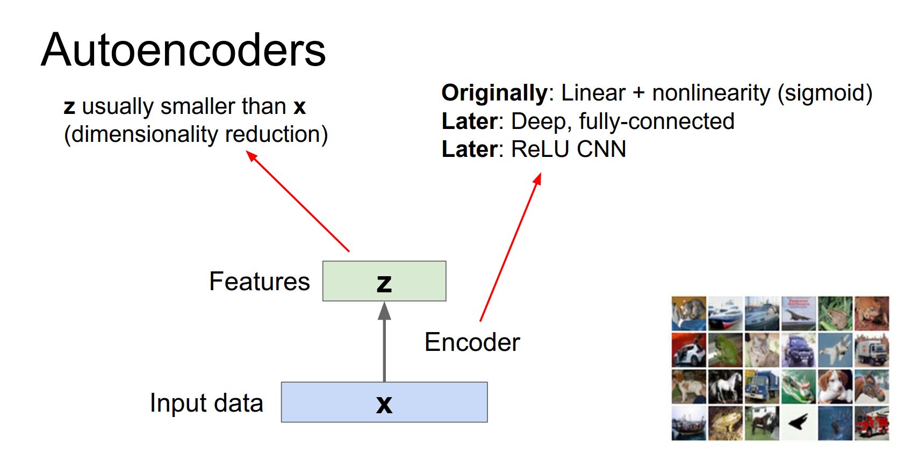

So the surrogate task that we often use for auto-encoders is this idea of reconstruction.

Since we don't have any $Y$ to learn a mapping, instead we're just going to try to reproduce the data X from those features Z. 

And especially if those features Z are smaller in size then hopefully that will force the network to summarize the useful statistics of the input data and hopefully discover some useful features that could be one useful for reconstruction, but more generally maybe those features might be useful for some other tasks,  if we later get some supervised data.

**Loss Function**: Usually L2 loss (Euclidean distance) between input $x$ and reconstruction $\hat{x}$.

$$ L = || x - \hat{x} ||^2 $$

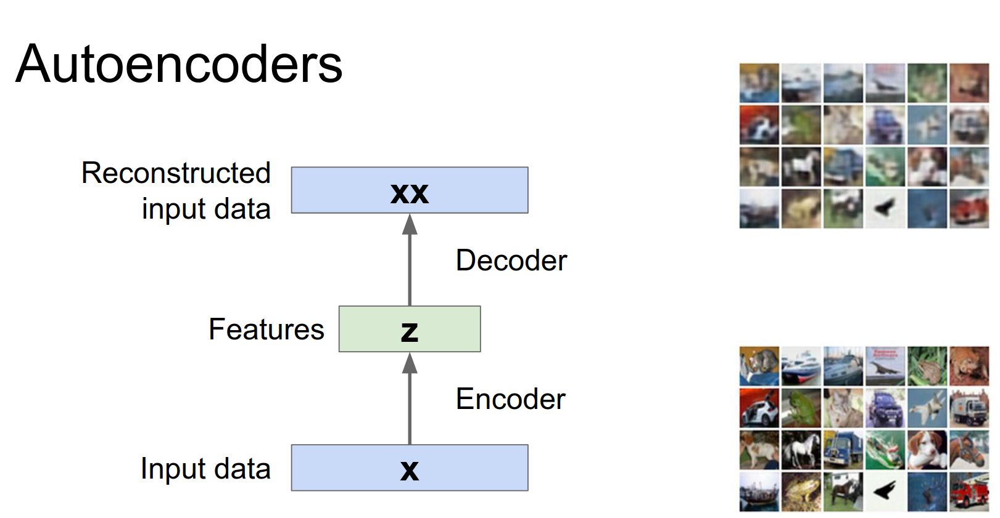

I'd like to make the point that these things are actually pretty easy to train, so on the right here is a like a quick example that I just cooked up in torch. So this is a four layer encoder which is a convolutional network and then a four layer decoder which is an upconvolutional network.

And you can see that it's actually learns to reconstruct the data pretty well.

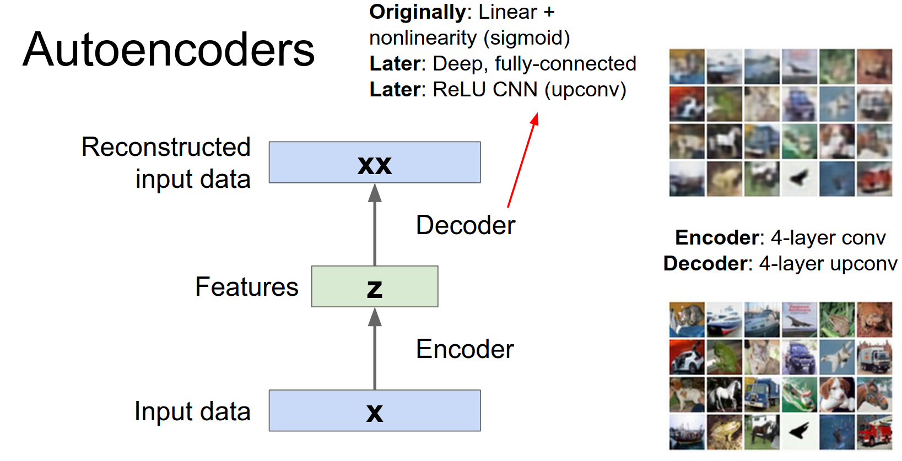

Sometimes weights are shared (tied) between encoder and decoder (e.g., $W_{dec} = W_{enc}^T$).

With just sort of as a regularization strategy and with this intuition that these are opposite operations so maybe it might make sense to try to use the same weights for both.

So just as a concrete example, if you think about a fully connected Network then maybe your input data has some dimension D. And then your latent data Z will have some smaller dimension H.

If this encoder was just a fully connected network then the weight would just be this matrix of $DxH$. 

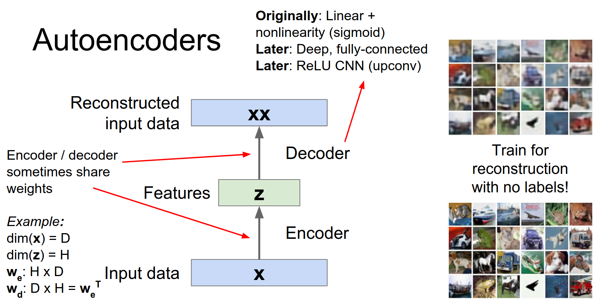

So when we're training this thing we need some kind of a loss function, that we can use to compare our reconstructed data with our original data.

And oftentimes we'll see L2, Euclidean loss to train this thing.

So once we've chosen our encoder Network and once we've chosen our decoder network and chosen a loss function, then we can train this thing just like any other normal neural network.

We get some data we pass it through to encode it we pass it through to decode it we compute our loss we back propagate and everything's good.

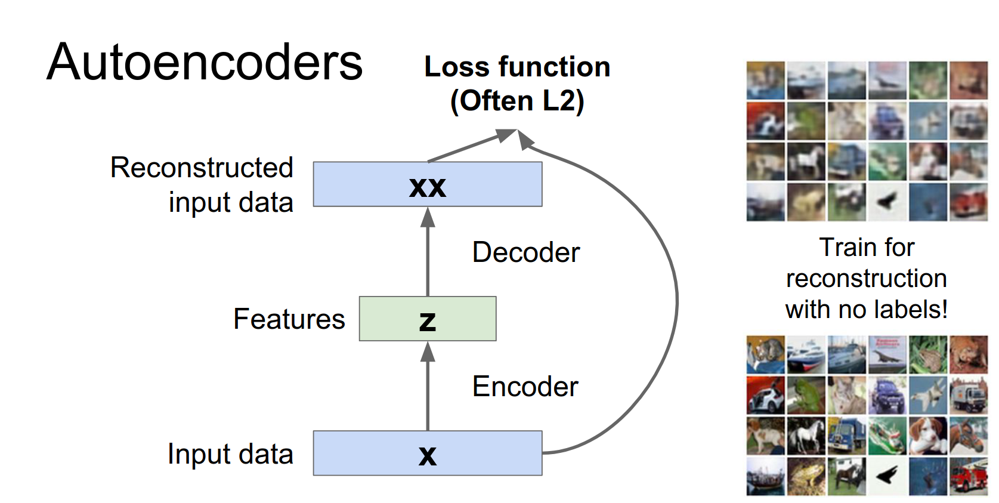

**Why do this?**

Reconstruction itself isn't very useful. The goal is to learn the **latent features** $z$.

After training, we can throw away the decoder and use the encoder to initialize a supervised model (e.g., for classification). This is useful when you have lots of unlabeled data but few labeled examples.

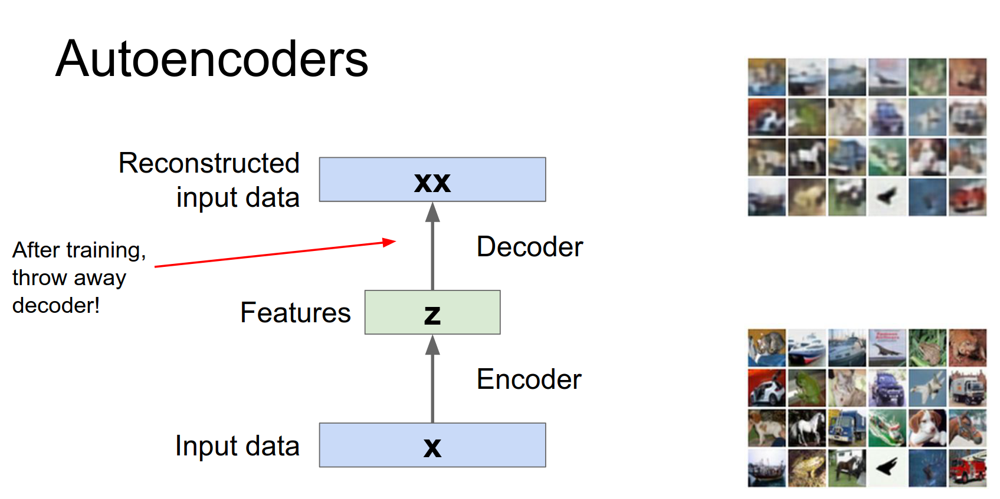

We've learned this encoder network which hopefully - from all this unsupervised data - has learned to compress the data and extract some useful features.

And then we're going to use ***this encoder network to initialize part of a larger supervised Network***.

If we actually do have access to maybe some smaller data set, that have some labels, then hopefully this most of the work here could have been done by this unsupervised training at the beginning. Then we can just use that to initialize this bigger Network and then fine tune the whole thing with hopefully a very small amount of supervised data.

So this is one of the dreams of unsupervised feature learning. 

That you have this really large data set of with no labels you can just go on Google and download images forever and you it's really easy to get a lot of images. The problem is that labels are expensive to collect. So you'd want some system that could take advantage of both a large huge amount of unsupervised data and also just a small amount of supervised data.

So auto-encoders are at least one thing that has been proposed that has this nice property but in practice I think it tends not to work too well. Which is a little bit unfortunate because it's such a beautiful idea.


*Historical Note*: In the mid-2000s, people used "greedy layer-wise pre-training" with Restricted Boltzmann Machines (RBMs) to train deep autoencoders. Nowadays, with ReLU, BatchNorm, and Adam, we can just train them end-to-end.


As an example on the previous slide, we saw this four layer convolutional upconvolutional autoencoder that i trained on CIFAR-10,  and this is just fine to do using all these modern neural network techniques. 

You don't have to mess around with this, greedy layer wise training.

So this is not something that really gets done anymore, but I thought we should at least mention it since you'll probably encounter this idea, if you read back in the literature about these things.


#### Variational Autoencoders (VAEs)

Autoencoders learn features, but they don't necessarily let us generate *new* data. **Variational Autoencoders (VAEs)** add a probabilistic twist that allows for generation.

Maybe you could think about a three layer neural network, so our input is going to be the same as the output.

So we're just hoping that this is a neural network that will learn the identity function.

But in order to learn the identity function we have some loss function at the end, something like an L2 loss that is encouraging our input and our output to be the same.

Learning the identity function is probably a really easy thing to do, but instead we're going to force the network to not take the easy route, and instead hopefully rather than just regurgitating the data and learning the identity function in the easy way, instead we're going to bottleneck the representation through this hidden layer in the middle.

So then it's going to learn the identity function but in the middle if the network is going to have to squeeze down and summarize and compress the data.

Hopefully that compression will give rise to features that are useful for other tasks.


So here we need to dive into a little bit of Bayesian statistics. This is something that we haven't really talked about at all in this class up to this point. But there's this whole other side of machine learning that doesn't do neural networks and deep learning, but thinks really hard about probability distributions and how probability distributions can fit together to generate data sets.

And then reason probabilistically about your data.

This type of paradigm is really nice, because it lets you sort of state explicit probabilistic assumptions about how you think your data was generated. And then given those probabilistic assumptions you try to fit your model to the data that follows your assumptions.

So with the variational auto encoder, we're assuming this this particular type of method by which our data was generated.

We assume that, we there exists out there in the world some prior distribution which is generating these latent States $Z$. And we then we assume some conditional distribution that once we have the latent States, we can sample from some other distribution to generate the data.

So the variational auto encoder it really imagines that our data was generated by this pretty simple process:

1.  Sample latent vector $z$ from a prior distribution $p(z)$ (e.g., unit Gaussian).
2.  Sample data $x$ from a conditional distribution $p(x|z)$ (e.g., Gaussian).


So the intuition is that X is something like an image and ***Z*** maybe summarizes some useful stuff about that image.

So if these was CIFAR-10 images then maybe that latent state Z could be something like the class of the image, whether it's a frog or a deer or a cat.

And also might contain variables about how that cat is oriented or what color it is or something like that.

So this is a pretty simple idea but makes a lot of sense, for how you might imagine images to be generated.


We want to estimate the parameters of this model. The true posterior $p(z|x)$ is intractable.


So to make it simpler we're going to do something that you see a lot in Bayesian statistics and we'll just assume that the prior is Gaussian, because that's easy to handle.


**Encoder (Recognition Network)**: Approximates the posterior $q_\phi(z|x)$.

Instead of outputting a single $z$, it outputs the **mean** $\mu_z$ and **covariance** $\Sigma_z$ of a Gaussian distribution.


So it suppose that we had the latent state $Z$ for some piece of data. 

Then we assume that that latent state will go into some decoder network which could be some big located neural network. Now that neural network is going to spit out two things.

It's going to spit out the mean of the data X and also the the variance of the data X.

So you should think that this looks very much like the top half of a normal autoencoder, that we have this latent state we have some neural net that's operating on the latent state. 

But now instead of just directly spitting out the the data instead, its spitting out the the mean of the data and the variance of the data.


This decoder network sort of thinking back to the normal auto encoder, might be a simple fully connected thing or it might be this very big powerful Deconvolutional network, and and both of those are pretty common.


So now the problem is that by Bayes rule if given the prior and given the conditional, Bayes rule tells us the posterior.

If we want to actually use this model, we need to be able to estimate the latent state from the input data. The way that we estimate the latent state from the input data is by writing down this posterior distribution, which is the probability of the latent state $z$ given our observed data $X$.

And using Bayes rule we can easily flip this around and write it in terms of our prior over $Z$ and in terms of our conditional x given z. 

So we can use Bayes rule to actually flip this thing around and write it in terms of these three things.


After we look at Bayes rule we can break down these three terms and we can see that the conditional, we just use our decoder Network and we easily have access to that.

And this prior, again we have access to the prior because we assumed its unit Gaussian. So that's easy to handle. 

But this denominator, this probability of X it turns out, if you work out the math and write it out this ends up being this giant intractable integral over the entire latent state space.

So that's completely intractable there's no way you could ever perform that integral and even approximating it would be a giant disaster.

So instead we will not even try to evaluate that integral.


Instead we're going to introduce some encoder network that will try to directly perform this inference step for us.

So this encoder network is going to take in a get a point, and it's going to spit out a distribution over the latent state space. Looking back at the original auto-encoder from a few slides ago this looks very much the same. As sort of the bottom half of a traditional auto encoder.

We're taking in data and now instead of directly spitting out the latent state, we're going to spit out a mean and a covariance of the latent state.


Again this encoder network might be some fully convolutional network or it might be some deep convolutional network.


The intuition is that this encoder network will be this separate totally different disjoint function, but we're going to try to train it in a way so that it approximates this posterior distribution that we don't actually have access to.


**Decoder (Generation Network)**: Takes a sample $z$ and outputs the parameters of the data distribution $p_\theta(x|z)$ (e.g., mean and variance of pixels).


Once we put these things together, then we have this input data point X, we're going to pass it through our encoder network, and the encoder network will spit out a distribution over the latent States.


Once we have this this distribution over the latent States you can imagine sampling from that distribution to get some latent state of high probability for that input.


Once we have some concrete example of a latent state, then we can pass it through this decoder network, which should then spit out the probability of the data again.


Then once we have this distribution over the data, we could sample from it to actually get something that hopefully looks like the original data point.

This ends up looking very much like a normal auto encoder, where we're taking our input data we're running it through this encoder to get some latent State, we're passing it through this decoder to hopefully reconstruct the original data.


And when you go about training this thing it's actually trained in a very similar method as a normal auto encoder, where we have this forward pass and this backward pass, the only difference is in the loss function. 

So at the top we have this reconstruction loss, rather than being this point wise L2, instead we want the distribution to be close to the true input data.

And we also have this loss term coming in the middle, that we want this generated distribution over the latent states to hopefully be very similar to our stated prior distribution that we wrote down at the very beginning.

So once you put all these pieces together, you can just train this thing like a normal auto encoder with normal soared forward pass and backward pass, the only difference is where you put the loss and how you interpret the loss.

**Q**: Why do you choose a diagonal covariance ?

**A**: Because it's really easy to work. Actually people have tried I think slightly fancier things too but that's something you can play around with.

**Loss Function**:
We maximize the **Variational Lower Bound (ELBO)** on the log-likelihood of the data.

$$ \mathcal{L} = \mathbb{E}_{q_\phi(z|x)}[\log p_\theta(x|z)] - D_{KL}(q_\phi(z|x) || p(z)) $$

1.  **Reconstruction Loss**: Make the output close to the input.
2.  **KL Divergence Regularizer**: Make the approximate posterior $q_\phi(z|x)$ close to the prior $p(z)$ (unit Gaussian).


So once we've actually trained this kind of variational autoencoder, ***we can actually use it to generate new data*** that looks kind of like our original data set.

So here the idea is that remember we wrote down this prior, that might be a unit Gaussian or maybe something a little bit fancier. But in any rate this prior is some distribution that we can easily sample from. So a Unit Gaussian, it's very easy to draw random samples from that distribution.

So to generate new data, we'll start by just sort of following this data generation process that we had imagined for our data.

So first we'll sample from our from our prior distribution over the latent States.


And then we'll pass it through our decoder network that we have learned during training.

This decoder network will now spit out a distribution over our data points, in terms of both a mean and a covariance. 


**Generating Data**:
At test time, we can sample $z \sim \mathcal{N}(0, I)$ and pass it through the decoder to generate new images.

**Latent Space Interpolation**:
We can explore the latent space. On MNIST, we see smooth transitions between digits.


On faces (Frey Face dataset), we see transitions in pose and expression.

So this is doing exactly that on the MNIST dataset. We trained this variational auto encoder with where $Z$ the latent state is just a two-dimensional thing. Now we can actually scan out this latent space, we can explore densely this two-dimensional latent space and for each point in the latent space pass it through the decoder and use it to generate some image.

So you can see that it's actually discovered this very beautiful structure on MNIST digits, that sort of smoothly interpolates between the different digit classes.

So I'll be up here at the left you see 6's that kind of morph into 0's.

As you go down you see 6's that turn into maybe 9's and 7's. The 8's are hanging out in the middle somewhere and the 1's are down here.

So this latent space actually learned this beautiful disentanglement of the data, in this very nice unsupervised way.


We can also train this thing on a faces data set and it's the same sort of story, where we're just training this two dimensional variational auto encoder and then once we train it we densely sample from that latent space to try to see what it has learned.
### the question is whether people ever try to force the late specific latent variables to have some exact meaning?

And yeah there has been some follow-up work that does exactly that. There's a paper called deep inverse graphics networks from MIT that has that does exactly this setup. 

They try to force where they want to learn sort of a renderer as a neural network, so they want to learn to like render 3D images of things. So they want to force some of the variables in the latent space to corresponds to the 3D angles of the object and maybe the class and the 3D pose of the object, and the rest of them it lets it learn forever whatever at once.

And they actually have some cool experiments where now they can do exactly as you said and by setting those specific values of latent variables, they can render and actually rotate the object and those are pretty cool.

That's a little bit fancier than these faces, but these faces are still pretty cool.

You can see it's sort of interpolating between different faces in this very nice way.


And I think that there's actually a very nice motivation here and one of the reasons we pick diagonal Gaussian is that that has the probabilistic interpretation of having independent, that the different variables in our latent space actually should be independent.

So I think that helps to explain why there actually is this very nice separation between the axes when you end up sampling from the latent space. It's due to this probabilistic independence assumption embedded in a prior. 

So this idea of priors is very powerful and lets you sort of bake those types of things directly into your model.


So I wrote down a bunch of math and I don't think we really have time to go through it.

Classically when you're training generative models, there's this thing called maximum likelihood where you want to maximize the likelihood of your data under the model, and then pick the model where that makes your data most likely.


But it turns out that if you just try to run maximum likelihood using this generative process that we had imagined for the variation auto-encoder, you end up needing to marginalize this Joint Distribution, which becomes this giant intractable integral over the entire latent state space.


So that's not something that we can do.


No bueno.


So instead the variational auto encoder does this thing called ==variational inference.==
## variational inference ?

Which is a pretty cool idea.


 The math is here in case you want to go through it.


But the idea is that instead of maximizing the log probability of the data, we're going to cleverly insert this extra constant and break it up into these two different terms.


This is an exact equivalence that you can maybe work through on your own.


This is an exact equivalence that you can maybe work through on your own.


But this log likelihood we can write in terms of this term - that we call an elbow- and this other term which is a KL divergence between two distributions.


We know that KL divergence between distributions is nonzero. 


We know that this term (on the right) has to be nonzero.


Which means that this this elbow term actually is a lower bound on the log likelihood of our data.


Notice that in the process of writing down this elbow, we introduced this additional parameter $\phi$ that we can interpret as the parameters of this encoder network, that is sort of approximating this hard posterior distribution.

So now instead of trying to directly maximize the log likelihood of our data, instead we'll try to maximize this variational lower bound of the data.

Because the this elbow is built as a low bound of the log-likelihood then maximizing the elbow will also have the effect of raising up the log-likelihood instead.


And these these two terms of the elbow actually have this beautiful interpretation.

This one at the front is the expectation over the latent space of the probability of x given the latent state space.

So if you think about that that's actually a data reconstruction term.

That's saying that, if we averaged over all possible latent states then we should end up with something that is similar to our original data.


And this other term is actually a regularization term. This is the KL divergence between our approximate posterior and between the prior. So this is a regularization is trying to force those two things together.


So in practice this first term you can approximate with something called the ==approximate by sampling== using this trick in the paper that I won't get into.


And this other term again because everything is Gaussian here you can just evaluate this KL divergence explicitly.

So I think this is the most math heavy slide in the class.

This looks scary but it's actually just this auto-encoder idea where you have a reconstruction and then you have this penalty penalizing to go back towards the prior.


#### Generative Adversarial Networks (GANs)

VAEs generate blurry images because of the L2 reconstruction loss (or similar). **GANs** (Goodfellow et al., 2014) try to fix this with a game-theoretic approach.


**Two Networks**:

1.  **Generator ($G$)**: Tries to generate fake images that look real. Input is random noise $z$.
2.  **Discriminator ($D$)**: Tries to distinguish between real images and fake images.


And then we're going to have a generator network and this generator network actually looks very much like the decoder in the variational auto encoder. Or like the second half of a normal auto encoder. In that we're taking this random noise and we're going to spit out an image, that is going to be some fake non real image that we're just generating using this train network. 


Then we're also going to hook up a discriminator network that is going to look at this fake image and try to decide whether or not that generated image is real or fake. 

So this second network is just doing this binary classification task where it receives an input and it just needs to say whether or not it's real image or not.

So that's just sort of a classification task that you can hook up like anything else.


**Training**:

-   **Discriminator**: Maximize probability of assigning correct label (real vs. fake).
-   **Generator**: Minimize probability that Discriminator is correct (try to fool $D$).

This is a **minimax game**:
$$ \min_G \max_D V(D, G) = \mathbb{E}_{x \sim p_{data}}[\log D(x)] + \mathbb{E}_{z \sim p_z}[\log(1 - D(G(z)))] $$


Now another way that we can hook up this kind of supervised learning problemish without any real data. So we hook this thing up and we train the whole thing jointly.


**Results**:

-   MNIST: Good.
-   Faces: Good.
-   CIFAR-10: Okay, but blobby.


And when we apply this this task to CIFAR-10 then our samples don't quite look as nice and clean.

So here it's clearly got some idea about CIFAR-10 data where it's making blue stuff and green stuff, but they don't really look like real objects.

So that's a problem.


**Laplacian Pyramid GAN (LAPGAN)**

Generate images in a coarse-to-fine manner using a pyramid of generators.


Then we'll up sample that low res guy.


And apply a second generator that receives a new batch of random noise and computes some Delta on top of the low res image.


Then we'll up sample that again.


And repeat the process several times.


And repeat the process several times.


And repeat the process several times, until we've actually finally generated our final result.

So this is again a very similar idea as the previous as the original GAN, we're just generating at multiple scales simultaneously.


The training here is a little bit more complex. You actually have a discriminator at each scale and that hopefully does something.

So when we look at the train samples from this guy they're actually a lot better.


So here they actually train a separate model per class on CIFAR-10. So here they've trained this adversarial network on just planes from CIFAR-10, and you can see that they're starting to look like real planes.

These look almost like real cars and these maybe look kind of like real birds.


**DCGAN (Deep Convolutional GAN)**

Radford et al. (2015) found a stable architecture for training GANs:
-   Replace pooling with strided convolutions.
-   Use BatchNorm.
-   Remove fully connected layers.
-   Use ReLU in Generator, LeakyReLU in Discriminator.


**Results**:
Generated bedrooms look amazing!


**Latent Space Arithmetic**:
We can do vector arithmetic on the $z$ vectors.

Smiling Woman - Neutral Woman + Neutral Man = **Smiling Man**


So one example that we can try is interpolating between bedrooms.

These images on the left hand side we've drawn a random point from our noise distribution and then used it to generate an image. On the right hand side we've done the same and we generate another random point from our noise distribution and use it to generate an image.

So now these these two guys on the opposite sides are sort of two points on a line. Now we want to interpolate in the latent space between those two latent z vectors. And along that line we're going to use the generator to generate images.

And hopefully this will interpolate between the latent states of those two guys.

And you can see that this is pretty crazy that these bedrooms are morphing sort of in a very nice smooth continuous way, from one bedroom to another.

This morphing is actually happening in kind of a nice semantic way, if you imagine what this would look like in pixel space then it would just be kind of this fading effect and it would not look very good at all.

But here you can see that actually the shapes of these things and colors are sort of continuously deforming from one side to the other.


Another cool experiment they have in this paper is actually using vector math to play around the type of things that these networks generate.

Here the idea is that they generated a whole bunch of random samples from the noise distribution then push them all through the generator to generate a whole bunch of samples.

Then using their own human intelligence, they tried to make some semantic judgments about what those random samples looked like. And then group them into a couple meaningful semantic categories.

So this would be three images that were generated from the network that all kind of look like a smiling woman. Those are human provided labels.

Here in the middle are three samples from the network of a neutral woman that's not smiling.

And here on the right is three samples of a man that is not smiling.


So each of these guys was produced from some latent state vector. So we'll just average those latent state vectors to compute this sort of average average latent state of smiling women neutral women and neutral men.

Now once we have this latent state vector, we can do some vector math.

We can take a smiling woman subtract a neutral woman and add a neutral man. 

So what would that give you?


Man with Glasses - Man without Glasses + Woman without Glasses = **Woman with Glasses**


We can do another experiment, so we can take a man with glasses and a man without glasses.

Subtract the man with glasses and add a woman with glasses with no glasses. 

This is confusing.

What would this little equation give us?


That's pretty crazy. Even though we are not forcing an explicit prior on this latent state space these adversarial networks have somehow still managed to learn some really nice useful representation there.


**Combining VAE and GAN**

We can combine VAEs and GANs to get the best of both worlds (VAE/GAN paper).


So we do that.

Now in addition to having our variational auto encoder, we also have this this discriminator network that's trying to tell the difference between the real data and between the samples from the variational auto encoder.

That's not cool enough.


So why don't we also download AlexNet and then pass these two images through AlexNet.


Extract AlexNet features for both the original image and for our generated image.


Now in addition to having a similar pixel loss and fooling the discriminator, we're also hoping to generate samples that have similar AlexNet features as measured by L2.

Once you stick all these things together hopefully you'll get some really beautiful samples right?


So here are the examples from the paper.

So these are they just train the entire thing on ImageNet. Cherry picked examples maybe? 

If you contrast this with the multi scale samples on CIFAR-10 that we saw before, for those samples remember they were actually training a separate model per class in CIFAR-10, and those beautiful bedroom samples that you saw was again training one model that's specific to bedrooms.

But here they actually trained one model on all of ImageNet.

Still like these aren't real images but they're definitely getting towards realish looking images.

It's fun to just take all these things and stick them together and hopefully get some really nice samples.

That's I think that's pretty much all we have to say about unsupervised learning so if there's any any questions..
## the question is are you may be linearizing the bedroom space?

That's maybe one way to think about it. Here remember we're just sampling from noise and passing that through the generator. And then the generator has just decided to use these different noise channels in nice ways. Such that if you interpolate between the noise you end up interpolating between the images in a sort of a nice smooth way. Hopefully that lets you know that it's not just sort of memorizing training examples it's actually learning to generalize from them in a nice way.


Alright so just to recap everything we talked about today: Andrej gave you a lot of really useful practical tips for working with videos. Justin gave you a lot of very non practical tips for generating beautiful images.

We'll have a guest lecture from Jeff Dean so if you're watching on the internet maybe you might want to come to class for that one.


Done!
