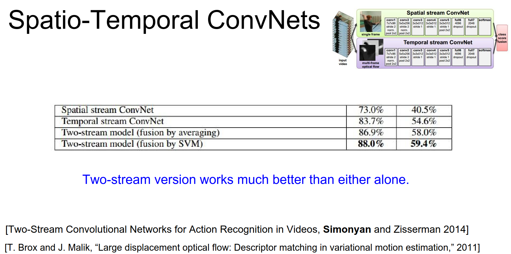
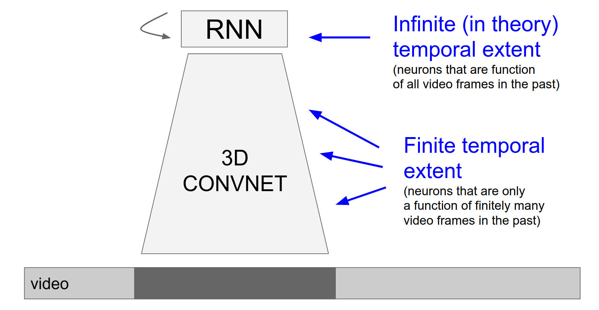

Part of [CS231n Winter 2016](../index.md)

---
# From Andrej Karpathy 💙 💙 💙

---
# Videos and Unsupervised Learning

If you are not done with Assignment 3 by now, you are in trouble!
### Where we are in the class?

Last class we looked very briefly at segmentation.

We looked at some **soft attention models** soft attention models are a way for selectively paying attention to different parts of the image as you're processing it with something like a recurrent neural network.

So it allows you to selectively pay attention to some parts of the scene and enhance those features.

And we also talked about spatial transformer which is this very nice way of basically in a differentiable way cropping parts of an image or some features, either in an affine region or in any kind of warped shape or anything like that.

So very interesting kind of piece that you can slot into your neural network architectures.

Today we will talk about videos specifically.

In image classification - you should be familiar by now - with the basic column that set up you have an image that comes in and we're processing it to for example classify it.

In a case of videos we want to have just a single image, but we'll have multiple frames.

So this is an image of $32x32$ we'll actually have an entire video of frames so $32x32xT$ where T is some time extent.

Before I dive into how we approach these problems with convolutional neural networks I'd like to talk very briefly about how we used to address them before ConvNets came about, using feature based methods.

So some of the most popular features are right before convolutional networks and I became very popular where these dense trajectory features are developed by Heng Weng et all.
###  dense trajectory features ?

I just like to give you a brief taste of exactly how these features worked. Because it's kind of interesting and they inspire some of the later developments in terms of how convolutional networks actually operate over videos.

So in this trajectory is what we do is we have this video that's playing and we're going to be detecting these key points that are good to track in a video. Then we're going to be tracking them and you end up with all these little tracklets that we actually track across the video and then lots of features about those tracklets and about the surrounding features that accumulated in that histograms.

So just to give you an idea about how this worked:

There's basically three steps roughly. 

We detect feature points at different scales in the image I'll tell you briefly about how that's done in a bit.

Then we're going to track those features over time using optical flow methods.

---
### Optical Flow ?

Optical flow methods -I'll explain very briefly - they basically give you a motion field from one frame to another and they tell you how the scene moved from one frame to a next frame.

---

Then we're going to extract a whole bunch of features but importantly we're not just going to extract those features at fixed positions in the image but we're actually going to be extracting these features in the local coordinate system of every single tracklet.

And so these ==histogram of gradients==, ==histogram of flows== and ==MBH features== we're going to be extracting them in the coordinate system of a tracklet.

And so HoG, here we saw histograms of gradients and two-dimensional images there are basically generalizations of that to videos and so that's the kind of things that people use to encode little spatial temporal volumes.

So in terms of the key point detection part there's been quite a lot of work on exactly how to detect good features and videos to track.

And intuitively you don't want to track regions in the video that are ==too smooth== because you can't lock onto any visual feature.

So there are ways for basically getting a set of points that are easy to track in a video. So there are some papers on this so you detect a bunch of features like this.

Then you run optical flow algorithms on these videos. 
### how does an optical flow algorithm work?

So an optical flow algorithm will take a frame and a second frame and it will solve for a motion field ==a displacement vector at every single position== into where it traveled or how the frame moved.

Here are some examples of optical flow results. Basically here every single pixel is colored by a direction in which that part of the image is currently moving in the video. 

So for example this girl has all yellow meaning that she's probably translating horizontally or something like that. One of the most common ways to compute Optical Flow here is Brocks from Brock's and Malik, that's the one that is kind of like a default thing to use.

So if you are computing optical flow in your own project I would encourage you to use this large displacement optical flow method.

So using this optical flow we have all these key points using optical flow. We know also how they move and so we end up tracking these load tracklets of maybe roughly 15 frames at a time.

So we end up with these half a second roughly tracklets through the video.

And then we encode regions around these tracklets with all these descriptors. Then we need to accumulate all these visual features into histograms and people used to play with different kinds of how do you exactly truncate video spatially, because we're going to have a histogram and independent histogram and every one of these bins.

And then we're going to basically make all these histograms per bin with all these visual features and all of this then goes into an SVM and that was kind of the rough layout in terms of how people address these problems in the past.
### the question is what is a tracklet? 

A tracklet, let's just think of it as it's going to be 15 frames and it's just $XY$ positions so a 15 $XY$ coordinates, that's a tracklet.

And then we extract features in the local coordinate system.

Now in terms of how we actually approach these problems with convolutional neural networks:

So you may recall AlexNet, on the very first layer will receive an image that is for example $227x227x3$ and we're processing it with 96 filters that are $11x11$ applied at stride 4.

And so we saw that with an Alex net this results in the $55x55x96$ volume, in which we actually have all these responses of all the filters at every single spatial position.

So now, what would be a reasonable approach if you wanted to generalize a convolutional network into a case where you don't just have a $227x227x3$ but you maybe have 15 frames that you'd like to encode, so you have an entire block of $227x227x3$ x15 that's coming in to a convolutional network and you're trying to encode both the spatial and temporal patterns and inside this little block of volume.

What would be like one idea for how to change a convolutional network or generalize it to this case?
### How to use CNN's in video ? Here are some student ideas 💎

- You basically took four frames and you arranged them as like two blocks right okay that's interesting okay I would expect that to not work very well. The problem with that is - that's kind of interesting - basically all these neurons they're looking at only a single frame and then by the end of the con that you end up with neurons that are looking at larger and larger regions in the original image so eventually these neurons would see all of your input but they would not be able to very easily relate the little spatial temporal patch in this image. So I'm not sure actually that's a real good idea.
- Could you tie an LSTM into it? I think so we'll get to some methods that do something like that.
- Maybe a good idea so right now we have three channels and maybe you will take these frames and you'll actually just stack them across channels. So you'll end up with 45 channels effectively and you could put a ConvNet on that. So that's something that I'll get to I think in the end. You could do that I don't think it's the best idea.
- You want to extract similar kinds of features in one time then a different time similar to the motivation of doing it sharing weight spatially because features here are useful down there as well. So you have the same kind of property where you'd like to share weights in time not only in space. 

The basic thing that people usually do when they want to apply ConvNets on videos is ==they extend these filters==, so you don't only have filters in space but you also have these filters and extend them small amounts in time.
## extend the filters in time! 😮

Before we have $11x11$ filters so now we're just going to have $11x11xT$ filters where T is some small temporal extent.

So say for example can use a 2 up to 15 in this particular case.

So for example if T was 3 then we have $11x11x3$ filters and then by 3 because we have RGB.

And so basically these filters are now you're thinking of sliding filters not only in space and carving out an entire activation map, but you're actually sliding filters not only in space but also in time.

And they have a ==small finite temporal extent in time== and you end up carving out an entire activation volume.

So you're introducing this time dimension into all your kernels and to all your volumes, they just have an additional time dimension along which we're performing the convolutions.

That's usually how people extract the features. Then you get this property where say T is 3 here and so then when we do the spatial temporal convolution we end up with this parameter sharing scheme going in time as well as you mentioned.

Basically we just extend all the filters in time and then we do convolutions not only in space but also in time we end up with activation volumes instead of activation maps.

Some of these approaches were proposed quite early on for example one of the earlier ones for in a context of activity recognition is maybe from 2010.

So the idea here was that this is just a convolutional Network but instead of getting a single input of $60x40$ pixels we are getting in fact 7 frames of $60x40$ and then there convolutions our 3D convolutions as we refer to them.

So these filters for example might be seven by seven but now by three as well. We end up with a 3D Conv and these 3D convolutions are applied at every single stage here.
### 3D Convolutions

Similar paper also in from 2011 with the same idea.

We have a block of frames coming in, and you process them with 3D convolutions. You have 3D convolutional filters at every single point in this convolutional network. 

So these are from before actually AlexNet, these approaches are kind of like smaller neural network and convolutional network.

So the first kind of large-scale application of this was from this awesome paper in 2014 by Karpathy et al.
##  awesome paper in 2014 by Karpathy et al. 😅

This is for processing videos. So the model here on the very right that we called slow fusion, that is the same idea that I presented so far. These are three-dimensional convolutions happening in both space and time. 
### slow fusion - what we saw so far

That's slow fusion as we refer to it ==because you're slowly fusing this temporal information just as before we were slowly fusing the spatial information==. 

Now there are other ways that you could also wire up convolutional networks and just to give you some context historically: I was in Google research and AlexNet just came out and everyone was super excited because they work extremely well on images and I was in the video analysis team at Google. And we wanted to run ConvNet on the YouTube videos and but it was not quite clear exactly how to generalize, ConvNets from images to videos.

So we explored several kinds of architectures of how you could actually wire this up.

So float ==slow Fusion== is a 3D ConvNet kind of approach.

==Early fusion== is this idea - that someone described earlier - where you take a chunk of frames and you just concatenate them along channels so you might end up with a to $27x27$ by like 45, where everything is just stacked up and you do a single Conv over it.
### early fusion ? wait and load images all at once

It's like your filters on the very first Conv layer have a large temporal extent. But from then on everything else is two-dimensional Convolution.

So in fact we call it early fusion, because we fused the temporal information very early on in the very first layer and from then on everything's just 2D Conv.

You can imagine architectures like Late convolution (Late Fusion). So here the idea is we take two AlexNet's. We place them say ten frames apart, so they both compute independently on these ten frames apart. Then we merge them much later in the fully connected layers.
### Late Fusion - Two separate ConvNets x frames apart

And then we had a single flame baseline that is only looking at a single frame of a video.

You can play with exactly how your wire up these models.

For the slow fusion model you can imagine that if you have three-dimensional kernels now on the first layer you can actually visualize them and these are the kinds of features you end up learning on videos.

So these are basically the features that we're familiar with ==except they're moving==.

Because now these filters are also extended a small amount in time so you have these little moving blobs and some of them are static and some of them are moving.

And they're basically detecting motion on the very first layer and so you end up with nice moving volumes.
### the question is how much do we extend this in temporal length for the filters?

We'll get to that and I think the answer is probably yes, just as in spatial. It works better if you have smaller filters and you have more depth at the same applies I think in time. And we'll see an architecture that does that in a bit.

So we have a video and we're still classifying fixed number of categories at every single frame, but now your prediction is not only a function of that single frame but also a small number of frames on both sides. So maybe your prediction is actually a function of say 15 frames - half a second of video.

In this paper we also released a video data set of 1 million videos in 500 classes, just to give you a context for why this is actually it's kind of difficult to work with videos right now.

I think because problem right now I think is that, there's not too many very large-scale data sets like on the order of millions of very varied images that you see an ImageNet there are no really good equivalents of that in the video domain.

And so we tried with this Sports data set back in 2013 but I don't think it actually we fully achieved that. And I think we're still not seeing very good really large-scale data sets and videos and that's partly why we're also slightly discouraging some of you from working on this on projects. Because you can't pre train these very powerful features because the data sets are just not right there.

Another kind of interesting things that you see and this is why we also sometimes caution people from working on videos and getting very elaborate very quickly with them. Because sometimes people they think they have videos and they get very excited, they want to do 3D convolutions, LSTM's and they just think about all the possibilities that open up before them.

But actually it turns out that single frame methods are a very strong baseline and I would always encourage you to run that first. So don't worry about the motion in your video and just try single frame networks first.
## just try single frame networks first. 😉

So for example in this paper we found that a single frame baseline was about 59.3% classification accuracy in our data set. And then we tried our best to actually take into account small local motion but we ended up only bumping that by 1.6%.

So all this extra work / all the extra compute and then you ended up with relatively small gains.

And I'm going to try to tell you why that might. But basically video is not always as useful as you might intuitively think.

These are different datasets of sports and our predictions. And I think this kind of highlights slightly why adding video might not be as helpful in some settings. So in particular here if you're trying to distinguish sports and think about trying to distinguish say tennis from swimming or something like that.

It turns out that you actually don't need very fine local motion information if you're trying to distinguish tennis from swimming right. Lots of blue stuff lots of red stuff. The images actually have a huge amount of information and so you're putting in a lot of additional parameters and trying to go after these local motions, but in most classes actually these local motions are not very important.

They're only important if you have very fine-grained categories where the small motion actually really matters a lot.

And so a lot of you if you have videos you'll be inclined to use a spatial-temporal crazy video networks. But think very hard about is that local motion extremely important in your setting because if it isn't you might end up with results like this where you put in a lot of work and it might not work extremely well.

Let's s look at some other video classification convolutional networks.

So this paper is from 2015 it's relatively popular. it's called C3D.
## C3D - 3D VGGNet basically

The idea here was basically VGG network has this very nice architecture where it's three by three Conv and two by two pool throughout.

So the idea here is that basically let's do the exact same thing but extend everything in time. So going back to your point, you want very small filters so this is everything is $3x3x3$ Conv $2x2x2$ pool throughout the architecture.

So it's a very simple kind of VGG net in 3D kind of approach and that works reasonably well and you can look at this paper for reference.

Another form of approaches actually that works quite well is from Karen Simonian in 2014.

Karen Simonian by the way is of VGGnet fame he's a person who came up with the VGGnet.

He also has a very nice paper on video classification. The idea here is that he didn't want to do three-dimensional convolutions because it's kind of painful to have it implemented or find it and so on. So he only used two-dimensional convolutions.

But the idea here is that we 2 ConvNet's looking at an image and the other one is looking at optical flow of the video. 
### 2 ConvNet's looking at an image and the other one is looking at optical flow of the video.

So both of these are just images, but the optical flow basically it tells you how things are moving in the image. And so both of these are just kind of like a VGGNet like or AlexNet like ConvNet, one of them on optical flow one of them on the image.

And you extract optical flow we say the Brock's method that I've shown you before.

And then you let you fuse that information very late in the end. So both of these come up with some idea about what they are seeing in terms of the classes in the video and then you fuse them and there are different ways of fusing them.

They found for example that if you just use a spatial ConvNet so it's only looking at images you get some performance, if you use ConvNet on just the optical flow it actually performs even slightly better than just looking at the raw images.
###  tangent: a spatial ConvNet so it's only looking at images

So optical flow actually here in this case contains a lot of information.

And then if you fuse them you actually end up performing even better.
### Why does it help to actually put an optical flow?

You'd imagine that in this end-to-end framework we're hoping that these come let's learn everything from scratch. In particular they should be able to learn something that simulates the computation of computing optical flow.

And it turns out that that might not be the case because sometimes when you compare video networks on only the raw pixels and then you add optical flow it works better.

And so I think the reason for that is probably comes back to actually data. Since we don't have enough data we have small amount of data I think you actually probably don't have enough data to actually learn very good optical flow like features.

That would be my particular answer why actually hard-coding optical flow into the network is probably helping out in many cases.

So if you guys are working on your projects with videos I would encourage you to actually try maybe this kind of architecture, where you extract optical flow and then you pretend that it's an image and you put ConvNets on it and you merge it and so that seems like a relatively reasonable approach.

So far we've only talked about little local information in time, right so we have these little piece of like movements say of like half a second and we're trying to take advantage of it to do better classification.
### But what happens if you have videos that actually have much longer temporal kind of dependencies that you'd like to model? 

So it's not only that the local motion is important but actually there are some events throughout the video that are much larger in timescale than your network and they actually matter.

So event 2 happening after event 1 could be very indicative of some class and you'd like to actually model that with a neural network.

So what are the kinds of approaches that you might think, how would you modify the architecture to actually model these kinds of much longer-term events?

- Attention model? You may be like to have an attention over you're trying to classify this entire chunk of video and maybe you'd like to have attention over different parts of the video yeah, sensible idea.

- So you're saying that, we have these multi scale approaches where we process images on very low detail level. But also sometimes we resize the images and process them on the global level and so maybe the frames we can actually like ==speed up the video== and put a ConvNet on that. I don't think that's very common but it's a sensible idea I think.

So the problem roughly is that basically this temporal extent is maybe sometimes too short it doesn't span entire as many seconds.
### So how do we make architectures that are function of much longer timescales in their prediction?

Yeah so one idea here is, we have this video and we have different classes that we'd like to predict at every single point in time, but we want that prediction to be a function not only after the low like chunk of 0.5 seconds but actually a much longer time extents.

And so the idea is that, you actually use recurrent neural networks somewhere in the architecture because recurrent networks allow you to have infinite context and principle, over everything that has happened before you up till that time.

So actually if you go back to this paper that I've already shown you in 2011, it turns out that they have an entire section where they take this and they actually have an LSTM that does exactly that!

So this is a paper from 2011 using 3d column and LSTM's way before they were cool in 2011.

This paper basically has it all, they model little local motion with 3D Conv and model global motion with LSTM's. And so they put LSTM's on a say the full connected layers so they strength together fully connected layers with this recurrence and then when you're predicting classes every single frame you have infinite context.
### [link to the paper](https://link.springer.com/chapter/10.1007/978-3-642-25446-8_4) ahead of its time

So this paper is - I think - quite ahead of its time and it basically has it all except it's only cited sixty five times. I'm not sure why it's not more popular. I think people I don't know but basically this is a way ahead of its time paper that recognizes both of these and actually use LSTM's way before I even knew about them.

So since then, there are several more recent papers that actually kind of take this similar approach.

So in 2015 by Jeff Donohue et all from Berkeley, the idea here is that you have video and you'd like to again classify every single frame. But they have these ConvNet's that look at individual frames but then they have also LSTM's that string this together temporarily.

A similar idea also from a paper from I think this is Google. The idea here is that they have optical flow and images both are processed by ConvNet's and then again you have an LSTM that merges that over time.

Again this combination of ==local and global.==

So far we've looked at kind of two architectural patterns in accomplishing video classification that actually takes into account temporal information.

Modeling local motion which for example we extend 3D Conv where we use optical flow.

Or more global motion where we have LSTM that string together sequences of learning time steps.

Or fusions of the two.

Now actually I like to make the point that there's another cleaner very nice interesting idea that I saw in the recent paper, that I like much more.

And so here's basically the rough picture of what things look like right now.

We have some video and we have a 3D ConvNet say that is using optical flow maybe or it's using 3D Conv or both on chunk of your data. And then you have RNN's on the top on the fully connected layer or something like that that are doing the long term modeling.

And so kind of what's kind of not very nice or unsettling about this is that there's kind of this ==ugly asymmetry== about these components.

You have these part these neurons inside the 3D ConvNet that are only a function of some small local chunk of video. And then you have these neurons on the very top that are function of everything in the video. Because they're recurrent units that are a function of everything has become come before it.

And so it's kind of like an unsettling asymmetry or something like.

There's a paper that has a very clever a neat idea from a few weeks ago that is much more nice and homogeneous in a VGGnet-like style where everything is very nice and homogeneous and simple and so I don't know if anyone can think of how we could what we could do to make everything much more cleaner?

And I couldn't because I didn't come up with this idea but I thought it was cool once I read it.

You want to do the RNN before the ConvNet actually starts processing the images. I'm not sure what that would give you. So you would have our RNN's on the raw pixel information and then ConvNets on top of it somehow? You would certainly have neurons that are a function of everything, but it's not clear what the LSTM would be doing in that case like would it be blurring the pixels it's too low level probably, processing at that point good.

- **Student Idea**: So it seems like one of the problems is that in video there's so much duplicate information between two frames that like it there's a lot of redundancy if you're only looking at a few frames so you could have maybe like an ensemble of confidence that looks at different like temporal resolutions so this ConvNet is looking every frame right but you could have another ConvNet that's looking like every two frames every four frames every eight frames and then you can feed all of those things into RNN.

So your idea is that I think it's similar to what someone pointed out where you take this video and you work on multiple scales of that video so you speed up the video and you slow down the video and then you have 3D ConvNets on different temporal like speeds or something like that I think it's a sensible idea.
## The question: could you do background subtraction only look at things that are interesting to look at?

I think that's a reasonable idea. I think it kind of goes against this idea of having end-to-end learning because you're introducing like this explicit computation that you think is useful.
## the question: can we have weight sharing between the 3D ConvNets and the RNN?

That's interesting I'm not 100% sure because the RNN is just a hidden state vector and you're doing matrix multiplies and things like that. But in the Conv layers we have this like spatial structure, so I'm not actually sure how the sharing would work, but yeah.

We're going to get rid of the RNN we're going to basically take a ConvNet and we're going to make every single neuron in that ConvNet be a small recurrent neural network like every single neuron becomes recurrent in the ConvNet.
### RNN's inside ConvNet Neurons ?

So the way this will work and - I think this is beautiful - but their picture is kind of ugly so I'm not sure if this this makes sense so let me try to explain this in a slightly different way.

So in a normal ConvNet we have a Conv Layer somewhere in the neural network and it takes input from below, the output of a previous Conv layer something like that.

And we're doing convolutions over this to compute the output at this layer, right.

So the idea here is we're going to make every single convolutional layer a kind of a recurrent layer and so the way we do that is - just as before - we take the input from below us and we do Convs over it. 

But we also take our previous output from the previous time step of this Conv Layers output so that's this Conv Layers from previous time step in addition to the current input that this time step and we do convolutions over both this one (in the bottom) and that one (in the top).

And then, we done Convs, then we have these activations **from current input** and we have activations from **our previous output** and we add them up or something like that. We do a recurrent like, recurrent neural network like merge of those two to produce our output.

And so we're a function of the current input, but we're also a function of our previous activations.

So what's very nice about this is that, we're in fact only using two-dimensional convolutions here. There's no 3D Conv anywhere, because both of these are width by height by depth right so the previous column volume is just width height depth from the previous layer. 

And we are with high depth from previous time and so both of these are two-dimensional convolutions but we end up with kind of recurrent process in here.

So one way to see this also with recurrent neural networks which we've looked at, is that you have this recurrence where you're trying to compute your hidden state and it's a function of your previous hidden state and the current input X. So we looked at many different ways of actually wiring up that recurrence, so there's a vanilla RNN or an LSTM or there's a GRU, which GRU is a simpler version of an LSTM if you recall, but it almost always has similar performance to an LSTM.

So GRU has slightly different update formulas for actually performing that recurrence.

And so what they do in this paper is basically they take the GRU - because it's a simpler version of an LSTM that works almost just as well - but instead of every single matrix multiply it's kind of like replaced with a Conv if you can imagine.

That so every single matrix multiply here, just becomes a Conv so we convolve over our input and we convolve our output and that's the before and the below. And then we combine them with the recurrence just as in the GRU to actually get our activations.

And so before it looked like this.

And now it basically just looks like that.

We don't have some parts being infinite in extent and some parts finite, we just have this RNN ConvNet, where every single layer is recurrent.

It's computing what it did before but also it's a function of its previous outputs. And so this RNN ConvNet that is a function of everything. 

And it's very kind of uniform, it's kind of like a VGG net you just do $3x3$ Conv $2x2$ max pool and your recurrent.

And that's it, maybe that's just the answer, nicest simplest thing.

So in summary if you'd like to use spatial temporal convolutional networks in your project and you're very excited because you have videos, the first thing you should do is stop, and you should think about whether or not you really need to process local motion or global motion or if motion is really important to your classification task.

If you really think motion is important to you then think about whether or not you need to model local motions are those are important or all the global motions very important.

Based on that you get a hint of what you should try but you always have to compare that to a single frame baseline I would say.

And then you should try using optical flow because it seems that if you especially have smaller amount of data, it's like a very nice signal to actually encode that and explicitly specify that optical flow is a useful feature to look at.

And you can try this GRU-RCN network that I've shown you just now but I think this is too recent and experimental so I'm actually not sure if I can fully endorse this or if it works. It seems like it's a very nice idea but it hasn't kind of been proven yet.

And so that's kind of like the rough layout of how people process videos in the field.
## the question, do people take into account networks that also taken audio and somehow consider it in on the side with a video?

I would say that that's definitely something people would want to do. You don't see too many papers that do both of them just because people like to kind of isolate these problems and tackle them maybe not jointly. But certainly if you're in a company or in trying to get something working in a real system you would do something like that.

You'd probably do this with a late fusion approach where you have a whatever works best on videos whatever works best on audio and then you merge that somewhere later somehow, but that's certainly something you can do, yeah so good idea.

And with the neural networks right it's very simple, because you just have a fully connected layer that's looking at the output of both at some point. And then you're classifying as a function of both.

We're going to go into unsupervised learning. Justin Continues the lecture.

For the rest of the lecture we're going to switch gears completely and entirely and talk about unsupervised learning.

I'd like to make a little bit of a contrast here that first we're going to talk about some sort of basic definitions around unsupervised learning. 

Then we're going to talk about two different sort of ways that unsupervised learning has recently been attacked it by deep learning people. 

So in particular we're going to talk about autoencoders and then this idea of adversarial networks.

Pretty much everything we've seen in this class so far is supervised learning.

So the basic set up behind pretty much all supervised learning problems is that we assume that in our dataset, each data point has sort of two distinct parts. We have our data X and then we have some label or output Y, that we want to produce from that input.

And our whole goal in supervised learning is to learn some function, that takes in our input X and then produces this output or label Y.

If you really think about it pretty much almost everything we've seen in this class is some instance of this supervised learning setup. For something like image classification X is an image and then Y is a label. For something like object detection X is an image and then Y is maybe a set of objects in the image that you want to find. Y it could be a caption and then we look at captioning. X could be a video and now Y could be either a label or a caption or pretty much anything.

So I just want to make the point that supervised learning is this very powerful and generic framework that encompasses everything we've done in the class so far.

The other point is that supervised learning actually makes system that work systems that work really well in practice.

And is very useful for practical applications.

Unsupervised learning I think is a little bit more of an open research question at this point in time. So it's really cool, I think it's really important for solving AI in general, but at this point it's maybe a little bit more of a research focused type of area.

It's also a little bit less well defined. So in unsupervised learning we generally assume that we have just data. We only have X we don't have any Y. And the the goal of unsupervised learning is to do something with that data X. The something that we're trying to do really depends on the problem.

In general we hope that we can discover some type of latent structure in the data X. Without explicitly knowing anything about the labels.

So some classical examples that you might have seen in previous machine learning classes would be things like clustering, so something like k-means where x is just a bunch of points and we discover structure by classifying them into clusters.

Some other classical examples of unsupervised learning would be something like ==principal component analysis== where X is just this some bunch of data and we want to discover some low dimensional representation of that input data.

So unsupervised learning is this really sort of cool area but a little bit more problem specific and a little bit less well defined than supervised learning.
## GOAL: Learn some structure of the data!

Two architectures in particular that people in deep learning have done for unsupervised learning are these ideas as this idea of an ==autoencoder== - we'll talk about sort of traditional autoencoders that have a very long history -  we'll also talk about ==variational auto-encoders== which are this sort of new cool bayesian twist on them.

We'll also talk about some ==generative adversarial networks== that actually are this really nice idea that let you generate images and sample from natural images.

The idea with an autoencoder is pretty simple.

We have our inputs $X$ which is some data and we're going to pass this input data through some kind of encoder network to produce some latent features $Z$. You could think this stage a little bit like a ==learnable principal component analysis==, where we're going to take our input data and then convert it into some other feature representation.

So those many times these X's will be images like these CIFAR-10 images shown here. 

So this encoder network could be something very complicated. 

For something ==like PCA it's just a simple linear transform==, but in general this might be a fully connected Network originally sort of maybe five or ten years ago this was often a single layer fully connected network with sigmoid units.

Now it's often a deep network with ReLU units and this could also be something like a convolutional Network.

We also have this idea that, Z the the features that we are that we learn are usually smaller in size than X, so we want Z to be some kind of useful features about the data X. 

We don't want the network to just transform the data into some useless representation.

We want to force it to actually crush the data down and summarize its statistics in some useful way. That could hopefully be useful for some downstream processing. 

But the problem is that we don't really have any explicit labels to use for this downstream processing, so instead we need to invent some kind of a surrogate task that we can use using just the data itself.

So the surrogate task that we often use for auto-encoders is this idea of reconstruction.

Since we don't have any $Y$ to learn a mapping, instead we're just going to try to reproduce the data X from those features Z. 

And especially if those features Z are smaller in size then hopefully that will force the network to summarize the useful statistics of the input data and hopefully discover some useful features that could be one useful for reconstruction, but more generally maybe those features might be useful for some other tasks,  if we later get some supervised data.

So again this decoder network could be pretty complicated. When auto-encoders so first came about oftentimes these were just either a simple linear network or a small sigmoid Network.

But now they can be deep ReLU networks and oftentimes this decoder nowadays will be one of these up convolutional networks, that takes your features that are again are smaller in size and your input data. And kind blows it back up in size to reproduce your original data.

I'd like to make the point that these things are actually pretty easy to train, so on the right here is a like a quick example that I just cooked up in torch. So this is a four layer encoder which is a convolutional network and then a four layer decoder which is an upconvolutional network.

And you can see that it's actually learns to reconstruct the data pretty well.

Another thing that you'll sometimes see is that these encoder and decoder networks will sometimes share weights.

With just sort of as a regularization strategy and with this intuition that these are opposite operations so maybe it might make sense to try to use the same weights for both.

So just as a concrete example, if you think about a fully connected Network then maybe your input data has some dimension D. And then your latent data Z will have some smaller dimension H.

If this encoder was just a fully connected network then the weight would just be this matrix of $DxH$. 
### weight sharing - just use the transpose of it!

Now when we want to do the decoding and try to reconstruct the original data, that we're mapping back from H back to D, so we can just reuse the same weights in these two layers if we just ==take a transpose of the matrix==.

So when we're training this thing we need some kind of a loss function, that we can use to compare our reconstructed data with our original data.

And oftentimes we'll see L2, Euclidean loss to train this thing.

So once we've chosen our encoder Network and once we've chosen our decoder network and chosen a loss function, then we can train this thing just like any other normal neural network.

We get some data we pass it through to encode it we pass it through to decode it we compute our loss we back propagate and everything's good.

So once we train this thing then oftentimes we'll take this decoder network that we spent so much time learning and we'll just throw it away.
### throw away decoder ?🤔

Which seems kind of weird, but the reason is that reconstruction on its own is not such a useful task. 

So instead, we want to apply these networks to some kind of actually useful task. Which is probably a supervised learning task.

So here the setup is that, we've learned this encoder network which hopefully - from all this unsupervised data - has learned to compress the data and extract some useful features.

And then we're going to use ==this encoder network to initialize part of a larger supervised Network.==

If we actually do have access to maybe some smaller data set, that have some labels, then hopefully this most of the work here could have been done by this unsupervised training at the beginning. Then we can just use that to initialize this bigger Network and then fine tune the whole thing with hopefully a very small amount of supervised data.

So this is one of the dreams of unsupervised feature learning. 

That you have this really large data set of with no labels you can just go on Google and download images forever and you it's really easy to get a lot of images. The problem is that labels are expensive to collect. So you'd want some system that could take advantage of both a large huge amount of unsupervised data and also just a small amount of supervised data.

So auto-encoders are at least one thing that has been proposed that has this nice property but in practice I think it tends not to work too well. Which is a little bit unfortunate because it's such a beautiful idea.

As a side note, if you go back and read the literature on these things from maybe the mid-2000s in the last ten years, then people had this funny thing called **greedy layer wise pre-training** that they used for training auto-encoders.

The idea was that at the time in 2006 training very deep networks was challenging. You can find quotes in papers like this that _"even when you have maybe four or five hidden layers it was extremely challenging for people in those days to train deep networks"_

So to get around that problem, they instead had this paradigm where they would try to Train just one layer at a time.

And they used this thing that I don't want to get too much into called a Restricted Boltzmann Machine which is a type of graphical model.
### Restricted Boltzmann Machine 🤔

they would use these restricted Boltzmann machines to train these little layers one at a time. 

So first we would have our input image of maybe size $W1$. And this would be maybe something like PCA or some other kind of fixed transform. And then we would hopefully learn using a restricted Boltzmann machine some kind of relationship between those first layer features and some higher layer features.

When once we learn this layer we would then freeze it, and learn another restricted Boltzmann machine on top of those features connecting it to the next layer of features.

This type of approach, it let them train just one layer at a time in this sort of greedy way. And that let them - hopefully -  find a really good initialization for this larger Network.

So after this greedy pre training stage, they would stick the whole thing together into this giant auto encoder. And then fine-tune the auto encoder jointly.

So nowadays we don't really need to do this. With things like ReLU and proper initialization and Batch Normalization and slightly fancier optimizers this type of thing is not really necessary anymore.

As an example on the previous slide, we saw this four layer convolutional upconvolutional autoencoder that i trained on CIFAR-10,  and this is just fine to do using all these modern neural network techniques. 

You don't have to mess around with this, greedy layer wise training.

So this is not something that really gets done anymore, but I thought we should at least mention it since you'll probably encounter this idea, if you read back in the literature about these things.

So the basic idea around autoencoders is I think pretty simple. It's this beautiful idea where we can just use a lot of unsupervised data to hopefully learn some nice features.

Unfortunately that doesn't work but that's OK. But there's maybe some other nice type of tasks we would want to do with unsupervised data.
## the question is what's going on here? 🤭

Maybe you could think about a three layer neural network, so our input is going to be the same as the output.

So we're just hoping that this is a neural network that will learn the identity function.

But in order to learn the identity function we have some loss function at the end, something like an L2 loss that is encouraging our input and our output to be the same.

Learning the identity function is probably a really easy thing to do, but instead we're going to force the network to not take the easy route, and instead hopefully rather than just regurgitating the data and learning the identity function in the easy way, instead we're going to bottleneck the representation through this hidden layer in the middle.

So then it's going to learn the identity function but in the middle if the network is going to have to squeeze down and summarize and compress the data.

Hopefully that compression will give rise to features that are useful for other tasks.

Is that maybe a little bit more clear?
### the question, why not just do PCA?

The claim was that PCA is just the answer for this problem, so it's true that PCA is optimal in certain senses if you're only allowed to do maybe a one layer type, if your encoder and your decoder are just a single linear transform then indeed PCA is optimal in some sense.

But if your encoder and decoder are potentially larger more complicated functions, that are maybe multi-layer neural networks. Then maybe PCA is no longer the right solution.

Another point to make is that PCA is only optimal in certain senses. Particularly talking about L2 reconstruction. But in practice we don't actually care about reconstruction. 

We're just hoping that this thing will learn useful features for other tasks. So in practice - we'll see this a bit later - that people don't always use L2 anymore, because L2 is maybe not quite the right loss for actually learning features.
### The question, what it the RBM layer ? 

The RBM layer is this kind of generative model of the data, where you imagine that you have sort of two sequences of bits and you want to do this generative modeling of the of the two things.

So then you need to get into quite a lot of Bayesian statistics to figure out exactly what the loss function is. But it ends up being something like log likelihood of the data with these latent states that you don't observe.

And that's actually a cool idea that we will sort of revisit in the variational auto encoder.

So one of the one of the problems with this traditional auto encoder, it can learn features that's a cool thing, but there's this other thing that we would like to not just learn features but also be able to generate new data.

A cool task that we could potentially learn from unsupervised data is that, hopefully our model could slurp in a bunch of images and after it does that it sort of learns what natural images look like.

And then after its learned this distribution then it could hopefully spit out sort of fake images that look like the original images but are fake.

And this is maybe not a task which is directly applicable to things like classification, but it seems like an important thing for AI.

That humans are pretty good at looking at data and summarizing it and kind of getting the idea of what a data set looks like.

So hopefully if our models could also do this sort of task, then hopefully they'll have learned some useful summarization or some useful statistics of the data.

## Variational Autoencoder

So the variational auto encoder is this kind of ==neat twist on the original auto encoder== that lets us hopefully actually generate novel images from our learned data.

So here we need to dive into a little bit of Bayesian statistics. This is something that we haven't really talked about at all in this class up to this point. But there's this whole other side of machine learning that doesn't do neural networks and deep learning, but thinks really hard about probability distributions and how probability distributions can fit together to generate data sets.

And then reason probabilistically about your data.

This type of paradigm is really nice, because it lets you sort of state explicit probabilistic assumptions about how you think your data was generated. And then given those probabilistic assumptions you try to fit your model to the data that follows your assumptions.

So with the variational auto encoder, we're assuming this this particular type of method by which our data was generated.

We assume that, we there exists out the out there in the world some prior distribution which is generating these latent States $Z$. And we then we assume some conditional distribution that once we have the latent States, we can sample from some other distribution to generate the data.

So the variational auto encoder it really imagines that our data was generated by this pretty simple process:

- First we sample from some prior distribution to get our Z.
- Then we sample from this conditional to get our X.

So the intuition is that X is something like an image and ==Z maybe summarizes some useful stuff about that image.==

So if these was CIFAR-10 images then maybe that latent state Z could be something like the class of the image, whether it's a frog or a deer or a cat.

And also might contain variables about how that cat is oriented or what color it is or something like that.

So this is a pretty simple idea but makes a lot of sense, for how you might imagine images to be generated.

So the problem now is that we want to estimate these parameters $\theta$ of both the prior and the conditional, without actually having access to these latent States $Z$.

That's a challenging problem.

So to make it simpler we're going to do something that you see a lot in Bayesian statistics and we'll just assume that the prior is Gaussian, because that's easy to handle.

And the conditional will also be Gaussian, but it's going to be a little bit fancier.

So we'll assume that it's a Gaussian with diagonal covariance and some mean, but the way that we're going to get those is we're going to compute them with a neural network.

So it suppose that we had the latent state $Z$ for some piece of data. 

Then we assume that that latent state will go into some decoder network which could be some big located neural network. Now that neural network is going to spit out two things.

It's going to spit out the mean of the data X and also the the variance of the data X.

So you should think that this looks very much like the top half of a normal autoencoder, that we have this latent state we have some neural net that's operating on the latent state. 

But now instead of just directly spitting out the the data instead, its spitting out the the mean of the data and the variance of the data.
### output is mean and variance instead the data itself

This decoder network sort of thinking back to the normal auto encoder, might be a simple fully connected thing or it might be this very big powerful Deconvolutional network, and and both of those are pretty common.

So now the problem is that by Bayes rule if given the prior and given the conditional, Bayes rule tells us the posterior.

If we want to actually use this model, we need to be able to estimate the latent state from the input data. The way that we estimate the latent state from the input data is by writing down this posterior distribution, which is the probability of the latent state $z$ given our observed data $X$.

And using Bayes rule we can easily flip this around and write it in terms of our prior over $Z$ and in terms of our conditional x given z. 

So we can use Bayes rule to actually flip this thing around and write it in terms of these three things.

After we look at Bayes rule we can break down these three terms and we can see that the conditional, we just use our decoder Network and we easily have access to that.

And this prior, again we have access to the prior because we assumed its unit Gaussian. So that's easy to handle. 

But this denominator, this probability of X it turns out, if you work out the math and write it out this ends up being this giant intractable integral over the entire latent state space.

So that's completely intractable there's no way you could ever perform that integral and even approximating it would be a giant disaster.

So instead we will not even try to evaluate that integral.

Instead we're going to introduce some encoder network that will try to directly perform this inference step for us.

So this encoder network is going to take in a get a point, and it's going to spit out a distribution over the latent state space. Looking back at the original auto-encoder from a few slides ago this looks very much the same. As sort of the bottom half of a traditional auto encoder.

We're taking in data and now instead of directly spitting out the latent state, we're going to spit out a mean and a covariance of the latent state.

Again this encoder network might be some fully convolutional network or it might be some deep convolutional network.

The intuition is that this encoder network will be this separate totally different disjoint function, but we're going to try to train it in a way so that it approximates this posterior distribution that we don't actually have access to.

Once we put all these pieces together then then we can setup stitch this all together and give rise to this variational auto encoder. 

Once we put these things together, then we have this input data point X, we're going to pass it through our encoder network, and the encoder network will spit out a distribution over the latent States.

Once we have this this distribution over the latent States you can imagine sampling from that distribution to get some latent state of high probability for that input.

Once we have some concrete example of a latent state, then we can pass it through this decoder network, which should then spit out the probability of the data again.

Then once we have this distribution over the data, we could sample from it to actually get something that hopefully looks like the original data point.

This ends up looking very much like a normal auto encoder, where we're taking our input data we're running it through this encoder to get some latent State, we're passing it through this decoder to hopefully reconstruct the original data.

And when you go about training this thing it's actually trained in a very similar method as a normal auto encoder, where we have this forward pass and this backward pass, the only difference is in the loss function. 

So at the top we have this reconstruction loss, rather than being this point wise L2, instead we want the distribution to be close to the true input data.

And we also have this loss term coming in the middle, that we want this generated distribution over the latent states to hopefully be very similar to our stated prior distribution that we wrote down at the very beginning.

So once you put all these pieces together, you can just train this thing like a normal auto encoder with normal soared forward pass and backward pass, the only difference is where you put the loss and how you interpret the loss.
### the question is why do you choose a diagonal covariance ?

The answer is because it's really easy to work. Actually people have tried I think slightly fancier things too but that's something you can play around with.

So once we've actually trained this kind of variational autoencoder, ==we can actually use it to generate new data== that looks kind of like our original data set.

So here the idea is that remember we wrote down this prior, that might be a unit Gaussian or maybe something a little bit fancier. But in any rate this prior is some distribution that we can easily sample from. So a Unit Gaussian, it's very easy to draw random samples from that distribution.

So to generate new data, we'll start by just sort of following this data generation process that we had imagined for our data.

So first we'll sample from our from our prior distribution over the latent States.

And then we'll pass it through our decoder network that we have learned during training.

This decoder network will now spit out a distribution over our data points, in terms of both a mean and a covariance. 

Once we have a mean and covariance this is just a diagonal Gaussian. So we can easily sample from this thing again to generate some data point.

So now, once you train this thing, another thing you can do is sort of scan out the latent space and rather than sampling from the latent distribution instead you just densely sample all the latents from the latent space to kind of get an idea for what type of structure the network had learned.

So this is doing exactly that on the MNIST dataset. We trained this variational auto encoder with where $Z$ the latent state is just a two-dimensional thing. Now we can actually scan out this latent space, we can explore densely this two-dimensional latent space and for each point in the latent space pass it through the decoder and use it to generate some image.

So you can see that it's actually discovered this very beautiful structure on MNIST digits, that sort of smoothly interpolates between the different digit classes.

So I'll be up here at the left you see 6's that kind of morph into 0's.

As you go down you see 6's that turn into maybe 9's and 7's. The 8's are hanging out in the middle somewhere and the 1's are down here.

So this latent space actually learned this beautiful disentanglement of the data, in this very nice unsupervised way.

We can also train this thing on a faces data set and it's the same sort of story, where we're just training this two dimensional variational auto encoder and then once we train it we densely sample from that latent space to try to see what it has learned.
### the question is whether people ever try to force the late specific latent variables to have some exact meaning?

And yeah there has been some follow-up work that does exactly that. There's a paper called deep inverse graphics networks from MIT that has that does exactly this setup. 

They try to force where they want to learn sort of a renderer as a neural network, so they want to learn to like render 3D images of things. So they want to force some of the variables in the latent space to corresponds to the 3D angles of the object and maybe the class and the 3D pose of the object, and the rest of them it lets it learn forever whatever at once.

And they actually have some cool experiments where now they can do exactly as you said and by setting those specific values of latent variables, they can render and actually rotate the object and those are pretty cool.

That's a little bit fancier than these faces, but these faces are still pretty cool.

You can see it's sort of interpolating between different faces in this very nice way.

And I think that there's actually a very nice motivation here and one of the reasons we pick diagonal Gaussian is that that has the probabilistic interpretation of having independent, that the different variables in our latent space actually should be independent.

So I think that helps to explain why there actually is this very nice separation between the axes when you end up sampling from the latent space. It's due to this probabilistic independence assumption embedded in a prior. 

So this idea of priors is very powerful and lets you sort of bake those types of things directly into your model.

So I wrote down a bunch of math and I don't think we really have time to go through it.

Classically when you're training generative models, there's this thing called maximum likelihood where you want to maximize the likelihood of your data under the model, and then pick the model where that makes your data most likely.

But it turns out that if you just try to run maximum likelihood using this generative process that we had imagined for the variation auto-encoder, you end up needing to marginalize this Joint Distribution, which becomes this giant intractable integral over the entire latent state space.

So that's not something that we can do.

No bueno.

So instead the variational auto encoder does this thing called ==variational inference.==
## variational inference ?

Which is a pretty cool idea.

 The math is here in case you want to go through it.

But the idea is that instead of maximizing the log probability of the data, we're going to cleverly insert this extra constant and break it up into these two different terms.

This is an exact equivalence that you can maybe work through on your own.

This is an exact equivalence that you can maybe work through on your own.

But this log likelihood we can write in terms of this term - that we call an elbow- and this other term which is a KL divergence between two distributions.

We know that KL divergence between distributions is nonzero. 

We know that this term (on the right) has to be nonzero.

Which means that this this elbow term actually is a lower bound on the log likelihood of our data.

Notice that in the process of writing down this elbow, we introduced this additional parameter $\phi$ that we can interpret as the parameters of this encoder network, that is sort of approximating this hard posterior distribution.

So now instead of trying to directly maximize the log likelihood of our data, instead we'll try to maximize this variational lower bound of the data.

Because the this elbow is built as a low bound of the log-likelihood then maximizing the elbow will also have the effect of raising up the log-likelihood instead.

And these these two terms of the elbow actually have this beautiful interpretation.

This one at the front is the expectation over the latent space of the probability of x given the latent state space.

So if you think about that that's actually a data reconstruction term.

That's saying that, if we averaged over all possible latent states then we should end up with something that is similar to our original data.

And this other term is actually a regularization term. This is the KL divergence between our approximate posterior and between the prior. So this is a regularization is trying to force those two things together.

So in practice this first term you can approximate with something called the ==approximate by sampling== using this trick in the paper that I won't get into.

And this other term again because everything is Gaussian here you can just evaluate this KL divergence explicitly.

So I think this is the most math heavy slide in the class.

This looks scary but it's actually just this auto-encoder idea where you have a reconstruction and then you have this penalty penalizing to go back towards the prior.

So the the overview of autoencoders is that: 

In general the idea of an auto encoder is that we want to force a network to try to reconstruct our data and hopefully this will learn sort of useful representations of the data.

For traditional autoencoders this is used for feature learning.

But once we move to variational auto-encoders we make this thing Bayesian so we can actually generate samples that are similar to our data.

So with then this idea of generating samples from data is really cool and everyone loves looking at these kinds of pictures.

So there's another idea that may be can we generate really cool samples without all this scary Bayesian math?

And it turns out that there's this idea called a ==Generative Adversarial Network== that is a sort of different idea - a different twist - that lets you still generate samples that look like your data. But sort of a little bit more explicitly without having to worry about divergences and priors.

So the idea is that we're going to have a generator network, that well first we're going to start with some random noise, that probably is drawn from like a unit Gaussian or something like that.

And then we're going to have a generator network and this generator network actually looks very much like the decoder in the variational auto encoder. Or like the second half of a normal auto encoder. In that we're taking this random noise and we're going to spit out an image, that is going to be some fake non real image that we're just generating using this train network. 

Then we're also going to hook up a discriminator network that is going to look at this fake image and try to decide whether or not that generated image is real or fake. 

So this second network is just doing this binary classification task where it receives an input and it just needs to say whether or not it's real image or not.

So that's just sort of a classification task that you can hook up like anything else.

So then we can train this thing all jointly all together where our generator network will receive mini batches of random noise and it will spit out fake images.

And our discriminator network will receive mini batches of partially these fake images and partially real images from our data set.

And it'll try to make this classification task to say which are real and which are fake.

Now another way that we can hook up this kind of supervised learning problemish without any real data. So we hook this thing up and we train the whole thing jointly.

So we can look at some examples from the original generative adversarial networks paper.

And so these are fake images that are generated by the network on MNIST.

So you can see that it's done a very good job of actually generating fake digits they look like real digits. 

Here this this middle column is showing actually the nearest neighbor in the training set of those digits to hopefully let you know that it hasn't just memorized the training set.

So for example this $2$ has a little dot and this guy doesn't have a dot so it's not just memorizing training data.

And it also does a pretty good job of generating faces.

As people who've worked on machine learning know, these digit and face datasets tend to be pretty easy to generate samples from.

And when we apply this this task to CIFAR-10 then our samples don't quite look as nice and clean.

So here it's clearly got some idea about CIFAR-10 data where it's making blue stuff and green stuff, but they don't really look like real objects.

So that's a problem.

So some follow-up work on generative adversarial networks, has tried to make these architectures bigger and more powerful, to hopefully be able to generate better samples on these more complex data sets.

One idea is this idea is ==multi scale processing.== 
### multi scale processing for GAN's ?

So rather than generating the image all at once, we're actually going to generate our image at multiple scales in this iterative way.

So first we're going to have a generator that receives noise and then generates a low resolution input.

Then we'll up sample that low res guy.

And apply a second generator that receives a new batch of random noise and computes some Delta on top of the low res image.

Then we'll up sample that again.

And repeat the process several times.

And repeat the process several times.

And repeat the process several times, until we've actually finally generated our final result.

So this is again a very similar idea as the previous as the original GAN, we're just generating at multiple scales simultaneously.

The training here is a little bit more complex. You actually have a discriminator at each scale and that hopefully does something.

So when we look at the train samples from this guy they're actually a lot better.

So here they actually train a separate model per class on CIFAR-10. So here they've trained this adversarial network on just planes from CIFAR-10, and you can see that they're starting to look like real planes.

These look almost like real cars and these maybe look kind of like real birds.

In the following year people actually threw away this multi scale idea and just used a simpler better more principled ConvNet. 

Forget about this multi scale stuff and just use a use batch norm don't use fully connected layers. All these architectural constraints that had become best practice in the last couple years, just use those. 

It turns out that your Adversarial Nets then work really well.

So here they're generator is this pretty simple pretty small up convolutional network. And the discriminator is again just a simple convolutional network with batch normalization.

Once you hook up this thing, they get some amazing samples in this paper.

So these are generated bedrooms from the network.

So these actually are a pretty impressive results, these look like real data almost.

It's done a really good job of capturing the like really detailed structure about bedrooms like there's a bed, there's a window, there's a light switch, so these are really amazing samples.

But it turns out that rather than just generating samples we can play the same trick as the variational auto encoder and actually try to play around with that latent space.

Because these adversarial networks are receiving this noise input, we can cleverly try to move around that noise input and try to change the type of things that these networks generate.

So one example that we can try is interpolating between bedrooms.

These images on the left hand side we've drawn a random point from our noise distribution and then used it to generate an image. On the right hand side we've done the same and we generate another random point from our noise distribution and use it to generate an image.

So now these these two guys on the opposite sides are sort of two points on a line. Now we want to interpolate in the latent space between those two latent z vectors. And along that line we're going to use the generator to generate images.

And hopefully this will interpolate between the latent states of those two guys.

And you can see that this is pretty crazy that these bedrooms are morphing sort of in a very nice smooth continuous way, from one bedroom to another.

This morphing is actually happening in kind of a nice semantic way, if you imagine what this would look like in pixel space then it would just be kind of this fading effect and it would not look very good at all.

But here you can see that actually the shapes of these things and colors are sort of continuously deforming from one side to the other.

Another cool experiment they have in this paper is actually using vector math to play around the type of things that these networks generate.

Here the idea is that they generated a whole bunch of random samples from the noise distribution then push them all through the generator to generate a whole bunch of samples.

Then using their own human intelligence, they tried to make some semantic judgments about what those random samples looked like. And then group them into a couple meaningful semantic categories.

So this would be three images that were generated from the network that all kind of look like a smiling woman. Those are human provided labels.

Here in the middle are three samples from the network of a neutral woman that's not smiling.

And here on the right is three samples of a man that is not smiling.

So each of these guys was produced from some latent state vector. So we'll just average those latent state vectors to compute this sort of average average latent state of smiling women neutral women and neutral men.

Now once we have this latent state vector, we can do some vector math.

We can take a smiling woman subtract a neutral woman and add a neutral man. 

So what would that give you?

You hope that would give you a smiling man, and this is what it generates.

So this actually it does kind of look like a smiling man, that's pretty amazing.

We can do another experiment, so we can take a man with glasses and a man without glasses.

Subtract the man with glasses and add a woman with glasses with no glasses. 

This is confusing.

What would this little equation give us?

That's pretty crazy. Even though we are not forcing an explicit prior on this latent state space these adversarial networks have somehow still managed to learn some really nice useful representation there.

Also, I think there's a pretty cool paper that just came out a week or two ago that puts all of these ideas together. 
We covered a lot of different ideas in this lecture and let's just stick them all together.

So first we're going to take a variational auto-encoder as our starting point and this will have sort of the normal pixel wise loss from a variational auto encoder.

But we saw that these adversarial networks give really amazing samples, so why don't we add an adversarial network to the variational auto encoder.

So we do that.

Now in addition to having our variational auto encoder, we also have this this discriminator network that's trying to tell the difference between the real data and between the samples from the variational auto encoder.

That's not cool enough.

So why don't we also download AlexNet and then pass these two images through AlexNet.

Extract AlexNet features for both the original image and for our generated image.

Now in addition to having a similar pixel loss and fooling the discriminator, we're also hoping to generate samples that have similar AlexNet features as measured by L2.

Once you stick all these things together hopefully you'll get some really beautiful samples right?

So here are the examples from the paper.

So these are they just train the entire thing on ImageNet. Cherry picked examples maybe? 

If you contrast this with the multi scale samples on CIFAR-10 that we saw before, for those samples remember they were actually training a separate model per class in CIFAR-10, and those beautiful bedroom samples that you saw was again training one model that's specific to bedrooms.

But here they actually trained one model on all of ImageNet.

Still like these aren't real images but they're definitely getting towards realish looking images.

It's fun to just take all these things and stick them together and hopefully get some really nice samples.

That's I think that's pretty much all we have to say about unsupervised learning so if there's any any questions..
## the question is are you may be linearizing the bedroom space?

That's maybe one way to think about it. Here remember we're just sampling from noise and passing that through the generator. And then the generator has just decided to use these different noise channels in nice ways. Such that if you interpolate between the noise you end up interpolating between the images in a sort of a nice smooth way. Hopefully that lets you know that it's not just sort of memorizing training examples it's actually learning to generalize from them in a nice way.

Alright so just to recap everything we talked about today: Andrej gave you a lot of really useful practical tips for working with videos. Justin gave you a lot of very non practical tips for generating beautiful images.

We'll have a guest lecture from Jeff Dean so if you're watching on the internet maybe you might want to come to class for that one.

Done!
